# Breastfeeding

母乳喂养知识库电子书

> 这是完整正文。目录中的每个条目都可以直接跳到对应知识点，适合按需查阅，也可以从头阅读。

## 阅读入口

- [在线阅读与 PDF 下载](index.html)
- [目录总表（含检索标签）](docs/00-目录总表.md)
- [电子书导入方案](docs/01-电子书导入方案.md)
- [插图视频映射方案](docs/02-插图视频映射方案.md)
- [权威资源下载与核验](docs/05-权威资源下载与核验.md)
- [G6PD 溶血触发物质清单](docs/06-G6PD溶血触发物质清单.md)

## 目录

1. [孕期认知储备](#chapter-01)
  - [孕期 - 认知储备 - 生命最初1000天](#point-01-001)
    - [生命最初1000天：奠定一生身心健康的基石](#point-01-002)
      - [第一部分，震撼父母的数据](#point-01-003)
      - [第二部分，健康和疾病的发育起源](#point-01-004)
        - [巴克假说](#point-01-005)
        - [出生体重](#point-01-006)
        - [发育的关键时期](#point-01-007)
      - [营养错配](#point-01-008)
      - [心血管系统对生命早期营养不足非常敏感](#point-01-009)
        - [错配的适应](#point-01-010)
      - [第三部分，营养是基因表观的“开关”](#point-01-011)
      - [给您的建议](#point-01-012)
    - [孕期 - 认知储备 - 哺乳征程](#point-01-013)
      - [母乳喂养不亚于万里长征，准备好了吗？](#point-01-014)
      - [第一部分，孤立无援的母乳喂养大环境](#point-01-015)
        - [仅有5%的新生儿第一口奶吃的是母乳](#point-01-016)
        - [因诺琴蒂宣言与全球共识](#point-01-017)
        - [抱歉，政府并未实质支持父母](#point-01-018)
        - [国际母乳代用品销售守则](#point-01-019)
      - [中国的实施情况分析](#point-01-020)
        - [抱歉，医疗机构是抢夺初乳的急先锋](#point-01-021)
        - [推动母婴友好医院变革](#point-01-022)
        - [抱歉，很多育儿平台并不真正希望你学会母乳喂养](#point-01-023)
      - [第二部分，为什么你应该坚持](#point-01-024)
        - [母乳喂养对宝宝的好处](#point-01-025)
          - [母乳的“量身定制”与无可替代性](#point-01-026)
        - [母乳喂养对妈妈的益处](#point-01-027)
        - [母乳喂养对家庭的好处](#point-01-028)
        - [母乳喂养对社会的好处](#point-01-029)
      - [第三部分，成为母乳喂养的倡导者](#point-01-030)
2. [初乳与开奶](#chapter-02)
  - [☑️初乳 - 宝宝出生后第一堂生命课](#point-02-001)
    - [初乳始于无，关键在吮吸](#point-02-002)
      - [开奶之前有个常被误解的空转期](#point-02-003)
      - [我给几条建议：](#point-02-004)
    - [开奶秘诀：早接触、早吸吮、勤吸吮](#point-02-005)
      - [早接触（热车）](#point-02-006)
      - [早吸吮（点火）](#point-02-007)
      - [勤吸吮（踩住油门）](#point-02-008)
      - [无营养吮吸](#point-02-009)
      - [给父母们的行动建议](#point-02-010)
    - [初乳很少，一勺就饱：奶少，胃也小](#point-02-011)
      - [初乳，是宝宝出生后最早吃到的母乳，是宝宝的第一剂疫苗。](#point-02-012)
      - [初乳听上去很棒，可是半天挤不出一茶匙，父母担心宝宝吃不饱。](#point-02-013)
    - [干扰初乳的手段：母婴分离；让母婴多休息；怕娃渴饿、脱水、低血糖](#point-02-014)
      - [母婴分离 - 新生儿是否需要立即洗澡？](#point-02-015)
        - [国际医学指南的明确推荐](#point-02-016)
        - [为什么“国内医院一出生就洗澡”？](#point-02-017)
      - [怕娃渴饿、低血糖、脱水](#point-02-018)
        - [有父母会好奇，水又没有营养，喂水如何干扰母乳喂养？](#point-02-019)
        - [诱导喂糖水为使宝宝没有吮吸的需求。](#point-02-020)
        - [配方奶粉只是一种富含食品添加剂的加工食品而已](#point-02-021)
      - [让母婴多休息](#point-02-022)
      - [7. 常见情况：胎便污染羊水](#point-02-023)
      - [早产儿和坏死性小肠结肠炎](#point-02-024)
3. [产后一周](#chapter-03)
  - [☑️产后一周 - 纯母乳喂养的关键](#point-03-001)
    - [产后 24小时](#point-03-002)
    - [产后 48小时](#point-03-003)
    - [产后第三天](#point-03-004)
    - [产后第四天](#point-03-005)
    - [产后第五天](#point-03-006)
    - [新生儿黄疸不是病](#point-03-007)
      - [一、胆红素的生成与代谢](#point-03-008)
      - [二、新生儿黄疸的常见表现与分类](#point-03-009)
      - [延伸阅读：新生儿大便卡](#point-03-010)
      - [三、新生儿黄疸的预防与日常护理](#point-03-011)
      - [四、新生儿黄疸与脑瘫的科学认知](#point-03-012)
      - [五、新生儿黄疸的治疗方法](#point-03-013)
      - [延伸阅读：光疗曲线图（或直接询问奶爸AI）](#point-03-014)
      - [延伸阅读：G6PD缺乏症（蚕豆病）溶血触发物质清单](#point-03-015)
    - [含乳姿势与乳头混淆](#point-03-016)
      - [正确含乳](#point-03-017)
      - [乳头混淆](#point-03-018)
      - [如何拯救乳头混淆？](#point-03-019)
    - [涨奶该怎幺办](#point-03-020)
      - [一定要及时处理](#point-03-021)
      - [发生涨奶后，应该怎么做](#point-03-022)
        - [继续按需哺乳](#point-03-023)
        - [先让乳晕变软，再让宝宝含乳](#point-03-024)
        - [检查含接是否有效](#point-03-025)
        - [喂奶后或两次喂奶之间冷敷](#point-03-026)
        - [不要用力揉、推、刮乳房](#point-03-027)
        - [吸奶器只用于必要情况](#point-03-028)
        - [穿舒适、有支撑但不压迫的内衣](#point-03-029)
        - [必要时使用止痛抗炎药物](#point-03-030)
      - [这些做法不建议使用](#point-03-031)
      - [什么时候需要及时就医](#point-03-032)
      - [产后一两周以后再次涨奶怎么办](#point-03-033)
4. [0-6个月纯母乳喂养](#chapter-04)
  - [☑️0-6个月纯母乳喂养](#point-04-001)
    - [如何判断宝宝是否吃饱了](#point-04-002)
    - [纯母乳喂养宝宝，天热要喂水吗？](#point-04-003)
    - [乳头破损与乳腺炎的处置实践](#point-04-004)
      - [证据框架与应用边界](#point-04-005)
      - [定义与流行病学](#point-04-006)
      - [病因与危险因素](#point-04-007)
        - [病因与对应预防措施](#point-04-008)
      - [临床表现、分级与诊断流程](#point-04-009)
      - [影像、实验室与治疗策略](#point-04-010)
        - [不同治疗方案的证据对比](#point-04-011)
        - [常用抗生素在哺乳期的安全性对**住院与静脉治疗**，ABM 2022 的核心意见不是“重症就一定上静脉药”，而是：**只有出现严重脓毒症表现、不能耐受口服药/液体，或已知多重耐药菌风险时**，才需要住院并按培养或本地抗菌谱个体化升级治疗；如需住院，应尽量母婴同室并维持按需哺乳。](#point-04-012)
      - [并发症、预后与争议](#point-04-013)
      - [哺乳妈妈的预防与自我管理 SOP](#point-04-014)
        - [乳头破损的急救处理](#point-04-015)
        - [乳腺炎的早期识别与家庭处理](#point-04-016)
        - [何时必须就医](#point-04-017)
        - [吸奶器使用、清洁与消毒](#point-04-018)
        - [休息、营养与心理支持](#point-04-019)
        - [乳头凹陷](#point-04-020)
    - [科学做月子](#point-04-021)
      - [坐月子是一种文化，而非科学](#point-04-022)
      - [科学坐月子，应对接西方42天产褥期](#point-04-023)
      - [月子病 - 现代社会的庸人自扰](#point-04-024)
      - [风寒捆住了产妇的手脚](#point-04-025)
      - [修养绝非卧床不动](#point-04-026)
      - [中医毁在无知的中医师手上](#point-04-027)
        - [母乳谣言：浓油鸡汤、猪蹄汤](#point-04-028)
        - [母乳谣言：米酒、酒酿、黄酒补气血](#point-04-029)
      - [不刷牙的产妇建议查一下智商](#point-04-030)
    - [孕产期的营养](#point-04-031)
      - [科学补铁：告别隐性饥饿](#point-04-032)
      - [锌 —— 铁的竞争对手](#point-04-033)
      - [碘 —— 健康的基石](#point-04-034)
      - [维生素A —— 中国父母的智商税](#point-04-035)
        - [为什么也不推荐β-胡萝卜素补充剂？](#point-04-036)
      - [钙与维生素 D：骨骼与整体健康的关键](#point-04-037)
      - [钙：多样的健康来源](#point-04-038)
    - [背奶指南：母乳喂养在职场的生存技巧](#point-04-039)
      - [背奶的科学内涵与健康动机](#point-04-040)
      - [科学严谨的背奶SOP](#point-04-041)
      - [职场困境中的空间与设施缺口](#point-04-042)
      - [时间、精力与心理负荷的双重挤压](#point-04-043)
      - [家庭内部的契约化协作](#point-04-044)
        - [职场中的向上管理与边界感](#point-04-045)
        - [轻量化互助网络的搭建方式](#point-04-046)
      - [背奶妈妈的法定权益](#point-04-047)
      - [维权路径与实操方法](#point-04-048)
      - [维权策略与实用工具](#point-04-049)
      - [维权成功案例分析](#point-04-050)
      - [总结与建议](#point-04-051)
5. [母乳喂养通识](#chapter-05)
  - [☑️母乳喂养](#point-05-001)
    - [儿童用药安全](#point-05-002)
    - [小儿推拿 —— 官方背书的智商税](#point-05-003)
      - [服务模式、费用与家长心理因素](#point-05-004)
      - [总结和诚恳治疗建议](#point-05-005)
    - [WHO儿童生长曲线：婴幼儿身长与体重](#point-05-006)
      - [官方生长曲线与表格下载](#point-05-007)
      - [WHO 儿童生长标准原则母乳喂养宝宝范本](#point-05-008)
      - [生长标准 vs 生长参照：与本地曲线比较](#point-05-009)
      - [正确解读WHO生长图（不想了解就问奶爸AI）：](#point-05-010)
      - [结语：沿着自身曲线成长才是健康](#point-05-011)
    - [母乳性腹泻与“乳糖不耐受”的真相](#point-05-012)
      - [揭开“母乳性腹泻”与“蛋花便”的真面目](#point-05-013)
      - [“母乳乳糖不耐受”逐利下的商业骗局](#point-05-014)
      - [乳糖不耐受又是怎么回事？](#point-05-015)
      - [自然离乳](#point-05-016)
      - [母乳性便秘](#point-05-017)
    - [戒夜奶](#point-05-018)
      - [成人和婴幼儿的睡眠模式并不相同](#point-05-019)
      - [宝宝容易醒，是早期发育的正常特点](#point-05-020)
      - [远离宝宝睡眠训练师](#point-05-021)
    - [母乳啥时会没营养](#point-05-022)
      - [营养素对比：母乳、全脂牛奶与幼儿配方奶粉](#point-05-023)
      - [母乳是高度定制化的营养](#point-05-024)
      - [母体营养缓冲机制](#point-05-025)
      - [1人吃饭保证2人营养](#point-05-026)
    - [厌奶期](#point-05-027)
    - [不能母乳喂养的情况｜宝宝禁忌与妈妈禁忌](#point-05-028)
      - [婴儿方面的禁忌症](#point-05-029)
      - [母亲方面的禁忌症](#point-05-030)
    - [血化成奶](#point-05-031)
      - [《佛说父母恩重难报经》疑似中国造](#point-05-032)
    - [胸小没有奶](#point-05-033)
    - [产后出汗多是气血太虚](#point-05-034)
    - [喂奶耗损妈妈气血，喂久了妈妈会变老、体虚、落下病根](#point-05-035)
    - [乳房下垂](#point-05-036)
6. [辅食过渡](#chapter-06)
  - [☑️婴幼儿辅食添加指南](#point-06-001)
    - [扯淡的辅食信号](#point-06-002)
    - [辅食的添加时间：不早于6个月，不迟于9个月](#point-06-003)
    - [早于 6个月吃辅食易肥胖](#point-06-004)
    - [宝宝的第一口辅食](#point-06-005)
    - [不过敏的辅食白名单](#point-06-006)
    - [辅食的注意事项](#point-06-007)
    - [有关辅食的注意事项](#point-06-008)
7. [人工喂养与替代喂养](#chapter-07)
  - [☑️人工喂养](#point-07-001)
    - [奶粉的选择](#point-07-002)
    - [婴儿配方奶粉的历史](#point-07-003)
    - [美国婴儿配方奶粉法规的历史](#point-07-004)
    - [豆奶、牛奶和山羊奶基配方奶粉选择](#point-07-005)
    - [水解与氨基酸奶粉](#point-07-006)
    - [“低过敏”标签标准与检测方法](#point-07-007)
    - [对免疫系统和过敏症状的影响](#point-07-008)
    - [对生长发育的影响](#point-07-009)
    - [冲泡奶粉的水温](#point-07-010)
    - [奶粉如何营销](#point-07-011)
      - [怀孕即被盯上](#point-07-012)
      - [谎言无处不在](#point-07-013)
      - [医务参与其中](#point-07-014)
      - [大V收割粉丝](#point-07-015)
      - [代价极其惨烈](#point-07-016)
      - [营养都是虚构](#point-07-017)
      - [颠覆价值信仰](#point-07-018)
      - [坚守母乳喂养](#point-07-019)
    - [0-6个月人工喂养的宝宝，需要喂水吗？](#point-07-020)

---

<a id="chapter-01"></a>
## 01 孕期认知储备


<a id="point-01-001"></a>
### 孕期 - 认知储备 - 生命最初1000天

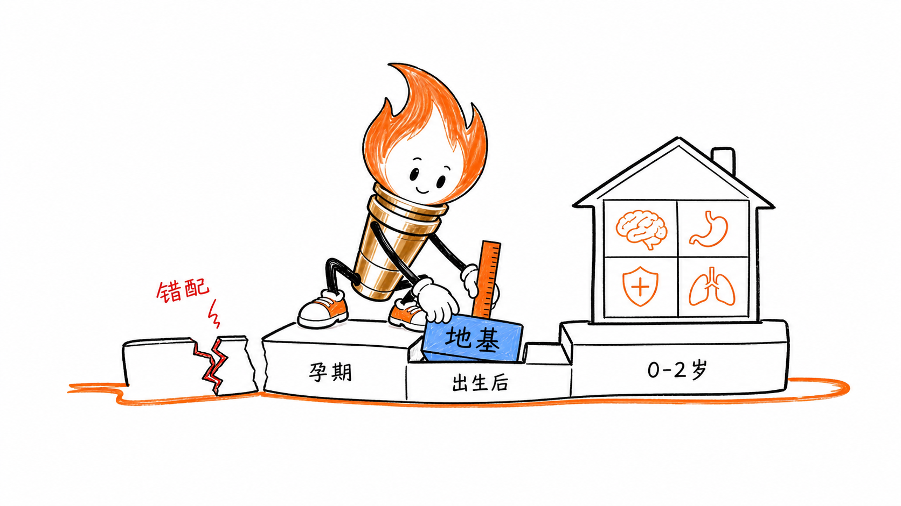

<a id="point-01-002"></a>
### 生命最初1000天：奠定一生身心健康的基石

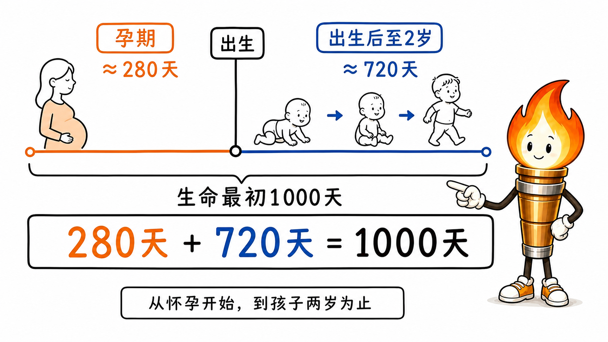

<a id="point-01-003"></a>
#### 第一部分，震撼父母的数据

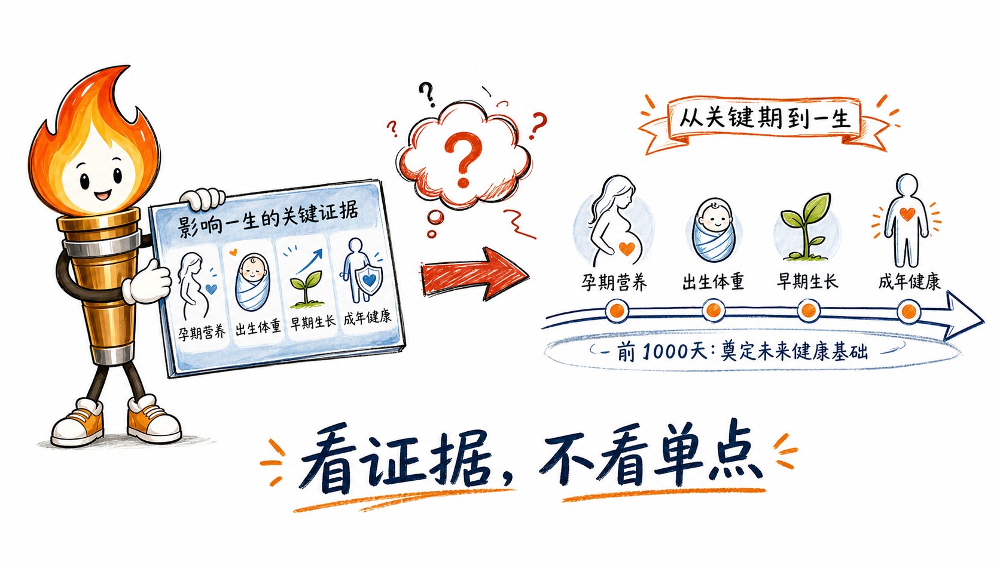

有一个数据，所有父母都应该知道。《中国心血管健康与疾病报告2023》的数据，2021年心血管病分别占农村、城市死因的48.98%和47.35%，几乎接近一半。可能很多人不知何谓心脑血管疾病，其实就是心梗、中风、猝死背后的真正疾病，大家总喜欢把原因归结为学习压力大，工作强度高，加班、熬夜、过劳。虽然这种疾病和成年后的饮食、运动、压力、睡眠有关，但越来越多研究提醒我们：一个人对心脑血管疾病的易感性，并不是到了四五十岁才突然出现的。它的地基，可能早在生命最初1000天就已经建好。

也许有人会说：“孩子刚出生，怎么就和几十年后的心血管病、糖尿病、肥胖联系到一起了？”这正是很多父母最容易忽略的地方。我们总以为，健康是长大以后的事情。孩子小时候，只要不生病、不发烧、体重长得快，看起来白白胖胖，就觉得养得不错。等到一个人中年以后出现肥胖、高血压、糖尿病、脂肪肝，甚至心梗、中风，我们才开始回头找原因：是不是吃得太油？是不是运动太少？是不是压力太大？是不是经常熬夜？

这些原因当然重要。
但它们往往只是推倒身体的最后一块多米诺骨牌。真正的地基、第一块多米诺骨牌，可能藏在宝宝还只是个胚胎的时候。

生命最初1000天，是从怀孕开始，到孩子两岁为止。孕期大约280天，出生后大约720天。加起来这1000天，孩子的身体不是在简单长大，而是在建立一生的代谢系统、免疫系统、心血管系统和大脑发育基础。

一个孩子在妈妈肚子里的营养环境，出生后的喂养方式，婴儿期的生长速度，早期的肠道菌群、免疫系统和代谢系统，都会参与塑造这个孩子未来怎样利用能量、怎样储存脂肪、怎样调节血糖、怎样面对炎症和压力。

这个观点听上去很惊人，但它不是育儿焦虑，也不是商业广告。它来自过去几十年里，一个越来越重要的科学领域：健康和疾病的发育起源。

它想回答的问题很简单：
为什么有些人长大后更容易肥胖？
为什么有些人更容易患高血压、糖尿病和心血管疾病？
为什么同样的饮食、同样的生活方式，有些人的身体更能承受，有些人却更早出现问题？

科学家逐渐发现，答案不能只从成年后的生活习惯里找。
还要回到生命刚开始的时候。

而这个领域最重要的起点之一，就是著名的巴克假说。

<a id="point-01-004"></a>
#### 第二部分，健康和疾病的发育起源

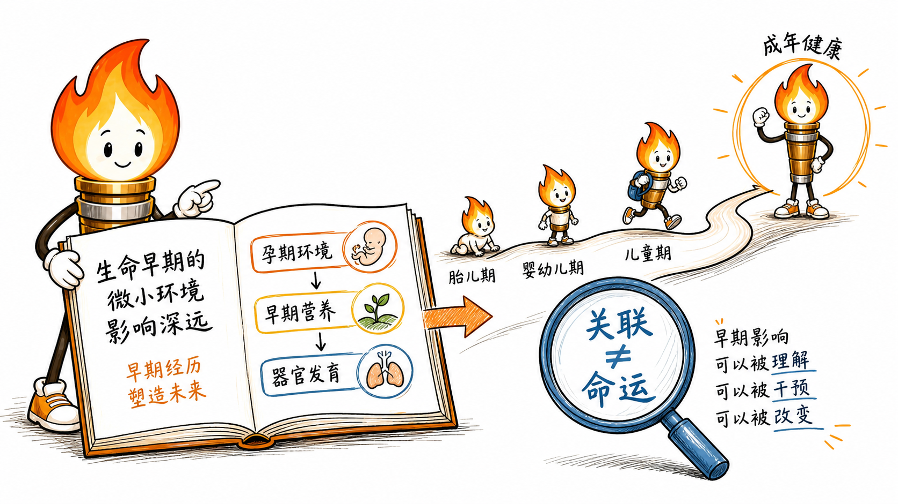

<a id="point-01-005"></a>
##### 巴克假说

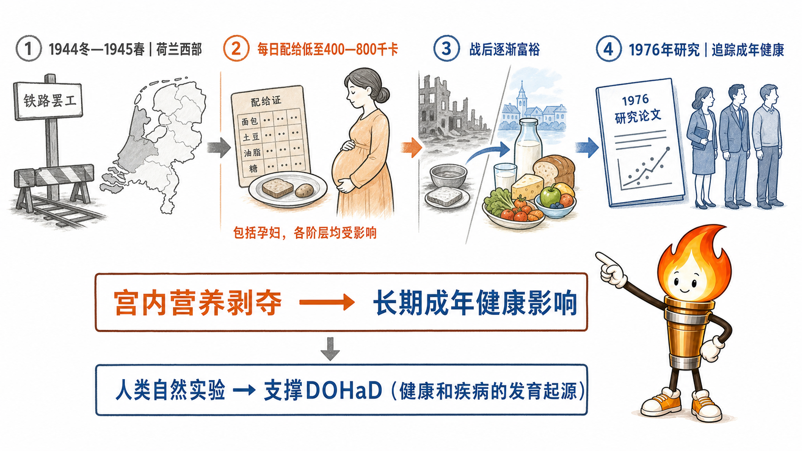

20世纪80年代初，David Barker 及其他研究者注意到一个看似矛盾的现象：虽然随着国家整体富裕程度提高，心血管疾病的总体发生率会上升，但在一个富裕国家内部，最贫困的居民反而承受着最高的患病率。

他和其他研究者通过一系列研究提出：如果胎儿时期处在不良环境中，而成年后又处在食物充足的环境里，这种组合可能会成为成年慢性病的“配方”。这一观点后来被称为 Barker 假说。是指出生体重和其他婴儿期指标，与成年疾病发生率之间的联系。

1944年冬天和1945年春天，在一次铁路罢工之后，德国占领当局限制了荷兰西部地区的食物配给，包括阿姆斯特丹在内。当地居民，包括孕妇，每天只能获得低至 400—800 千卡的食物。饥荒影响了各个社会阶层，战后又紧接着进入了逐渐富裕的时期。

发表于1976年的“荷兰饥饿冬天”研究，虽然源于一场悲剧，却几乎构成了一项设计完美的人类自然实验，用来观察宫内营养剥夺对后续成年健康的影响。这项研究为一个不断发展的领域提供了关键支持和基础洞见，这个领域就是“健康和疾病的发育起源”，英文叫 DOHaD（多哈）。

<a id="point-01-006"></a>
##### 出生体重

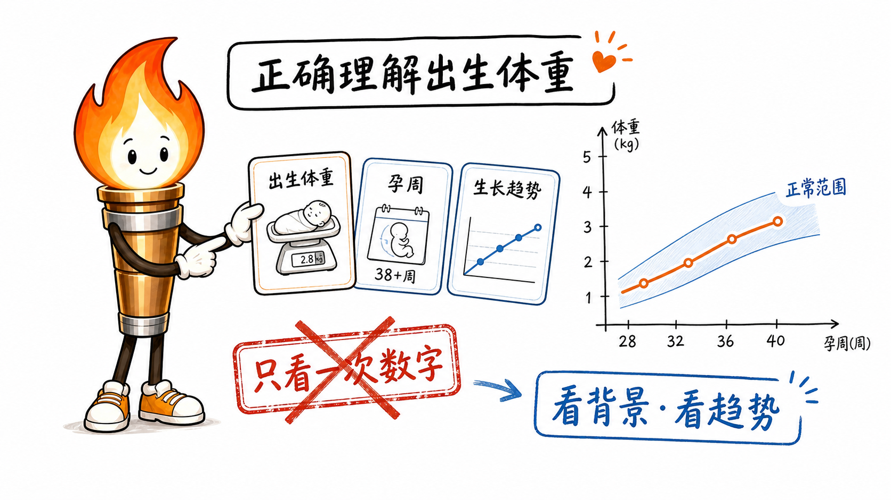

“荷兰饥饿冬天”研究的一个重要发现是：那些会影响成年健康的孕期经历，并不一定都会反映在出生体重上。

如果母亲在妊娠中晚期经历饥荒，婴儿的出生体重往往会明显降低。可是，如果母亲只是在妊娠早期经历饥荒，孩子出生时的体重可能完全正常。问题在于，这些出生体重正常的孩子，长大后反而更容易肥胖；他们成年后的肥胖率，不仅高于二战前和二战后出生的人，也高于那些在妊娠中晚期经历饥荒的人。

这说明，出生体重虽然是观察胎儿营养状况最容易获得的指标，但它并不是后来成年疾病的直接原因，也不能完整反映所有会影响成年健康的孕期风险。

换句话说，一个孩子出生时体重正常，并不意味着胎儿时期没有受到影响。宫内营养不足，即使没有造成出生体重下降，也可能在身体内部留下长期影响，改变孩子成年后的代谢和肥胖风险。后来在啮齿动物和绵羊等动物研究中，也观察到了类似现象。

<a id="point-01-007"></a>
##### 发育的关键时期

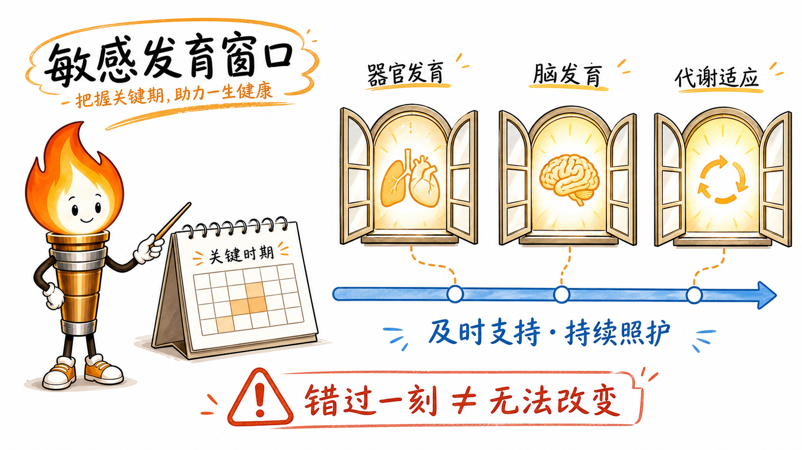

“荷兰饥饿冬天”研究的另一个重要启示是：孕期营养不足发生在什么时候，非常关键。

如果饥荒发生在妊娠晚期，孩子出生时通常体重较低，并且一生中体型都偏小；他们成年后的肥胖率反而低于饥荒前后出生的人。

但如果饥荒发生在妊娠早期，情况就不同了。这些孩子出生体重可能正常，但成年后更容易出现肥胖、血脂异常和心血管疾病风险升高。相比之下，肾功能下降的相关指标，则更多出现在妊娠中期经历饥荒的人身上。

“发育存在关键窗口期”这个概念，在 DOHaD 理论出现之前就已经存在。在动物实验中，科学家可以比较容易地验证不同发育阶段受到影响后会发生什么。但在人类身上，不可能为了研究而故意让孕妇在某个阶段经历饥饿。因此，大多数流行病学研究很难清楚回答“哪个孕期阶段最关键”这个问题。

也正因为如此，“荷兰饥饿冬天”研究格外重要。它虽然来自一场悲剧，却像一次自然发生的人类实验，让我们看到：孕期某个短暂阶段的饥饿经历，如何影响孩子几十年后的健康。

<a id="point-01-008"></a>
#### 营养错配

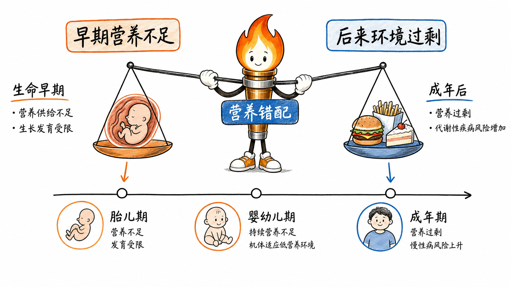

发生在1958-1961年的中国大饥荒，不仅是人类历史上一次惨烈的社会经济灾难，也为生命科学、流行病学和人口经济学提供了一个规模空前的“自然实验”场域。这场饥荒造成了约1700万至3000万非正常死亡，被视为人类记录史上死亡人数最多的单次饥荒事件。它影响范围极广，不同地区受灾程度差异很大。所以研究人员可以比较不同出生年份、不同地区、不同暴露阶段的人群，观察他们成年后的健康差异。

而饥荒的幸存者在几十年后又经历了中国快速的经济发展和饮食变化。也就是说，很多人生命早期经历的是匮乏，成年后却进入了食物越来越充足、热量越来越高、生活方式越来越现代化的环境。这种前后环境的巨大反差，正好对应了巴克假说里非常重要的一个概念：营养错配。

北京大学公共卫生学院（马冠生教授团队）与哈佛大学等机构合作的研究被公认为该领域的奠基性经典。其中最具代表性的研究是2011年发表于糖尿病顶级期刊《Diabetes Care》的实证论文：《生命早期暴露于中国大饥荒与成年期代谢综合征风险》。该研究最重要的贡献是提出了“早期营养匮乏 + 成年期营养过剩”的“双重打击”证据。研究发现，在严重受灾地区，胎儿期暴露于饥荒的个体患高血糖的风险是非暴露者的3.92倍；但如果该个体成年后采取了西方饮食模式（高油脂、高热量），其高血糖风险会剧增至7.63倍。

<a id="point-01-009"></a>
#### 心血管系统对生命早期营养不足非常敏感

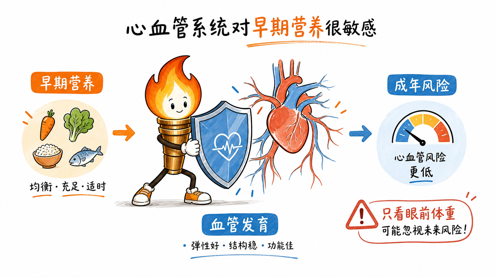

很多关于中国大饥荒的研究发现，胎儿期或婴儿期经历饥荒的人，成年后更容易出现代谢问题，比如血糖异常、2型糖尿病、肥胖、血脂异常和代谢综合征。

在肥胖和代谢综合征方面，研究还发现了明显的性别差异。女性受到的影响往往更明显，尤其是在成年后的BMI、肥胖风险和代谢综合征方面。这可能和生物学差异有关，也可能和当时资源分配、儿童照护、社会偏好等因素有关。简单说，在极端匮乏时期，不同孩子实际得到的食物和照顾可能并不一样，这些差异也会被身体长期记录下来。

中国大饥荒研究还支持了一个重要判断：心血管系统对生命早期营养不足非常敏感。特别是在妊娠早期，如果胎儿经历营养不足，成年后高血压、冠心病、中风等风险可能会增加。原因之一是，妊娠早期正是肾脏、血管和心血管系统打基础的时候。比如肾单位的数量基本在出生前就已经确定，如果胎儿期发育受限，出生后肾单位数量偏少，成年后每个肾单位就要承担更大的工作压力，时间久了，就更容易和高血压、肾脏负担加重联系在一起。

随着这一代人逐渐进入老年，研究者还开始关注认知功能。已有研究提示，生命早期经历饥荒的人，晚年可能更容易出现记忆力、执行功能、视觉空间能力等方面的下降。更深入的一层，是表观遗传。过去我们以为，遗传主要看DNA序列。但现在我们知道，营养是基因的“开关”。中国大饥荒相关研究发现，胎儿期饥荒暴露可能和一些代谢、胰岛素功能、血脂调节相关基因的甲基化变化有关。简单说，饥荒并没有改写DNA本身，却可能改变了身体读取这些基因的方式。这样的变化，有些甚至可以在几十年后仍然被检测到。

<a id="point-01-010"></a>
##### 错配的适应

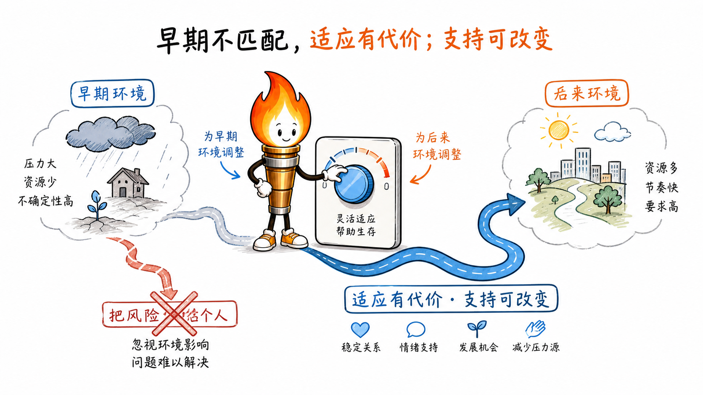

胎儿期营养不足是否会导致成年慢性病，不只取决于胎儿期发生了什么，也取决于出生后进入了怎样的环境。

越来越多的研究也证明，最危险的情况可能不是“胎儿期营养不足”本身，而是胎儿期经历匮乏，出生后又迅速进入营养充足环境。后来的许多动物研究也证实，不良宫内环境之后的“追赶生长”，在这种长期健康风险中扮演着重要角色。

正如课程最开始的死亡数据，我们真的不知道是明天先到，还是无常先到。年纪轻轻的名人猝死频繁地登上热搜，大多数逝者没有意识的几分钟之后自己和最爱的人就将阴阳两隔。也有人因为感受到身体的不适，开始积极的自救，例如某高考志愿规划名师中午还在跑步机上疯狂锻炼，看似是死神好不眷顾其与命运抗争的努力，其实是他努力的方向错了，记住，营养是基因表达的“开关”，对于癌症和心脑血管等慢性疾病的逆转，改变饮食是首要的选择，没有改变饮食的运动、健身都是徒劳的。

<a id="point-01-011"></a>
#### 第三部分，营养是基因表观的“开关”

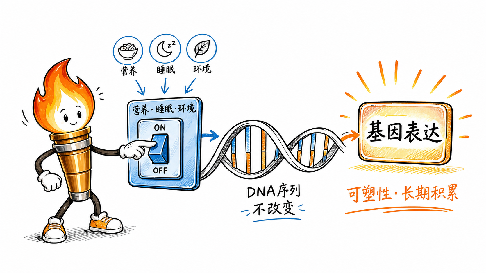

前面讲了一堆宏达的研究，现在讲一个接地气的数据。
1994—1995年，研究人员测量了1570名3—6岁儿童的血压。这其实是关于母乳喂养宝妈什么时候恢复生理期的研究，研究案例分别生活在中国成都、危地马拉、智利、尼日利亚和瑞典。这些儿童全部为孕周超过37周出生，出生体重都超过2.5千克。
在每个国家，儿童当前体重越高，血压也越高。另一个数据是出生时体型越小，收缩压越高。例如在智利，在调整当前体重后：出生体重每减少1千克，收缩压升高4.9毫米汞柱；出生身长每减少1厘米，收缩压升高1毫米汞柱；出生头围每减少1厘米，收缩压升高1.3毫米汞柱。这些关联不受孕周长短影响。
在这些来自中国、中美洲和南美洲的样本中，儿童血压升高与出生时身体比例整体缩小有关。这种比例性缩小通常源于整个妊娠期生长受限。而高血压是卒中的一个已知强危险因素，因此，备孕和改善孕期的营养与健康，可能对预防发展中国家的心脑血管疾病具有重要意义。

那么，生命最初1000天是指哪一段时间？是从怀孕开始，整个孕期有280天，到宝宝出生后两岁，又有约720天，合计就是生命最初1000天。孕期营养影响胎儿编程，出生后喂养继续影响孩子的代谢、免疫、肠道菌群和肥胖风险。世界卫生组织（WHO）强调这是人一生中生长发育最快、奠定健康基础的“关键窗口期”。如果人生是一栋高楼，这1000天就是决定高楼长久屹立或不幸坍塌的地基。

如今，生命最初1000天的概念正被商家疯狂盗用，用来宣传婴儿配方奶粉、米粉和各种补充剂。世界卫生组织也一再警告，配方粉使儿童易患感染病、哮喘、脑膜炎、肥胖和糖尿病。但依然有大量的父母缺乏最基本的营养和母乳喂养常识，据权威医学杂志《柳叶刀》的研究，如果提升母乳喂养率，每年可以挽救82万名5岁以下儿童的生命。 2019年，上海调查发现超过半数中小学生过敏。如果宝宝出生后吃的第一口奶不是母乳，那伴随他们的可能就是终身过敏体质。

所以，母乳喂养从来不只是“吃不吃奶”的问题。它是孩子出生后的720天里，父母最常参与、最容易被误导、也最能影响孩子长期健康的关键行动。

不止是身体的健康，从出生到3岁的1000天，是潜意识形成和性格的“关键窗口期”。监狱中有75%的罪犯是4次以上的惯犯，他们基本都属于无情型人格，大都又源于生命最初1000天的忽视、冷漠或虐待，具体会在性格培养的课程中详解。

<a id="point-01-012"></a>
#### 给您的建议

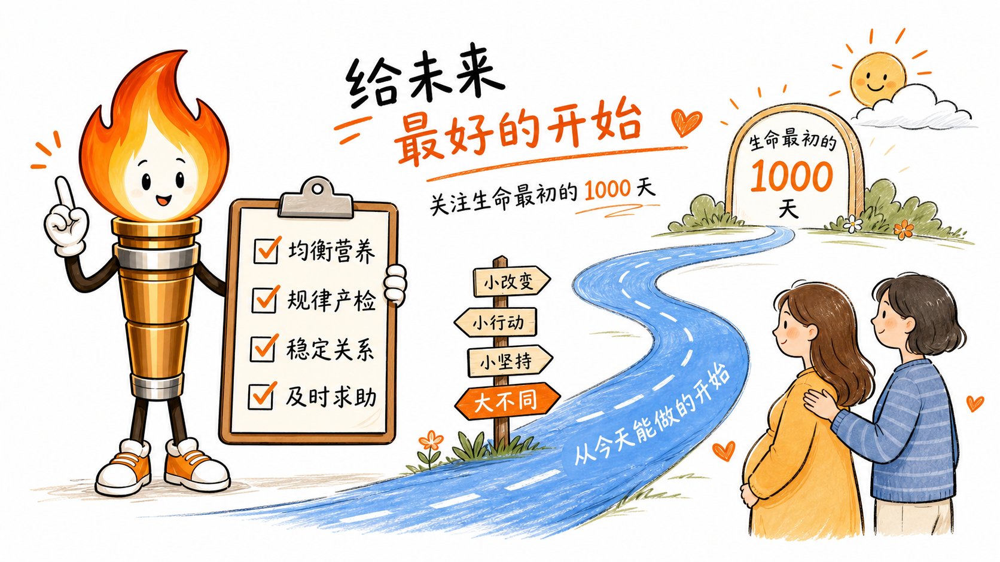

当您完成生命最初1000天的学习，我不知您是否会思考，我能为自己和孩子做一些什么？给您三条建议：
1、提前备孕，戒烟限酒，让自己的BMI数值处于19-23区间，既不太瘦，又给孕期留下增长空间。仅仅自己不吸烟是不够的，努力戒掉二手烟，尽量避免宝宝生活的空间有三手烟，烟草是宝宝哮喘的诱因之一。
2、完成营养健康课程学习，通过多食用豆类、粗粮、蔬菜和水果，减少动物性食物来排毒，完成身体质量的蜕变。这个建议和公众普遍的常识有冲突，是因为大众不爱学习，却又活在资本精心营造的信息茧房中。
3、生命最初1000天不是宿命论，但它深刻影响我们的每日生活和一生的身心健康。最初的营养错配毁掉的是成年后身体的健康，最初的忽视、虐待会迫使孩子用一生治愈童年。而给孩子一个好的人生开端，首要是自己得是一个稳定、理性和爱学习的人。


<a id="point-01-013"></a>
### 孕期 - 认知储备 - 哺乳征程

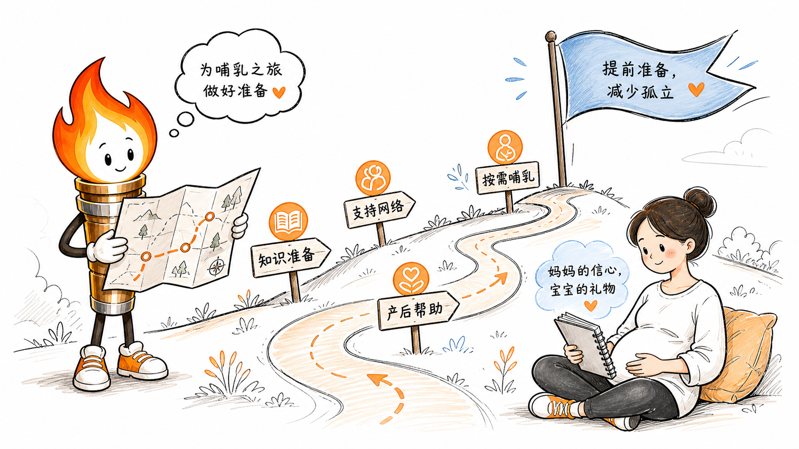
<a id="point-01-014"></a>
#### 母乳喂养不亚于万里长征，准备好了吗？

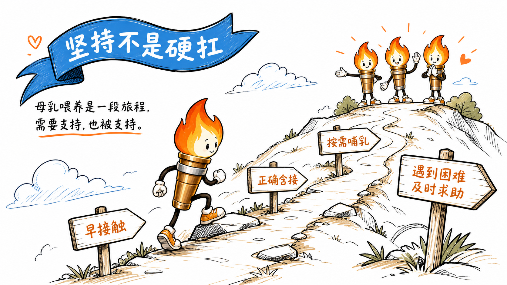

<a id="point-01-015"></a>
#### 第一部分，孤立无援的母乳喂养大环境

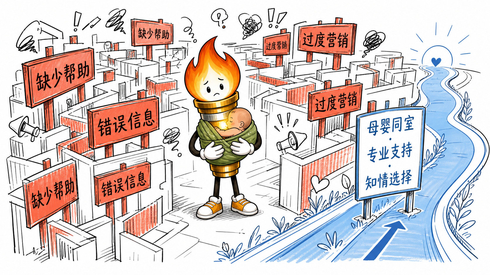

<a id="point-01-016"></a>
##### 仅有5%的新生儿第一口奶吃的是母乳

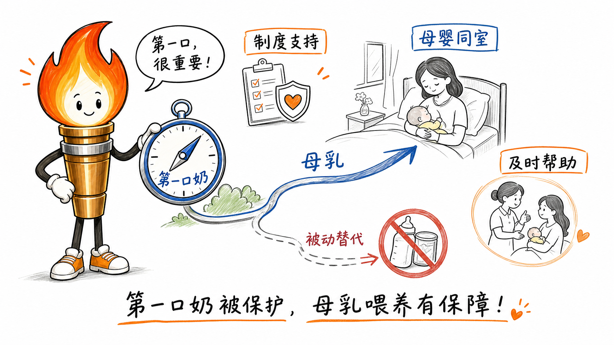

有一群医学院的学生，在医院询问孕妇，准备如何喂养自己的宝宝，结果有95%的孕妇想要母乳喂养宝宝。等这群孕妇产后出院时，学生问宝宝出生后的第一口奶吃的是什么时，仅有5%的产妇报告自己的宝宝第一口奶吃的是母乳，数据搞好翻转了。

为什么？因为第一次产检时，胎儿就已经被资本盯上了，商人拿出真金白银获取母婴的信息，并不是为了做慈善，而是将母婴视为自己的提款机，为了利益最大化，抢夺新生儿的第一口奶就成为资本与父母博弈的最前沿和最重要的战场。

<a id="point-01-017"></a>
##### 因诺琴蒂宣言与全球共识

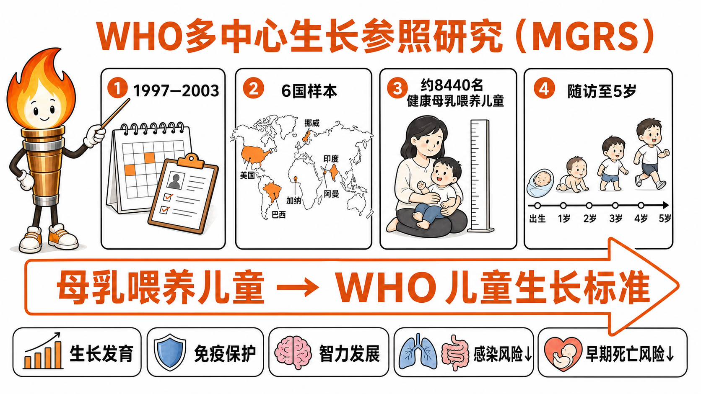

为了对抗日益疯狂的资本掠夺，1989年，世界卫生组织（WHO）和联合国儿童基金会（UNICEF）首次联合提出“纯母乳喂养”的倡议，倡导婴儿在出生后前6个月应完全由母乳喂养。

1990年8月，在意大利佛罗伦萨的因诺琴蒂中心，WHO与UNICEF正式签署并发布了具有里程碑意义的《因诺琴蒂宣言》。这份宣言明确将“6个月纯母乳喂养”确立为全球公共卫生目标，呼吁各国政府制定政策、培训医护人员、改善母婴照护体系，以全面支持母乳喂养。

《因诺琴蒂宣言》的主要内容和核心要点：
主要目标：母乳喂养是婴儿获得最佳营养、健康和发展的自然方式，并呼吁全球采取行动，确保所有婴儿在生命最初阶段得到充分的母乳喂养支持。

核心内容
**婴儿喂养的理想标准**
所有婴儿在出生后的前6个月应完全采用纯母乳喂养（即不添加任何其他食物或液体，包括水，除非有医学需要）。在6个月后，应在继续母乳喂养的同时，逐步引入适当的辅食，母乳喂养可持续至2岁或更长时间。

**保护、促进和支持母乳喂养的行动**
国家层面：各国政府应制定政策和法律，保护母乳喂养，例如落实《国际母乳代用品销售守则》（1981年通过），限制奶粉的营销。
医疗机构：所有产科医院和保健机构应采取措施支持母亲在婴儿出生后立即开始母乳喂养，并避免不必要的奶粉喂养。后来有了专门的认证，例如爱婴医院。
社会支持：通过教育和宣传，提高公众对母乳喂养益处的认识，消除文化和社会障碍。

**全球合作与承诺**
呼吁国际组织、政府、NGO和社区共同努力，创建一个支持母乳喂养的环境。
强调需要监测和评估母乳喂养的实施情况，确保政策有效执行。

世界卫生组织（World Health Organization，简称WHO）是联合国下属的专门机构，负责制定全球卫生目标和战略，为各国提供技术指导和建议。联合国儿童基金会（United Nations Children's Fund，简称UNICEF）致力于在全球范围内促进和维护儿童生存权、发展权、受保护权和参与权的组织。

在世界卫生组织和联合国儿童基金会发起“纯母乳喂养”倡议之前，各国医疗机构使用的儿童生长指南并非完全基于母乳喂养儿童的数据，其中夹杂了大量人工喂养儿童的样本，导致标准存在偏差。为了为全球提供更科学、精准的儿童生长数据，世界卫生组织于1997年至2003年间联合联合国儿童基金会，在巴西、加拿大、加纳、印度、挪威和阿曼六国，筛选出8440名健康、接受母乳喂养的儿童进行系统随访，直至5岁。研究结果表明，纯母乳喂养的婴儿在生长发育、免疫力及智力发展方面具有明显优势，尤其在预防呼吸道感染和腹泻等常见传染病方面更为突出。纯母乳喂养不仅显著降低婴儿期疾病的发生率，还有效减少早期死亡风险。

<a id="point-01-018"></a>
##### 抱歉，政府并未实质支持父母

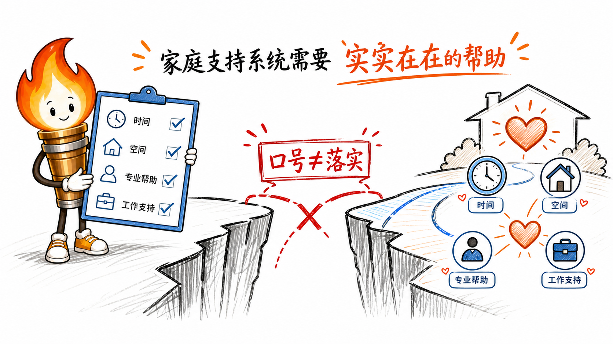

守护母乳喂养最重要的力量是政府，看一个政府是守护婴童福祉，还是只在乎资本利益，不要听它说什么，要看它做什么。

<a id="point-01-019"></a>
##### 国际母乳代用品销售守则

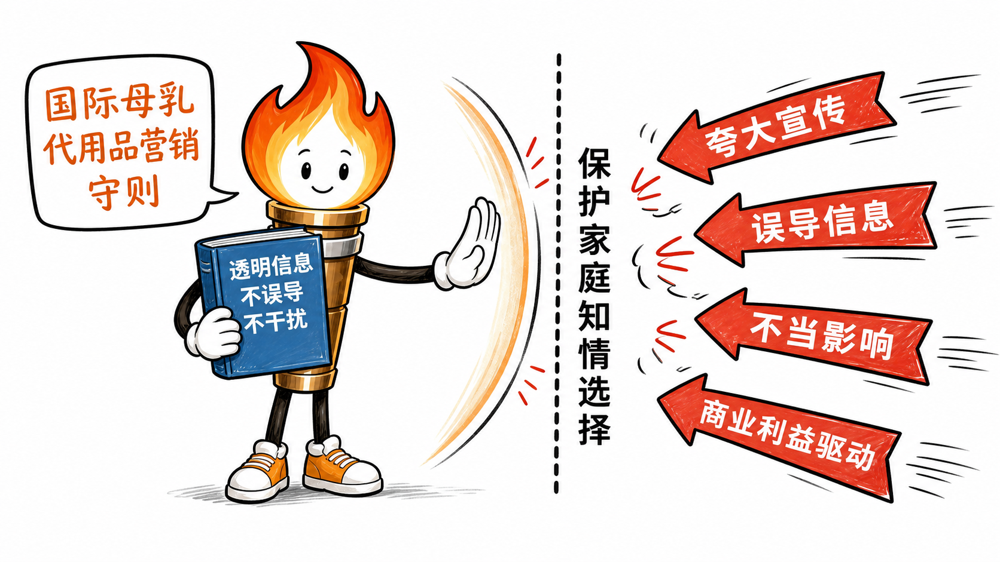

《国际母乳代用品销售守则》是世界卫生组织（WHO）于1981年5月21日由世界卫生大会通过的国际健康政策框架，旨在通过保护和促进母乳喂养，确保婴儿获得安全和充足的营养，并规范母乳代用品（如婴儿配方奶粉、辅食、喂养瓶和奶嘴）的营销。其核心目标是防止母亲因不当营销而放弃母乳喂养，并确保替代品在必要时的安全使用。

《国际母乳代用品销售守则》具体内容包括：

禁止行为：禁止向孕妇、哺乳期母亲或公众提供免费或低成本的母乳代用品样品、促销材料或礼品。
医疗机构的限制：禁止在医疗保健设施内展示或推广母乳代用品，包括禁止提供免费样品、使用医务人员进行推广或举办相关活动。
标签要求：要求母乳代用品的标签上必须包含准确信息，例如母乳喂养的优越性、配方奶粉的正确使用方法、潜在健康风险（如病原体污染）和不当使用的危害。标签不得包含误导性图片或文字，如暗示母乳代用品优于母乳或鼓励瓶喂。
信息教育材料：要求所有与婴儿和幼儿喂养相关的教育材料必须突出母乳喂养的好处，禁止使用（奶粉）行业提供的材料。
监测和执行：建议成员国通过立法将守则纳入国家法律，并建立独立、透明的监测机制，明确责任主体和违规处罚措施。

<a id="point-01-020"></a>
#### 中国的实施情况分析

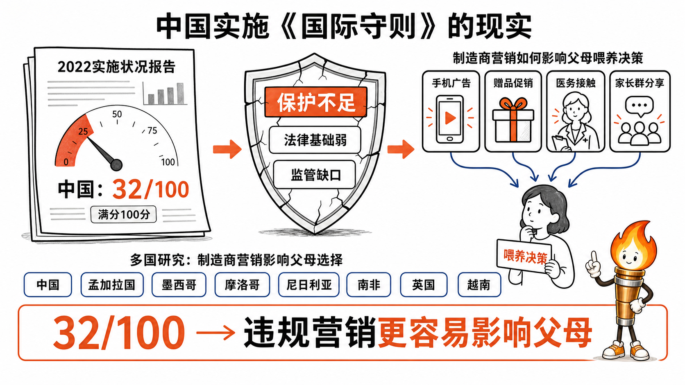

《国际母乳代用品销售守则》是为了守护母婴的利益，但在我国其不具有任何法律约束力。父母们但凡留意，都会发现它的每一条守则都被我们按在地上使劲摩擦，我们的感受有时并不精准，世界卫生组织和联合国儿童基金会也会对各成员国的实施情况进行检查。

中国确实实施了《国际母乳代用品销售守则》，但实施程度有限，存在显著的差距。根据2022年WHO和UNICEF联合发布的《母乳代用品营销：国际守则的国家实施状况报告2022》，中国的实施情况如下：

法律基础与评分，满分100分，我们得分32分。
2015年的《中华人民共和国广告法》是法律层面执行《守则》的唯一证据。  
“最适合中国宝宝体质”、“专利配方”、“最接近母乳”这些耳熟能详的违法广告遍地都是，我们是如何获得了32分。

得分细分为以下类别：
范围	（得分 8）
仅覆盖12个月以内的婴儿母乳代用品，不包括辅食和喂养瓶及奶嘴。

监测和执行（得分0）
明确了负责监测的主体，但未定义违规行为的制裁措施，也未要求监测独立于商业影响且透明。

信息/教育材料（得分3）
所有要求的内容均未完全包括，包括：
母乳喂养的好处
母亲营养的重要性
部分瓶喂的负面影响
放弃母乳喂养的决定难以逆转
配方奶粉的正确使用方法
使用母乳代用品的含义和风险
不当喂养/使用的健康危害
内在污染风险
不得提及特定品牌产品
不得使用理想化母乳代用品的图片或文字
社会和经济影响
禁止行业提供材料

向公众的推广（得分10）
广告：禁止（但监测和执行为0）。
向公众提供样品：未禁止。
销售点促销设备：未禁止。
与母亲的直接接触：未禁止。
向孕妇和母亲赠送礼品：未禁止。

医疗保健设施内的推广（得分0）
总体禁止推广：未禁止。
展示相关产品：未禁止。
展示标牌/海报：允许。
分发制造商材料：未禁止。
使用设施举办活动/宣传：未禁止。
制造商使用医务人员：未禁止。

与医务人员的互动（得分0）
总体禁止礼物/诱因：未禁止。
财务/物质诱因：未禁止。
奖学金、考察、研究资助、会议参与：未禁止。
要求披露：未要求。
免费/低成本供应：未禁止。
设备/服务捐赠：未禁止。
捐赠中提及特定产品：未禁止。
产品样品：未禁止。
产品信息限制：未限制。
会议赞助：未禁止。

标签要求（得分11）
婴儿配方奶粉：
禁止内容：均未禁止，包括营养/健康声明、暗示6个月前使用、贬低母乳喂养、与母乳比较、推荐瓶喂、专业人士背书等。
要求信息：均未包括，包括“重要提示”、母乳喂养优越性声明、仅在医务人员建议下使用、准备说明、健康危害警告、病原体风险警告、理想化使用图片、推荐年龄、2岁以上继续母乳喂养的重要性、6个月前不推荐辅食等。
后续配方奶粉：与婴儿配方奶粉类似，均未禁止相关内容或包括要求信息。

尽管有一部《广告法》措施，但监管为0，作为父母您作何感想？研究显示中国存在广泛的母乳代用品营销违规行为。例如，一项多国研究（包括中国、孟加拉国、墨西哥、摩洛哥、尼日利亚、南非、英国、越南）记录了制造商的营销活动对父母喂养决策的显著影响。政府的不作为和默许制造商违法营销，长期的代价就是国民的整体素质越来越低，一个连婴童福祉都不顾的政府，何谈食品安全。

<a id="point-01-021"></a>
##### 抱歉，医疗机构是抢夺初乳的急先锋

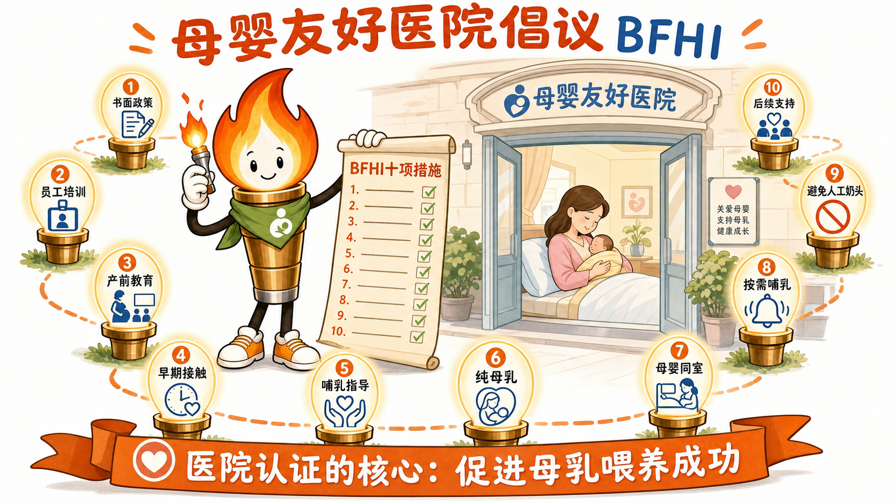

由世界卫生组织（WHO）和联合国儿童基金会（UNICEF）于1991年联合发起的一项全球性项目，旨在通过改善医疗机构的服务和实践，保护、促进和支持母乳喂养。这一倡议是1990年《因诺琴蒂宣言》的直接延续和具体实施，目标是确保所有母亲和婴儿在出生后能够获得最佳的喂养支持。

**核心内容：十项措施**
母婴友好医院倡议（Baby-Friendly Hospital Initiative, 简称BFHI）
BFHI的核心是“促进母乳喂养成功的十项措施”，所有希望获得“母婴友好医院”认证的医疗机构必须遵守这些标准：
1、制定书面政策：建立支持母乳喂养的明确政策，并传达给所有医护人员。
2、培训员工：为医护人员提供必要的培训，使其具备支持母乳喂养的知识和技能。
3、产前教育：向孕妇及其家人宣传母乳喂养的益处和方法。
4、早期接触：帮助母亲在婴儿出生后半小时内开始母乳喂养。
5、哺乳指导：指导母亲如何正确哺乳，并维持乳汁分泌，即使母婴暂时分离。
6、纯母乳喂养：除非有医学指征，不给新生儿喂食除母乳外的任何食物或饮品。
7、母婴同室：让母亲和婴儿24小时同处一室，促进亲密接触和按需哺乳。
8、按需哺乳：鼓励根据婴儿需求随时哺乳，而不是按固定时间表。
9、避免奶嘴：不给母乳喂养的婴儿使用奶嘴或人工奶头，以免干扰哺乳。
10、后续支持：建立母乳喂养支持网络，确保母亲出院后能获得社区或专业帮助。

**实施与认证**
医院需经过自我评估、外部评审和实地检查，证明其符合“十项措施”，才能被授予“母婴友好医院”称号。截至目前，全球已有超过150个国家的20,000多家医疗机构获得认证。

在中国，BFHI于1992年引入，第一批“母婴友好医院”于1990年代中期获得认证。截至近年，全国已有数千家医院参与这一倡议，尤其在城市地区推广较广。但是，我们也看到国外的著名乳业公司因为贿赂医院受到处罚，央视曾揭露新生儿第一口吃什么奶粉，取决于宝宝被安排在哪一层，每一层的奶粉品牌不一样。

<a id="point-01-022"></a>
##### 推动母婴友好医院变革

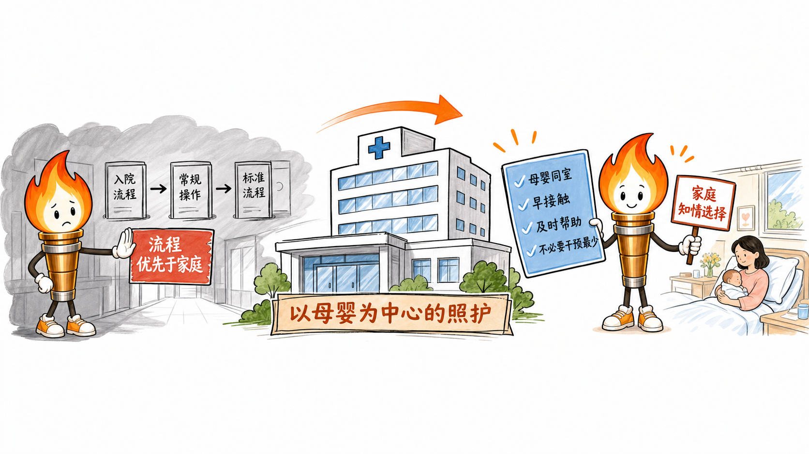
伴随出生率下降，医院为争抢客户也是费尽心机。育儿网校将基于孕产妇的反馈，在各城市给医疗机构打分，引导孕产妇选择支持母乳喂养的医院。希望每一位孕产妇都能积极报告产检医院和自己信息泄露情况，在宝宝出生后，及时报告医院干扰母乳喂养的情况。

<a id="point-01-023"></a>
##### 抱歉，很多育儿平台并不真正希望你学会母乳喂养

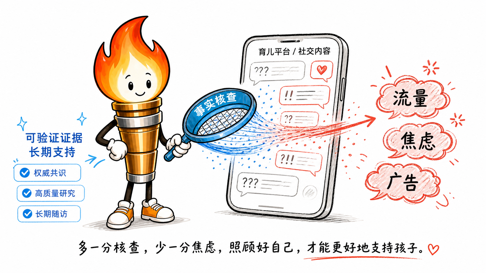

今天的母婴行业，有一个很少被公开说破的现实：
很多育儿平台、母婴社区和母婴博主，表面上都在说“母乳喂养好”，但它们真正赖以生存的商业收入，往往来自配方奶粉、婴儿米粉和各种补充剂。

这就决定了一个很尴尬的结果：
它们可以温和地支持母乳喂养，但很难真心地指导你母乳喂养。
因为母乳喂养的家庭，基本上远离了奶粉消费、焦虑消费和服务消费。可在商业逻辑里，一个持续焦虑、不断提问、反复购买的妈妈，才是更有价值的用户。

所以，很多父母进入育儿群之后会发现，群里最热闹的不是科学喂养，而是广告、推荐、团购和经验争吵。真正坚持母乳喂养、愿意分享系统知识的妈妈，很快会被踢出群。因为她们说出的真相，既可能影响别人的生意，也可能刺痛一些已经被迫放弃母乳喂养的妈妈。

久而久之，很多育儿群就变成了信息茧房。
妈妈们在里面互相安慰，互相模仿，互相强化焦虑，却很难真正获得可靠、系统、可执行的科学喂养支持。

这也是育儿网校存在的原因。
育儿网校不是要把母乳喂养变成妈妈一个人的责任，也不是要用母乳喂养去审判任何妈妈。恰恰相反，我们要做的是把母乳喂养从“妈妈一个人的孤军奋战”，变成“整个家庭共同参与的科学养育”。

因为母乳喂养从来不是妈妈一个人的事。
它需要爸爸理解，需要长辈支持，需要家庭形成共识。
很多家庭背负房贷、车贷的压力，老人并不懂得生命早期陪伴的重要性，只是单纯想帮忙分担照顾孩子，让宝妈“早点断奶去上班”。但生命最初几年，孩子需要的远远不只是吃饱和安全。

他需要稳定的回应，需要熟悉的气味，需要温柔的身体接触，需要在一次次被抱起、被安抚、被理解中，建立对世界最初的信任。

早期陪伴影响安全感，安全感影响性格，性格影响命运，而孩子的命运，最终会反过来影响整个家庭的福祉。

所以，育儿网校要做的，不只是教妈妈怎么喂奶。
我们真正要做的，是帮助一个家庭看见：
母乳喂养不是小事，早期陪伴不是闲事，生命最初1000天不是可有可无的事。
这是孩子人生的开端。
共识是一个家庭和睦相处的关键所在。

<a id="point-01-024"></a>
#### 第二部分，为什么你应该坚持

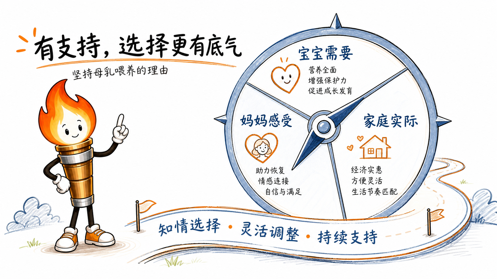

母乳喂养不是“可有可无的加分项”，而是对宝宝、妈妈、家庭和社会都具有可量化收益的基础健康投资。世界卫生组织指出，母乳是婴儿的理想食物，安全、清洁，并含有可预防多种常见儿童疾病的抗体。

从高质量证据看，母乳喂养最明确、最稳定的收益，首先体现在感染与住院风险下降。Lancet 系列综述显示，在 6 个月内，与不母乳喂养相比，纯母乳喂养与感染性死亡显著下降相关；在 6–23 个月，任何母乳喂养都与感染性死亡风险下降相关。母乳喂养还与腹泻、下呼吸道感染、急性中耳炎住院和发病风险下降相关。

对母亲而言，母乳喂养不是单向“付出”。系统综述和荟萃分析显示，较长的总哺乳时长与更低的乳腺癌、卵巢癌、2 型糖尿病、高血压和部分心血管结局风险相关；同时，哺乳过程中的催产素释放还可帮助子宫收缩，减少产后出血。

对家庭而言，母乳喂养的现实收益很“接地气”：更少的配方奶支出、较低的疾病相关医疗费用、更少因孩子生病而误工、在停电、出行、灾害或供应波动时更强的喂养韧性。中国的相关成本研究估算，家庭每年为商业配方奶直接支出的费用超过 70 亿美元；而在国际经济学模型里，提高母乳喂养率可显著减少家庭与医保体系的医疗和非医疗成本。

一个同样重要的事实：坚持母乳喂养，不是妈妈一个人的“意志力测验”。Lancet 2023 系列、WHO“成功母乳喂养十项措施”以及中国相关政策都提示，家庭支持、医疗机构支持、返岗环境和商业营销压力，都会实质性影响母乳喂养是否成功。换句话说，很多“坚持不下去”，并不是因为妈妈不够努力，而是因为支持系统不够好，所以，妈妈要成为最早的学习者。

<a id="point-01-025"></a>
##### 母乳喂养对宝宝的好处

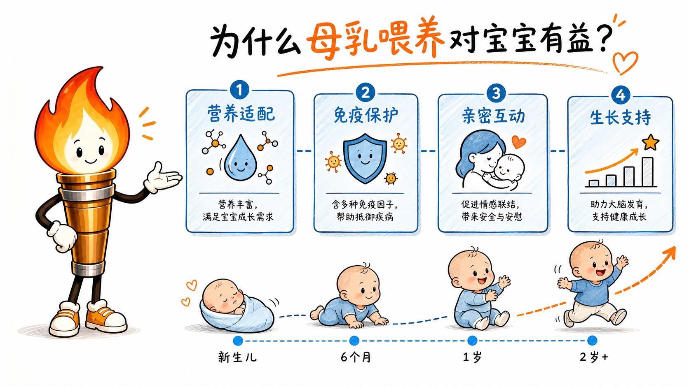

<a id="point-01-026"></a>
###### 母乳的“量身定制”与无可替代性

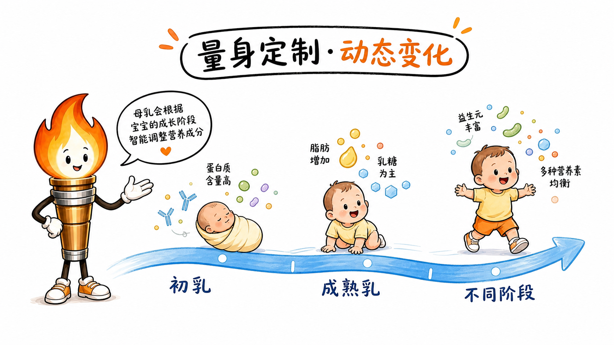

中国母婴家庭面对的是非常具体的环境阻力。UNICEF 中国报告显示，97% 的孕妇和母亲在过去一年中见过或听过配方奶广告；研究提示，广告和推广会提高前 6 个月使用配方奶的概率，而返岗工作是引入配方奶的重要时间点之一。

这也是为什么，谈“坚持母乳喂养”，不能只谈“母乳有多好”，还必须谈系统支持：家人的态度、医院的流程、出院后的咨询、工作场所是否允许哺乳或挤奶、以及商业营销是否在削弱母亲信心。Lancet 2023 系列明确指出，婴幼儿喂养不仅是个人选择问题，也是社会、政策和商业力量共同塑造的结果。

对宝宝来说，母乳喂养最确定的优势，是它同时具备营养、免疫和发育支持三重价值。WHO 明确指出，母乳能提供婴儿最初几个月所需的全部能量和营养；在出生后第一年的后半年，母乳仍可满足一半或一半以上的营养需求；在第二年仍可满足约三分之一的营养需求。更重要的是，母乳不仅是“热量和蛋白质”，还是含抗体和多种生物活性成分的活体食物。

最强的证据来自感染性疾病。Lancet 2016 系列纳入多项系统综述后显示，在 6 个月内，与“无母乳喂养”相比，纯母乳喂养与感染性死亡显著下降相关。母乳喂养对婴幼儿早期生存有实打实的保护作用。

在常见疾病上，保护效应同样清楚。母乳喂养与 6 个月内腹泻发病风险下降相关；5 岁内因腹泻住院风险下降相关；2 岁内下呼吸道感染发病或患病风险下降相关。Lancet 总结称，约一半腹泻发作和三分之一呼吸道感染可因母乳喂养而避免，而腹泻和呼吸道感染住院风险下降更大。

对于很多父母最常见的“耳朵发炎、反复感冒、老跑医院”这类困扰，证据也相当一致。Lancet 系列中的系统综述显示，2 岁以内更多母乳喂养与急性中耳炎风险下降相关。

在早产儿或低出生体重儿中，人乳的意义更大。针对早产儿的系统综述显示，与配方喂养相比，供体人乳可显著降低坏死性小肠结肠炎风险；而 AAP 相关综述也指出，在早产和低出生体重儿中，配方奶相对母亲自有乳增加坏死性小肠结肠炎风险。也就是说，对脆弱宝宝而言，“有没有人乳”本身就是重要的风险分界线。

母乳喂养的好处不仅停留在“少生病”，还延伸到更远期的代谢健康。Lancet 的 113 项研究荟萃分析显示，更长的母乳喂养与超重/肥胖几率下降相关。

发育层面，母乳喂养与认知表现的关系，是很多父母关心但又常被争论的话题。仅看观察性研究，Lancet 综述显示，母乳喂养与儿童和青少年 IQ 平均提高约 3.44 分相关；即便控制母亲智力后，差异仍约 2.62 分。更有说服力的是 PROBIT 这项以“促进更长、更纯的母乳喂养”为目标的集群随机试验：干预组儿童在 6.5 岁时的 verbal IQ 比对照组高 7.5 分，阅读与写作的教师评分也更高。

还有一些益处虽不像感染保护那样“铁板钉钉”，但值得知道。系统综述提示，母乳喂养与儿童白血病发病下降 19% 相关；而关于婴儿猝死综合征，个体参与者水平的荟萃分析显示，至少持续 2 个月的母乳喂养与 SIDS 风险约减半相关。

如果把这些证据放在一起看，对父母最实际的结论是：**坚持母乳喂养的价值，不只在“更天然”这类泛泛表述，而在于它能真实地减少早期生病、住院和脆弱期风险，并给远期体重管理和认知表现带来平均意义上的优势。**

<a id="point-01-027"></a>
##### 母乳喂养对妈妈的益处

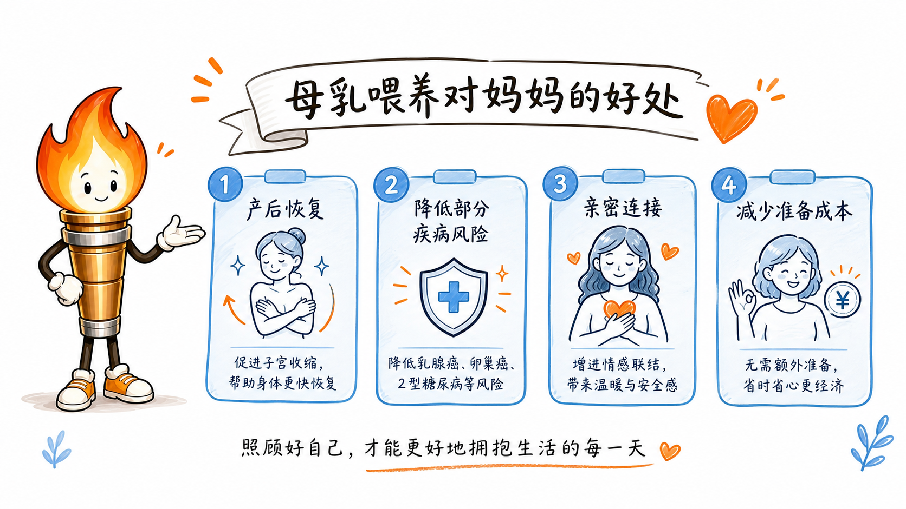

很多母亲的体验是：“喂奶好像全在为孩子付出。”但从医学证据看，母乳喂养对母亲并不是单向消耗，而更像是一种帮助身体完成产后恢复与长期代谢重置的生理过程。美国妇产科医师学会指出，哺乳触发催产素释放，能促进子宫收缩，并可能减少产后出血。

从中长期看，证据最扎实的是肿瘤保护作用。Lancet 2016 系列指出，每增加 12 个月累计母乳喂养时间，浸润性乳腺癌发生率约下降 4.3%；关于卵巢癌，更长时间母乳喂养与更低风险相关，整体荟萃分析约下降 30%。

另一组非常重要的收益，来自代谢和心血管健康。JAMA Network Open 的系统综述与荟萃分析显示，累计哺乳超过 12 个月与母亲糖尿病风险下降 30% 相关；高血压风险下降 13%。对许多父母来说，这意味着母乳喂养不仅关乎宝宝的前 6 个月，也与妈妈 10 年、20 年后的健康有关。

更广义的心血管结局也有类似趋势。2022 年的系统综述与荟萃分析涉及 100 多万经产妇，结果显示，与从未母乳喂养者相比，曾经母乳喂养的女性总体心血管疾病风险下降约 11%，冠心病下降 14%，卒中下降 12%，心血管死亡下降 17%。这类证据主要来自前瞻性观察研究，不能完全排除混杂，但方向相当一致。

关于产后月经恢复和生育间隔，证据同样明确。系统综述显示，尤其是纯母乳或以母乳为主的喂养方式，与更长的泌乳性闭经相关。

母亲们也常问：母乳喂养能不能帮助情绪恢复？这里需要讲得更谨慎。系统综述提示，较短的母乳喂养时长与更高的产后抑郁风险相关。

因此，对妈妈来说，把这段生理窗口变成对自己未来健康的投资。与此同时，如果出现明显疼痛、严重情绪问题、睡眠剥夺或喂养失败感，尽早求助和调整，同样是负责任的做法。

<a id="point-01-028"></a>
##### 母乳喂养对家庭的好处

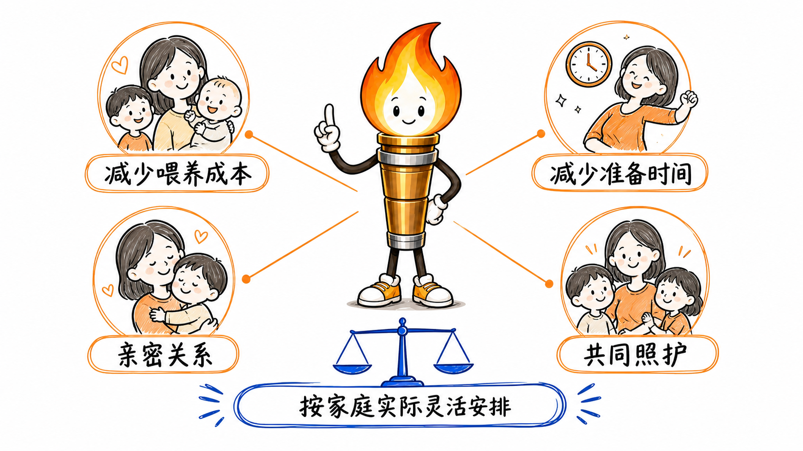

Alive & Thrive 发布的《中国不母乳喂养的代价》指出，中国家庭每年仅为“经济型商业配方奶”支付的直接支出就超过 71 亿美元。这还没有算上因感染、住院、误工、认知损失等带来的间接成本。对于普通家庭来说，母乳喂养并不意味着“零成本”，因为仍可能需要吸奶器、储奶袋、哺乳内衣、咨询服务和时间投入；但若只比较婴儿口粮和相关疾病支出，母乳喂养通常能明显降低现金压力。

第二笔账，是“孩子少生病，父母少请假”。美国农业部关于 WIC 的经济研究指出，提高母乳喂养率可以减少家庭医疗费用和父母因照顾患病婴儿而错过工作的损失。其逻辑并不复杂：如果母乳喂养能降低腹泻、呼吸道感染、中耳炎等常见病，那么家庭就会少一些夜间急诊、少一些药物和请假损失。

第三个家庭收益，是喂养韧性。WHO 和 UNICEF 都强调，母乳安全、清洁，不依赖额外水源和冲调条件；在灾害、停电、出行、物流波动或家庭临时混乱时，母乳喂养尤其重要。当无法母乳喂养时，配方奶当然是必要替代选择，但 UNICEF 同时强调，配方喂养在紧急状态下对供给、卫生和安全条件要求更高。

第四个现实好处，是家庭内部更容易形成一致的照护节律。这不是说母乳喂养一定比配方喂养“轻松”，而是说，一旦喂养建立起来，家庭通常能更清楚地围绕按需喂养、睡眠安排、返岗挤奶、出门储奶等问题形成分工。家庭成员要从营养、心理等多方面支持母亲实现母乳喂养；也就是说，母乳喂养从来都不是妈妈一个人的工作，而是家庭协作能力的一次现实考验。

坚持母乳喂养的收益，往往不是一天两天里感受到的“高大上健康优势”，而是日常生活里非常具体的少花钱、少跑医院、少打乱节奏、少在紧急情况下手忙脚乱。

<a id="point-01-029"></a>
##### 母乳喂养对社会的好处

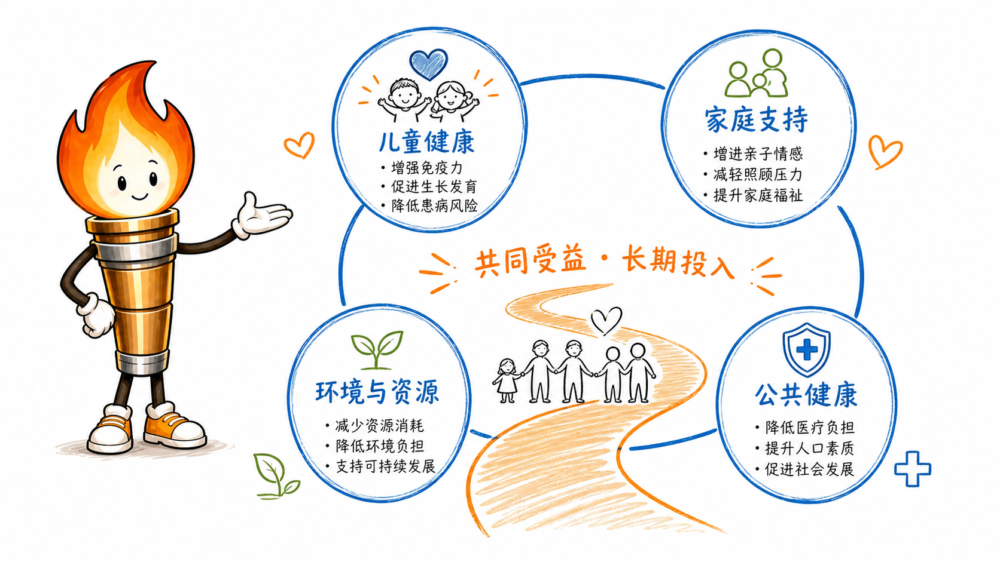

当母乳喂养率提高，受益的不只是某一个家庭，而是整个公共卫生系统。UNICEF 与 Lancet 系列估算，如果全球母乳喂养水平达到更优水平，每年可挽救超过 82 万名 5 岁以下儿童生命，其中大多数是 6 个月以下婴儿；同时还能减少大量与乳腺癌相关的女性死亡。

社会收益首先体现为公共卫生负担下降。更多母乳喂养意味着更少腹泻、肺炎、下呼吸道感染、中耳炎、坏死性小肠结肠炎等病例，也意味着更少门急诊、住院、抗菌药物使用和家庭照护负担。Lancet 系列强调，母乳喂养在低中收入国家对儿童死亡的保护作用尤其大，但在高收入国家，母乳喂养也能降低如坏死性小肠结肠炎和婴儿猝死等严重结局。

社会收益还体现在人力资本。母乳喂养与更高的平均认知测试成绩相关，PROBIT 和巴西 30 年出生队列都支持其对认知和教育成就的长期影响。Lancet 进一步指出，母乳喂养对收入的影响，很大一部分可由 IQ 的提升解释。换句话说，母乳喂养并不仅仅是“健康议题”，也是教育和经济发展议题。

经济学上，“不母乳喂养”的代价非常大。UNICEF 中国报告引用的全球估算显示，不足够的母乳喂养每年造成约 3020 亿美元经济损失；而在中国，相关模型估算“不母乳喂养”的总经济损失高达数百亿美元量级，约占国民总收入的相当比例。

环境层面，母乳喂养在减缓全球变暖、土地利用和富营养化等方面都表现优异。虽然这类研究的结果会受母亲饮食结构、但总体上母乳喂养的碳足迹更低。

最后，母乳喂养还是一个制度质量问题。WHO 的《母乳代用品国际销售守则》之所以存在，就是因为社会已经认识到：如果婴儿喂养决策被商业营销、弱支持和错误信息主导，那么真正被牺牲的，是妇女、儿童和家庭的健康权。母乳喂养本是最自然的喂养方式，但如今成为一项艰难的全球公共卫生政策。中国的奶粉市场规模一度接近3000亿，最疯狂时，美国市场上50%的奶粉都被我们代购走了。Lancet 2023 系列则进一步指出，商业配方奶行业不仅影响消费，还会影响政策、科学传播和公众对喂养“正常值”的理解。


<a id="point-01-030"></a>
#### 第三部分，成为母乳喂养的倡导者

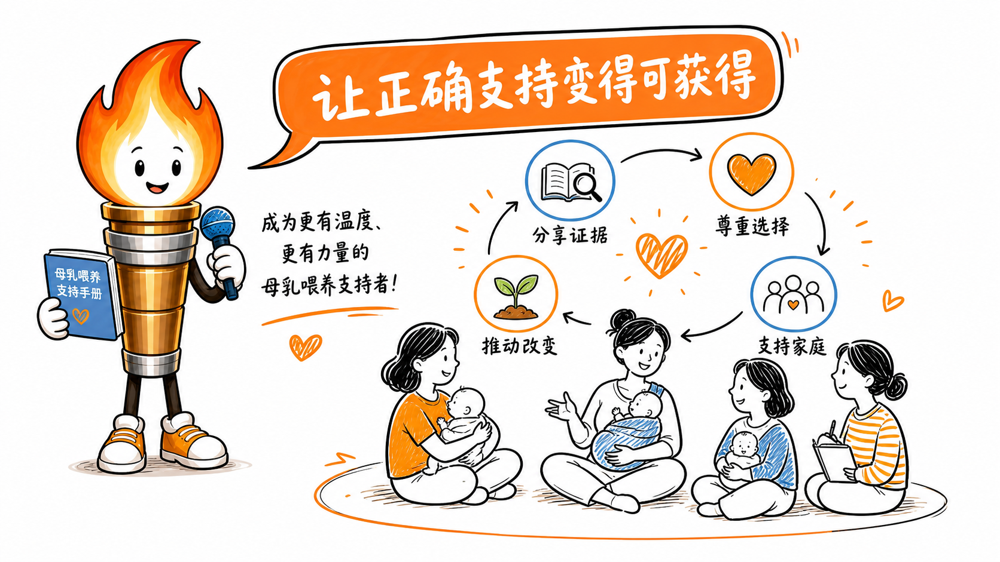

很多妈妈在刚开始母乳喂养时，都会经历一段非常孤独的时期。
孩子一哭，身边人就说：“是不是奶不够？”
孩子黄疸，别人说：“先停母乳吧。”
孩子晚上频繁醒，别人说：“奶粉更顶饿。”
妈妈乳头疼、堵奶、睡不好、情绪崩溃的时候，真正能理解的人并不多。
所以，母乳喂养从来不只是一个喂养方式的问题，它更像是一场认知、技术、家庭支持和社会环境的综合考验。

很多妈妈不是不想喂母乳，而是在最需要支持的时候，没有人真正帮她一把。
这也是为什么，我们希望育儿网校是一个母乳喂养支持系统。

我们希望每一个曾经受益的妈妈，将来都能成为另一个妈妈的支持者。
你今天学到的知识，明天可能会帮助一个正在崩溃的新手妈妈坚持下来。
你今天的一句鼓励，可能会让一个孩子多吃一天母乳。
而这一天，对孩子来说，可能就是免疫力、肠道菌群、亲密关系和生命早期安全感的一部分。

---
在中国，真正坚定支持母乳喂养的人，其实并不算多。
不是因为母乳不好，而是因为很多妈妈一旦转向奶粉喂养，就很难再公开强调母乳的价值。
因为她们会担心：
“我说母乳好，是不是就在否定自己？”
“我没有坚持下来，是不是说明我不是一个好妈妈？”
“我现在孩子吃奶粉，我还有资格支持母乳吗？”
所以，很多人选择沉默。
但我们必须说清楚：支持母乳，不等于批评没能母乳的妈妈。
一个妈妈最后选择了奶粉，背后可能有太多复杂原因：没有人指导、家人不支持、医生建议不清楚、产后太痛苦、工作环境不允许，甚至只是因为她在最困难的时候没有遇到正确的人。

真正应该被反思的，不是某一个妈妈的选择。
真正应该被改变的，是这个社会没有给妈妈足够好的支持。
所以，育儿网校要做的，不是制造妈妈之间的对立，而是让更多妈妈在一开始就少走弯路。
我们要让母乳喂养从“靠意志硬撑”，变成“有知识、有方法、有支持、有伙伴”的科学养育行动。
---

还有一件事，就是全职妈妈，是这个社会里最容易被收割的一群人。
保险、直销、微商、各种所谓副业项目，甚至一些杀猪盘诈骗，都特别喜欢盯上全职妈妈。
因为她们有时间焦虑，有收入焦虑，有价值感焦虑。
很多人告诉她们：
“宝妈在家也能轻松月入过万。”
“学个证书，时间自由，高薪就业。”
“做母婴行业，既能带娃又能赚钱。”
但现实往往是，宝妈们交了培训费、囤了货、消耗了信任，最后一无所获。
所谓零基础“高薪催乳师”，就是收割培训费，如果你在育儿网校帮助下成功母乳喂养，你就会知道“催乳师”是个多么扯淡的名字，按摩乳房更是造成乳腺炎的最简单方法。
育儿网校不希望全职妈妈继续在这些陷阱里被消耗。
我们希望做一件更踏实的事：让真正相信科学养育、真正推动母乳喂养、真正帮助其他妈妈的人，能够从这件正确的事情中获得尊重，也获得实际回报。

---
育儿网校是一个AI驱动的健康、养育平台，我们的使命是把纯母乳喂养率提升至80%，要达成这一目标，需要足够多的孕产妇掌握母乳喂养支持，自己成功之后，主动去推动更多人学习。为了实现这一目标，育儿网校将成为一个全用户持股平台，每推荐一位孕产妇加入平台，就会获得一股分红股。育儿网校会从营收中拿出一定比例的利润，按持股比例分给用户。这是一场健康和养育变革，您既是见证者，也是推动者，更是受益者。拥有高级勋章的用户，也会成为育儿网校的城市代言人，您如果从事和母婴相关的业务，会获得资源的倾斜。远离各种欺诈，从推动母乳喂养中受益。

---

<a id="chapter-02"></a>
## 02 初乳与开奶


<a id="point-02-001"></a>
### ☑️初乳 - 宝宝出生后第一堂生命课

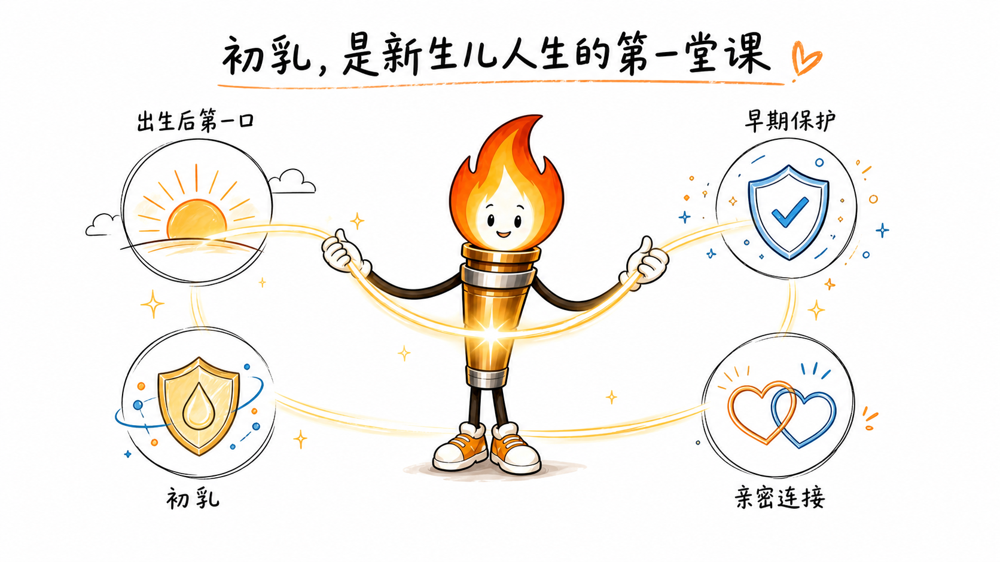

<a id="point-02-002"></a>
### 初乳始于无，关键在吮吸

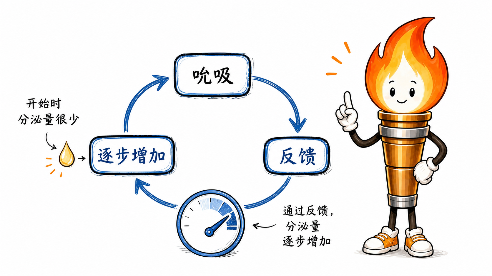

<a id="point-02-003"></a>
#### 开奶之前有个常被误解的空转期

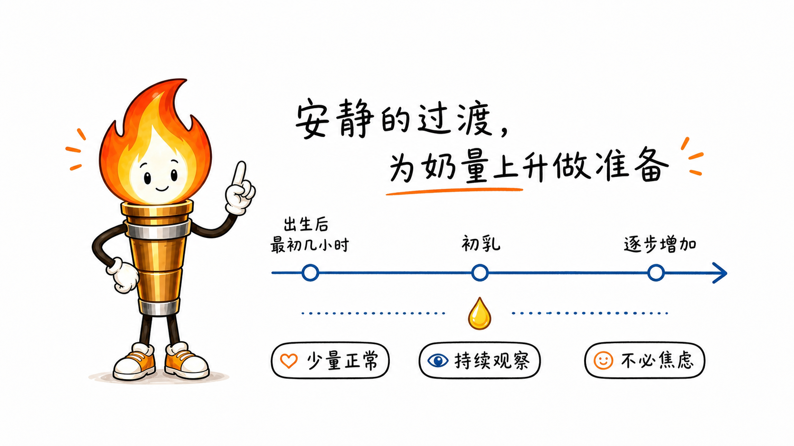

很多产妇及家人真正焦虑的时刻，不是在生产的时候，而是在孩子出生后的第一天。
宝宝趴在妈妈胸前，含着乳头，吧唧吧唧的吮吸着，过一会儿累到睡着了。宝宝睡着后，产妇或家人去挤乳头，如果产后几个小时依然没有奶水，一家人就开始焦虑了，宝宝会不会饿到，焦虑是会传染的，也可能被居心不良之人利用。

很多新手父母以为宝宝一出生，妈妈就应该有奶水，就像家里的水龙头，打开就应该源源不断的流出，如果没有奶水，是脾胃虚弱导致气血生化不足，从而出现乳汁清稀、量少甚至全无的情况。这种中医谣言广为传播，常常伴随孕晚期就已经开始泌乳，新生儿没有力气，宝爸帮忙开奶，这些滑天下之大稽的谣言，已经深入某些国人的骨髓。现实是包括人类在内的任何哺乳动物，都不存在没有奶水或奶水不足的情况。

有人不乐意了，因为她自己就遭遇没有奶水或奶水不足。
接下来我会把泌乳这件事掰开揉碎了讲清楚。如果你想中500万大奖，你得先买一张彩票，这叫因缘果报。泌乳是个过程，什么导致泌乳？刺激，什么样的刺激？宝宝的吮吸。宝宝的吮吸刺激泌乳，泌乳之后宝宝就吃到了奶水，这就是一个泌乳的因果循环。

从新生儿哇哇落地到“开奶”，短则数小时，长的有时需要2-3天，这个过程我们暂且称其为“空转期”。为什么开奶的时间会有如此大的差异?因为刺激泌乳的频率，如果你懂了，那么您的宝宝就可以在4-6个小时吃到初乳。

此时，有人可能会问，为什么会有一个空转期，为什么有些人孕晚期乳房就产奶了？
首先，人体就像一台精密的机器，怀孕期间，整个泌乳系统已经就绪，孕晚期会挤出奶水只是设备里的残留试验品。

空转期是一个自然演化的结果，就像蹬脚踏车有一个缓慢起步的过程。泌乳系统正式量产就如原料进产线，需要经过一道道工序，只有完成最后一道工序，才会从终端呈现一个完美的产品。因此，在空转平静的表面之下，母婴身体内部都在进行一场轰轰烈烈的运动。

在怀孕期间，催乳素升高并促进乳腺组织增殖，但高水平孕激素和雌激素会抑制乳汁分泌；胎盘娩出后，与宝宝的肌肤相亲和吮吸刺激，会给下丘脑传递宝宝已降生的信号，雌激素和孕激素水平迅速下降，解除对泌乳的抑制，负责乳汁生成的催乳素开始发挥作用，刺激乳腺腺泡细胞合成乳汁。

此时，乳汁是在乳房的深处，必须通过仅有头发丝三分之一粗细的乳腺导管输送至乳头，如果乳腺导管里面有空气，乳汁就输送不出来。因此，宝宝拼命的吮吸，把乳腺导管吸成了真空环境，乳汁顺着乳腺导管从乳腺的深处一点点汇入乳头。

胎儿期间，宝宝的全部养分来自与胎盘链接的脐带，因此，空转期宝宝的胃依然没有启用，宝宝的吮吸除了刺激泌乳和疏通乳腺导管，也在将妈妈产道、乳头和乳腺内的细菌吞入，这些细菌穿过还没有启用的胃，进入肠道构建自己最初的肠道菌群。

通过血液检测，可以判断宝宝的血缘关系。通过菌脉，可以判断宝宝和谁更亲近。妈妈身体所携带的细菌，有些是世世代代基因匹配的细菌，这种细菌被学术界称为大树细菌，就像雨林中的参天大树，如果它们定殖肠道成为宝宝肠道菌群的主力，就可以极大的抑制有害菌的入侵，守护宝宝的健康。

所以你看，空转期不论是产妇还是宝宝，身体都没有闲着，当我们了解了这一切，就不必焦虑，而是不要帮倒忙。

<a id="point-02-004"></a>
#### 我给几条建议：

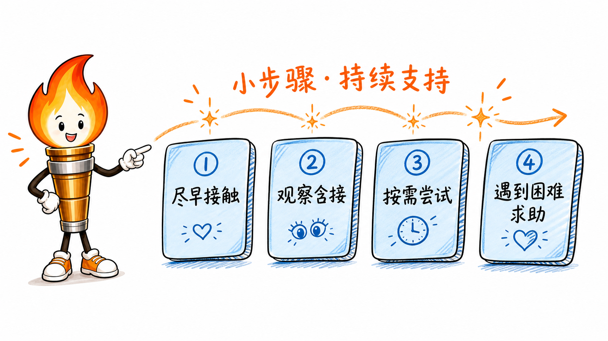
首次，如果有条件，尽量顺产。顺产的痛其实是源自恐惧，越早去医院候着就越紧张和恐惧。美国有一项研究，他们调查了2000个在出租车上分娩的案例，所有的分娩都很顺利，这甚至滋生了一批仅有助产士的分娩医院。当然，中国的现实是近80%的剖腹产率，这背后有一种畸形的文化作祟。顺产通常是创伤更小、恢复更快、更符合母婴早期适应过程的分娩方式。为了减少分娩那几分钟的恐惧，带来的结果是数日不能翻身、不能咳嗽、不能下地，甚至不能抱娃，否则伤口会痛。终身都有一道抹不去的疤，不能穿性感的衣服。因为大树菌抢先定殖在肠道，从而导致更少的过敏和哮喘发生率。
其次，首次哺乳前不需要清洗乳房，更不建议消毒。家政月嫂培训都包括乳头消毒的内容，月嫂是干扰母乳喂养的主要因素之一。记住一点，妈妈身上的细菌对新生儿是有益的。
最后，开奶时间的长短是由刺激的频率决定，而非妈妈的生理决定。越短的空转期代表您在宝宝出生后做的越正确。
---

<a id="point-02-005"></a>
### 开奶秘诀：早接触、早吸吮、勤吸吮

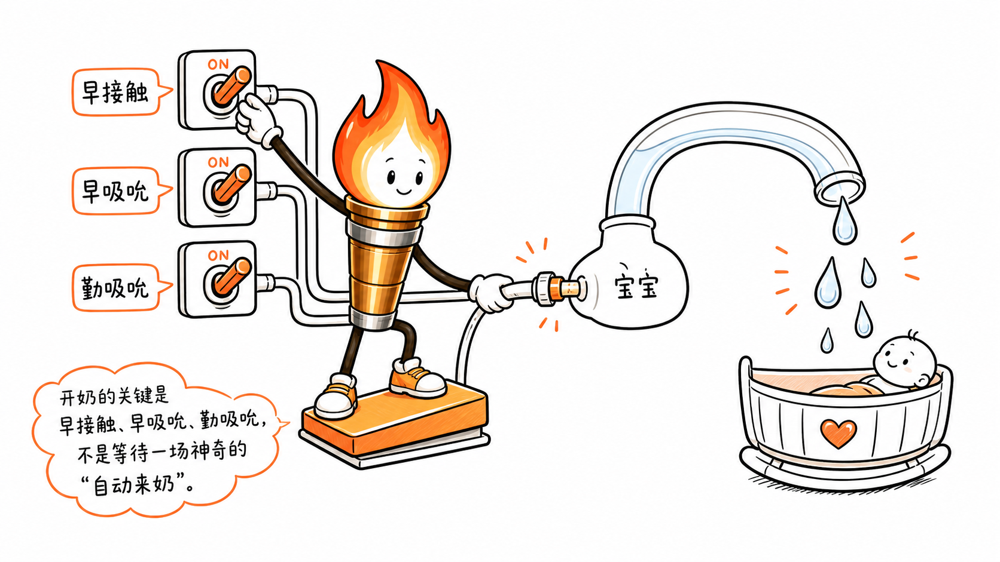

母乳喂养是自然赋予母婴的宝贵连接，也是宝宝健康成长的基石。然而，在现实中，许多妈妈在开启母乳喂养之路时，会遭遇各种“陷阱”和误区，尤其是在争取“第一口奶”的关键时期。要成功捍卫这珍贵的第一口奶，并为整个母乳喂养打下坚实基础，国际公认且行之有效的核心策略便是：早接触、早吸吮、勤吸吮。

<a id="point-02-006"></a>
#### 早接触（热车）

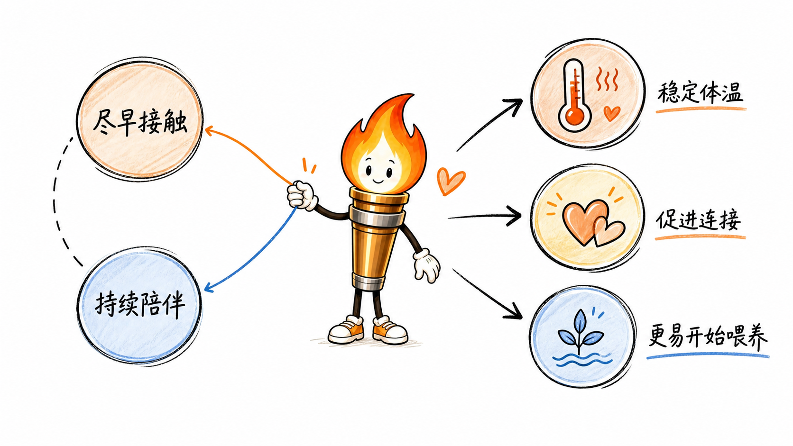

在宝宝出生后立即（理想情况是在剪断脐带前）将赤裸的宝宝直接放在妈妈的胸口，保持皮肤接触及母婴互动至少15分钟。妈妈可以牵着宝宝的小手，感受到宝宝的心跳和体温。肌肤相亲可以让妈妈的大脑接收到宝宝已经出生的信号，身体迅速启动泌乳程序。

肌肤相亲是母婴建立亲密连接、开启哺乳之旅的温暖而重要的第一步。即使是剖腹产妈妈，在麻醉后清醒、条件允许后也应尽早进行。若妈妈行动不便，家人应协助宝宝进行吮吸。

但有中国特色的产后流程是新生儿娩出后健康检查、佩戴标签、带走洗澡、接种疫苗、送到母婴室，妈妈留观2个小时后母子见面。这个标准流程本质是在人为制造一场干扰母乳喂养的母婴分离行为。宝宝出生后没有肌肤相亲，最快2个小时才能吮吸，这就导致了大量的产妇无法在第一时间开奶。有人会质疑，全世界不都是这样的吗？
不，这既不符合世界卫生组织的母乳喂养倡议，也不是国际上通行的标准。为了提升纯母乳喂养率，也为了新生儿的健康，父母们必须用行动改变这一切。

<a id="point-02-007"></a>
#### 早吸吮（点火）

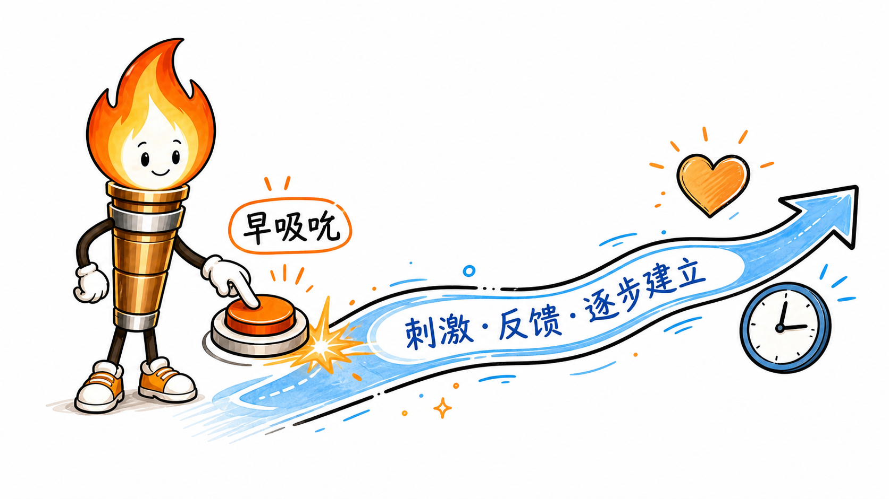

如果早接触是热车，那么早吸吮就是泌乳启动开关。在早接触的基础上，我们需尽快（理想状态是产后30分钟内）帮助宝宝尝试吸吮妈妈的乳头。这个时候，新生儿的吸吮反射最为强烈。值得注意的是，宝宝此时的吮吸并非真的为了吃到母乳，而是向妈妈大脑发送“宝宝出生了”的强烈信号，以此来刺激泌乳反射。

这种吸吮刺激会作用于乳头周围的机械感受器（我们常说的“乳窦”），信号一路上传至下丘脑，促进脑垂体后叶分泌催产素（它负责“喷乳反射”，也就是将乳汁排出），同时促进脑垂体前叶分泌催乳素（它负责乳汁的生成）。此外，宝宝的吸吮也有助于刺激妈妈体内催产素的分泌，这能促进子宫收缩，有效减少产后出血。

世界卫生组织已经明确指出，剖宫产所使用的麻醉药物并不影响哺乳。因此，请务必忽略那些“剖腹产麻药没过不能喂奶”等干扰母乳喂养的错误信息，一定要坚持让宝宝尽早吸吮。经验表明，如果能在产后1小时内开始吸吮，开奶时间通常在4-6小时。如果延迟至产后2个小时才开始吮吸，那么开奶时间则可能延长至产后12小时以上，这会极大的增加产妇的焦虑情绪，并极大增加了给宝宝喂糖水、奶粉的风险。

<a id="point-02-008"></a>
#### 勤吸吮（踩住油门）

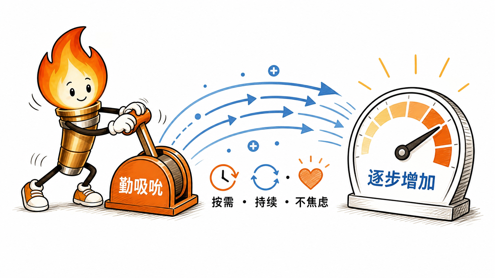

“点火”之后要送油，否则车子只会原地踏步。推动纯母乳喂养20年的经验，我发现很大一部分父母产后在坐等开奶。宝宝出生后，她们既没有给宝宝肌肤相亲，也没有给宝宝吮吸，更没有在宝宝清醒的每一分钟给宝宝勤吮吸，而是一直在等产妇开奶，最终的结论是产妇没奶。

为什么有的产妇没奶，因为没有热车、点火并踩住油门。为什么有的产妇奶水不足，因为没有踩住油门，你不送油车子是不会前进的，道理就是这么简单，奶水多少是宝宝决定的，他勤吸吮，奶水就多，他少吸吮奶水就少，他不吸吮，奶水就没有了。

<a id="point-02-009"></a>
#### 无营养吮吸

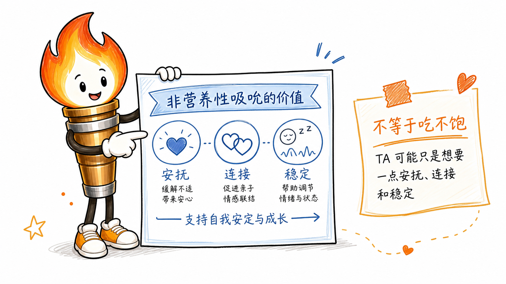

有父母开始辩解，因为产妇迟迟未开奶，宝宝一直哭，才给添加的糖水或奶粉，自己也是没有办法，总不能让宝宝一直哭。

如果父母听过安抚奶嘴儿，就应该明白，宝宝哭不一定是饿了，也可能是“精神需要”。在养育层面，宝宝需要“无营养吮吸”，虽然没有奶水，但宝宝通过吮吸的动作确信妈妈再自己的身边，从而获得安全感。因此，吮吸这个动作本身是宝宝必不可少的生理需要。父母焦虑的背后，隐藏着资本长期洗脑营销的结果，无数的女性轻信了有人会没有奶水的谣言。

<a id="point-02-010"></a>
#### 给父母们的行动建议

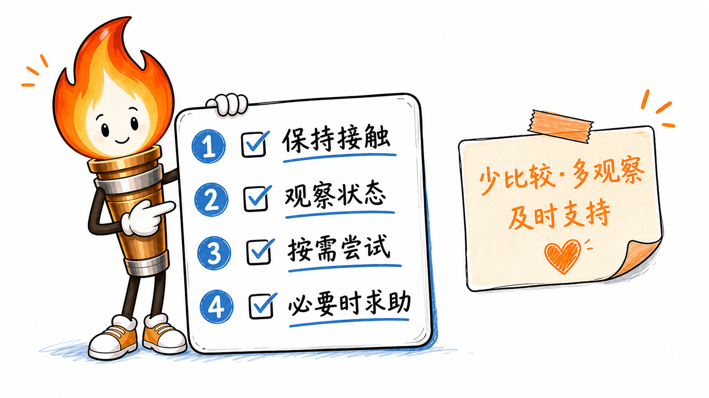
1、随着生育率的下降，用选择权和医院争取宝宝产后肌肤相亲的权益；
2、纯母乳喂养离不开家庭成员的共同努力。我有一个案例是丈夫和同事喝酒，公公陪产，产后宝宝没有抱给产妇吮吸，而是公公直接给宝宝喂奶粉，后来我每次询问宝宝的状况，结论不是在医院就是在来去医院的路上，宝宝长期腹泻，骨瘦如柴，护士还给爷爷推荐奶粉伴侣，我一看配料表，居然是练乳之类的甜食。
3、每24小时内吃奶8–12次、能看到或听到吞咽、吃奶后满足感。
---

<a id="point-02-011"></a>
### 初乳很少，一勺就饱：奶少，胃也小

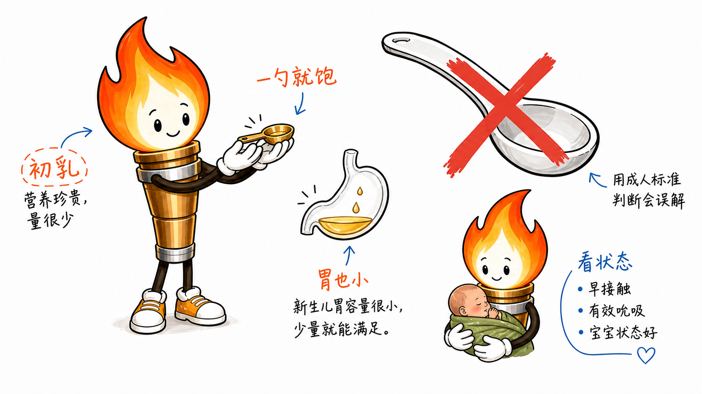

<a id="point-02-012"></a>
#### 初乳，是宝宝出生后最早吃到的母乳，是宝宝的第一剂疫苗。

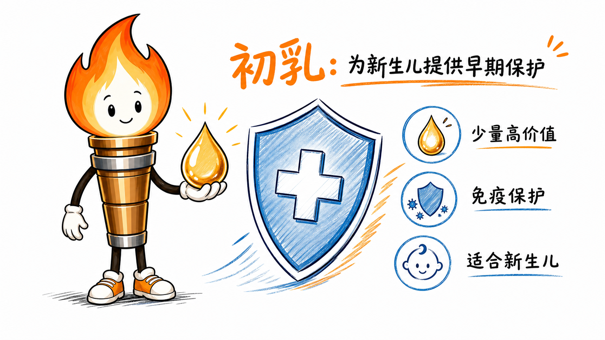
它量少、浓稠、颜色偏黄，看起来不像一瓶奶，更像几滴金黄色的精华。
初乳里的蛋白质、脂肪、乳糖、维生素和矿物质，给宝宝提供最早的营养；初乳里富含分泌型IgA、乳铁蛋白、白细胞、溶菌酶，帮助宝宝抵御外界病原体；初乳里的生长因子和人乳低聚糖，则帮助宝宝的肠道开始成熟，帮助早期菌群建立。初乳的成分决定了它的使命：不是单纯喂饱，而是启动营养、免疫和肠道发育。

<a id="point-02-013"></a>
#### 初乳听上去很棒，可是半天挤不出一茶匙，父母担心宝宝吃不饱。

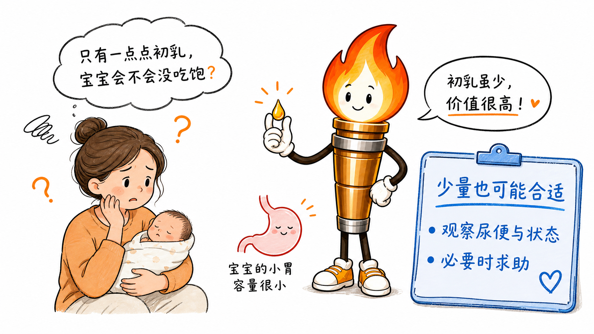
担心宝宝吃不饱是多虑了。新生儿第一天的胃仅有一颗玻璃弹珠大小，出生第三天也仅有一颗乒乓球大小，前3天的总初乳需求也仅有50毫升左右。足月健康新生儿即使 2-3天不吃不喝也不会危及健康。通常在出生4天前后，比出生体重下降7%后，体重才开始反弹，到满月时，宝宝的胃已经有一枚鸡蛋大小，仅依靠母乳就让体重增加了3-5斤。
---

<a id="point-02-014"></a>
### 干扰初乳的手段：母婴分离；让母婴多休息；怕娃渴饿、脱水、低血糖

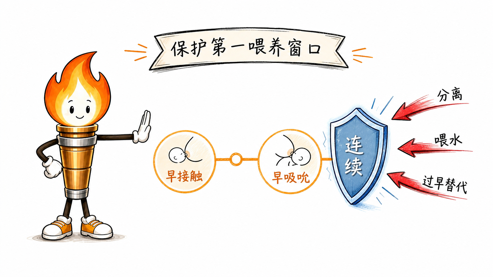

<a id="point-02-015"></a>
#### 母婴分离 - 新生儿是否需要立即洗澡？

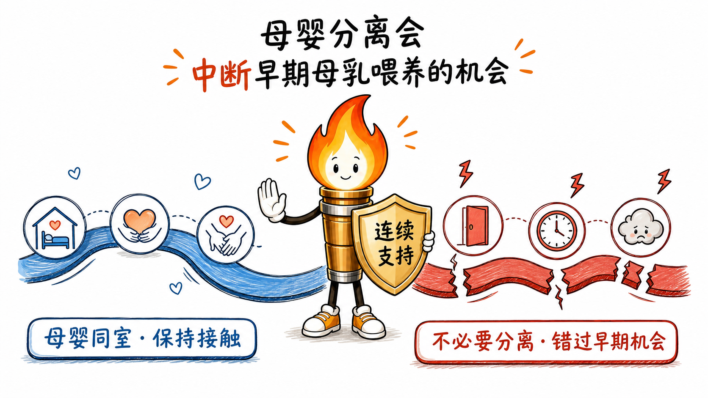

在中国，产后宝宝不会有妈妈肌肤相亲，护士会在让产妇确认是不是带把（是不是男孩）后，马上带去洗澡和注射第一剂乙肝疫苗。而产后不马上洗澡、保留胎脂并非迷信，而是有充分科学依据的国际推荐做法。

什么是胎脂？胎脂是一种由皮脂腺分泌物、胎儿脱落的角化上皮细胞、水分和蛋白质混合而成的白色乳膏状物质，覆盖在新生儿皮肤表面。
胎脂的主要成分：约80%是水分；10%脂类（油脂、胆固醇）；10%蛋白质（包括抗菌肽、角蛋白、乳铁蛋白等）。它不是“脏东西”，而是宝宝的天然生物保护膜。

胎脂的功能：
皮肤屏障：保护尚未成熟的新生儿皮肤免受外界细菌、干燥、摩擦损伤。
防止水分流失：胎脂中的脂质能减少经皮水分蒸发，防止皮肤干裂。
抗菌保护：含有抗菌肽（如lysozyme、lactoferrin、defensin），可抑制金黄色葡萄球菌、大肠杆菌等。
保温作用：胎脂可减少热量散失，帮助维持体温稳定。
免疫调节：胎脂中含有免疫因子，帮助皮肤免疫系统成熟。
促进母婴接触：胎脂气味与羊水相似，有助于新生儿识别母体气味、建立依恋。

<a id="point-02-016"></a>
##### 国际医学指南的明确推荐

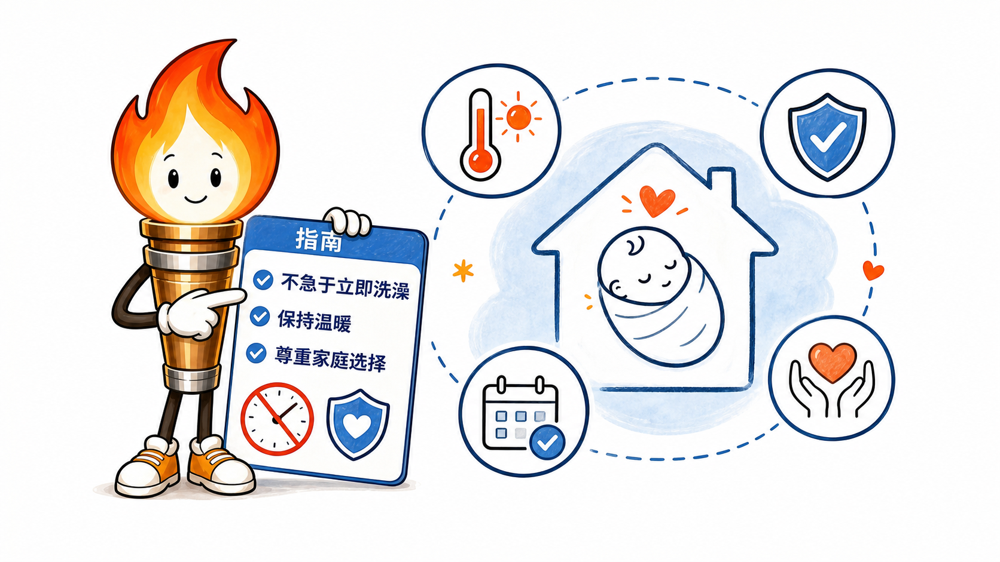
世界卫生组织（WHO, 2017）：建议出生后 24小时内不要洗澡，至少延迟到6小时以上。保护胎脂、稳定体温、促进母乳喂养。
联合国儿童基金会（UNICEF）：建议在婴儿体温稳定后（通常24小时后）再洗澡。	防止体温过低和感染。
美国儿科学会（AAP）：推荐推迟首次洗澡至出生后 至少12–24小时。鼓励皮肤接触，减少低体温和血糖波动。
英国NHS国家卫生体系：“Don’t rush the first bath.” 建议保留胎脂直至自然吸收。	强调胎脂的生理价值。
我们是个人治社会，医生向来以自我为中心。过去，新生儿吃什么奶粉取决于被分配到哪一层母婴室，如今生育率下降，我相信已经有商量的余地。父母们可以争取并且选择母乳友好型的医院预约分娩。

<a id="point-02-017"></a>
##### 为什么“国内医院一出生就洗澡”？

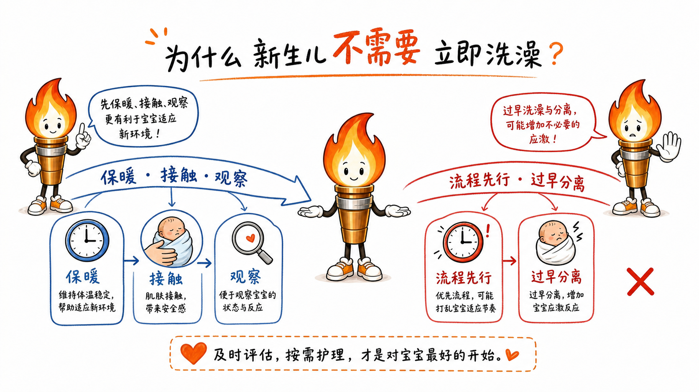
这是一个典型的“制度惯性 + 观念误区”。
1️⃣ 卫生观念的偏差：过去几十年，医院认为胎脂“脏”、“不卫生”、“要清理干净才能抱回母亲身边”。实际上这种“洁癖式护理”是从成人清洁逻辑出发的，而非基于新生儿生理。
2️⃣ 操作标准化：为提高接生效率、转入新生儿病房方便，医院流程常设定“出生即清洗、称重、包裹”。但这往往剥夺了新生儿与母亲的黄金1小时肌肤接触，干扰了纯母乳喂养；破坏了胎脂保护皮肤的自然过程。
3️⃣ 母婴分离的传统模式：国内许多医院至今仍执行“母婴分区”，因此护士会先洗净、包好、登记再送回母亲怀中。这其实违背了WHO倡导的“母婴同室、即时皮肤接触”原则。

胎脂一般在出生后2–3天内会自然被吸收，皮肤变得细嫩光滑，不需要刻意清除。
早期洗澡的风险
❄️ 体温下降：新生儿体表面积极大，洗澡易失温，诱发低体温。
💧 皮肤干裂：失去胎脂保护，皮肤屏障功能未建立。
🦠 感染风险上升：清洗破坏天然抗菌层。
🍼 哺乳延迟：母婴分离，错过初乳吸吮的黄金时机。
💔 依恋建立受阻：早期分离削弱母婴情感连接。
洗澡是收费服务，所以新生儿会洗澡，这甚至导致很多父母认为宝宝就应该天天洗澡，离开医院后还办理了洗澡套餐，天天推着宝宝去付费洗澡。绝大部分国人是在威权环境中成长，奴性也决定她们不敢对权威说不。如果您是一位内心强大的人，勇敢捍卫宝宝出生不马上洗澡的权力吧，为了孩子的权益，做孩子的榜样。

<a id="point-02-018"></a>
#### 怕娃渴饿、低血糖、脱水

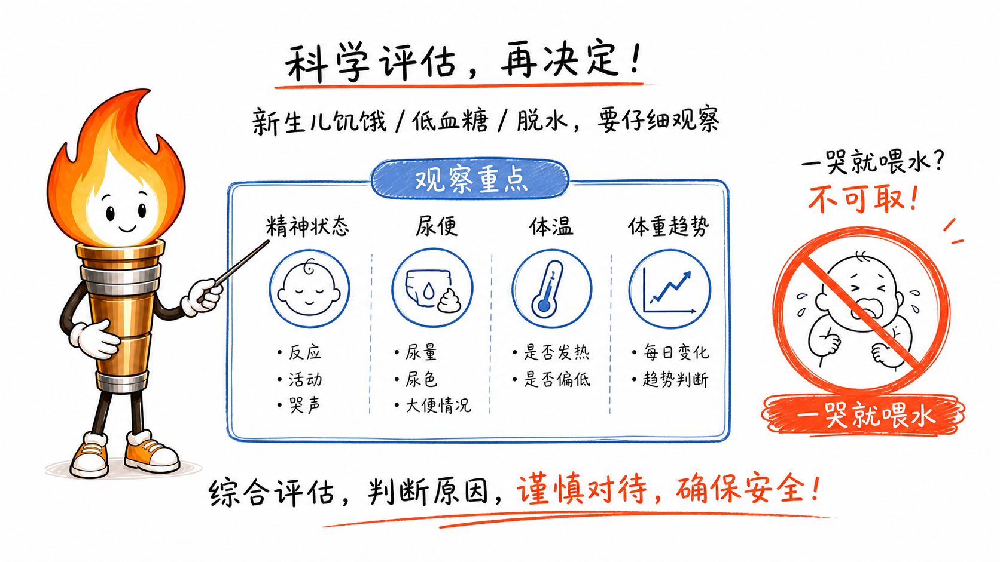

在现实中，诱导父母给新生儿喂水、喂葡萄糖水或配方奶粉的情况屡见不鲜，在医护“反复建议”或“严肃命令”之下，很多父母误以为那是“医疗规范”。看似“好心”或“规范”的操作，实则是压垮母乳喂养的第一根稻草，是资本抢夺宝宝第一口奶的、毫无底线的卑劣手段。

足月健康新生儿带着干粮出生的，加之嗜睡的本性，如果不能抓住已分钟计算的清醒时间多吮吸，开奶的时间就会一再推迟，一旦开奶的时间超过产妇家属的焦虑值，喂奶粉就在所难免。

资本为了抢夺宝宝的第一口奶，就联合医务人员针对不同的产后情景设计干扰的手段，对于足月健康的新生儿，就以担心宝宝脱水诱导父母给宝宝喂水。对于剖宫产的宝宝，就以担心宝宝低血糖诱导父母给宝宝喂葡萄糖水。对于看上去就没有什么主见的焦虑父母，就直接或由护工间接引导去指定地点领取免费的奶粉，任何一种手段达成，都会导致纯母乳喂养失败，甚至直接变成人工喂养宝宝。

<a id="point-02-019"></a>
##### 有父母会好奇，水又没有营养，喂水如何干扰母乳喂养？

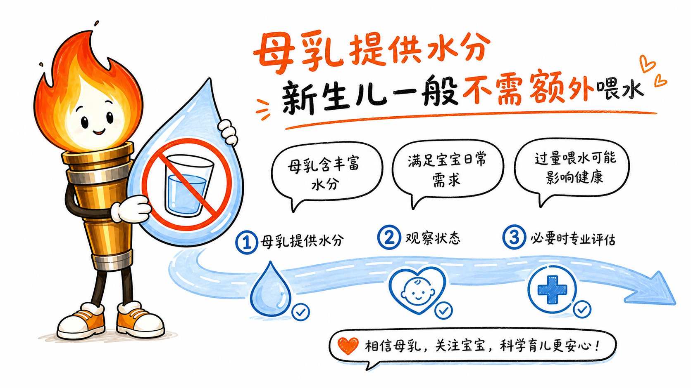

首先，胎儿一直泡在羊水中，才出生几个小时就脱水，这显然不科学。如果父母们理解啥是脱水，就不会被欺骗了。医学上**脱水**指的是体内水分和电解质（尤其是钠）丢失过多，体液平衡失调，而非口渴。通常只有发生严重腹泻时才会导致脱水，人出现脱水迹象时，喂水是没有用的，喂水是解决口渴问题，脱水时需要及时补充口服补液盐。

既然喂水是为了干扰母乳喂养，其原理又是什么呢？
前面讲了新生儿的胃容量很小，仅有一颗弹珠大小。医护拿给父母30毫升水，这大概是宝宝胃容量的 6倍。有过减肥经验的人都知道，饿了要喝水顶一下。我们的胃上面有一些感知细胞，当胃容物达到一定比例时，大脑就会接收到已吃饱的信号。对于本就不饿的新生儿，自然就可以放心大胆的一直睡觉。开奶泌乳是由宝宝的吮吸频率决定的，嗜睡又缺少吮吸的结果就是开奶时间被一再推迟，对于绝大部分缺乏母乳喂养常识的新手父母，她们误以为自己**没有奶水**而只能被迫选择给宝宝添加奶粉。

<a id="point-02-020"></a>
##### 诱导喂糖水为使宝宝没有吮吸的需求。

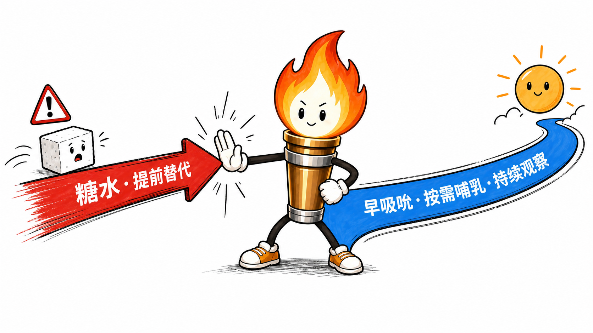

世界卫生组织也一再提醒，喂糖水预防低血糖是干扰母乳喂养的手段。
喂糖水主要针对剖宫产的宝宝，是因为剖宫产造成的母婴分离时间更长，产妇开奶所需的时间也更长，为什么不直接推荐喂奶粉？因为推荐喂奶粉一旦被举报，可能所受处罚会大于收益，诱导喂糖水即使被举报，也可以赖皮，往往死无对证。
有些父母听到低血糖，也真的害怕，要如何判断孩子是不是低血糖呢？首先，孩子如果不适会一直哭闹，透过观察可以发现宝宝会有抖动、发绀、抽搐、呼吸暂停、呼吸急促、哭声弱或尖、肌张力低、嗜睡、喂养差、眼球异常转动等情况，并且需要排查其他疾病。我们知道遇到低血糖的情况，喂一点糖水马上就会缓解，问题是医务人员诱导喂糖水并非因为宝宝有可观察的低血糖症状，而是以预防低血糖的理由违背世界卫生组织纯母乳喂养的倡议，这就很可恶了。如果真的要预防低血糖，应该在宝宝出生时先进行肌肤相亲，然后辅导宝宝早吸吮，早开奶就不会有任何低血糖的风险。但是喂了糖水，宝宝就完全没有吮吸的需求，只顾着睡觉，结果就是开奶被推迟到产后的第2、3天，对于早产低体重儿（肝糖原储备少）、巨大儿（通常是母亲在怀孕期间患有糖尿病，胎盘能让葡萄糖自由通过，但胰岛素不能通过），就真的存在低血糖的风险！由此可见，父母千万不要给干扰母乳喂养的医务人员留情面，因为她们为了一点私利，真的是不顾新生儿的生命安危。

<a id="point-02-021"></a>
##### 配方奶粉只是一种富含食品添加剂的加工食品而已

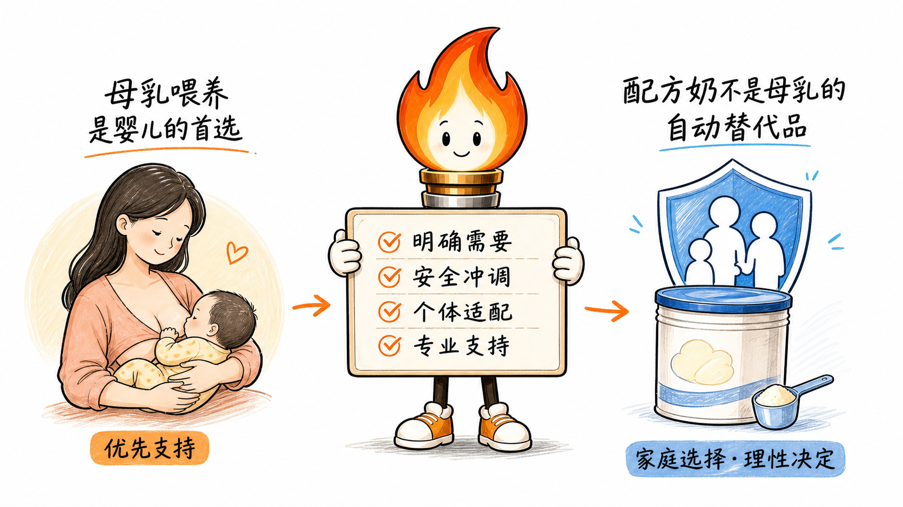

既然世界卫生组织强调没有母乳必须要喂奶粉，而非自制婴儿食物，为什么又如此捍卫母乳？搞得好像奶粉对婴幼儿不好一样。
事实的确如此。世界卫生组织也一再警告：配方粉使儿童易患感染病、哮喘、脑膜炎、肥胖和糖尿病。配方奶粉只是一种婴童的基础食物，其性质和动物饲料类似，可以让宝宝快速长大，但并不是最适合宝宝生长的食物。
配方奶粉罐上的配料表已经揭示，配方粉不超过40种成分中，主要是食品添加剂（营养素），而是营养。公众常把营养和营养素混为一谈，实际两者之间是有区别的。
康奈尔大学Rui Hai Liu（刘瑞海）教授团队对苹果抗氧化活性的研究：一颗中等大小苹果的一半测得的维生素C成分约5.7–5.8毫克，但可以呈现相当于1500毫克的纯维生素C补充剂的抗氧化效果。苹果中维生素C本身的贡献很小（不到1%），其余99%以上的抗氧化/抗癌潜力来自其他植物化学物质（phytochemicals），如槲皮素（quercetin）、儿茶素（catechin）、根皮苷（phlorizin）、绿原酸等化合物协同作用，效果远超孤立的维生素C。有句俗语，每天一个苹果，医生远离我，这句话是有参考价值的。但如果用每天50毫克VC，医生远离我就有点扯了。
有研究显示，从食物中获取的脂溶性维生素E（坚果、种子、绿叶菜、植物油等）通常显示中性或对吸烟者有保护作用。但芬兰一项大型随机对照试验，涉及近3万名男性吸烟者（50-69岁），每天补充50mg维生素E（α-生育酚）或β-胡萝卜素，或两者结合，或安慰剂，持续5-8年。结果证明服用维生素E补充剂对吸烟者是有害的。

**味蕾是宝宝最早发育成熟的器官之一**
早期为抢夺新生儿的第一口奶，诱导父母给新生儿喂奶粉，便利用新生儿的生理特性使其拒绝母乳。成人的味蕾不敏感，我们很难想象新生儿味蕾之强大。在自然演化过程中，新生儿如果离开妈妈，通常意味着死亡。于是，在新生儿基因中刻着一条铁律，为了不被从妈妈身边带走，只接受妈妈的乳汁。可是，卑劣的资本不顾及妈妈怀胎10个月的辛苦，不顾及新生儿生命的脆弱，非要用各种卑劣的手段，抢在产妇开奶之前，抢夺新生儿的第一口奶，以此把脆弱的小生命变成自家的提款机。同时，这可能导致孩子终身的过敏体质，可能导致孩子更易婴幼儿杀手的感肺炎腹泻，成年后更易感各种慢性疾病。

**一瓶配方奶足以永久改变婴儿的肠道微生物组**
国际认证的执业母乳喂养顾问(IBCLC)、注册护士玛莎·沃克(Marsha Walker)的文章《只需一瓶》指出，即使只是一瓶配方奶，也足以干扰成功建立母乳喂养，降低母乳喂养的专一性和持续时间，并永久改变婴儿的肠道微生物组。
生命的第一周每天给予一瓶配方奶就足以使肠道微生物组向促炎症菌群转变，这种情况下，肠道炎症成为急性和慢性疾病和病症的前兆，如自身免疫疾病和肥胖症。第一口吃到妈妈初乳的幸福宝宝，肠道菌群以双歧杆菌为主，占比高达90%，这种独特的婴儿肠道菌群被所有的研究证明有利于宝宝的健康，便便以蛋花等非成形便便为主，不易撕裂肠道。而过早摄入婴儿配方奶粉，会让「机会致病菌」抢先定殖，影响宝宝长期免疫健康，如果是早产儿，最典型的是会罹患“坏死性小肠结肠炎”，那是宝宝人生最痛苦的经历，因为医生会不断地手术切断肠道，因为再不切会导致更多肠道坏死。健康的宝宝可能会成长为终身过敏体质，无数痛苦又无助的父母抱着满脸浑身结痂的过敏宝宝，最悲催的莫过于因为肠道过敏导致不可逆转的认知和发育迟缓。每一位父母请一定谨记，捍卫初乳、捍卫纯母乳喂养不止是省下奶粉钱，而是捍卫宝宝一生的健康。

<a id="point-02-022"></a>
#### 让母婴多休息

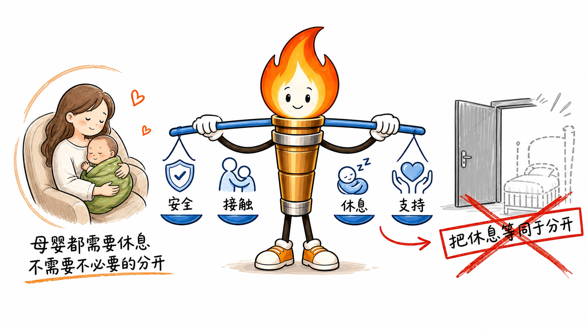

母乳喂养还有一种隐秘的敌人，她们支持母乳喂养，但她们用好心做了坏事。
她们是真的关心母婴，希望产妇多休息，希望让宝宝多睡一会儿，她们忙前忙后一刻不停，只是不知道自己的辛苦，其实是在干扰母乳喂养。
产妇当然应该多休息，宝宝也应该多睡一会儿，但开奶这事越早越好。减少了宝宝吸吮，推迟一次喂奶，开奶的时间就是数小时的延迟，全家人的焦虑就是指数级的增长。正确的做法是产后的妈妈可以多睡一会儿，但要有人守在旁边，协助宝宝多吮吸，不要停止刺激泌乳的动作。

记住，母乳不是等出来的，母乳喂养的启动，需要宝宝参与。有太多的失败案例，是因为新生儿没有勤吸吮造成的，宝宝睡超过3个小时就必须唤醒吃奶，没有开奶就无营养吮吸刺激泌乳。

月子中心太希望让产妇多休息，但母乳失败的代价也是产妇需要承受的。例如肠绞痛大都发生在出了月子之后，人工喂养的宝宝通常更加严重，有甚者大半个晚上宝宝都在哭闹，妈妈也根本没有办法睡觉。

养育是一个辛苦之后才有收获的过程，母乳喂养的家庭，出个远门只需要一条亲密育儿背巾，人工喂养的家庭需要打包一个巨大的行李箱。母乳喂养的家庭，半夜宝宝饿了，只需要妈妈伸手把宝宝揽入怀着，他自己闭着眼睛就能找到乳头吃奶。人工喂养的家庭总的有一个人起来，一边哄着宝宝，一边冲奶、试温、喂奶、拍嗝，尤其是睡的迷迷糊糊必须要爬起来那种痛苦，根本没有后悔药。
---

<a id="point-02-023"></a>
#### 7. 常见情况：胎便污染羊水

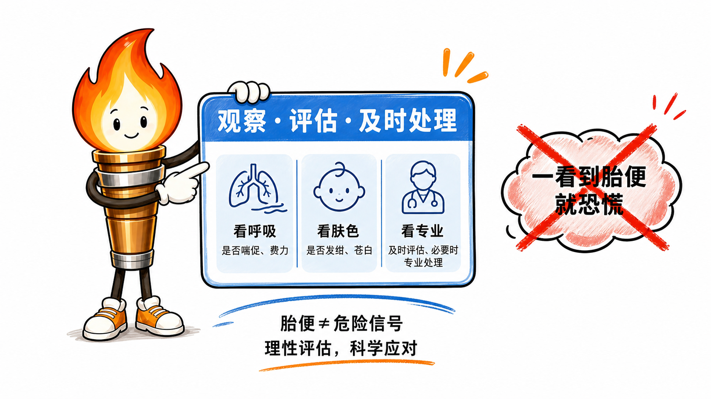

医务人员常以胎便污染羊水，要求母婴分离，家属往往马上进入恐慌：孩子是不是很危险？这类情况要先交给新生儿科或产科判断，因为重点是宝宝出生后的呼吸、活力和是否需要医学处理。遇到这种情况，父母也不要做甩手掌柜，容易变成长期母婴分离。

宝宝在顺产过程中如果**在子宫里（羊水中）排出胎便**，医学上叫**“胎粪污染羊水”**，是一种比较常见但需要密切观察的情况。
为什么会出现这种情况？宝宝在出生前排便，多见于：胎龄偏大（\>40周），越接近或超过预产期，发生率越高。分娩过程中受到刺激或短暂缺氧，比如宫缩强烈、脐带受压。有时没有明显异常，仅仅是宝宝自己肠道成熟后排出。

可能带来的风险是胎粪吸入综合征（MAS），例如呼吸急促、呼吸困难、肺部炎症，严重时需要进NICU观察，但大多数胎粪污染羊水的宝宝是健康的。
根据国际上的权威指南：如果宝宝出生后哭声响亮、肌张力好，不需要常规吸痰。
如果呼吸不好，会进行气道管理和观察，和以前“必须立即吸干净”的做法不同，现在更强调循证医学。

如果新生儿没有严重缺氧，没有发生严重胎粪吸入综合征，出生评分正常的前提下，父母大可不必担心，去努力实现纯母乳喂养。
---

<a id="point-02-024"></a>
#### 早产儿和坏死性小肠结肠炎

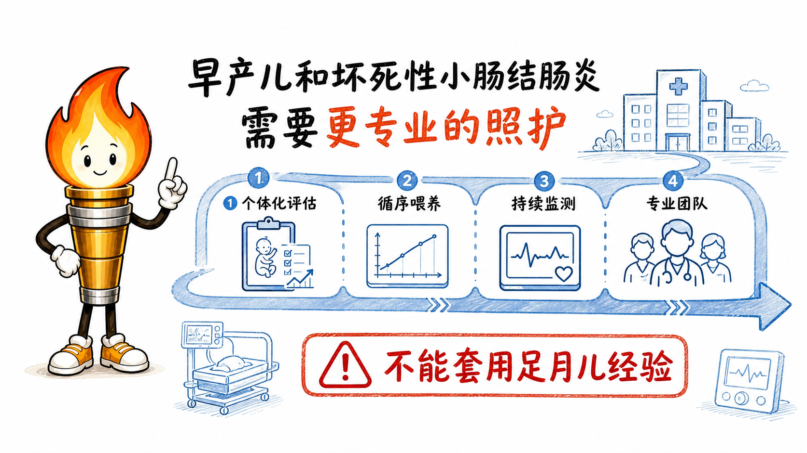

随着围产医学与新生儿重症监护（NICU）技术的飞速发展，早产儿的存活率显著提升。然而，早产儿群体因其各器官系统发育极度不成熟，尤其是胃肠道屏障功能的先天性缺陷，面临着极高的短期发病率与长期神经发育障碍风险。在诸多早产儿并发症中，坏死性小肠结肠炎（Necrotizing Enterocolitis, NEC）作为一种灾难性的胃肠道急症，一直是导致NICU早产儿死亡和严重远期后遗症（如短肠综合征、神经发育迟缓）的核心因素。全球范围探索降低NEC发病率的临床路径中，多项权威循证医学研究及欧洲儿科胃肠肝病营养学会（ESPGHAN）、美国儿科学会（AAP）的临床指南均明确指出：早期、规范且优化的肠内营养管理，特别是推动纯母乳喂养，是迄今为止预防NEC、促进早产儿肠道成熟及改善远期预后的最有效干预手段。

母乳喂养保护肠道的分子生物学与免疫机制  

对于早产儿而言，亲生母亲的母乳不仅是食物，更是包含复杂免疫调节因子、干细胞及微生物群落的“活性靶向生物制剂”。在亲生母亲的母乳不可得或不足时，巴氏杀菌的捐赠母乳被强烈推荐作为次优选择，直至婴儿发生NEC的风险降至最低（通常为校正胎龄34至36周）。基础医学研究表明，母乳能显著延缓NEC的疾病进展。此外，母乳外泌体还能直接保护肠道上皮的紧密连接蛋白免受促炎因子的破坏，从而逆转早产儿肠道的“渗漏”状态。初乳中更含有独特的母乳干细胞，尽管其在早产儿体内的确切归宿与分化机制仍在研究中，但其在参与胃肠道组织再生与受损上皮细胞修复方面的潜力已被广泛认可。

微生态调节与特定抗菌多肽的作用

母乳初乳及过渡乳中的母乳低聚糖（HMOs）作为一种高度复杂的益生元基质，不能被婴儿自身的消化酶分解，却能特异性地被肠道内的双歧杆菌代谢利用。这一过程选择性地促进了有益菌群的绝对优势定植，并产生大量短链脂肪酸（SCFA，特别是丁酸盐）。丁酸盐为肠上皮细胞提供了直接的能量来源，同时维持了肠粘膜屏障的免疫耐受状态。
此外，母乳中高浓度的乳铁蛋白和分泌型IgA发挥了强大的协同防御作用。乳铁蛋白在早产儿胃部酸性环境中经历蛋白水解，生成更具生物活性的乳铁蛋白肽。该肽具有强效的中和内毒素能力，能够阻止单核细胞激活，进而切断白细胞介素（IL）-1β、IL-6、肿瘤坏死因子（TNF）-α和IL-8等核心炎症因子的分泌链条，显著降低了迟发型败血症及NEC的发生率。母乳中的溶菌酶则在早产儿潘氏细胞数量不足的情况下，承担了分解病原菌细胞壁的关键抗菌任务。

临床泌乳支持

要实现早产儿纯母乳喂养，产妇要在分娩后1小时内尽早启动手动挤奶，并建立每3小时一次（包括夜间至少一次）的高频吸乳常规。美国儿科学会（AAP）与美国疾病控制与预防中心（CDC）对挤出的母乳的储存提出了严格的指导原则，为确保NICU早产儿的用乳安全，临床常推荐采用“4法则”结合环境特异性标准：
室温25°C最长 4 小时（健康足月儿是6-8小时）；冷藏室 (4°C)	最长 4 天 ；适用于母乳运输的保温冰袋最长 24 小时；独立冷冻室 (-18°C)最佳 6 个月。
解冻后的母乳冰箱中 24 小时，绝对禁止使用微波炉解冻或加热，且严禁再次冷冻。
喂养后剩余的母乳最长 2 小时，剩余奶液必须丢弃。
针对部分解冻母乳出现的“肥皂味”，这是由于母乳中的脂肪酶在低温下持续分解甘油三酯形成游离脂肪酸（FFA）所致。这并不影响营养价值，亦不会引起胃肠道不适；若婴儿拒绝对此味道的母乳，可在冷冻前对新鲜母乳进行瞬间巴氏加热以灭活脂肪酶，从而避免因口感问题导致的母乳废弃。

初乳口腔免疫疗法的实施与获益

在早产儿出生后的最初几天，由于临床状态不稳定（如极度低血压或需要高频振荡通气），常规的胃肠道管饲喂养往往被迫延迟。这种延迟导致早产儿错失了早期接触母乳生物活性因子的关键窗口期，缺乏了类似宫内吞咽羊水所带来的生长因子刺激。为弥补这一缺陷，临床广泛引入了初乳口腔免疫疗法。该疗法的标准操作协议为：在早产儿出生后尽早（通常在数小时内），将0.2 ml（或数滴）母亲的新鲜初乳直接滴注或用无菌棉签涂抹于婴儿的双侧颊黏膜上，每2至3小时重复一次，持续进行至婴儿能够安全耐受常规模拟胃肠管饲（通常至少进行48至96小时）。由于初乳中富含极高浓度的sIgA、乳铁蛋白及各类细胞因子，这些大分子物质可直接通过口咽部丰富的淋巴组织（如扁桃体和黏膜相关淋巴组织）被吸收，无需经过胃肠道的消化过程即可激活全身黏膜免疫系统。
临床微生物组学数据证实，接受初乳口腔免疫疗法的早产儿在治疗后48小时，其口腔微生物群中致病性的莫拉菌科和葡萄球菌科丰度显著下降，而乳酸杆菌和双歧杆菌显著增加。同时，唾液中sIgA水平大幅升高，局部促炎因子被有效下调。尽管在降低极重症NEC发病率方面仍需大规模队列数据的统计学确证，但初乳口腔免疫疗法在促进黏膜愈合、改善喂养耐受性、缩短达到全肠内喂养时间及缩短NICU住院天数方面展现了巨大的临床价值，且未见任何不良副作用。

强化营养（HMF）的应用与争议
由于成熟母乳的蛋白质含量通常仅为1.0-1.4 g/dL，能量密度约为67 kcal/dL，若不添加任何强化剂，一个极低出生体重儿若要达到目标蛋白质摄入量，每日需摄入超过300-400 ml/kg的母乳。这超出了其胃肠道容量极限，会导致严重的水负荷及营养失衡。因此，对早产儿食用的母乳进行多组分强化（补充蛋白质、碳水化合物、矿物质及维生素）是标准治疗的必由之路。
当肠内喂养量达到40至100 ml/kg/d时即可安全启动母乳强化。目前市场上的强化剂绝大多数源自牛乳蛋白提取物（BMF）。尽管BMF能有效促进生长，但在脆弱的极早产儿肠道中引入非同源的牛乳大分子抗原可能诱发局部炎症反应，并改变微生态多样性，被推测为增加重症NEC风险的潜在因素。为实现“100%纯母乳喂养饮食”，由捐赠母乳浓缩提取的人乳基强化剂近年来受到极大关注。这里要提醒父母，一定要考虑现实中的资源，在中国使用人乳基强化剂并不现实。

袋鼠妈妈护理法

世界卫生组织的袋鼠妈妈护理（Kangaroo Mother Care, KMC）代表了新生儿重症监护理念从“母婴分离的冷酷医疗技术为中心”向“家庭参与的零分离照护”的根本性范式转变。在2022至2023年间，世界卫生组织（WHO）连续发布了关于KMC的全球临床实践指南与实施战略，彻底颠覆了以往“仅在早产儿生命体征稳定后才可进行KMC”的保守观念。新版指南指出，对于所有早产或低出生体重婴儿，无论其是否需要持续气道正压通气或特殊的重症监护，除非存在严重的血流动力学休克或自主呼吸完全丧失，否则都应在出生后立刻启动并持续进行KMC。持续的肌肤接触为婴儿提供了一个完美的天然恒温环境，有效消除了早产儿低体温的发生率。更为重要的是，KMC通过母婴间的皮肤共生微生物转移，抑制了医院内高致病性耐药菌对婴儿体表及肠道的定植，从源头上降低了败血症的风险。
生理学研究揭示，KMC通过物理接触极大地刺激了母婴双方迷走神经的张力，诱导了下丘脑催产素的大量释放。这一内分泌级联反应不仅平稳了婴儿的心率、呼吸和氧合水平，还强化了母亲的泌乳启动，极大提高了纯母乳喂养的成功率与持续时间。WHO 关于早产及低出生体重儿的KMC及喂养核心推荐建议： KMC 应在婴儿出生后尽早（立即）开始，涵盖甚至需要重症监护的早产儿。强烈推荐 (高确定性证据)持续时间： 推荐作为常规护理，每日进行时间应尽可能长，理想目标为 8至24小时。强烈推荐 (高确定性证据)首选喂养：极力推荐使用母亲亲生母乳 (MOM) 进行喂养。强烈推荐 (中/低确定性证据)次选喂养： 若MOM不可得，建议使用捐赠人乳 (DHM)。有条件推荐 (中确定性证据)强化营养： 对于VLBW/ELBW早产儿使用MOM或DHM时，可考虑进行多组分母乳强化。有条件推荐 (中/低确定性证据)WHO强调，KMC绝非一项可选的附加干预，而应被确立为现代新生儿重症监护的基石与标准操作规程。其不仅限于医院环境，更应在婴儿达到稳定标准（通常为校正胎龄38-40周或体重2500g前）出院后，在家中持续推进。

---

<a id="chapter-03"></a>
## 03 产后一周


<a id="point-03-001"></a>
### ☑️产后一周 - 纯母乳喂养的关键

<a id="point-03-002"></a>
### 产后 24小时

产后第一小时对于宝宝和母亲都是最清醒、最警觉的时间，母亲可能还在处理胎盘娩出、缝针等后续产程（通常在25-30分钟内完成），应尽量争取和宝宝的亲密时间。
第一小时后，母亲和宝宝通常会变得非常困倦，让母婴都抓紧时间小睡休息。足月健康新生儿嗜睡，记得间隔2-3个小时唤醒吮吸，对于开奶非常重要。

前面讲了初乳的质量极高，含有宝宝所需的所有营养和抗体，有些地方有丢弃初乳的愚蠢的行为，希望伴随母乳科普，类似的事情不要再发生。

如果母婴分离或吮吸困难，可以尝试手挤初乳用小药杯或注射器喂哺，手挤初乳比用吸奶器更容易成功。由于初乳量少且易消化，宝宝会非常频繁地想要吃奶，这对刺激泌乳量非常有益。记得哺乳后挤一点乳汁涂抹乳头，乳汁中的油脂可以让乳头保持湿润，避免干裂疼痛。

在喂奶时产妇会感到痉挛或更强的宫缩，并伴随阵痛，这是因为哺乳时身体会释放催产素，帮助子宫收缩，可能会伴随阴道出血，这很正常，可以尝试深呼吸缓解疼痛。
注意自己的疼痛水平，尤其是产后头几天，如果遇到任何问题，不要害怕向专业人士寻求帮助。及时解决小问题比让其发展成大问题要容易得多。

在医院里，病床不适合同床共眠，不安全，一般医院都有准备婴儿床。回家之后，如果能母婴同床有利于母乳喂养，此时妈妈会担心翻身压到宝宝，导致其窒息。最稳妥的安排，是宝宝睡在妈妈的床边床里，妈妈伸手可及，夜里方便喂奶，也能减少被大人身体、被子、枕头压住的风险。宝宝脸周围不能有被子、枕头、衣物遮挡。

<a id="point-03-003"></a>
### 产后 48小时

产后第二天，身体正在从分娩中恢复，可能会感到有些酸痛，一切都在慢慢平稳下来。情绪可能会很不稳定，例如无故哭泣或情绪激动。这是非常正常的生理现象，很多产妇都有这样的经历。

经历宝宝一整天的吸吮，乳头可能会感到酸痛，感觉像晒伤或有点擦伤一样。如果疼痛剧烈，或者发现乳头有裂开、流血，或喂食后乳头变形，请务必寻求哺乳顾问的帮助，这通常表明衔乳有问题。

哺乳时仍可能会有子宫收缩（痉挛），伴随一些出血。这是子宫收缩回正常大小的正常过程。

产后第二天是母乳喂养磨合的关键时期，遇到困难请立即咨询哺乳顾问，不要因为挣扎而感到沮丧，获得指导非常重要。在中国，咨询护士和催乳师是不明智的选择，因为她们通常不懂母乳喂养，容易误导你。

为缓解乳头疼痛，交替喂养姿势可以改变宝宝口腔对乳房施压的位置，如果是坐着哺乳，请确保使用枕头支撑你的手臂、背部等所有发力点，以减轻疲劳。

按需喂养：尽可能多的给宝宝吮吸，当宝宝吮吸节奏变缓时就掉头换乳房吮吸，早期频繁地更换乳房有助于增加泌乳量。

除非有明确的医学指征被写在病历上，否则不要急于用配方奶“补足”宝宝。你的身体正在制造初乳，虽然量少（约一茶匙），但易于消化，营养丰富。宝宝吃得频繁是正常的，因为他们很快就会消化完。保持耐心，相信你的身体，多让宝宝吸吮有助于刺激乳汁分泌。

评估宝宝是否吃到足够的食物的最佳方法是检查尿布。宝宝出生第二天应该有 2-3 片湿尿布，并伴随一些胎粪。

新生儿出生后体重减轻是预期且正常的，出生后3–5天：体重会先下降约 7%–10%，属于正常的“生理性体重下降”。一般来说，宝宝有大约两周的时间来恢复出生体重。乳汁转换后，每周增加大约 150–250克（即每天增加约20–35克），母乳喂养宝宝满月时平均体重增加0.5–1公斤。很多宝妈因为担心宝宝吃不饱而拼命喂奶，出月子时宝宝体重会增加超过3公斤，不必担心因此出现的婴儿肥，和人工喂养不同，学步期母乳中的脂肪含量下降，母乳喂养宝宝会自然瘦下来。

产后支持非常重要，不要独自承受一切，尤其在夜间感到孤立时。虽然月子中心能满足产妇的虚荣心，但回到熟悉的环境更有安全感。产后一段时间是需要有人照顾的，如果是外聘一定要找懂母乳喂养的月嫂。我见过太多月嫂误导导致混合喂养的情况，喂过奶粉的宝宝会在月子后，几乎每晚都出现数小时哭闹的肠绞痛。月子中心也都是以产妇为中心，一旦因为干扰未能实现纯母乳喂养，后期宝宝过敏、各种反反复复的肺炎腹泻都需要父母自己承担，宝宝自己承受。

<a id="point-03-004"></a>
### 产后第三天

产后第三天通常是母乳喂养最困难的日子。产妇可能会感到情绪化，甚至觉得一切都在崩溃。这是很正常的，不是你一个人的感受，此时真心是需要有人陪伴，尤其是有母乳喂养经验，又熟悉的人在身边。

乳汁很可能会开始转向成熟乳，奶量有所增多。宝宝的胃比前两天大了一些，对奶量的需求增加，可能会更频繁地吮吸，甚至一整天都想在乳房上。这是非常正常的。
因此乳头可能仍然会有点酸痛或擦伤感。如果你备有羊脂膏，每次宝宝吮吸后都涂抹保持乳头湿润，高纯度的羊脂膏在下次宝宝吮吸前不需要清洗。如果没有准备，不要乱涂保湿膏，还是挤出乳汁涂抹在乳头上，然后让其自然风干，这是最好的自愈方法，而且是免费的。担心羊脂膏摩擦衣物，可以使用**乳房保护罩**让乳头处于悬空状态，这还有助于舒缓疼痛和促进空气流通。

早期不需担心“过度喂养”，只要宝宝清醒就多给宝宝吮吸。如果确实乳头疼痛需要休息，挤出的乳汁不要使用奶瓶喂哺，以防乳头混淆。

早期的建议是尽可能多的选择侧卧哺乳，并与宝宝一起休息。宝宝也还处于嗜睡的阶段，顺产的产妇可以多下床活动，每天都要洗漱，切莫听信老一辈的恐吓，天天躺床上不利于血液循环和情绪稳定，还会得褥疮。

<a id="point-03-005"></a>
### 产后第四天

我遇过一个极度有掌控感的外婆，她为外孙准备了非常贵的奶粉。第四天产妇和宝宝回到家里，外婆执意要给宝宝喂奶粉。宝爸赶紧向我求助，我及时赶过去劝说外婆收起她的善意，因为喂奶粉可能导致宝宝付出巨大的代价，例如宝宝可能会过敏、便秘，也会干扰母乳喂养。

说服别人是用你的认知替代他人的认知，这个过程几乎是不可能的，这等于是让对方承认她不如你聪明。老一辈的国人是非常没有边界感的，她们总是喜欢用自己的经验压制别人。外婆说宝妈的乳房是憋憋的，宝宝根本就没有吃饱，会饿坏的。我提醒她，如果宝宝饿是会哭的，可是宝宝睡得很安慰。最后当宝爸知道外婆属于输不起的性格，就干脆跪下求丈母娘不要插手他们养育孩子的行为。最后外婆放狠话，第二天要去宝爸公司找他经理，控诉他虐待孩子。结果产妇第五天时，奶水已经多到宝宝吃不完。

通常第四天时，乳汁会大量分泌和“涌入”，乳房充盈可能让人感到不适，因为会伴随肿胀，不仅有乳汁，还有多余的液体和肿胀。仅仅排出乳汁并不能完全解决肿胀问题。乳汁充盈会使乳房变硬，宝宝难以正确含接。此刻需要温和排出少量乳汁以缓解压力，避免过度刺激导致供过于求。在喂奶前，用温热的水淋浴或热敷，可以帮助放松乳房，促进奶水流出。在不喂奶时，可以使用冷敷袋来帮助减轻肿胀，冷敷可以帮助减少肿胀。如果乳房非常硬，宝宝无法含接，可以用手指对乳头周围施加压力。将两根手指放在乳头两侧（或用拇指、食指和中指），轻轻向乳房后方按压。这样可以暂时将乳汁和肿胀推离乳头区域，使其变软，方便宝宝含接。

强烈建议不要过度使用电动吸奶器，避免过度刺激，过度排空会向身体发出信号，要求制造更多的乳汁，从而加剧充盈。只需排出足够的乳汁以缓解不适和压力。可以在温水中让乳汁自然流出，或者手动挤出少量乳汁，以达到舒适的程度。这个阶段的重点是缓解充盈压力，而非完全排空，因为宝宝的胃口有限。频繁的哺乳是帮助供需平衡的最佳方式，让宝宝来帮助你排出乳汁，持续的母乳喂养不仅能缓解妈妈的不适，还能为宝宝提供更多的奶水，帮助他们排出胎便和多余的胆红素，对宝宝的健康至关重要。

宝宝的大便会从前几天的墨绿色胎便开始向黄色芥末状的母乳便过渡，颜色会越来越浅，表明他们正在摄入大量的奶水。

随着乳汁量的增加，你应该能听到宝宝更频繁和更明显的吞咽声，这也是宝宝吃到奶水的重要信号。乳汁的充盈只是暂时的，通常只会持续几天。你的身体最终会根据宝宝的需求调节供需平衡，请保持信心和耐心。

<a id="point-03-006"></a>
### 产后第五天

到了产后第五天，宝宝在 24 小时内可能仍需要喂奶 10 到 12 次，这是非常正常的。宝宝可能会在一天中的某个时间段（例如下午或傍晚）进行集中喂养，频繁进食，然后可能会有稍长一些的休息时间，比如晚上第一次睡更久。这是一个好迹象。
尽量顺应宝宝的集中喂养模式，如果能将集中喂养安排在傍晚，有助于让宝宝在晚上睡得更久一些。

准备一些可重复使用的竹纤维溢乳垫比一次性乳垫更舒适，具有更好的吸湿性，且不会像一次性乳垫那样容易起皱。漏出的奶水比较多可以收集起来加到宝宝的洗澡水中。乳头应该开始感觉好转，如果仍然有持续的剧烈疼痛、开裂或流血，必须联系哺乳顾问寻求帮助。

充盈的乳房会变得很硬，像“篮球”一样，宝宝难以含接。用手指在乳头周围按压 20-30 秒，将肿胀和乳汁推向乳房深处，使乳头和乳晕变软，方便宝宝含接。注意检查乳房是否有硬块，这可能是乳腺导管堵塞。在宝宝吃奶时，朝硬块方向按摩，以帮助疏通。如果乳房出现红肿、触痛，并伴有流感症状（如发烧），这可能是乳腺炎，造成乳腺炎的原因很多，特别是催乳师的暴力按摩、过于油腻的月子餐、睡觉时长时间按压到乳房等。乳腺炎是一种全身性感染，有时需要医疗帮助，没有出现脓肿引流的情况，继续哺乳可以帮助排空乳汁，减轻胀痛，促进炎症恢复。乳腺炎时乳汁虽然含有少量炎症细胞，但不会对宝宝有害，频繁哺乳或挤奶能改善局部循环。医生会开具对哺乳安全的抗生素（如头孢类、青霉素类），继续哺乳可以帮助抗生素更快起效。其它包括温敷按推硬块促进排乳，产妇多休息、多补水。我见过多起乳腺炎导致乳房穿孔，被迫引流，皆是早期聘请催乳师暴力按摩乳房后造成的，远离催乳师、中医按摩师。没有奶水或奶水不足就是宝宝吮吸不够，所有鼓吹按摩催奶、药物催奶都是骗子。
---
<a id="point-03-007"></a>
### 新生儿黄疸不是病

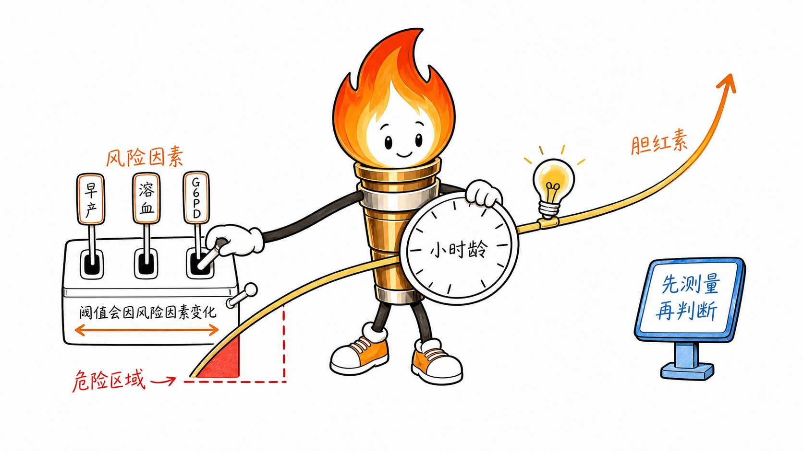

黄疸是病，但新生儿黄疸是症，古时称之为胎黄，是新生儿时期常见的生理现象。大多数宝宝出生后都会出现不同程度的皮肤和巩膜发黄，这主要是由于体内胆红素水平升高所致，也称为新生儿高胆红素血症。正常情况下，胆红素由肝脏处理并经粪便和尿液排出体外。然而，由于新生儿出生后肝脏功能尚未成熟，一时无法有效清除过多的胆红素，导致胆红素在体内累积，引起皮肤和巩膜的黄染。

公众对于新生儿黄疸的认知，常伴随着对脑瘫的巨大担忧。但事实是，在美国等发达国家，与新生儿黄疸相关的脑瘫病例数据极少。新生儿黄疸要发展到脑瘫的地步，通常需要两个必要条件：早产+溶血。本文旨在基于世界卫生组织（WHO）、美国疾病控制与预防中心（CDC）、美国儿科学会（AAP）等权威机构以及《柳叶刀》（The Lancet）、《美国医学会杂志》（JAMA）、《新英格兰医学杂志》（NEJM）等学术期刊的资料，系统介绍新生儿黄疸的概念、分类、预防、护理要点、并发症（如脑瘫）的风险、流行病学数据、治疗指征与方法，以及光疗过度使用的潜在危害。

<a id="point-03-008"></a>
#### 一、胆红素的生成与代谢

胆红素是人体内血红素分解代谢的最终产物。正常生理条件下，约75%的胆红素来源于体内衰老的红细胞中血红蛋白的分解，其余25%来自肌红蛋白、细胞色素和过氧化氢酶等其他含血红素蛋白质的分解。新生儿的胆红素生成速率显著高于成人，大约是成人的2-3倍。这主要是因为新生儿红细胞寿命相对较短（约70-90天，成人约120天），且体内红细胞容量相对较高，进一步促进了胆红素生成。胎儿红细胞寿命也比成人红细胞短，这也在一定程度上增加了新生儿体内胆红素的产生。新生儿体内胆红素产生过多的现象，是其更容易发生新生儿黄疸的重要生理基础。

未结合胆红素（间接胆红素）是一种脂溶性物质，在正常生理pH值下几乎不溶于水。在血液循环中，未结合胆红素需与血浆蛋白（主要为白蛋白）紧密结合才能被运输。形成胆红素-白蛋白复合物后，才能顺利被运输到肝脏进行代谢。当血液中未结合胆红素浓度过高，超过白蛋白结合能力时，就会出现游离的、未结合的胆红素。游离的未结合胆红素是导致神经毒性的主要形式，它们先沉淀在血管壁形成肉眼可见的新生儿黄疸，大量累积并进入早产儿尚未完全成熟的血脑屏障，一旦进入大脑组织，便会造成神经系统损害。因此，维持足够的白蛋白水平和避免影响胆红素-白蛋白结合的因素，对于预防胆红素神经毒性至关重要。

当胆红素-白蛋白复合物到达肝脏后，未结合胆红素会从白蛋白上解离，被肝细胞主动摄取。在肝细胞内，尿苷二磷酸葡萄糖醛酸糖基转移酶1A1（UGT1A1）发挥核心作用，催化未结合胆红素与葡萄糖醛酸结合，形成水溶性的结合胆红素。新生儿肝脏中UGT1A1酶的活性在出生时相对较低，大约只有成人的1%左右，需在出生后数周内逐渐成熟并提高活性。UGT1A1酶活性不足是导致生理性黄疸的核心原因。

结合胆红素是水溶性的，能从肝细胞分泌到胆汁中，然后通过胆道系统进入十二指肠。成人肠道细菌会将结合胆红素代谢转化为尿胆原，最终以粪便形式排出。但新生儿肠道菌群尚未完全建立，且肠道中存在β-葡萄糖醛酸酶，能将结合胆红素去结合为未结合胆红素。这些未结合胆红素又被肠道重新吸收进入血液循环，形成胆红素的肠肝循环。新生儿肠肝循环活跃，进一步加剧了高胆红素血症的发生。这些代谢差异使得新生儿更容易出现新生儿黄疸。

值得注意的是，适量的胆红素对机体有抗氧化作用。但是，当血脑屏障发育不完整的早产儿胆红素浓度过高时，对中枢神经系统具有神经毒性，可引发严重后果。因此，新生儿黄疸虽大多属于正常生理现象，仍需密切监测胆红素水平，以避免其升高至危险水平。

总结：胆红素是人体代谢的最终产物，由肝脏代谢后随粪尿排出。胎儿的胆红素由母体处理 ，而新生儿因肝脏尚未发育完全，负责转化的酶（UGT1A1）仅有成人的1%，导致大量脂溶性胆红素游离积聚形成新生儿黄疸。

<a id="point-03-009"></a>
#### 二、新生儿黄疸的常见表现与分类

新生儿黄疸非常常见，尤其在生后头几天内出现。据统计，约60%的足月新生儿在出生第一周会出现肉眼可见的新生儿黄疸，早产儿中这一比例更高，可达80%。这表明大多数新生儿都会经历一定程度的新生儿黄疸。在绝大部分情况下，新生儿黄疸都是轻度和短暂的，对健康无长期影响。

新生儿黄疸通常在出生后2-3天开始出现，4-5天时达到高峰，然后逐渐消退。足月儿一般在生后1周左右新生儿黄疸会明显减轻或消退，早产儿可能持续时间稍长，通常在生后两周左右开始消退。这种按上述时间进程出现、达峰和消退的新生儿黄疸，多属于生理性黄疸范畴。

新生儿黄疸最直观的表现是皮肤和眼白发黄。最早常在面部观察到皮肤发黄，随着胆红素水平升高，黄染会向下发展，依次波及颈部、躯干、四肢，最严重时手心和脚底也可能发黄。家长可在自然光线下观察婴儿皮肤，轻压额头或鼻子附近皮肤片刻，松开后若皮肤呈现黄色则提示新生儿黄疸。对于皮肤较深色的婴儿，新生儿黄疸可能不如白皙皮肤的婴儿明显。

一般来说，大部分新生儿的黄疸是轻度且无害的。然而，如果胆红素水平过高，婴儿可能出现嗜睡、吃奶差、反应低下等异常症状。这些症状提示新生儿黄疸程度严重，需要及时就医检查胆红素浓度。

新生儿黄疸根据其发生原因和严重程度，可以分为生理性黄疸和病理性黄疸两大类。生理性黄疸是正常新生儿常见的生理过程，而病理性黄疸则提示存在潜在的异常或疾病。此外，临床上还会根据新生儿黄疸发生时间、持续时间以及胆红素种类（未结合或结合胆红素升高）进行进一步细分。

2.1 生理性黄疸
生理性黄疸是新生儿时期最常见的黄疸类型，约50% ～80%的新生儿都会出现不同程度的生理性黄疸。它的特点是由于新生儿肝脏处理胆红素能力不足和红细胞破坏较多所致，但本身属于正常生理过程，没有器质性病变。

生理性黄疸有以下特征 ：
出现时间：通常在出生后2 ～3天开始出现 。若在出生后24小时内即出现黄疸，则倾向于病理情况。
峰值和持续时间：足月儿在生后4 ～5天左右黄疸达高峰，早产儿可能在生后5 ～7天达到峰值。足月新生儿的生理性黄疸通常在1周内明显减退，2周龄时基本消退；早产儿则可能持续2 ～3周。
胆红素水平：血清胆红素值升高幅度有限。一般认为，足月儿血清总胆红素峰值不超过17mg/dL (290 µmol/L)，如果超过此水平通常应谨慎评估。大部分新生儿很少出现胆红素高于12mg/dL的情况。
症状轻微：通常只有皮肤巩膜黄染，婴儿整体状态良好，无其他异常症状。宝宝食欲正常、精神反应正常，体温、呼吸等生命体征平稳。这类黄疸一般不需特殊处置，大多可自行消退。
胆红素种类：主要是未结合胆红素（间接胆红素）升高。若出现结合胆红素升高（结合胆红素\>2 mg/dL或占总胆红素\>20%，则提示非单纯生理性因素，应考虑胆汁淤积等情况。

母乳摄入不足性黄疸：并非母乳本身引起，而是指新生儿在生命最初几天里摄入母乳量不足、脱水或热量摄入不足，导致肠蠕动减少，使胆红素在肠道内被重吸收（肠肝循环增加），从而加重黄疸。这常发生于母乳建立尚未充分的前几天。本质上是可纠正的病理因素。此时宝宝常有脱水征象（如尿布很少湿、尿色深黄、体重下降超过正常范围）。通过增加哺喂频率、指导母乳喂养技巧或必要时补充奶水后，黄疸即可缓解。

母乳性黄疸：是一种特殊类型的生理性黄疸，发生在母乳喂养的婴儿中。一般在生后4-7天开始出现或加重，在第二周时胆红素水平升高明显，但婴儿状态良好。其机制尚不完全清楚，可能与母乳中的某些成分影响了肝脏对胆红素的处理，并加速了胆红素的肠肝循环。有一项研究发现，在出生后28天时，34%的主要以母乳喂养的婴儿经皮胆红素（TcB）浓度≥5 mg/dL，9%的婴儿浓度≥10 mg/dL，1%的婴儿浓度≥12.9 mg/dL。总体而言，母乳性黄疸是良性的，持续时间较长但无长期危害。母乳性黄疸可持续3个月之久。只要胆红素数值不到光疗阈值，宝宝进食生长正常，无需中断母乳喂养。美国儿科学会（AAP）的黄疸临床指南首要是排查是否有危险因素，其次就是确保母乳喂养。

新生儿黄疸与疫苗接种
根据国家卫生健康委员会发布的《国家免疫规划疫苗儿童免疫程序及说明(2021年版)》及相关指南 ：
生理性黄疸和母乳性黄疸不属于疫苗接种的禁忌症。如果婴儿整体健康状况良好，可以按照免疫程序正常接种疫苗。
病理性黄疸的婴儿需要暂缓接种疫苗，直到查明病因且生命体征平稳。如果病理性黄疸未达到光疗或换血标准，且无肝功能异常或感染，可以正常接种乙肝疫苗。

2.2 病理性黄疸
病理性黄疸是指由异常原因或疾病引起的黄疸，往往提示新生儿存在潜在的健康问题。与生理性黄疸相比，病理性黄疸通常出现更早、程度更重或持续时间更长，需要及时识别和处理。

判断黄疸是否为病理性的常用标准包括 ：
出现时间过早：黄疸在出生后24小时内出现即被视为异常，常提示有溶血等病理原因。
血清胆红素升高过快：每天升高超过5 mg/dL (86 µmol/L)或每小时升高\>0.2 mg/dL，提示可能存在大规模溶血或严重感染。
血清胆红素浓度过高：若胆红素水平高于正常范围许多，则高度怀疑病理性黄疸。对于父母来说，如果宝宝黄疸严重到肉眼可见的遍及四肢甚至手脚心发黄，就属于比较严重的情况，应尽快测试胆红素数值。
黄疸持续时间过长：足月儿黄疸持续超过2周，早产儿超过3周仍未消退，或黄疸退而复现，需要排查原因。
伴随症状异常：出现精神萎靡、嗜睡、吃奶困难、肌张力异常、高调尖叫、抽搐等神经系统症状，或苍白、贫血、呼吸困难、发热、呕吐、生长不良等其他体征。这些是危险信号，提示可能出现胆红素神经毒性。

病理性黄疸的常见原因包括 ：
溶血性疾病：母婴血型不合溶血（如ABO溶血、Rh溶血）或葡萄糖-6-磷酸脱氢酶（G6PD）缺乏症（蚕豆病）。溶血性黄疸往往胆红素升高很快且水平很高，需要积极干预。
ABO溶血在孕妈中常常引起恐慌，但研究数据显示其基本没有造成较大影响，胆红素数值达到光疗阈值积极配合光疗即可。
Rh溶血是造成非发达国家新生儿死亡和核黄疸的高风险之一，可以通过孕期注射抗D免疫球蛋白等手段预防。
G6PD缺乏症（蚕豆病）没有有效治疗手段，一旦触发溶血很容易造成严重后果。携带此基因的父母应避免可能触发溶血的物质（详见附录中的清单），并确保纯母乳喂养，即可确保宝宝平安。

红细胞异常及血肿吸收：先天性红细胞缺陷或分娩过程中出现的头颅产伤（如头皮血肿）可导致胆红素负荷增加。

感染和败血症：新生儿感染可能干扰肝脏功能，导致胆红素结合受损，或引起红细胞破坏增加，常导致混合性黄疸。

内分泌和遗传代谢疾病：如先天性甲状腺功能减低症可导致持久黄疸。Gilbert综合征、Crigler-Najjar综合征等遗传性胆红素代谢障碍也会引起重度黄疸。

胆道或肝脏疾病：胆汁淤积性黄疸指直接（结合型）胆红素升高导致的黄疸，多由先天性胆道闭锁、新生儿肝炎综合征等引起。此类黄疸往往持续不退甚至加重，大便颜色变淡或呈陶土色，尿色深黄。父母在宝宝出生头2周应对照大便卡观察便便颜色，以便及时筛查肝胆疾病。

综上，病理性黄疸的特点是出现早、进展快、数值高或伴随异常症状。早期识别和处理对于预防严重并发症至关重要。

<a id="point-03-010"></a>
#### 延伸阅读：新生儿大便卡

<a id="point-03-011"></a>
#### 三、新生儿黄疸的预防与日常护理

虽然大多数新生儿黄疸是生理现象，但通过良好的护理可以预防胆红素升高到危险水平。预防新生儿黄疸升高的关键在于促进胆红素从体内排出和避免引发胆红素升高的危险因素。

3.1 预防措施
早开奶和充足喂养：足够的营养摄入和水分摄入可以促进新生儿排便和排尿，帮助将肠道中的胆红素排出体外，减少肠肝循环重吸收。
尽早开奶：出生后1小时内进行第一次哺乳，初乳有助于促进胎便排出。
频繁喂奶：AAP建议新生儿出生最初几天内每天哺喂8-12次母乳，按需喂养，确保获得足量液体。
禁止喂糖水或清水：单纯喂水或糖水没有营养，反而会减少喝奶量，不利于胆红素代谢和排泄，父母们谨记一点，仅有母乳有轻泄作用，水没有促排便的作用。
母乳喂养支持：确保母乳喂养成功，避免因摄入不足引发“母乳喂养不足性黄疸” 。
及时排出胎便：胎便中含有大量胎儿期摄入的胆红素，尽快排出有助于预防黄疸。

警惕高危因素并提前干预：
母亲血型及抗体检查：
1、ABO血型不合：母亲为 O型血，而胎儿为 A型或B型时，母体可产生抗A或抗B抗体（IgG），可通过胎盘进入胎儿血液，引发轻至中度溶血。ABO溶血通常发生在产后24小时内，目前没有有效的免疫预防药物，也没有出现过严重的溶血后果，父母们遇到也不要慌，达到光疗阈值就光疗，通常几天就会消退。
2、Rh(D)血型不合：母亲为 Rh阴性（Rh–），胎儿为 Rh阳性（Rh+），若胎儿红细胞进入母体循环，母体会产生抗D抗体（IgG），下一胎若仍为Rh+，这些抗体可穿过胎盘引起严重溶血甚至胎死宫内。听上去可怕，但有预防的手段：妊娠中期（一般28周）注射**抗D免疫球蛋白（RhIg）**即可，若有可能混血事件（流产、外伤、绒毛穿刺等）72小时内注射RhIg。产后可再产后72小时内再次注射RhIg。

> 孕早期（第一次产检时）应检测夫妇双方血型（含ABO和Rh），当母亲Rh阴性 且 丈夫Rh阳性 时，胎儿可能Rh+，后续就需要免疫监测和预防（Rh免疫球蛋白注射），因为Rh溶血影响较大，尤其是早产儿绝不能掉以轻心。

早产儿和低体重儿特别护理：早产儿黄疸发生率和严重程度更高，应给予足够保温、喂养支持和监测。
分娩损伤的处理：严重瘀伤、头颅血肿会增加胆红素负荷，需更频繁监测。
母亲糖尿病等情况：糖尿病孕妇所生新生儿发生黄疸风险较高，因常出现红细胞增多症。
医院出院前检查与随访：出院前应检查胆红素水平，高风险婴儿需在出院后2天内复诊。
避免不良诱因：避免让婴儿接触樟脑丸、含萘物质等可能触发G6PD缺乏症溶血的物质。避免新生儿受寒、缺氧、感染等应激情况。不要擅自给新生儿服用中草药或药物，避免宝宝溶血风险。
关于阳光照射：阳光中含有蓝光成分可辅助降黄疸，但强度和波长不可控。AAP特别提醒不要直接以日光替代正规治疗，以免晒伤。仅适用于轻微黄疸辅助改善，不可代替医疗干预。

3.2 日常护理指南

持续母乳喂养并观察摄入：确保每昼夜哺乳8-12次，观察宝宝吞咽声音、尿布判断摄入是否足够（每日不少于6片湿尿布，尿液无深黄色；每天排便3-4次以上） 。
监测黄疸部位和颜色变化：每日在自然光线下观察宝宝皮肤和眼白发黄程度，黄染通常从脸部开始向下发展。如果黄疸范围扩大或颜色加深，特别是扩散到手掌脚底时，应及时就医。

警惕黄疸相关的危险信号：以下症状出现任何一项，都应立刻就医 ：
皮肤颜色愈发偏黄，尤其扩散到手心脚心。
嗜睡，很难叫醒，比平时更加安静、不爱动。
异常烦躁、持续哭闹难以安抚，或非常懒怠、反应迟钝。
吃奶困难：吸吮无力、食欲降低。
出现肌张力改变：软绵绵无力或身体发硬、后仰等异常姿势。
出现尖锐的哭声（尖叫式哭闹）或者惊厥、抽搐等神经症状。
这些迹象可能表示胆红素水平已非常高并开始影响大脑（急性胆红素脑病），属医疗紧急情况，必须立即就医。

按照医生安排进行黄疸检测：严格遵循随访计划，配合经皮或抽血检测胆红素水平。
家庭光照和环境：对于轻度黄疸，可在确保宝宝保暖前提下，安置在室内明亮环境接受适度日照，但切勿直接曝晒。

照护黄疸儿的小贴士：
保持宝宝温暖，避免体温过低或波动。
不要随意停止母乳喂养，考虑到国内医生的专业水平参差不齐，对于停止母乳喂养的建议父母最好参考美国儿科学会的指南再做决定。
密切观察大便颜色，如果变淡或灰白，立即告知医生。
安抚和陪伴，光疗期间给予关心和身体接触，医院禁止时建议更换允许的医院。

<a id="point-03-012"></a>
#### 四、新生儿黄疸与脑瘫的科学认知

新生儿黄疸本身并不会直接导致脑瘫或其他神经损伤。只有当胆红素水平异常升高且未及时治疗时，脂溶性胆红素（间接胆红素）穿过血脑屏障对脑细胞造成损害，才会引发严重后果。极重度黄疸累及中枢神经系统时所致的脑损伤，称为胆红素脑病。其中，急性期的脑功能损害称为急性胆红素脑病，若发展到永久性损害阶段，则称为核黄疸（kernicterus，又称慢性胆红素脑病）。核黄疸会导致严重的神经系统后遗症，包括听力丧失和脑瘫等。

“核黄疸”得名是因为胆红素容易沉积在大脑深部的基底神经节等核团（如苍白球、海马和丘脑下部等），在尸检病理上可看到这些部位被胆红素染成黄色。核黄疸实际指的是胆红素所致的脑性瘫痪综合征，是高胆红素血症最严重的并发症。

导致脑瘫的原理：未结合胆红素在血中浓度极高时，可以突破尚未成熟的新生儿血脑屏障，进入脑组织，对神经元产生毒性作用。尤其在存在缺氧、酸中毒、感染等促发因素时，胆红素更容易进入脑内。胆红素的神经毒性表现为对神经细胞线粒体功能干扰和细胞膜损伤，最终导致神经元坏死。核黄疸最典型损伤锥体外系的神经元，幸存者常表现为手足徐动型脑瘫和感觉神经性耳聋。

新生儿黄疸发展到核黄疸，是当血中总胆红素水平达到或超过毒性阈值而未得到干预。在早产新生儿中，总胆红素持续高于约30 mg/dL (513 µmol/L) 将有相当风险引起胆红素脑病，需要紧急换血治疗。早产儿的血脑屏障脆弱，只要胆红素水平上升较快，就建议及早介入干预。

急性胆红素脑病的发展可分为三个阶段 ：
早期阶段：宝宝嗜睡、吸吮无力、肌张力降低，有时伴轻度低温。此时若能紧急干预，脑损伤可能是可逆的。
中期阶段：宝宝异常烦躁易激惹，出现高音调尖叫，身体呈现强直后仰（角弓反张），颈部和背部肌肉僵硬，有的会有发热。这是非常危险的迹象。
晚期阶段：宝宝可能出现惊厥、昏迷。此阶段往往已造成不可逆的脑损伤。
如果急性胆红素脑病阶段没有有效治疗，存活的婴儿可能进入慢性胆红素脑病（核黄疸）状态。典型表现包括手足徐动型脑瘫、听力损失、牙釉质发育不良（在核黄疸/慢性胆红素脑病里的牙釉质发育不良通常主要影响乳牙，例如牙面不光滑完整，出现黄褐色、绿色、灰绿色或斑块样）和眼球向上凝视麻痹。

由黄疸导致的脑瘫发生率
在医疗发达国家通常有完整的诊疗数据，据CDC报告，美国每年因核黄疸导致的婴儿死亡不足2-3例。

根据Bhutani等人2013年的研究，2010年全球约有1.34亿≥32周胎龄活产婴儿。该研究估计，全球因黄疸相关原因（包括Rh病和极度高胆红素血症）死亡的新生儿为11.41万，占总出生人口约0.85%。另有超过6.3万幸存者发展成为核黄疸（脑瘫、耳聋等）患儿，占比约0.47%。但需注意的是，这些死亡和核黄疸病例主要集中在南亚和撒哈拉以南非洲，且多为本可以避免的情况。

新生儿脑瘫的全球发生率及其原因
根据2022年发表的系统分析，高收入国家的脑瘫出生流行率约为每1000名活产儿1.6例，而黄疸导致脑瘫在发达国家已非常罕见。
脑瘫是由大脑发育异常或损伤导致的运动和姿势控制问题，损伤可能发生在出生前、出生期间或出生后。中国脑瘫出生流行率约为每1000名活产儿1～5例。黄疸是导致脑瘫的众多因素中极小的一个，且是完全可预防的。

健康新生儿高胆红素血症的脑瘫研究
研究一致表明，在健康新生儿中，黄疸导致脑瘫的风险极低。Newman TB等（2015）的一项基于10万多婴儿的队列研究发现，即使胆红素水平达到或超过换血阈值，脑瘫的风险也很低。最终符合核黄疸的脑瘫病例仅有3名婴儿（发病率每10万例出生中0.57例），所有3名婴儿的总胆红素（TSB）水平均超过换血阈值（ETT）5.0 mg/dL以上，并且至少有2个神经毒性风险因素，如早产 + G6PD缺乏症或缺氧缺血。

研究结果表明，美国儿科学会（AAP）2004年的ETT指南能够有效识别所有符合核黄疸的脑瘫病例。核黄疸被认为是一种可以通过适当医疗干预预防的疾病，但在某些高风险情况下，可能无法完全避免。研究发现，TSB水平超过ETT 5 mg/dL以下的婴儿中，脑瘫风险极小。这表明，对于没有神经毒性风险因素的健康婴儿，其对高胆红素血症的耐受性可能高于当前管理指南所认可的水平。

小结：Newman TB等（2015）的研究中，在10万新生儿中发现93例脑瘫，其中3人通过脑部MRI确诊核黄疸，均来自TSB显著高于换血阈值（\>5mg/dL以上）的暴露组，且每人至少有2个神经毒性风险因素（如早产 + G6PD缺乏症或缺氧缺血）。研究表明，新生儿黄疸导致脑瘫的概率极低，几乎不会发生在足月健康新生儿中。证据倾向于认为：1、早产是核黄疸的高风险因素。2、溶血是核黄疸的高风险因素，尤其是Rh血型和G6PD缺乏症。3、早产+溶血是核黄疸的极高风险因素，两者同时存在显著增加了核黄疸的风险。

<a id="point-03-013"></a>
#### 五、新生儿黄疸的治疗方法

新生儿黄疸是否需要治疗，取决于胆红素的浓度、婴儿日龄以及存在的风险因素等综合评估。根据世界卫生组织（WHO）和联合国儿童基金会（UNICEF）的数据，全球约有10%-15%的黄疸宝宝是需要医疗干预的。

目前临床上普遍根据宝宝出生后小时数（或天龄）和胆红素值以及是否有危险因素，来判断是否需要治疗。例如，美国儿科学会（AAP）制定的黄疸临床指南中，有一张著名的“光疗曲线图”和“换血曲线图” 。医护人员将宝宝测得的血清胆红素值，在图表上对应宝宝的小时龄和风险类别，落在曲线以上则需要开始光疗，落在更高阈值则需要考虑换血。父母可以通过这些图表更直观地学习判断标准（或直接询问奶爸AI）。

新生儿日龄越小（离出生时间越近），可耐受的胆红素浓度越低。风险因素存在会降低干预阈值。高风险因素包括早产（\<36周）、溶血（如Rh血型）、G6PD缺陷、出生时有窒息、体温不稳、低白蛋白血症等 。病理性标志也是启动治疗的理由之一，如黄疸在出生24小时内出现，或上升速度\>5 mg/dL/天，或直接胆红素升高。

综上，黄疸是否需要治疗并没有一个绝对统一的胆红素值标准，而是因时因人而异。但可以总结一些需要治疗的常见情况：
极早出现的黄疸：出生当天出现黄疸者，一般会立即检查原因并开始干预。
胆红素达到治疗线：根据宝宝日龄套用标准曲线后，如果总胆红素等于或超过光疗阈值，则应开始光疗；如果接近换血阈值或已有神经症状，则准备换血治疗。
胆红素上升过快：如果一天之内胆红素飙升很多，即使当前值未达标准，也倾向提前干预。
出现任何神经症状：一旦宝宝因高胆红素表现出嗜睡、肌张力改变等神经系统异常，无论胆红素数值如何，一律视为紧急，需要立即强化光疗甚至准备换血。
结合胆红素升高：如果发现**直接胆红素**明显升高（\>2 mg/dL或占比\>20%），光疗对此类黄疸无效。这种情况通常提示胆汁淤积性疾病，需要针对原发病进行检查和治疗。
小结：父母应了解光疗曲线图的解读方法，并重视风险因素（早产、溶血、G6PD缺陷、窒息、体温不稳、低白蛋白血症等）和病理指标（黄疸\<24小时出现、上升速度\>5mg/dL/天、角弓反张、尖叫等）。（或直接询问奶爸AI）

<a id="point-03-014"></a>
#### 延伸阅读：光疗曲线图（或直接询问奶爸AI）

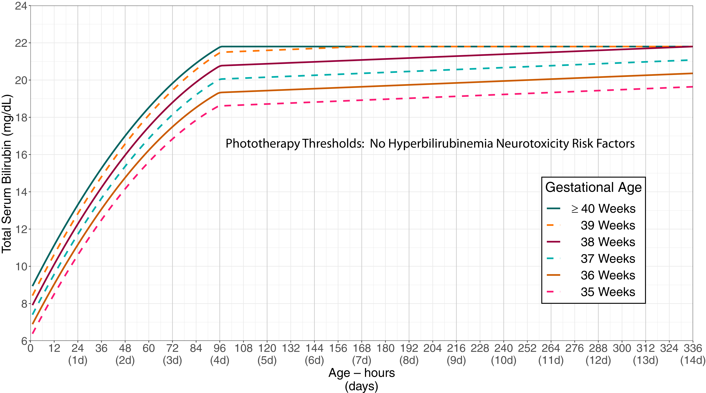

这张图用于帮助理解“小时龄 + 总胆红素 + 神经毒性风险因素”共同决定干预阈值。它不是家庭自行决定光疗或换血的计算器；请让新生儿科医生结合宝宝胎龄、小时龄、胆红素检测方式和风险因素判读。

一旦评估决定新生儿黄疸需要医疗干预，目前主要有以下几种治疗方法。治疗目标是降低血中胆红素水平，防止其进一步升高并避免发生胆红素脑病。

5.1 光疗（蓝光照射疗法）
光疗是治疗新生儿高间接胆红素血症的最常用方法。其原理是利用特定波长的光照射婴儿皮肤，使胆红素发生光化学反应转变成不需经肝脏结合即可从胆汁或尿液排出的产物，从而降低血中胆红素水平。
光疗通常使用蓝光或蓝绿光波段（波长约430-490nm），因为该波段对胆红素的吸收率最高。实践中，有两种主要形式 ：

常规光疗箱：婴儿置于特制光疗箱或蓝光灯下，只穿尿布，遮盖眼睛以保护视网膜，其余皮肤尽可能暴露以接受光照。
纤维光毯（BiliBlanket）：一种柔软的纤维光源垫子，可以包在宝宝身上或垫在身下。这种方式避免了母婴分离，不影响母乳喂养。光疗毯国内罕见，在欧美主要用于家庭租赁市场。
光疗的疗效显著，一般在开始治疗4-6小时后可观察到血清胆红素下降。光疗持续时间视胆红素水平而定，国内普遍存在过度光疗的问题，对母乳喂养干扰较大。

光疗的短期副作用包括 ：
发烧、水和电解质失衡、腹泻、皮肤损伤（皮疹、肤色变黝黑）、铜婴综合征（皮肤变成灰棕色）、血液学变化、麻痹性肠梗阻、动脉导管未闭、眼损伤和昼夜节律周期紊乱。
研究表明，光疗还可以显著影响新生儿肠道菌群和代谢标志物，导致肠道菌群失衡。
脱水和腹泻：光疗可导致水分蒸发增加，大便次数增多、变稀，可能出现轻度脱水。
体温变化：强光照射和裸露可能使宝宝体温升高或不稳定。
视网膜防护：务必佩戴好婴儿护眼罩，保护眼睛免受强光刺激。

过度光疗的潜在长期风险：
喂养节奏被打乱：部分医院禁止探视，可能导致瓶喂，进而引起宝宝乳头混淆、肠道菌群紊乱。
母婴分离造成的精神创伤：生命早期的短暂母婴分离可能给宝宝造成严重的精神创伤，导致木讷不哭、不黏人等创伤特质，甚至影响依恋关系。
儿童肿瘤风险：有大型研究指出，新生儿期接受光疗与婴幼儿某些癌症的发病有统计学相关性 。一项荟萃分析结论显示，接受新生儿光疗的婴儿患任何类型癌症的风险增加了24%，患血液系统癌症的风险增加了49%，患任何白血病的风险增加了35%，与髓性白血病的关联更为显著，风险增加了2.86倍。
癫痫和神经发育：目前主流认为光疗不会直接导致这些问题，但过度治疗间接可能影响发育环境。
皮肤病变：光疗可能导致婴儿皮肤痣数稍增。
发育迟缓的风险：一项日本团队的观察性队列研究显示，随着光疗时间的增加，新生儿在3岁时某些发育领域出现迟缓的风险也随之上升，特别是在沟通、粗大运动、问题解决和个人社交等领域。
医疗资源和成本的非必要占用：过度光疗意味着医疗资源的非必要占用。
总的来说，对于大多数需要治疗的新生儿黄疸，光疗的利益大于危害，建议父母积极配合治疗。

5.2 药物治疗
静脉丙种球蛋白（IVIG）：对于免疫性溶血所致的严重黄疸，可减轻溶血程度，常用于需要换血临界的病例。
酶诱导剂（苯巴比妥）：主要用于某些特殊遗传性高胆红素血症的管理或作为辅助。
治疗原发疾病的药物：如果黄疸由特定疾病导致，则应针对原发病用药，如抗生素、甲状腺激素替代等。
其他药物：有些研究探索了金属卟啉来抑制血红素氧合酶，从源头减少胆红素产生，但因副作用和安全性问题不随意使用。
药物副作用：西药使用由医生决定，其副作用医生会提前告知。对于中药制剂，父母们要首先了解副作用。
中药制剂（如茵栀黄）：茵栀黄口服液主要成分包括茵陈、栀子、黄芩、金银花提取物，用于清热解毒、利湿退黄。不良反应包括腹泻、呕吐和皮疹。对于G6PD缺乏患者，有个例报告可能引发溶血并导致新生儿死亡。国家食品药品监督管理总局（CFDA）已于2016年禁止茵栀黄注射液用于新生儿、婴幼儿和孕妇，因为存在严重不良反应。2017年市场监管总局要求修订茵栀黄口服制剂说明书，明确不良反应并增加G6PD缺乏者和脾虚大便溏者（大便不成形、形似溏泥）的使用注意事项。

5.3 换血治疗
换血治疗是治疗新生儿严重高胆红素血症的最迅速有效但同时也是侵入性最高、风险较大的手段。它通过将宝宝含有高浓度胆红素的血液抽出，同时等量输入匹配的捐献血，在短时间内大幅降低血中胆红素水平。换血通常在新生儿重症监护病房（NICU）进行，理论上可以清除婴儿体内90%以上的胆红素，并移除被母体抗体包裹的红细胞，同时纠正贫血。
通常当胆红素水平达到换血阈值或已有急性胆红素脑病表现时，医生会决定进行换血。临床上有时采用的标准是：“在强化光疗下胆红素仍持续上升，且接近换血水平时，准备换血；或出现神经症状时即刻换血” 。

换血是一项侵入性操作，有一定风险，可能发生的并发症包括 ：
血液动力学问题（血压波动、心律不齐、心脏骤停）。
电解质和代谢紊乱（高钾血症、低钙血症、血糖波动、酸碱平衡紊乱）。
感染风险；空气栓塞；血液学并发症（出血、血小板减少）；死亡（历史数据显示死亡率可达0.5-3%，现代NICU环境下已大为降低）。
由于换血的风险，现代新生儿黄疸管理一直强调尽量通过早期监测和光疗避免走到换血这一步。随着光疗技术的发展，换血的需要已经大大减少。

换血后的处理：单次换血可迅速降低胆红素，但换血后宝宝体内仍有病理过程可能继续产生胆红素。因此，换血后一般仍会继续光疗，并密切检测电解质、血糖。

5.4 其它“治疗”手段辨析
当父母了解新生儿黄疸的成因，就会明白有些“治疗”方式缺乏科学依据，甚至可能有害：沐浴、老中医、孕期吃特定食物预防。这些方法属于缺乏科学依据的“智商税”，生理性黄疸通常会自愈，病理性黄疸则可能因此耽误治疗。
晒太阳：对于轻度黄疸可适度光照，但不鼓励暴晒，可能导致晒伤。
居家光疗：欧美推荐使用光疗毯居家光疗，几乎所有的家庭都负担得起租赁的费用。我们的医疗机构肯定不推荐，因为无利可图。我咨询过国内光疗毯的仿制厂家，价格比GE的公开售价低1万元人民币，可以说极为昂贵，而小作坊制造一个蓝光箱的成本可能就百十元钱，已经形成租赁效应，而我不得不提醒父母们，过度光疗是有害的，在缺乏专业知识的情况下居家光疗弊大于利。
各种退黄药：不要随意给孩子服用退黄药，存在引发溶血的风险。
益生菌：不要听医生忽悠，益生菌退黄缺乏科学依据，身边人的有效反馈属于幸存者偏差，新生儿黄疸本就会消退，恰好和服用益生菌的时间重合了。

六、总结与展望
新生儿黄疸本是一个常见的生理症状。许多父母可能因不了解而感到焦虑不安。但通过本文的详细讲解，我们了解到大多数黄疸是生理性的、无害的，只需耐心喂养和观察即可自然消退。同时，我们也强调了及时监测和识别异常黄疸的重要性：在少数情况下，黄疸可能是潜在疾病的信号，需要积极治疗，否则可能引发严重后果如胆红素脑病甚至脑瘫。
幸运的是，现代医学已经使得黄疸所致脑瘫几乎是可以完全预防的。这得益于产前预防（如预防Rh溶血）、产时监护，以及新生儿期的筛查和干预。对于家长来说，最重要的是掌握纯母乳喂养方法和新生儿黄疸的常识。切勿轻信民间偏方或延误治疗时机。

<a id="point-03-015"></a>
#### 延伸阅读：G6PD缺乏症（蚕豆病）溶血触发物质清单

请参阅：[G6PD 溶血触发物质清单](docs/06-G6PD溶血触发物质清单.md)。
---

<a id="point-03-016"></a>
### 含乳姿势与乳头混淆

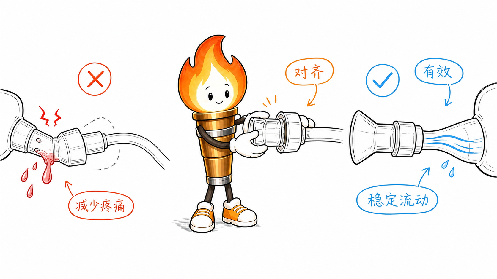

<a id="point-03-017"></a>
#### 正确含乳

吮吸是本能，但如果宝宝含乳的姿势不正确，不仅可能无法及时有效地”开奶”，还非常容易导致妈妈乳头疼痛甚至破损出血。

正确含接的要点：

妈妈选择一个舒适的姿势，比如坐直或半躺，确保背部、手臂、脚都有良好的支撑（怎么支撑凭感觉，确保长期不动也不会累），关键是全身放松。让宝宝的身体完全面向妈妈，做到腹贴腹，宝宝的头、颈、身体保持在一条直线上，嘴巴要对准乳头的高度。妈妈可以用乳头轻轻触碰宝宝的嘴唇，激发他的觅乳反射，耐心等待宝宝把嘴巴张得像打哈欠那么大。抓住时机，快速地将乳房（主要是乳头和大部分乳晕）送入宝宝口中，要确保宝宝含住的是大部分乳晕，而不单是乳头。

正确含接的表现是：

宝宝的下唇是向外翻的，下巴紧紧地贴着妈妈的乳房，鼻子尖轻轻触碰或靠近乳房，呼吸保持通畅。如果有旁人观察宝宝吮吸，含接正确时，宝宝的下唇可见小舌头忽隐忽现，能看到小舌头轻触乳晕，就代表宝宝含乳正确，开奶只是时间问题。

妈妈要用C型手势（拇指在上方，其余四指并拢托住乳房）来帮助宝宝更好的含接吮吸。后期乳汁太丰沛呛到宝宝时，可改用剪刀手（食指和中指张开）夹住乳房，通过压住乳腺导管，控制出奶的量，避免呛到宝宝。哺乳一段时间后，妈妈通常能感觉到乳汁喷射（奶阵），同时能听到宝宝发出有节奏的吞咽声。

<a id="point-03-018"></a>
#### 乳头混淆

母乳喂养三个重点：
1、0-6个月纯母乳喂养；
2、6个月后及时添加辅食，并继续母乳喂养到宝宝至少2岁；
3、不使用奶瓶、奶嘴儿。

母乳喂养为什么不可以使用奶瓶、奶嘴儿？喂水时使用奶瓶、奶嘴儿不是更方便吗？
这是因为奶瓶和乳房的“出奶规则”不同。吃乳房时，宝宝要深含乳晕，用舌头和下颌配合刺激妈妈的射乳反射，乳汁才会一阵一阵射出来。宝宝需要等待、需要用力、需要和妈妈配合。

可吃奶瓶时，奶水就像自来水一样流个不停，宝宝需要使用舌头控制奶嘴儿的流速，否则会呛到自己，因此，舌头是完全卷曲在口腔最里面的。吃母乳时宝宝会累的满头大汗，我们常用拿出吃奶的劲形容一个人很辛苦。吃奶瓶则完全不需要用劲，因此，宝宝常常吃过量，这也是为什么人工喂养的宝宝普遍肥胖的原因。我们现在关注的不是省劲和吃撑，而是两种吃奶方式的舌头，一个是伸直的，整个嘴巴都是在拼命使劲的吮吸。一个是卷曲的，静静的等待奶水持续流出来。一旦宝宝习惯了奶瓶的节奏，再回到乳房上，就会只叼乳头、不深含乳晕，也不吮吸，等半天没有奶就哇哇大哭。很多妈妈和我讲宝宝含着乳房就哭，我就知道是乳头混淆了。

吸奶器、手挤奶和宝宝直接吮吸，也并不是完全相同的取奶方式。吸奶器主要依靠周期性负压刺激和牵拉乳头乳晕；手挤奶则通过手指对乳晕后方和乳房组织的节律性压迫，帮助乳汁排出。宝宝吃奶不是简单“吸出来”，而是通过含住足够多乳晕，配合舌头、下颌和口腔负压，刺激妈妈的射乳反射。真正让乳汁大量流出的关键，是催产素引发的奶阵——乳腺周围的肌肉样细胞收缩，把乳汁从乳腺推向乳头。奶阵强的时候，手挤奶甚至能看到乳汁喷射很远，这也说明母乳排出不是单纯靠“吸力”，而是妈妈身体和宝宝动作共同配合的结果。

懂了乳头混淆的原理，就不要给宝宝使用奶瓶、奶嘴儿。即便是返岗背奶继续母乳喂养的父母，可以使用杯子或汤匙给宝宝喂奶。用汤匙给宝宝喂奶，需要更有耐心，喂急了会呛到宝宝，每年有发生月嫂用汤匙喂奶致宝宝呛奶，甚至因此死亡的案例。父母不必因为悲剧而惶恐，出现呛奶及时拍背疏通一下就好了，之所以会有悲剧发生，通常是因为月嫂在宝宝呛奶后，想通过加大喂奶量掩盖问题，结果导致奶水被灌入肺部，导致吸入性窒息，继而呼吸、心跳骤停。一旦缺氧，大脑和重要脏器受到了不可逆的损伤，进入了“低氧缺血性脑病”的状态，就会导致不治身亡。所以人工喂养的宝宝，没有母乳喂养那么身心，母乳喂养是宝宝自己把握节奏。不论是吃的快慢、还是吃的多少，都是由宝宝自己决定。母乳喂养的宝宝也会吐奶，是因为食管和胃之间的食管括约肌还不够成熟，吃完马上平躺，或者抱着动得多一点就被吐一身。父母完全不需要焦虑，宝宝打嗝吐奶都是正常的。

<a id="point-03-019"></a>
#### 如何拯救乳头混淆？

如果宝宝已经出现了乳头混淆，父母可以尝试以下的办法：
首先，立刻停止使用所有的奶瓶、奶嘴儿。如果宝宝因为某些原因不能亲喂母乳，务必使用杯子或汤匙喂养。

其次，在宝宝清醒、情绪比较好的时候，逗宝宝张大嘴巴后，使用干净的雪糕棍或者压舌片，轻轻地按压宝宝舌头的中部，使他张嘴时舌头伸直。反复练习这个动作为重新吮吸做准备。

最后，但宝宝张嘴时已经不再习惯性卷曲舌头，就可以再次尝试母乳喂养。将乳头及大部分乳晕放入宝宝张大的嘴巴里，引导他吮吸。经过反复训练，宝宝又可以重新吮吸母乳。
---

<a id="point-03-020"></a>
### 涨奶该怎幺办

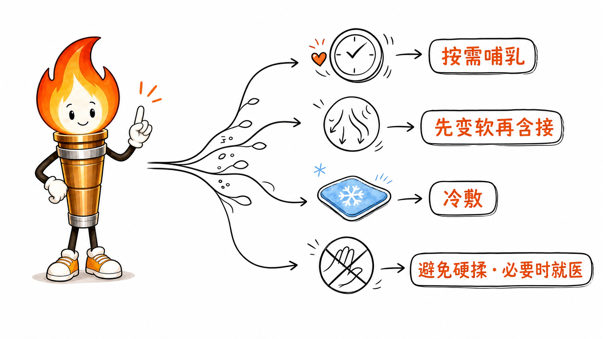

涨奶通常发生在产后第3～5天，也可能稍晚出现。
这时乳房可能出现：
* 两侧同时变大、发硬、发热；
* 沉重、胀痛或触碰敏感；
* 乳晕肿胀，乳头看起来变平；
* 宝宝难以含住乳房。

涨奶并不只是“乳房里装满了奶”。产后泌乳启动时，乳房内的血流增加，组织间液体也会增多，再加上乳汁分泌增加，共同造成乳房肿胀。因此，处理涨奶不能只是拼命把奶吸空，还要设法减轻乳房组织和乳晕的水肿。

<a id="point-03-021"></a>
#### 一定要及时处理

乳晕过度肿胀后，乳头和乳晕会变得紧绷、扁平，宝宝很难含入足够的乳房组织。
宝宝含接困难，又会进一步导致：
* 吸奶效率下降；
* 妈妈乳头疼痛或破损；
* 乳房越来越胀；
* 妈妈因疼痛而减少喂奶；
* 局部炎症逐渐加重。

不过，涨奶本身并不等同于乳腺炎，也不一定是感染。大多数早期涨奶经过适当处理后，可以在一两天内逐渐缓解。

<a id="point-03-022"></a>
#### 发生涨奶后，应该怎么做

<a id="point-03-023"></a>
##### 继续按需哺乳

不要因为乳房疼痛而突然停止喂奶。
新生儿通常每天吃奶8～12次，有时还会更多。观察宝宝的觅乳、张嘴、转头、吃手等早期饥饿信号，及时喂奶。

按需喂养，不要为了消除涨奶而额外人工吸奶，尤其不要每次把乳房排空，身体会误以为宝宝需要更多乳汁，反而进一步增加泌乳，使涨奶反复发生。

<a id="point-03-024"></a>
##### 先让乳晕变软，再让宝宝含乳

有时并不是宝宝不会含乳，而是乳晕肿得太硬，宝宝根本含不进去。

喂奶前可以：
* 用手指围绕乳头根部轻轻向胸壁方向按压；
* 保持一两分钟，使乳晕周围的水肿暂时向后移动；
* 或者用手挤出少量乳汁，让乳晕变软。

只需要挤到宝宝能够含住、妈妈感觉稍微舒服即可，不需要把乳房排空。

<a id="point-03-025"></a>
##### 检查含接是否有效

宝宝吃奶时应当：
* 嘴巴张得足够大；
* 下巴贴近乳房；
* 含入的不只是乳头，还包括较多乳晕部分；
* 吸吮一段时间后能听到吞咽声；
* 妈妈没有持续的夹痛、刺痛或乳头被压扁的感觉。

如果宝宝反复滑脱、只含乳头、几乎听不到吞咽，或者每次吃奶时间很长却仍然没有满足感，应尽快评估含接和乳房排空情况。

<a id="point-03-026"></a>
##### 喂奶后或两次喂奶之间冷敷

冷敷有助于减轻疼痛、炎症和组织水肿。

可以将冷敷袋包上一层薄毛巾，敷在肿胀部位约10～20分钟。避免冰袋直接接触皮肤，也不要长时间持续冷敷。

目前更强调冷敷，而不是反复热敷。长时间热敷会增加局部血流，可能使乳房更加肿胀。使用生大头菜也冷敷也是不错的选择，把从冰箱拿出的大头菜一片片剥开，紧贴发热乳房上是不错的家庭缓解方法，相较于冰敷更安全。部分妈妈喂奶前短暂温敷后感觉奶阵更容易出现，可以偶尔使用，但不应把长时间热敷作为主要治疗方法。

<a id="point-03-027"></a>
##### 不要用力揉、推、刮乳房

涨奶时乳房已经处于水肿和充血状态。用力揉硬块、从乳房根部向乳头暴力推奶，或者使用按摩仪、电动牙刷、梳子等反复刺激，可能造成：
* 组织损伤；
* 毛细血管损伤；
* 水肿加重；
* 炎症范围扩大；
* 疼痛和淤青。

可以做的只是非常轻柔地触摸皮肤，或者轻轻向腋窝、锁骨方向做表浅抚触，不应进行深层按压。

<a id="point-03-028"></a>
##### 吸奶器只用于必要情况

如果宝宝暂时不能有效吃奶，妈妈可以手挤或使用吸奶器，但原则是：
> 挤到舒服，或者挤出宝宝本次需要的量，而不是追求“彻底排空”。

使用吸奶器时，应确认喇叭罩尺寸合适，吸力不要过大，也不要为了追奶而长时间吸奶。

<a id="point-03-029"></a>
##### 穿舒适、有支撑但不压迫的内衣

内衣可以提供适当支撑，但不能过紧，也不应让钢圈或肩带持续压迫乳房某一个部位。

<a id="point-03-030"></a>
##### 必要时使用止痛抗炎药物

在没有相关禁忌的情况下，布洛芬或对乙酰氨基酚通常可以用于哺乳期缓解疼痛。具体用药应按照说明书、医生或药师建议进行。

<a id="point-03-031"></a>
#### 这些做法不建议使用

涨奶期间应避免：
* 为了“通奶”反复吸空乳房；
* 每隔一两个小时额外吸奶，不论宝宝是否需要；
* 暴力按摩、推揉硬块；
* 用梳子、刮痧板或震动仪按摩；
* 长时间热敷或不停洗热水澡；
* 用力挤压乳房，试图挤出所谓“奶栓”；
* 突然停止哺乳；
* 因为乳房疼痛而立即把奶挤出丢弃。

这些做法有的会刺激乳汁分泌增加，有的会加重乳房组织损伤。

<a id="point-03-032"></a>
#### 什么时候需要及时就医

出现以下情况时，应联系医生或具有专业资质的哺乳支持人员（绝不可以寻找催乳师）：
* 一侧乳房出现越来越明显的红、肿、热、痛；
* 伴有发热、寒战、心跳加快或明显全身乏力；
* 全身症状持续超过24小时；
* 经过冷敷、正常哺乳和休息后仍持续加重；
* 出现界限清楚、越来越大的肿块；
* 摸到柔软、波动感明显的包块，怀疑形成脓肿；
* 乳头严重破损或疼痛影响哺乳；
* 宝宝无法有效吃奶，尿量减少、精神差或体重增长异常。

即使发生乳腺炎，大多数情况下也不需要停止哺乳。是否需要抗生素，应由医生判断；并不是所有乳房红痛和发热都代表细菌感染。

<a id="point-03-033"></a>
#### 产后一两周以后再次涨奶怎么办

过了产后早期，以下情况仍可能造成乳房突然胀痛：

* 宝宝错过一次或多次吃奶；
* 宝宝生病、嗜睡或突然吃奶减少；
* 妈妈长时间外出；
* 吸奶时间突然改变；
* 开始夜间断奶；
* 断奶速度过快。

处理原则仍然是：维持正常哺乳节奏，必要时少量挤奶缓解不适，冷敷减轻肿胀，不要反复排空乳房。

如果正在断奶，应逐步减少喂奶或吸奶次数，让乳房有时间降低乳汁分泌，而不是突然完全停止。

---

<a id="chapter-04"></a>
## 04 0-6个月纯母乳喂养


<a id="point-04-001"></a>
### ☑️0-6个月纯母乳喂养

<a id="point-04-002"></a>
### 如何判断宝宝是否吃饱了

两位宝妈在小区遛娃，喂奶粉的宝妈随口问母乳喂养的宝妈，你们家的宝宝现在一次吃多少毫升的奶，她一时不知如何回答。回家后开始挤奶计算宝宝的奶量，然后发现自己的母乳量和人家比少了太多，于是非常焦虑，担心宝宝没有吃饱。

新手父母可能都会有如此困惑，到底怎么判断宝宝是不是吃饱了。在讲宝宝是不是吃饱了之前，我们先要明确，母乳喂养和人工喂养本质不同，母乳是按需喂养，所谓按需喂养，就是宝宝想吃就喂，没有具体应该吃多少毫升的概念。人的本能饿了就吃，吃饱了就玩、就睡。而且通过挤出来奶判断宝宝吃了多少是不准确的，宝宝吮吸吃到的母乳量，远超过可以挤出来的奶量。相比于按需喂养，人工喂养的宝宝胃会被撑大，且普遍都超重肥胖。

判断宝宝是否吃饱，首先记录宝宝每天的小便次数，世界卫生组织的标准是每天不少于 6次，实际都不会少于8次。其次是观察宝宝的生长曲线是不是平滑，平滑就代表稳定，如果生长曲线下滑，则代表近期的营养没有跟上，及时调整宝宝的吃奶频次就好。有些老人家帮忙带娃，要教她们观察纸尿裤的提示线变色代表宝宝尿了，要及时的更换纸尿裤，尿过的纸尿裤通气性降低，不利于宝宝生殖器健康。

母乳是一种高脂肪食物，纯母乳喂养期间的乳汁脂肪含量高达35%，6个月之后母乳的脂肪含量有所下降，同时宝宝因为进入爬行和学步期的运动量明显增加，可能出现体重停滞或增长缓慢，不要只盯着具体的体重变化，一定要看生长曲线是否平滑，只要生长曲线平滑，就不需要焦虑宝宝的身长体重。
---
<a id="point-04-003"></a>
### 纯母乳喂养宝宝，天热要喂水吗？

答案： 不需要，而且有害。
1)母乳的 88%是水，因此，营养物质仅占12%，当照护人给宝宝喂水时，水会填充宝宝的胃，减少宝宝的奶水摄入，长期如此会导致宝宝营养不良。
2)天气炎热，宝宝渴了怎么办？渴了当然就喂母乳，母乳不仅解渴，而且还是宝宝最喜欢的味道。
3)6个月以内的宝宝非常脆弱，喂的水如果不干净，感染腹泻会造成家庭不必要的紧张、焦虑。而母乳是妈妈用身体过滤、对宝宝而言是足够安全的水。
4)即便水是干净的，喂水的容器也从不像奶粉瓶一样频繁消毒。我曾经在社区检查老人们携带的水壶，发现有些水壶盖内层存有污垢，可见水瓶没有像奶瓶一样频繁消毒。
---

<a id="point-04-004"></a>
### 乳头破损与乳腺炎的处置实践

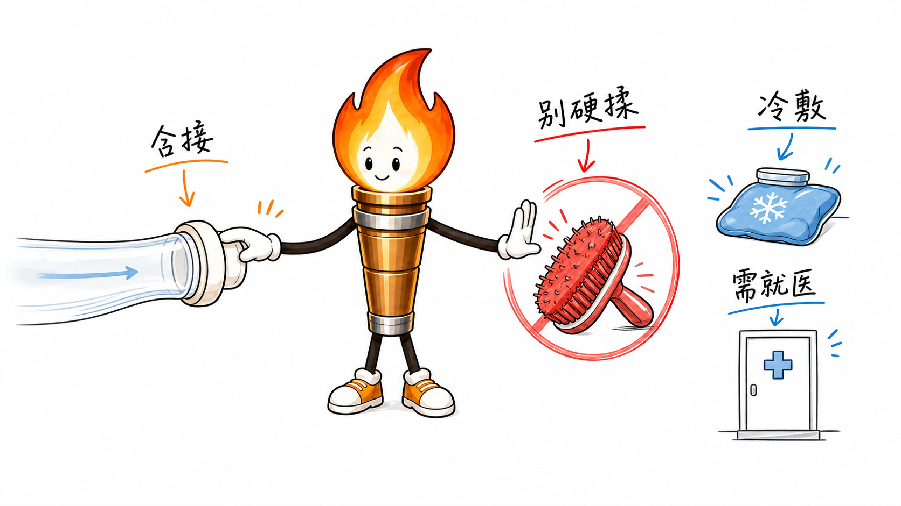

如果你有手洗衣服后手泡到褶皱的经验，有嘴唇干去舔结果皲裂的经历，大概也就理解为什么乳头会皲裂，以及知道如何保护乳头。乳头疼痛和皲裂通常发生在宝宝刚开始吃奶的阶段，疼痛有可能是因为含乳不太正确，原本该含住整个乳晕，但宝宝只含住了乳头并一直拉扯导致了乳头疼痛。

乳头皲裂是皮肤不适应导致的，我见过宝宝吸的满嘴血的情况，是新手宝妈被月嫂误导，给乳房消毒使用的清洁剂导致乳房皮肤干燥，最终导致乳头皲裂。

乳头破损与乳腺炎并非“忍一忍就会好”的小问题，它们显著增加早停母乳喂养、乳腺脓肿和产后抑郁风险。当前最佳证据支持：先纠正含接与吸奶器使用，避免深度按摩和过度排空；细菌性乳腺炎首选双氯西林或头孢氨苄 10–14 天；48 小时无改善应做乳汁培养并行超声；脓肿以超声引导穿刺/置管引流为先。

<a id="point-04-005"></a>
#### 证据框架与应用边界

| 关键建议                                                               | 主要依据                                                                                     |
| ------------------------------------------------------------------ | ---------------------------------------------------------------------------------------- |
| 乳头破损的首要处理不是“停喂”，而是立即评估并纠正含接姿势、婴儿口腔因素及吸奶器喇叭罩匹配                      | ABM #26 指出异常含接、舌系带、吸奶器误用是持续乳头痛/损伤的核心原因；2025 Meta 显示“专项干预”优于泛化护理。 (ABM, 2016；Jia 等, 2025) |
| 对**炎症性乳腺炎**，优先使用**冰敷、NSAIDs、按需排乳与生理性喂养**，避免深度按摩、过度泵奶和预防性抗生素        | ABM #36 明确“冰敷+NSAIDs+生理性哺乳”为谱系管理核心，并指出深度按摩和非选择性抗生素可能加重炎症或耐药。 (ABM, 2022)                 |
| 当出现**局灶红肿热痛合并发热/寒战，或保守处理 12–24 小时无缓解**时，应按**细菌性乳腺炎**处理并启用经验性抗生素    | ABM #36、NICE、AAFP 均支持对疑似细菌性乳腺炎进行经验治疗。 (ABM, 2022；NICE；AAFP)                              |
| **48 小时**一线治疗仍无改善、反复发作、NICU 脆弱婴儿喂养、当地 MRSA 高流行或医务人员暴露场景，应做**乳汁培养** | ABM #36 对乳汁培养的适应证给出明确建议。 (ABM, 2022)                                                     |
| 可疑**脓肿/痈样团块/波动感**时，首选**乳腺超声**；一旦证实脓肿，治疗核心是**引流+培养**而非单纯延长口服药       | ABM #36、ABM #30 均将超声列为首选影像；脓肿需引流控制感染源。 (ABM, 2022；ABM, 2019)                             |
| **持续单侧湿疹样改变、血性分泌物、固定肿块、橘皮样改变或反复同一部位乳腺炎**，必须排除 Paget 病、炎性乳腺癌和其他肿瘤   | ABM #26、ABM #30 与 Mayo/ACR 相关资料均强调该鉴别诊断。 (ABM, 2016；ABM, 2019；Mayo, 2025)                |

过去很多儿科医生见到新生儿舌系带短就直接剪了，避免影响母乳喂养，如今已经被证明这些顺带的手术基本都是没有必要的，而且有感染等风险。因为前面的证据确信舌系带确实是造成乳头破损的原因之一，我必须要很严肃的告知父母哪些情况可能需要手术，但请父母们一定谨记，概率并不高于您中奖500万，不要乳头疼痛就琢磨宝宝的舌系带，尽量忘了它的存在。
**有明确的舌头功能受限**：（舌头能不能完成吃奶动作）能不能伸过下牙龈/下唇，能不能上抬贴近上腭，能不能包裹乳房，能不能维持密封吸吮。有些宝宝舌尖被牵拉成心形、舌头前伸困难、上抬困难，才需要手术。比如一个出生 5–7 天的新生儿：
妈妈两侧乳头严重裂口，每次哺乳剧痛；宝宝含接总是很浅，吃奶时有明显咔哒声，容易滑脱；喂完后乳头呈压扁的“口红头”；宝宝吃奶 40–60 分钟仍频繁找奶，尿量偏少，体重下降接近或超过警戒线，或者后续体重增长不理想。有经验的母乳顾问已经现场调整过抱姿、深含接、乳房支撑、必要时用挤奶补充，但宝宝仍无法有效转奶。检查时发现“经典舌系带”：抬舌时舌系带清楚可见，并明显限制舌头上抬/前伸。


<a id="point-04-006"></a>
#### 定义与流行病学

**乳头破损**是指哺乳或吸奶相关的乳头—乳晕复合体表皮或浅层组织损伤，常表现为红斑、压痕、水疱、裂隙、糜烂、渗血或黄痂；它既可独立存在，也可成为乳汁淤积、细菌入侵和乳腺炎的上游事件。ABM 将超过 2 周仍持续存在的哺乳相关乳头/乳房疼痛归入“持续性疼痛”范畴，强调需要同时评估母婴双方，而不是仅把问题归于“乳头娇嫩”。 

乳头相关症状在产后早期非常常见，但**“常见”不等于“正常到无需处理”**。2014 年澳大利亚前瞻性研究显示，出院前 79% 的产妇报告乳头痛，8 周内 58% 报告过乳头损伤，至 8 周时仍有 8% 存在损伤、20% 仍有疼痛；2016 年一项产后 30 天研究报告乳头皲裂患病率为 32%；2023 年综述指出，产后首周乳头损伤大约影响 29%–76% 的哺乳者。乳头痛与早期停止母乳喂养密切相关。 

**哺乳期乳腺炎**是发生在泌乳期乳房的炎症性疾病，可有或无感染。WHO 在定义上强调其本质是“炎症”，不等同于所有病例都是细菌感染；ABM 2022 则进一步提出“乳腺炎谱系”，覆盖乳管狭窄/乳汁淤积、炎症性乳腺炎、细菌性乳腺炎、脓肿、痈样炎性肿块和感染性乳汁潴留囊肿等连续阶段。 

流行病学上，乳腺炎的发生率受病例定义、采样方式和就诊行为影响很大。2020 年系统综述估计，在产后 26 周内，约**四分之一**的母乳喂养女性至少经历一次乳腺炎；但基于行政数据库的台湾研究显示，产后 6 个月以医疗索赔计的发生比例约为 1.19%，提示**“自报症状—临床诊断—行政编码”之间存在明显差距**。多项研究共同指出，高峰发生期多在**产后最初 4 周至 3 个月**。 

<a id="point-04-007"></a>
#### 病因与危险因素

乳头破损与乳腺炎的病因不宜被简化为“奶没排空”或“着凉”。更准确的理解是：**机械损伤、炎症、微生态失衡、真正细菌感染、皮肤病和母婴解剖/功能不匹配**常常交织发生。ABM #26 和 #36 都强调，错误把所有疼痛都归因于“真菌感染”或“堵奶”，会带来漏诊与过度治疗。 

**机械性因素**是最常见上游诱因。核心包括浅含接、吸吮方向不良、婴儿颌部夹持、口腔结构异常、吸奶器喇叭罩过大或过小、吸力过高、单次泵奶时间过长、频繁额外排空导致过度泌乳，以及不必要的乳盾使用。2016 年 ABM 指出，美国一项调查中 14.6% 的母亲报告过泵奶相关损伤；2025 年喇叭罩研究进一步提示，喇叭罩尺寸应个体化试配，而不是按随机经验选择。 

**感染性因素**可分为细菌、病毒和争议较大的“真菌性”病因。细菌性乳腺炎最常见的病原体仍是金黄色葡萄球菌及耐药株，也应考虑凝固酶阴性葡萄球菌和少见耐药菌；当乳头已有裂隙、脓痂、黄色渗出时，浅表细菌感染更要警惕。病毒方面，HSV 或带状疱疹可累及乳头，表现为簇集性疱疹或沿皮节分布的疱疹样损害。真菌方面，ABM 2016 认为 Candida 关联“仍有争议”，2021 年综述更明确提出：大量所谓“乳头/乳管鹅口疮”可能被过度诊断和过度治疗。 

**皮肤病变**是被低估的类别。湿疹、刺激性接触性皮炎、过敏性接触性皮炎、银屑病、乳头白泡以及 Paget 病都可能表现为红、痒、灼痛、脱屑、糜烂或渗液。ABM 明确把羊毛脂、局部抗生素、香精、维生素 A/E 制剂等列为常见接触性过敏原之一，因此“乱抹药膏”本身就可能让乳头更糟。

**母体因素**包括乳量过多、肿胀、反复乳管阻塞、既往乳腺炎史、乳头裂口、乳腺手术史、雷诺现象/血管痉挛倾向、慢性疼痛综合征、抑郁焦虑，以及近期母婴应用抗生素或抗真菌药后导致的微生态改变。ABM 还提示，过度泵奶可维持“高供给—肿胀—疼痛—再泵奶”的恶性循环。 

**婴儿因素**应系统检查，包括舌系带短、腭形态异常、低口腔肌张力、早产导致的吸吮协调差、吞咽困难、反流/呛咳、鼻塞、出牙期咬乳，以及个体吸吮力异常。ABM 强调只看母亲、不看婴儿，是持续乳头损伤诊疗失败的重要原因。 

<a id="point-04-008"></a>
##### 病因与对应预防措施

| 病因类别                   | 典型线索                         | 可操作预防措施                                            |
| ---------------------- | ---------------------------- | -------------------------------------------------- |
| 机械性：浅含接、体位不佳           | 喂奶开始即刺痛，乳头喂后变扁/楔形、压痕明显       | 返岗前学习深含接；每次喂后观察乳头形态；疼痛持续即请泌乳顾问现场观察一次喂养             |
| 吸奶器误用：喇叭罩不合适、吸力过高、时长过久 | 泵后乳头充血、水肿、摩擦痛或乳晕被过度卷入        | 先测量乳头直径再试配喇叭罩；以“有效排乳而非最大吸力”为目标；单次一般 15–20 分钟内评估结束点 |
| 细菌感染                   | 裂隙伴黄痂、渗液、局部蜂窝织炎，或乳腺局灶红肿热痛伴发热 | 及时处理裂口；避免深按硬揉；48 小时无改善送培养                          |
| 真菌样疼痛                  | 亮粉色、脱屑、烧灼痛，但体征常不典型           | 不凭“烧灼痛”就长期抗真菌；先排除含接、皮炎、血管痉挛与细菌失衡                   |
| 病毒：HSV/带状疱疹            | 簇集小疱、剧痛、单侧为主或沿皮节分布           | 立即就医；患侧暂停直接喂及患侧乳汁喂养直到病灶愈合                          |
| 皮肤病：湿疹/接触性皮炎/银屑病       | 瘙痒、脱屑、渗液、边界清楚或长期反复           | 避免香精、刺激性清洁剂与不明药膏；按皮肤病管理而非一味抗感染                     |
| 母体高供给/反复堵塞             | 奶涨、漏奶、反复硬结                   | 减少“额外排空”，仅按需喂或表达至舒适；不要把“完全排空”作为每日目标                |
| 婴儿口腔解剖或功能异常            | 舌系带短、咬乳、松口频繁、含接浅             | 评估舌系带与口腔功能；必要时转介处理                                 |
| 药物/系统性疾病               | 雷诺现象、慢性疼痛、过敏体质、近期抗生素史        | 问诊要包含既往病史和用药史；对血管痉挛、皮炎、慢性痛分别处理                     |

<a id="point-04-009"></a>
#### 临床表现、分级与诊断流程

乳头破损的临床表现可从**红、痛、压痕、水疱**进展到**裂隙、渗血、黄痂、难以含接**。严格说，目前缺乏被普遍采用的统一分级金标准，ABM 也指出标准化疼痛评估不足；因此临床上更实用的做法，是同时记录**疼痛强度、损伤深度、受累面积、是否伴渗液/感染**以及是否影响有效喂养。 

乳腺炎更适合按**谱系分级**理解：  
轻者为乳管狭窄/局部淤积，表现为限局性胀痛或条索样硬结；  
进展为炎症性乳腺炎时，可见局部楔形红斑、肿胀、疼痛和低热；  
再进展为细菌性乳腺炎时，常有更明显红热痛、乏力、寒战、发热；  
若形成痈样炎性团块或脓肿，则出现边界较清的肿块、波动感或症状反复。约 3%–11% 的急性乳腺炎会发展为脓肿。 

鉴别诊断应覆盖三个层面。第一，**非感染性疼痛**：如血管痉挛、乳头白泡、过度供乳、阻塞、神经性痛/触痛异常。第二，**皮肤病与局灶性感染**：湿疹、过敏、银屑病、浅表脓疱病。第三，**肿瘤性疾病**：持续单侧湿疹样改变要排除 Paget 病；反复同一象限乳腺炎、橘皮样皮肤、乳房回缩或治疗后不缓解时要警惕炎性乳腺癌。 

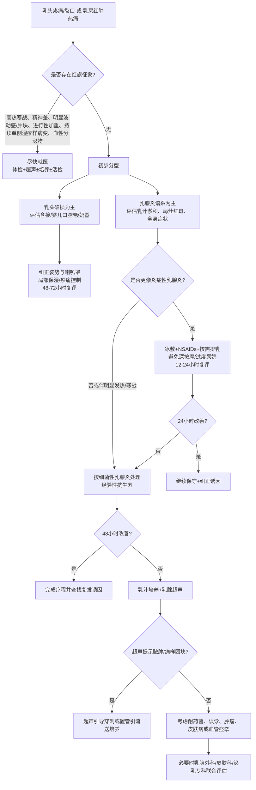
```mermaid
flowchart TD
A[乳头疼痛/裂口 或 乳房红肿热痛] --> B{是否存在红旗征象?}
B -->|高热寒战、精神差、明显波动感/肿块、进行性加重、持续单侧湿疹样病变、血性分泌物| C[尽快就医\n体检+超声±培养±活检]
B -->|无| D[初步分型]
D --> E[乳头破损为主\n评估含接/婴儿口腔/吸奶器]
D --> F[乳腺炎谱系为主\n评估乳汁淤积、局灶红斑、全身症状]
E --> G[纠正姿势与喇叭罩\n局部保湿/疼痛控制\n48-72小时复评]
F --> H{是否更像炎症性乳腺炎?}
H -->|是| I[冰敷+NSAIDs+按需排乳\n避免深按摩/过度泵奶\n12-24小时复评]
H -->|否或伴明显发热/寒战| J[按细菌性乳腺炎处理\n经验性抗生素]
J --> K{48小时改善?}
I --> L{24小时改善?}
K -->|是| M[完成疗程并查找复发诱因]
K -->|否| N[乳汁培养+乳腺超声]
L -->|是| O[继续保守+纠正诱因]
L -->|否| J
N --> P{超声提示脓肿/痈样团块?}
P -->|是| Q[超声引导穿刺或置管引流\n送培养]
P -->|否| R[考虑耐药菌、误诊、肿瘤、皮肤病或血管痉挛]
R --> S[必要时乳腺外科/皮肤科/泌乳专科联合评估]
```

上图为综合 ABM #26、#30、#36 和 Mayo/NICE 证据整理的临床路径，适合门诊与职业返岗场景的初筛与分流。 

<a id="point-04-010"></a>
#### 影像、实验室与治疗策略

哺乳期乳腺炎的诊断首先是**临床诊断**，并不依赖常规化验。ABM 2022 明确指出，CRP 和白细胞计数在区分“炎症”与“细菌感染”方面作用有限，因为它们都是非特异性炎症指标。真正决定检查升级的是**病程、严重度、复发性和对治疗的反应**。 

影像方面，**哺乳期首选乳腺超声**。当超声可疑、与触诊不一致，或怀疑恶性病变时，再加做乳腺 X 线摄影/数字乳腺断层摄影；ABM #30 和 ACR 还指出，哺乳期进行影像和穿刺活检总体是安全的，不能因为担心“奶漏”就回避对可疑肿块的活检。对持续疼痛但找不到原因、持续血性分泌物、单侧固定肿块或反复同一部位乳腺炎，影像和必要活检都应前移。

治疗原则上，**乳头破损与乳腺炎都应先纠正诱因，再决定是否进入药物或手术层级**。乳头破损的首选方案仍是机械性纠正：深含接、优化体位、婴儿口腔评估、吸奶器重配和减压性局部护理。对单纯裂口，2025 年系统综述提示各种“保湿型处理”总体可能优于单纯风干或只擦母乳，但产品间差异很大，且总证据质量仍不高；因此临床更可取的做法是：**在纠正力学创伤的前提下，选择单一、成分简单、低刺激的保湿保护措施**，同时警惕羊毛脂过敏和部分高湿敷料的浸渍风险。 

对乳腺炎，ABM 2022 强调很多病例首先是**炎症性而非感染性**。此时首选保守措施是冰敷、NSAIDs、按需哺乳/手挤乳、避免深度按摩和“拼命排空”。“吊喂”“电动按摩器猛揉”“一有硬块就高频加泵”都缺乏证据，且可能加重水肿、微血管损伤和痈样改变。抗生素应**保留给细菌性乳腺炎**，而不是对所有肿胀发热一上来就使用。 

<a id="point-04-011"></a>
##### 不同治疗方案的证据对比

| 方案                  | 主要适应证                        | 疗效结论                         | 常见不良反应/风险                 | 推荐定位     |
| ------------------- | ---------------------------- | ---------------------------- | ------------------------- | -------- |
| 含接矫正、婴儿口腔评估、吸奶器重配   | 乳头疼痛/裂口一线；反复乳腺炎上游干预          | 能直接减少持续机械创伤；专项干预整体优于泛化护理     | 需要专业观察和随访，依从性受支持系统影响      | **首选**   |
| 冰敷 + NSAIDs + 生理性排乳 | 炎症性乳腺炎、乳房肿胀、疼痛明显但暂无脓肿        | 可减轻水肿与疼痛；部分炎症性乳腺炎可无需抗生素缓解    | 热敷可能舒适但过热可加重充血；过度排空会维持高供给 | **首选**   |
| 保湿/水凝胶/羊毛脂等局部护理     | 乳头裂隙、摩擦痛、糜烂                  | 总体可能优于单纯风干或仅擦母乳，但研究异质性大、证据不稳 | 过敏性皮炎、局部浸渍；部分旧型水凝胶报道感染风险  | 替代或辅助    |
| 经验性口服抗生素            | 细菌性乳腺炎                       | 可缩短病程并减少并发症；需结合当地耐药谱         | 胃肠反应、皮疹、婴儿肠道菌群受扰          | **首选**   |
| 抗真菌治疗               | 仅限支持 Candida 的临床场景，且需排除更常见原因 | 真菌病因高度争议，不宜经验性长期用药           | 氟康唑相互作用、QT 风险；误治导致延误真正病因  | 非常选择性    |
| 超声引导穿刺/置管引流         | 脓肿、感染性乳汁潴留囊肿                 | 比单纯切开引流更微创，恢复更快、疼痛更少的证据在增加   | 可能需多次穿刺；置管护理要求更高          | **脓肿首选** |
| 切开引流                | 大脓肿、复杂多房脓肿或穿刺失败              | 有效，但创伤更大，可能影响哺乳体验            | 疼痛、瘢痕、换药负担大               | 替代方案     |

<a id="point-04-012"></a>
##### 常用抗生素在哺乳期的安全性对**住院与静脉治疗**，ABM 2022 的核心意见不是“重症就一定上静脉药”，而是：**只有出现严重脓毒症表现、不能耐受口服药/液体，或已知多重耐药菌风险时**，才需要住院并按培养或本地抗菌谱个体化升级治疗；如需住院，应尽量母婴同室并维持按需哺乳。

| 药物                                    | 常用剂量与疗程                                               | 适用场景                     | 哺乳期安全性               | 主要不良反应/禁忌                                  |
| ------------------------------------- | ----------------------------------------------------- | ------------------------ | -------------------- | ------------------------------------------ |
| **双氯西林 dicloxacillin**                | **500 mg，口服，每日 4 次，10–14 天**                          | 非 MRSA 风险、典型细菌性乳腺炎       | 乳汁浓度很低，通常可继续哺乳       | 母体胃肠不适、皮疹；青霉素过敏禁用                          |
| **头孢氨苄 cephalexin**                   | **500 mg，口服，每日 4 次，10–14 天**                          | 一线替代；需兼顾部分革兰阴性杆菌时更方便     | 乳汁水平低，可继续哺乳          | 婴儿偶见稀便/鹅口疮样改变；头孢过敏者慎用                      |
| **克林霉素 clindamycin**                  | **300 mg，口服，每日 4 次，10–14 天**                          | 头孢/青霉素过敏，或考虑 MRSA        | 一般不必停母乳，但更倾向监测婴儿肠道反应 | 婴儿腹泻、念珠菌、极少见血便；母体腹泻/C. difficile 风险        |
| **复方新诺明 TMP-SMX DS**                  | **160/800 mg，口服，每日 2 次，10–14 天**                      | MRSA 风险或二线替代             | 对健康足月儿、过了新生儿期通常可接受   | **G6PD 缺乏婴儿禁用**；黄疸、早产、病重婴儿及生后 \\\<30 天慎/避免 |
| **阿莫西林/克拉维酸 amoxicillin-clavulanate** | **875/125 mg，每日 2 次**，或 **500/125 mg，每日 3 次，10–14 天** | NICE/AAFP 作为二线或部分混合菌覆盖替代 | 总体可接受，可继续哺乳          | 婴儿更易出现腹泻、烦躁或皮疹；青霉素过敏禁用                     |

<a id="point-04-013"></a>
#### 并发症、预后与争议

乳头破损与乳腺炎最直接的并发症是**哺乳中断、奶量下降、疼痛记忆和乳房脓肿**。ABM 指出脓肿是细菌性乳腺炎或痈样炎性团块进一步进展的结果；持续炎症、错误按摩和延误治疗会增加这一风险。对形成脓肿者，若及时引流并继续建立排乳通路，多数仍能维持部分或全部母乳喂养。

心理层面的后果同样重要。ABM 2016 已提示乳头/乳房痛与产后抑郁相关；2023 年中国横断面研究进一步发现，哺乳期乳腺炎与产后抑郁风险升高相关。这意味着临床上不能把“乳房问题”仅当成局部疾病，而应把睡眠剥夺、疼痛、羞耻和失败感一并纳入评估。 

当前最值得警惕的临床争议有三类。其一，**Candida 过度诊断**：仅凭烧灼痛和“奶阵像针扎”就长期抗真菌，证据并不牢靠。其二，**是否所有乳腺炎都需抗生素**：ABM 2022 已明显转向“先识别炎症性/细菌性分层处理”。其三，**按摩与排空强度**：过去流行的“硬块越硬越要揉开、越痛越要抽空”并无高质量证据支持，反而可能造成更多组织损伤。 

总体预后通常良好，但前提是**早识别、早纠因、早复评**。若病灶反复出现在同一位置，或伴持续异常分泌物、皮肤橘皮样改变、固定肿块、体重下降或治疗后迟迟不消退，应把“良性炎症”退出默认诊断路径，及早排除炎性乳腺癌、Paget 病、肉芽肿性乳腺炎和其他实体病变。 

<a id="point-04-014"></a>
#### 哺乳妈妈的预防与自我管理 SOP

<a id="point-04-015"></a>
##### 乳头破损的急救处理

出现乳头裂口、渗血或剧痛时，**第一步不是停喂，而是减小继续受伤的机械力**。具体做法是：先用疼痛较轻一侧启动喂养或先短暂手挤几毫升让奶阵启动；随后重新调整深含接；若直接喂确实过痛，可短期以手挤乳或低吸力泵奶替代，但要同时纠正喇叭罩和吸力，防止把“替代喂养”变成新的创伤源。对裂口可薄涂单一成分保湿剂或使用简单敷料保护，避免多种药膏叠加。若裂口伴黄痂、渗液或明显局部发热，应考虑浅表细菌感染。

<a id="point-04-016"></a>
##### 乳腺炎的早期识别与家庭处理

职场妈妈最实用的自检标准是：**同一象限出现持续压痛/硬结 + 局灶红斑或楔形红区 + 乏力/发热感**。一旦出现，先停止“加班式排空”和深揉，改为冰敷、布洛芬等 NSAIDs、正常频率哺乳/手挤至舒适，不追求把乳房“抽空见底”。ABM 2022 还特别提醒，病中如果能让婴儿直接含乳，往往比继续高频泵奶更生理；乳汁本身通常可以继续给孩子。 

<a id="point-04-017"></a>
##### 何时必须就医

以下情况不宜继续居家观察：一是寒战、高热、明显全身不适；二是 12–24 小时保守处理不见缓解，或 48 小时抗生素后仍无改善；三是摸到波动感肿块、症状先缓解后又反跳；四是单侧乳头湿疹样破溃超过 3 周、血性分泌物、乳房回缩、橘皮样皮肤或持续固定肿块；五是婴儿为早产儿、病弱儿或 NICU 婴儿，母亲有反复乳腺炎史。 

<a id="point-04-018"></a>
##### 吸奶器使用、清洁与消毒

返岗泵奶的目标是**模拟婴儿正常吃奶的频率与量**，而不是“多抽多存”。每次泵前洗手，检查管路是否清洁、是否有霉点；泵后尽快拆分奶瓶和接触乳汁部件，在**单独清洁盆**中用温热肥皂水清洗，不建议直接在水槽里洗；冲净后自然风干。CDC 建议接触喂养的部件至少每日消毒一次，可选洗碗机热烘、沸水 5 分钟或蒸汽消毒。 

<a id="point-04-019"></a>
##### 休息、营养与心理支持

对患有乳腺炎的妈妈，最重要的生活方式处方不是“拼命喝汤催奶”，而是**减少额外刺激、保证液体摄入、分段休息和任务减负**。若疼痛持续、影响睡眠、出现明显失败感或哭泣易激惹，应主动筛查产后抑郁/焦虑。疼痛与抑郁相互放大，越早识别越能防止恶性循环。

<a id="point-04-020"></a>
##### 乳头凹陷

乳头凹陷会造成一些女性的自卑感，但因为乳房是一个隐私器官，很多女性并未想过处置它。哺乳或许是一次纠正乳头凹陷的时机，而且绝大部分的凹陷乳头可以通过长时间的拉伸复位。
建议在孕早期就购买一个乳头内陷矫正器，硅胶材质，就像一个果冻大小，利用拔罐的真空原理，贴附在乳头上按压硅胶外壳，排除空气后就可以把乳头吸起来，坚持每晚睡前矫正。如果对拉伸定型感觉不舒服，还有一种电子变频矫正器，理论上会更舒服一点。大部分女性都是单乳头内陷，把注射器的前段磨平，自己吸起来定型的方式也是可以的。

如果哺乳时乳头仍是内陷的，其实也不影响宝宝含乳，宝宝吮吸不是叼着乳头，而是含住整个乳晕，只要多耐心陪伴宝宝，一旦吮吸开始，宝宝还您一个漂亮的乳头就只是时间问题了。

---

<a id="point-04-021"></a>
### 科学做月子

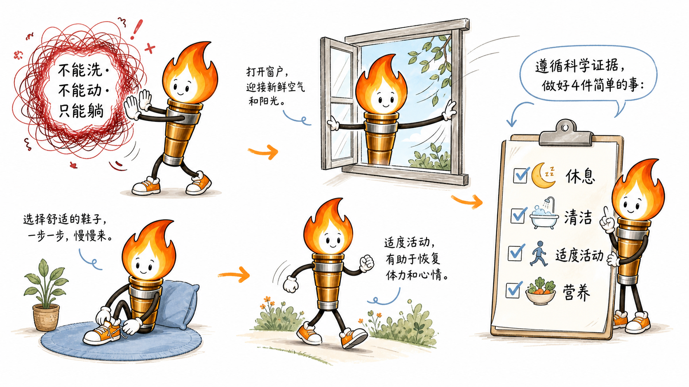

怀胎10 月生下宝宝后放下一切专心照顾宝宝，人类是哺乳动物中独有的一份，没有恐惧，免于风吹日晒，不必忍饥挨饿。但我们的月子文化伴随着争议，今天我们聊一下哪些应该保留，哪些是糟粕。

<a id="point-04-022"></a>
#### 坐月子是一种文化，而非科学

在传统中国社会里，家庭不是现代意义上的小家庭，而是父系宗族的一环。女人出嫁后离开娘家，进入夫家，成为夫家的一名媳妇。她和这个宗族没有血缘关系，身份天然尴尬：既是外来者，又是劳动者；既要服侍公婆，又要接受长辈考验。但生了孩子，尤其是男孩，意味着为夫家延续了香火，这在过去是整个宗族的大事。月子正是母凭子贵的仪式：一个没有血缘的外来媳妇，变成日后家族的话事人。

坐月子一面是保护。基于古代中医浅薄的认知，产妇刚生完，身体虚、毛孔开、气血亏，风寒容易进入身体，落下“月子病”。2007年关于中国坐月子习俗的研究就提到，传统观念认为产妇应该整个月躺在床上，借此恢复并避免未来疾病，尤其是避免风寒。

另一面是规训。怎么做月子往往由婆婆、长辈和习俗决定。吃什么，不能吃什么；刷牙、洗头、洗澡、下床都被纳入家庭秩序之中。这其中肯定有善意，例如过去是农耕社会，女性不仅要生孩子，还要做饭、洗衣、挑水、喂猪、下地、带大孩子。产后出血、会阴损伤、感染、贫血、体力透支都很常见。要求产妇“躺着休息”，某种程度上是在告诉家庭：这个女人刚刚经历了生死关口，这一个月不能让她干活，所以，“卧床”最早可能有一个合理内核：让产妇休息，免于劳动。

综上所述，月子是一种文化，而非科学。中医仅用一个“风寒”就困住了产妇手脚，不能碰冷水、不能吹风、不能洗头、不能洗澡，甚至不能下地，要卧床休息。古人不知道产后血液处于更容易凝固的状态，也不知道长期不动会增加下肢血栓风险。说实话古时候血栓可能真不是个事，在70年代末、80年代初的中国乡村地区，人们只有在大的节日才吃得上一顿肉，那个时候农村乳腺癌的发病率为零，而如今每八个女人就有一个最终会罹患乳腺癌。

<a id="point-04-023"></a>
#### 科学坐月子，应对接西方42天产褥期

说西方不坐月子，人家叫产褥期，不论是产假、照护的法规、政策都远比我们更扎实。说西方没有月饼，同样馅料的糕点人家琳琅满目。你叫中医，他叫草药医学，印度叫阿育吠陀，希腊和阿拉伯叫尤那尼医学，南非的穆替医学、西非的依发医学，哪一个都比我们历史悠久。这些依靠经验和本能的传统医学，不能说治疗方法一摸一样，只能说理论如出一辙，都是天人合一，道法自然。

经验这东西很唬人，但终究是不科学。例如传统的月子是30天，但全球现代医学的统一标准是产后 42 天进行复查，这个时间点完全取决于产妇身体的生理复原时间（医学上称为“产褥期”）。怀孕期间，子宫的体积会被撑大到孕前的数十倍，重量从 50 克左右增加到 1000 克左右。分娩后，子宫需要通过不断的收缩来恢复到孕前的大小。这个“缩回去”的生理过程，临床上需要大约 6 周（6 × 7 = 42 天）的时间才能彻底完成。胎盘娩出后，子宫内膜会留下一个巨大的创面。这个创面的修复、恶露的彻底排净，以及顺产侧切伤口或剖宫产腹部切口的深层组织愈合，都需要大约 6 周的时间。孕期女性的心血管系统（血容量大幅增加）、内分泌系统、甚至骨盆的韧带肌肉都发生了巨大改变。分娩后，这些系统需要大约 42 天才能基本恢复到“非孕状态”。既然医学都定义了产后恢复需要42天，月子也应该顺应科学改为42天。

你有没有发现42 背后有个神奇数字7。健康女性的平均月经周期是 28 天，这正好是 4 个7天（周、星期）。现代医学规定，孕期从女性“最后一次月经的第一天”开始计算。一个完整的妊娠期平均为 280 天。在医学上，这被划分为 10 个“妊娠月”（每个妊娠月严格按 28 天计算，即 4 周）。280 天除以 7 刚好是 40 周。这种算法消除了公历历法中大月（31天）、小月（30天）和平闰年带来的天数误差。胎儿在子宫内的发育日新月异。如果用“月”作单位，时间跨度太大，难以描述胎儿微小的变化（例如胎心、神经管的发育）；如果用“天”作单位，日常沟通又过于繁琐。以“周”为单位，刚好能精准卡住胎儿发育的关键节点和各项产检（如 12 周 NT 检查，24 周大排畸）的最佳窗口期。

<a id="point-04-024"></a>
#### 月子病 - 现代社会的庸人自扰

有一个段子，说 70年代的可口可乐遇到了困扰，媒体疯狂炒作可口可乐不健康，股东会上苹果的董事说，既然公众认为水才健康，那么我们就卖水。结果被疯狂嘲笑。而可口可乐真的推出了瓶装水，并且配上了恐吓营销的广告，自来水只是用来清洁和洗漱的。这只是一个讲恐吓营销的段子，但类似占领心智的恐吓营销在我们身边比比皆是，月子病就算是中医风寒最成功的案例。

古人的医学认知极为有限。《肘后备急方》给屠呦呦提供了发现青蒿素的重要灵感，但翻开《肘后备急方·治寒热诸疟方》会发现，同一个篇章里，既有“青蒿一握，以水二升渍，绞取汁”的宝贵线索，也混杂着大量今天看来毫无医学依据的巫术、厌胜和危险用药。比如，有方子让人把蜘蛛塞进芦管，再把芦管系在脖子上，等疟疾发作时间过去再解下来；有方子要求病人日出时向东方拜太阳，闭气跪拜，用墨注入两耳，再用朱砂（富含重金属汞）在舌头上写字；还有方子让人把一颗大豆破开，一半写“日”，一半写“月”，左右手各持一片，然后吞下去。甚至还有“抱雄鸡，让它大叫即可治疟”的说法，以及写“鬼”字、念咒语、把“疟鬼”送给河官的做法。这才是传统医学最真实的样子，不是什么“古人智慧”，而是经验、观察、误判、巫术和偶然有效的线索混杂在一起。迷信中医者无知，全面否定中医者自负，要像屠呦呦一样，借由现代科学和古人经验，走出一条中国特色的捷径。

回到坐月子本身，我们细数月子里的规矩：月子里不能洗头、洗澡，会受风落下头痛、月子病；必须捂月子，门窗紧闭、穿厚棉袄盖厚被子，不能开空调；月子不能下床，躺满 30 天才恢复；不能吃蔬菜、水果，寒凉伤胃、宝宝拉肚子；月子不能刷牙，一刷牙牙齿全松动脱落；必须天天喝浓油鸡汤、猪蹄汤才能下奶；不能看手机、看书，会伤眼、落下眼痛；月子不能哭，哭了以后眼睛会瞎、常年流泪；月子不能出门、不能见风，出门必留病根；月子里不能吃盐，完全无盐饮食；喝米酒、酒酿、黄酒下奶，补气血。

很多月子禁忌，并不是毫无来由的迷信。它们往往来自旧时代真实的生活困难：没有热水器，没有吹风机，没有空调，没有抗生素，没有现代产科，没有营养学，也没有母乳喂养科学。古人看见产妇洗头后头痛，就以为是洗头伤身；看见产后牙龈出血，就以为是刷牙伤牙；这些禁忌最初可能是为了保护产妇，但口口相传时不知所以然，最后把“提醒”变成了“恐吓”，把“经验”变成了“规训”，把“照护”变成了“控制”。今天我来拆解不是否定老祖宗，而是不要再以讹传讹下去，回归到科学坐月子，科学育儿本身。

<a id="point-04-025"></a>
#### 风寒捆住了产妇的手脚

旧时代生活条件导致的“防寒经验”，不能洗头、洗澡，会受风头痛；必须捂月子，门窗紧闭，不能开空调；不能出门、不能见风。是因为古代没有热水器、浴霸、吹风机、空调、干净浴室，也没有抗生素。产妇刚分娩后出汗多、体力差、免疫和伤口恢复都需要时间，如果在寒冷、潮湿、通风差的环境里洗澡，又不能及时擦干、保暖，确实容易受凉，也可能增加感染风险。而今天这些都已经不存在了，产后清洁反而有助于减少感染、异味和不适。产后有缝合伤口的应该每天用温水洗浴伤口并轻轻擦干，涂点碘伏以帮助预防感染。科学上不建议每天给宝宝洗澡，但脐带没有脱落要每天涂抹碘伏，现在我们颠倒过来，大人一身脏兮兮不洗澡，小宝宝偏要每天洗，这是不对的。

产妇刚生完孩子，身体确实像经历了一场大消耗，需要休息、营养和温暖的环境。但“保暖”不是“捂汗”，更不是让体温升高。产后如果发热，尤其体温达到38℃或以上，反而要警惕感染等问题。正确的做法，是让产妇感觉温暖、舒适、不被冷风直吹，避免忽冷忽热，而不是把门窗关死，把人捂在闷热的房间里。

新生儿也一样，不能用老人的体感去判断宝宝冷不冷。宝宝体温调节能力还不成熟，既怕冷，也怕热；但在很多家庭里，更常见的问题不是冻着，而是被捂热。宝宝睡觉时，房间保持在20℃左右到22℃左右，或者让大人穿轻薄衣服也觉得舒适、不闷热，通常就比较合适。判断宝宝冷热，也不要只摸手脚，手脚偏凉是正常的，应该摸后颈和背部：温热、干爽，说明比较合适；如果出汗、后背发烫、脸红，就可能是穿盖太多了。

所以，空调不是月子里的敌人，风扇也不是问题本身。真正要避免的是冷风直接对着产妇和宝宝吹，尤其是整晚固定吹身体。房间可以开空调，可以通风，但风口不要直吹人；温度不要忽高忽低；产妇的肩颈、腰腹、膝盖注意保暖；宝宝少捂一层、勤观察状态。坐月子不是回到没有空调的年代，而是用更科学的方法照顾母婴：产妇要暖，新生儿要凉爽，房间要舒适，空气要流通。保暖不是捂，降温不是吹。真正好的月子环境，是大人舒服，宝宝不热，全家都能睡得安稳。

多说一句，有些人会纳闷，为什么女人不吸烟，却同样是肺癌的高发人群，这背后有饮食的原因，动物性蛋白质是癌细胞生长的核心营养。但还有一个很隐蔽的杀手——氡气。氡是一种无色、无味、看不见的放射性气体，再环保的房屋也避免不了氡气聚集，长期暴露会增加肺癌风险，经常通风是解决氡气致癌最简单、有效的方法。所以，坐月子也要经常给房间通风换气。

<a id="point-04-026"></a>
#### 修养绝非卧床不动

把“产后需要休息”误解成“长期卧床不动”。农耕社会里，产妇很可能刚生完就要做饭、洗衣、挑水、带孩子、下地干活。要求她“卧床休息”，某种意义上是在替她争取免于劳动的权利。古时候这可能真不是事。70年代末、80年代初在中国农村做的《中国健康调查》显示，那会儿中国农村只有逢年过节才能吃上一顿肉，调查地区的乳腺癌发病率为零，今天中国每八个女性，就会有一个女性患上乳腺癌，因此各地都在开展免费的乳癌筛查。但比乳癌更恐怖的是心脑血管疾病，死亡率是两癌的20倍。今天的产妇再卧床，血栓就真找上门了，正确的做法是产后感觉可以时就开始轻柔运动，比如走路、轻柔拉伸和盆底肌训练。英国王妃产后都在运动，咱们躺那装金贵，其实暴露的是国人缺乏基本的生理认知和独立思考的能力。

<a id="point-04-027"></a>
#### 中医毁在无知的中医师手上

古人既没有七大营养素的概念，也没有生理学的基础常识，例如中医把脾视为消化器官，而脾是人体最大的淋巴器官，和消化没有半毛钱关系。因为不知道肠道菌群的存在，于是就用“寒、热、补、泄”来解释身体感受。蔬菜水果含水多、富含水溶性膳食纤维，人吃完不仅会促进肠道蠕动，有些还会胀气，于是被归为“寒凉”。但现代营养学看，产后更容易便秘、痔疮、肠蠕动变慢，蔬菜、水果、全谷物和水分反而很重要。NHS明确建议产后为了避免便秘，应吃足新鲜水果、蔬菜、沙拉、全谷物和全麦面包，并喝足水。权威医学杂志《柳叶刀》的研究也警告国人预防早逝，要多吃水果、蔬菜，减少红肉等动物性食物。我们常说越是无知的人越犟，无知的中医师就是谣言的坚定制造者，打着中医的旗号，毁掉中医的祖业。

无盐月子餐并不健康，这背后的原理我用一款减肥产品给您拆解。有一种数字命名的素食全餐，主要成分是100多种种子磨成的粉末，申请的商品品类是粥。它的减肥原理就藏在产品的配料表里，这是一款无盐餐。用 35克富含蛋白、脂肪和膳食纤维的种子代餐替代正餐，确实会造成巨大的热量缺口，这是减肥的第一步。冲泡的形态让种子中的膳食纤维富含水分，给人更强的饱腹感。无盐餐迫使细胞释放钠来完成新陈代谢，钠从细胞稀释出来时要把平衡的水分一同带出来，就造成体重的减轻。这就是素食全餐快速减重的原理，制造热量缺口、增加饱腹感，排出身体的水分，这套快速减肥方案最先减掉的4-5公斤体重主要是食物残渣和水。无盐月子餐可以让人快速减重，但脂肪会更紧实，难以下咽的食物可能会造成产妇厌食，导致短暂的营养不良。学过《生命最初1000天》就知道这可不是什么好事。

<a id="point-04-028"></a>
##### 母乳谣言：浓油鸡汤、猪蹄汤

传统观念认为浓白色的汤汁是“营养精华”，能帮助“下奶”。这在现代营养科学中是完全站不住脚的。“浓白”的本质是乳化脂肪，是因为肉类和骨头中的脂肪在持续沸腾中被游离出来的蛋白质包裹，形成了乳化脂肪微粒。汤里的核心成分其实是大量的饱和脂肪、胆固醇和嘌呤，而产妇真正需要的是蛋白质、铁和钙等营养依然残留在肉里。产妇摄入这种高饱和脂肪的汤水会导致乳汁中的脂肪含量骤增，使得乳汁变得粘稠。在产后最初一两周，乳腺导管尚未完全通畅、宝宝吸吮能力还有待提升时，这极易引发乳腺导管堵塞（堵奶），进而发展为痛苦的急性乳腺炎。这是导致许多母亲提早放弃纯母乳喂养的直接生理诱因。而且高脂饮食会加重消化系统负担，而高浓度的嘌呤则会增加高尿酸血症的风险，同时过剩的热量也会转化为脂肪囤积，不利于身体状态的恢复。

<a id="point-04-029"></a>
##### 母乳谣言：米酒、酒酿、黄酒补气血
用甜酒酿鸡蛋汤“活血化瘀”、“催乳”，从医学和儿科学的角度来看，哺乳期摄入任何形式的酒精都是百害而无一利的。酒精会抑制产妇大脑垂体分泌催产素，催产素是引发“奶阵”的关键激素，其水平下降会导致乳汁排出困难。酒精能自由穿透血乳屏障，母乳中的酒精浓度与母亲血液中的酒精浓度几乎同步。对于婴儿来说，酒精没有任何“安全暴露剂量”。即便是微量酒精通过母乳进入婴儿体内，也会扰乱婴儿的神经系统和睡眠节律（尤其是减少对其大脑发育至关重要的快速动眼期 REM 睡眠），导致婴儿异常清醒、烦躁不安。长期暴露更会对婴儿的运动神经和认知发育造成隐蔽的、不可逆的损害。

所谓的“产后气血亏虚”，在现代医学中通常对应的是分娩失血导致的缺铁性贫血，以及巨大体力消耗和激素剧烈波动带来的疲惫。
科学的应对方案是多食用富含铁的食物（如深色绿叶蔬菜、豆类、全谷物，或瘦肉），并搭配富含维生素 C 的果蔬以最大化铁的吸收率。多吃营养密度高、抗炎的全天然食物，获取身体组织修复所需的植物营养素、复合碳水和膳食纤维，才是产后恢复活力的科学基石。

<a id="point-04-030"></a>
#### 不刷牙的产妇建议查一下智商

古人常说“受了风寒”或“着凉了”，并将其视为感冒、发烧、咳嗽甚至重症的直接原因，实际上真正的幕后黑手都是微生物（病毒和细菌）。在中医经典（如张仲景的《伤寒论》）中，“伤寒”是一个非常宽泛的概念，字面意思是“受到寒冷的伤害”，涵盖了各种急性发热性疾病。如今我们知道，这些疾病都有对应的细菌感染。如伤寒沙门氏菌、斑疹伤寒立克次体等。古代的伤寒就是一种通过受污染的食物和水传播的肠道传染病（常伴有持续高热和神志不清）。在古代，由于缺乏对微生物和卫生条件的认知，这种由细菌引发的剧烈发热疾病，往往被统统归类为广义的“风寒邪气”所致。

洗头、洗澡会着凉是一个物理现象，人从水中出来，身体表面还有一层水珠，水蒸发时会吸收带走身体的热量，我们的身体一旦失温，大脑的下丘脑会立刻下达指令：保卫核心体温！ 为了防止热量通过血液循环散失到外界，身体会本能地收缩体表和末梢（包括鼻腔、咽喉黏膜）的毛细血管。血管收缩，流经鼻腔黏膜的血液量就会急剧减少，部署在呼吸道前线的免疫防御力量被瞬间削弱，病毒就能在毫无阻拦的情况下长驱直入。普通感冒的主要元凶“鼻病毒”，最适宜的繁殖温度就是 33℃左右。在正常体温（37℃）它们繁殖缓慢甚至会自爆；但当冷空气将你的鼻腔温度降到 33℃ 时，鼻腔就成了鼻病毒完美的大本营，它们会以指数级速度复制。

一个月不洗头、不洗澡可以忍，问题是如今吃的都是精加工的食物，长时间不刷牙真的能吃的下饭吗？刷牙是保持口腔卫生非常重要的手段，不刷牙很容易龋齿、口臭、牙龈出血、口腔溃疡。孕产阶段受激素影响，孕产妇很容易牙龈出血。古时候也没有软毛刷，都是猪鬃做牙刷，我估计刷牙不仅会牙龈出血，而且可能会疼。而古人的食物都是粗粮，所以一段时间不刷牙也问题不大。如果长辈告诉你刷牙会导致牙齿脱落，就这种鬼话你都能信，是不是应该去测试一下智商，别耽误孩子的人生。
---

<a id="point-04-031"></a>
### 孕产期的营养
 
<a id="point-04-032"></a>
#### 科学补铁：告别隐性饥饿

养育宝宝是一场马拉松，对妈妈们的身心都是极大的考验。在日复一日的忙碌中，我们常常忽略了自身的健康，也可能在无意中让宝宝错失了成长的关键。今天，让我们深入探讨一个看似寻常却至关重要的话题——补铁。这不仅关乎我们自身的健康，更是宝宝未来智力发育、身体强健的基石。

一、缺铁：被忽视的“隐性饥饿之首”

你是否经常感到疲惫、头晕，指甲变脆，头发干燥甚至脱发？或者稍一运动就心慌气短、手脚冰凉？如果这些症状与你相符，那么你很可能已经加入了“隐性饥饿”的大军，而缺铁，正是三大隐性饥饿之首。

铁是人体必需的微量元素，存在于我们身体的每一个细胞中。它最重要的功能是作为红细胞（血红蛋白）的核心，将氧气从肺部运送到身体的每一个角落。当铁储存不足，无法生成足够的健康红细胞时，就会出现缺铁性贫血。

缺铁是全球性的公共卫生问题，尤其影响儿童、妇女和青少年。对妈妈们而言，生理期是造成铁流失的重要原因。而在中国，婴幼儿的缺铁问题也相当普遍。根据一份来自西部12省的数据，6-12个月的儿童缺铁中位数高达50.09%，这意味着近一半的宝宝面临缺铁风险。这背后真正的症结，往往在于不当的喂养方式，例如过早地用辅食替代母乳，而非作为补充。

二、铁的来源与吸收：破除传统迷思

食物中的铁主要分为血红素铁和非血红素铁。血红素铁主要来自肉类、禽类和鱼类；植物性食物、全谷物、豆类、坚果种子、绿叶蔬菜，以及鸡蛋中的铁，主要属于非血红素铁。许多宣传会强调植物性铁吸收率较低，这句话本身没有错，但如果只强调“难吸收”，却不告诉公众非血红素铁才是大多数人日常铁摄入的主要来源，就容易造成误导。即便在吃肉的人群中，血红素铁通常也只占总铁摄入的一小部分，85%–90%的铁仍然来自非血红素铁。著名的流行病学研究《中国健康调查》：80年代的中国农村男性每日摄入约34毫克铁（几乎不吃动物性食物），远高于美国男性的18毫克。想提高铁的吸收率只需与富含维生素C的食物同餐，同时，与富含钙的食物（如牛奶）错开一小时，餐后一小时则避免浓茶、咖啡等抑制铁吸收的因素。

肉类、禽类和鱼类的血红素铁吸收率高，但也有代价，与钠和饱和脂肪一样，过量的血红素铁与引起炎症、增加胰岛素抵抗、甚至癌症、中风和心脏病风险有关。补错了铁也是要付出健康代价的。

三、婴幼儿补铁：警惕营销陷阱与过度干预
宝宝的铁需求至关重要，但如何补充却充满了争议和误区。

陷阱一：强化铁米粉是第一口辅食的最佳选择？

这是2014年前后，进口米粉行业为了销量而精心策划的“骗局”。让我们来剖析事实：
1、没有充分证据表明，强化铁米粉能有效降低婴幼儿缺铁性贫血的发生率。
2、多项研究显示，肉泥在提高宝宝铁吸收和维持肠道菌群健康方面，优于婴儿米粉。
3、大米的生物特性喜欢富集重金属，尤其是对婴幼儿神经系统有毒性的无机砷。美国《消费者报告》的研究指出，婴儿米粉在儿童无机砷暴露总量中占比高达55%。相比之下，小米、玉米、燕麦、藜麦、土豆、南瓜等是更安全的主食选择。
4、中国宝宝正在过量食用婴儿米粉，可能影响宝宝口味偏好，增加未来肥胖风险。

陷阱二：铁剂和强化食品是安全的？
无论是口服铁补充剂，还是强化铁的配方奶和米粉，其添加的都是游离铁。这种非自然形式的铁存在潜在风险：
胃肠道副作用：可能引起恶心、呕吐、便秘等不适，导致依从性差。
破坏肠道菌群：研究表明，铁补充剂会将婴儿肠道微生物组从有益模式转变为更具致病性的模式。病原菌对铁的需求似乎比有益菌更高，补充的游离铁可能反而“喂养”了坏细菌。
增加氧化应激和感染风险：对于铁充足的婴儿，额外补铁会增加肠道氧化应激，在感染高发地区甚至可能加剧细菌感染的风险。动物研究也提示，铁过量与学习记忆受损有关。

四、科学的婴幼儿补铁策略：回归天然与个体化
世界卫生组织（WHO）、美国儿科学会（AAP）和国际母乳会（LLLI）的核心共识是：6月龄后应通过富含铁的辅食来预防贫血，并反对1岁前喂食普通牛奶。
然而，在具体操作上存在差异，这恰恰揭示了补铁需要个体化考量：
AAP的普遍预防策略：建议纯母乳喂养的婴儿从4月龄起预防性补铁。这主要基于美国婴儿储铁普遍在6月龄前耗尽的背景，是一种“一刀切”的防范策略。
WHO与LLLI的精准干预策略：立场更为谨慎。他们强调，足月健康的婴儿在半岁前通常无需额外补铁，母乳中虽铁量少但吸收率极高且生理上最适宜。只有当社区婴幼儿贫血率超过40%，才推荐作为公共卫生政策进行每日补铁。他们认识到，对低风险人群补铁可能弊大于利。

给父母的实用建议：
母亲健康前提：贫血的孕妇应在孕期和哺乳期积极通过天然食物补铁。
第一口辅食：忘掉容易便秘的米粉！豆类（如扁豆）、深绿色蔬菜泥是极佳的富铁选择。例如，将蒸熟的扁豆压成泥，与富含维C和天然甜味的香蕉泥混合，就是一道完美的补铁辅食。
有争议的红枣：红枣能补铁和红枣不能补铁都属于超级食物叙事，属于营养噪音。干红枣 2.3 mg/100克，牛肉 2.7 mg /100克，虽然通过红枣泡水补铁不现实，但否定红枣能补铁就是刻意误导。使用动物肝脏给婴幼儿补铁，反而导致铁中毒的案例是存在的，铁是微量元素，前面的中国健康调查已经证实，只要多吃深色绿叶蔬菜和豆类，就不存在缺铁的问题。那么煮花生红枣米饭是不是可以弥补大米几乎不含铁的短板，而非血红素铁永远不会铁中毒。
科学的忠告：铁是微量元素，身体需求不高，且在没有失血或炎症的情况下，铁的循环利用率很高，不易流失。如今的食物并不匮乏，但婴幼儿贫血发生率却很高，这背后真正的问题父母被架上了资本的辅食陷阱，没有让孩子好好吃饭。

<a id="point-04-033"></a>
#### 锌 —— 铁的竞争对手

锌对免疫功能和细胞生长至关重要，参与味觉和嗅觉。
帮助血液凝结 ，蛋白质和DNA的生成，促进伤口愈合，支持免疫系统的正常功能，在骨骼的形成与维护中发挥关键作用，对皮肤、头发和指甲的健康也至关重要。

WHO、AAP和LLLI的立场一致，不主张对健康婴幼儿常规补锌药物，而是通过食补。锌不足可能引发皮肤病、免疫力下降和体重减轻。
通过植物性饮食可以获取足够的锌，然而，需要注意的是，谷物和大米中含有的植酸盐会阻碍锌的吸收，为了提高锌的吸收效率，可以通过现代加工技术来减少植酸盐的抑制作用。这些技术包括：浸泡、加热、发芽、发酵以及使用酵母。
一种食物同时含有铁和锌两种元素，食补时并不影响身体吸收，但如果是通过补充剂，尤其是在空腹的情况下，铁和锌会出现互斥现象，其实就是有一方抢占了金属离子转运蛋白 DMT1，另一方就失去了赶往需求的巴士。因此在服用补充剂时，应该错开补充剂的服用时间，对于市面上的钙铁锌补充剂，我只想，父母应该从小就教导孩子好好吃饭，想想自己是怎么活过来的。

<a id="point-04-034"></a>
#### 碘 —— 健康的基石

碘是一种必需的微量矿物质，对我们身体的正常运作至关重要。它主要用于合成甲状腺激素，而甲状腺激素负责调节新陈代谢、体温、神经和肌肉功能、生殖以及生长发育，碘缺乏被认为是可能导致泌乳不足的母体因素之一。婴儿自身碘储备有限，主要通过母乳和富含碘的辅食来获取，碘是大脑发育和生长的必需元素。如果婴儿缺乏碘，可能会导致智力发育障碍和甲状腺肿大。婴儿辅食中的碘应该来自食材，而非碘盐，因为婴儿的食物中不应该出现盐，因此，碘更依赖母乳。

海藻、海带、紫菜、裙带菜、红皮藻（dulse），这些植物性食物是碘的极佳来源。
哺乳期及婴幼儿不建议食用羊栖菜，虽然其富含碘，但可能含有重金属砷。每周少量多次地摄入富含碘的海藻类食物，而不是偶尔一次性大量摄入，这样能更有效地控制总摄入量。世界卫生组织（WHO）、美国儿科学会（AAP）以及国际母乳会（LLLI）都支持使用碘盐。AAP建议孕妇和哺乳期妈妈服用含碘的维生素。

碘摄入不足或过量都可能对健康造成危害。
哺乳期妈妈的推荐摄入量：膳食参考摄入量（DRI）为 290微克（µg）。可耐受的上限摄入量（Tolerable Upper Limit）为：14-18岁为900微克（µg），19岁及以上为1,100微克（µg）。研究表明，全球范围内，碘缺乏是一个普遍存在的问题，包括一些挪威的哺乳期女性母乳中的碘浓度且母体碘摄入不足。这再次强调了哺乳期母亲确保充足碘摄入的重要性。

甲状腺功能异常

颈部蝴蝶形的甲状腺分泌 T₄ 和 T₃ 两种激素，决定全身细胞燃烧能量的快慢；垂体分泌的 TSH 像油门，指挥甲状腺加速或减速。当激素分泌不足时，就出现“甲状腺功能减退症（甲减）”；分泌过多时，就是“甲状腺功能亢进症（甲亢）”。

甲状腺功能减退症：发动机“怠速”。桥本甲状腺炎（自身免疫）最常见病因，碘摄入过少／过多，特定药物（胺碘酮、锂盐等），垂体损伤导致 TSH 分泌不足（次发性甲减）也都会导致甲减。

甲减的典型表现有怕冷、乏力、体重增加、皮肤干燥或浮肿、便秘、反应变慢、情绪低落，女性可月经紊乱或不孕。

甲状腺功能亢进症：发动机“超转”。Graves 病（70–80%，自身免疫，吸烟加重）是最常见的病因。毒性结节或腺瘤、亚急性甲状腺炎早期、过量外源性甲状腺激素等也是主要的诱因。

甲亢表现为怕热、多汗、心悸、手抖、体重下降、焦虑失眠；Graves 病患者可出现突眼。女性常月经减少甚至闭经。

快速分辨甲减与甲亢。代谢方面甲减“踩刹车”、甲亢“踩油门”。体重方面甲减多增重、甲亢常减重。心率与情绪上甲减脉慢、易疲惫、甲亢心悸、情绪亢奋。

常见误区
“吃海带能治甲减” → 海藻只是碘来源，对自身免疫性甲减无治疗效果。
“补药或蜂蜜能治甲亢” → 甲亢需正规药物、放碘或手术治疗。
“抗甲状腺药必须终身服用” → 多数 Graves 患者经 1–1.5 年规范治疗可停药缓解。
“体检 TSH 略异常无需理会” → 持续异常或合并症人群须警惕亚临床甲状腺病变。

<a id="point-04-035"></a>
#### 维生素A —— 中国父母的智商税

维生素A是维持视力的关键，还对免疫系统的正常运作和上皮组织（如皮肤和黏膜）的健康发挥着不可或缺的作用。缺乏维生素A会增加宝宝感染的风险，严重时甚至可能导致夜盲症和生长发育迟缓。

在宝宝生命的早期，母乳（尤其是初乳）是维生素A的重要来源。但随着宝宝的成长，特别是进入6月龄后，他们需要从多样化的食物中获取额外的维生素A。

植物性食物：维生素A的宝库
人体可以高效地将β-胡萝卜素转化为维生素A。β-胡萝卜素是一种强大的抗氧化剂，只存在于植物性食物中。这意味着，通过摄入富含β-胡萝卜素的植物性食物，我们不仅能获得身体所需的维生素A，还能受益于β-胡萝卜素带来的其他健康益处。
重点推荐的富含β-胡萝卜素的植物性食物包括：
深黄色/橙色/红色蔬菜和水果： 南瓜、红薯、胡萝卜、哈密瓜、芒果、杏、红辣椒等。这些食物不仅颜色鲜艳，而且β-胡萝卜素含量丰富，是宝宝辅食的绝佳选择。
深绿色叶菜： 菠菜、羽衣甘蓝、西兰花等。虽然颜色不是橙黄色，但这些蔬菜同样含有丰富的β-胡萝卜素。
通过均衡饮食，特别是多吃这些色彩丰富的蔬菜和水果，能够安全、有效地满足宝宝的维生素A需求，同时还能摄入其他重要的维生素、矿物质和膳食纤维。

食补优于补充剂
世界卫生组织（WHO）、美国儿科学会（AAP）和国际母乳会（LLLI）在维生素A营养方面有基本共识：辅食应富含维生素A食物。各方都建议在婴儿辅食中经常加入深黄色/橙红色蔬果。通过天然食物来满足维生素A需求是首选方式，既安全又能提供其他协同营养素。

不常规补充维生素A制剂： 除非有明确的维生素A缺乏诊断，AAP和LLLI均不主张给婴幼儿额外服用维生素A药剂或保健品，以避免过量中毒的风险。WHO在6个月以内强烈不推荐维生素A。

<a id="point-04-036"></a>
##### 为什么也不推荐β-胡萝卜素补充剂？
你可能会想，既然β-胡萝卜素这么好，直接吃补充剂不是更方便吗？然而，有研究发现，服用β-胡萝卜素补充剂反而与肺癌发病率的增加有关，这与从食物中摄入β-胡萝卜素能降低肺癌发病率的结果截然相反。健康的营养是一个复杂的生化系统，涉及数千种化学物质及其对健康的数千种影响。孤立的营养素作为补充剂无法替代完整的食物，它们无法带来持久的健康，甚至可能产生意想不到的副作用。

每日摄取多少食物可以满足维生素A都需求？
根据世界卫生组织（WHO）和各国卫生机构（例如中国居民膳食营养素参考摄入量DRIs）建议：6个月婴儿每日维生素A建议摄入量：约300～400微克RAE。
每100克南瓜提供约516微克RAE，人体将β-胡萝卜素转化为维生素A（视黄醇当量）转化效率 6 : 1，3100微克 β-胡萝卜素÷ 6 ≈ 516.7 微克视黄醇当量 (RAE)，因此，每日约70克南瓜即可满足6个月宝宝一天所需维生素A（视黄醇当量）。
胡萝卜素不会导致维生素A中毒，但长期大量食用富含胡萝卜素的食物可能引起宝宝皮肤变黄（胡萝卜素血症），是因为色素是由肝脏代谢，但儿童的肝脏代谢还不够强大。素宝宝皮肤偏黄是可逆的，且对健康并无危害。

<a id="point-04-037"></a>
#### 钙与维生素 D：骨骼与整体健康的关键
钙和维生素 D 对骨骼和牙齿健康至关重要，并在神经、肌肉和心脏功能中发挥重要作用。

维生素 D：阳光是最佳来源

维生素 D 实际上是一种由皮肤在阳光照射下产生的激素，而非真正的维生素。它与饮食的关系不大，因为大多数维生素 D 是通过阳光照射下皮肤产生的。

阳光是维生素 D 的最佳来源：
人体可以利用自身的血清胆固醇在阳光下制造维生素 D，这也有助于降低胆固醇水平。适量的阳光照射对皮肤有益，有助于调节昼夜节律，改善情绪和睡眠。通常，没有涂抹防晒霜的成人每天晒太阳15分钟就足够了，你甚至都不需要刻意，只需要人在户外。

影响维生素 D 水平的因素：
地理位置：生活在赤道以北或以南37度以上地区的人群，在冬季可能无法通过阳光合成足够的维生素 D。
肤色：皮肤较黑的人需要更长时间的日照才能产生足够的维生素 D。
其他因素：癌症、怀孕或肥胖等都会增加维生素 D 缺乏的风险。

医院和食品强化都是使用维生素D2，没有过量风险。市场销售的主要是动物性的D3。富含维生素 D2的主要食物有香菇，香菇同时也富含维生素B12，因此，素食者建议多食用香菇。野生菌类容易富含重金属，但香菇都是使用锯末人工养殖很安全。

维生素 D 缺乏的普遍性与影响：
维生素 D 缺乏普遍存在。它对免疫功能至关重要，被认为是某些自身免疫性疾病发生的一个重要因素。低维生素 D 水平还与肥胖、抑郁、心脏问题和某些癌症风险增加有关，并可能导致抗磷脂抗体及其他自身免疫性抗体风险增加。此外，较低的维生素 D 水平与较高的多发性硬化症（MS）风险相关，且MS患者体内的维生素 D 水平越低，病情复发的风险就越高。

关于维生素 D 补充的指南与建议：
母乳喂养婴儿：AAP认为，由于现代育儿方式避免阳光直射，母乳喂养婴儿需要额外补充维生素 D 约400 IU/天，以有效预防佝偻病。意思是纯母乳喂养的妈妈如果总是躲在室内，建议给小宝宝每天喂400 IU。虽然小朋友皮肤较嫩，一旦可以爬了，还是建议多晒太阳，晒太阳的益处远不止补钙。

WHO（世界卫生组织）作为国际组织，其指南语气略显谨慎。LLLI（国际母乳会）赞同补充维生素 D，并强调这是由于“生活方式改变”而非“母乳本身缺陷”。

孕妇如果需要补充，每天1,000-2,000 IU就足够了。1岁以上的儿童和成人：如果需要，每天可以服用 600 IU的维生素 D 补充剂。尽管使用补充剂较为普遍，但目前没有研究真正表明服用维生素 D 补充剂有助于解决上述所有健康问题。对于慢性疾病来说，服用营养补充剂并不能带来同样的益处。但研究普遍认为对于缺乏者服用补充剂是有益的。

身体可以储存维生素 D，前提是制造的维生素 D 多于消耗的。充足的维生素 D 是自我保健的核心领域之一。

<a id="point-04-038"></a>
#### 钙：多样的健康来源

钙对骨骼健康至关重要，三方（WHO、AAP、LLLI）一致认为不需要给健康的婴儿额外补充钙片。

钙的良好来源：
牛奶、酸奶、奶酪（尽管存在争议，但仍是常见来源）
强化橙汁、强化谷物、强化植物奶
羽衣甘蓝、毛豆、秋葵
豆腐、杏仁、豆豉、深绿色蔬菜、豆类

乳制品与钙的争议：
尽管许多人将钙与乳制品联系起来，但不吃乳制品并不意味着钙摄入不足。
研究表明，乳制品对成人骨骼强度的益处可能并不像人们认为的那么大。乳制品消费量最高的国家，往往髋部骨折的风险也更高。

潜在健康风险：
高乳制品摄入量可能与某些癌症（如前列腺癌和子宫内膜癌）的风险增加有关。
乳制品中的镁含量很少，而镁是吸收钙所必需的。没有镁的帮助，身体只能吸收乳制品钙含量的25%。
牛奶中含有胰岛素样生长因子1 (IGF-1)，其含量是母乳的6倍，能够促进肿瘤生长，并可能导致儿童身高快速增长，而过快增长不一定是好事。
乳制品中还可能累积杀虫剂、重金属和其他脂溶性毒素。
乳制品可能会加剧炎症反应，因其钠和饱和脂肪含量较高，与引起炎症和增加患胰岛素抵抗的风险有关。
乳糖不耐症在许多非北欧裔人群中普遍存在，可能引发腹痛、腹胀、胀气和腹泻等问题。乳制品被认为是导致胰岛素抵抗和某些自身免疫性疾病的原因之一，可能通过“分子模拟”理论攻击胰腺细胞或神经髓鞘。

美国农业政策与公共卫生之间存在脱节，政府政策偏向玉米和大豆等作物用于饲养动物，而非种植更多的新鲜农产品供人食用。乳制品行业通过政府强制性计划推广乳制品，导致高糖、高脂肪、高盐的乳制品被大量消费，这与联邦政府的饮食指南相冲突。

植物性钙来源：
人类同样可以通过直接食用植物性食物或补充剂获得钙，而无需依赖乳制品。富含钙的植物性来源包括：豆腐和豆豉、深绿色蔬菜、豆类、杏仁、强化植物奶

促进钙吸收的关键营养素：
骨骼健康所需的营养素以复杂的方式相互协作：
钾：可以减少钙的流失，提高骨骼的生成速度。橙子、香蕉、土豆以及许多其他水果、蔬菜和豆类都富含钾。
镁：有助于增加骨密度。富含镁的食物有糙米、深绿色蔬菜、豆类、坚果、种子和全谷物。
维生素 C：是合成胶原蛋白的必需营养素，胶原蛋白是连接骨骼结缔组织的蛋白质。柑橘类水果、辣椒、西红柿以及其他水果和蔬菜都是维生素 C 的优质来源。
维生素 K：可以促进骨骼的形成。深色绿叶蔬菜、豆类和全豆制品（如毛豆和豆腐）等富含钙的食物也富含维生素 K。

特殊人群和补充剂：
无论是否食用乳制品，某些人群可能因医疗需求而需要额外补钙，这些需求可以通过天然富含钙的食物、强化食品或钙补充剂来满足。例如：ADHD 患者普遍缺乏多种矿物质，包括钙。低FODMAPs饮食可能导致铁、维生素 D、短链脂肪酸和总热量的缺乏，也可能导致钙的缺乏。

钙与维生素 D 的协同作用
钙和维生素 D 在骨骼健康中都扮演着重要角色。充足的钙摄入、适当摄入维生素 D，并进行规律的负重运动，是建立最大骨密度和骨骼强度的重要手段。这些营养素，连同镁、维生素 C 和 K，共同协作，对骨骼健康至关重要。
---
延伸阅读：晒太阳补钙，其实很简单

很多妈妈听过“多晒太阳能补钙”，但关键并不在于把宝宝暴露在强烈阳光下，而是让皮肤接收到足够的紫外线 B（UV-B）。UV-B 能促使皮肤合成维生素 D，维生素 D 再把饮食中的钙搬运进骨骼。只要掌握正确的时段、暴露面积与时长，宝宝就能既安全又高效地获得“天然维 D”。

 一、为什么一定要晒？
钙就像盖房子的砖块，维生素 D 是搬砖的工人。没有维 D，再多的钙也难以被骨头利用。合成维 D 需要 UV-B，而 UV-B 只有在太阳高度角足够大时才充足；玻璃、防晒衣和 SPF ≥ 8 的防晒霜几乎会把它全部挡住。因此，晒对时间和部位远比晒多久更重要。

 二、用“影子”判断黄金时机
出门前不必查复杂的数据，只要低头看看影子：当影子长度不超过身高两倍时，UV-B 基本达标；影子越短，UV-B 越强。通常上午十点到下午三点之间最容易出现这种情况，冬季或高纬度地区则要更靠近正午。若影子比身高短，就说明阳光强度很高，最好缩短暴露时间以免晒伤；若影子拉长到两倍以上，则几乎没有合成维 D 的价值，换个时间再晒更有效。

三、四步到位的安全日晒法
第一步：选时段。先确认 UV 指数达到 3 以上（影子 ≤ 自己身高的 2 倍）。
第二步：露面积。让至少 10 % 的皮肤直接见光——最简单的组合是“脸加双上臂”，但记得脱掉防晒衣，也别隔着玻璃。带宝宝沐浴阳光可以飞机抱只晒背。
第三步：控时长。浅色皮肤的宝宝晒 5–15 分钟即可，中等肤色延长到 10–25 分钟，深色肤色（黑人）可达 20–40 分钟。每周晒三到四次就够。
第四步：晒后护理。完成目标时长后，若还要继续外出，可涂儿童防晒霜或穿防晒衣。
总结：科普是为了让父母清晰的了解，生活中常带宝宝外出根本不会缺维生素D。

 四、宝妈最常见的四个疑问

隔着窗晒有用吗？玻璃几乎挡掉所有 UV-B，效果接近零。
怕晒黑怎么办？每天晒10几分钟太阳可以激活退黑色素，还有利于睡眠，避免过度暴晒同样重要，相比防晒霜，物理防晒（遮阳伞）效果更好。
阴天能不能补维 D？云层虽削弱半数以上 UV-B，但只要影子仍在身高两倍以内，适当延长时间仍然有效。
吃维 D 补剂还要晒吗？ 口服维 D 可以兜底保证血液水平，阳光还带来调节昼夜节律、改善情绪等额外益处，只要不晒伤，能晒是福报。

五、一句话总结

牢记“看影子、露出双臂、补完VD要做好防晒”这三大要诀，宝宝就能轻松从阳光中获得充足维生素 D，把饮食里的钙牢牢锁进骨骼，健康茁壮地成长。
---

<a id="point-04-039"></a>
### 背奶指南：母乳喂养在职场的生存技巧

“背奶”是母亲携带吸奶、储奶与冷藏器具，在工作间隙完成集乳、暂存、冷链运输，并在下班后把母乳带回给婴儿继续喂养。

“背奶”的认知图谱概括为三条主链。
第一条是**供需链**：按需、规律、有效地排空乳房，才能维持泌乳；而焦虑、疼痛、羞耻、疲惫会通过影响催产素与奶阵，降低排奶效率。
第二条是**安全链**：合格容器、清洁泵件、日期标记、冷链储存、先进先出、规范解冻与温热，决定了挤出的奶能否安全进入婴儿体内。
第三条是**支持链**：上级能否接受固定吸奶时段、单位是否有私密空间、家庭能否分担夜间照护、母亲是否拥有最小而稳定的社会支持，决定了这套流程能否持续执行。换句话说，背奶从来不是“意志力”单兵作战，而是生理规律、基础设施与关系协商共同作用的结果。

<a id="point-04-040"></a>
#### 背奶的科学内涵与健康动机

从医学与公共卫生立场看，母乳喂养并不是可有可无的生活方式，而是婴儿喂养的规范性基线。世界卫生组织建议出生后前六个月纯母乳喂养，随后在添加安全、充足的辅食同时继续母乳喂养至两岁或以上；美国儿科学会则强调，母乳喂养及人乳供给具有短期与长期的医学和神经发育优势。母乳不仅提供前六个月婴儿所需的营养，而且具有独特的免疫与抗炎成分，能够降低腹泻、肺炎等常见感染风险，并与更好的神经发育结局相关。

对母亲而言，继续母乳喂养并坚持到返岗后，健康收益同样明确。CDC与AAP都指出，母乳喂养与母亲较低的乳腺癌、卵巢癌、2型糖尿病和高血压风险相关；美国卫生总署的母乳喂养行动报告还指出，母乳喂养有助于减少产后出血，并需要家庭、职场与社区的共同支持，才能真正实现。也因此，许多女性选择“背奶”，并不只是为了“舍不得断奶”，而是基于对婴儿免疫和发育价值、以及对自身长期健康收益的理性判断。

在体重与产后恢复方面，证据更适合被表述为“有帮助，但不是魔法”。一项纳入队列研究的荟萃分析发现，哺乳母亲的产后体重滞留低于瓶喂母亲；另一项较早的大样本研究提示，若妊娠增重适中并按建议持续哺乳，许多女性在产后六个月时可显著减少体重滞留，而对“严重体重滞留”的风险也可能下降。与此同时，这一效应会受到孕前BMI、妊娠增重、哺乳强度等因素影响，因此不宜把背奶宣传成“必然瘦身”。更准确的说法是：持续泌乳与规律排空，通常有利于降低过度产后体重滞留的风险。

<a id="point-04-041"></a>
#### 科学严谨的背奶SOP

适合返岗“背奶”的SOP，首先要把设备选对。对需要长期、规律集乳的职场母亲，优先级通常是**双边电动吸奶器**，因为同时吸两侧能在更短时间内获得更多乳汁，更适合全职返岗场景。使用前要检查泵组与导管是否清洁、是否有霉变；个人用手动泵和个人用电动泵都不应与他人共用。FDA还特别提醒，不要被“医院级”一词做过度营销引导，因为这个说法本身并不是一个FDA认可的法定安全等级。

储奶容器要遵循“材质安全、密封稳定、便于标记”的原则。权威建议是使用清洁、带盖的食品级玻璃容器、**不含BPA**的硬质塑料容器，或专门设计的母乳储存袋；如果需要送托育机构，还应标注挤奶日期，必要时标注婴儿姓名。泵件中凡是接触母乳的部分，应在每次使用后尽快拆开清洗；CDC明确建议使用专用清洗盆而不是直接在水槽里洗，避免水槽内病原体污染泵件。对婴儿喂养用品，CDC还建议每日进行一次额外消毒，可通过洗碗机高温程序、煮沸或蒸汽完成。

吸奶频率要围绕“尽量模拟婴儿吃奶节律”来安排。美国妇女健康办公室给出的返岗经验值是：多数女性通常每 **2到3小时** 需要吸奶一次，8小时工作段大约需要 **2到3次**；每次泵奶常常需要 **15到20分钟**，还不包括往返、组装与清洁时间。对中国职场母亲来说，这意味着背奶不是“午休顺手做一下”，而是一项必须被写进工作节奏的固定生理安排。

家用与通勤环境中的储奶时限，建议采用“**保守优先**”原则。CDC当前家庭指导是：新鲜母乳在室温 **4小时内**、冰箱 **4天内**、冷冻 **6个月最佳、12个月可接受**；若放在带冰袋的保温冷藏包里，旅行或通勤场景下可保存 **24小时**。如果工作场所和家庭冰箱开关门频繁、温度波动明显，实际SOP采用更短时限会更稳妥。无论采用哪套时限，都应执行“**先进先出**”，优先使用日期更早的奶。

解冻与加热是第二个高风险节点。CDC建议将冷冻母乳在冰箱中过夜解冻，或用温水、流动温水缓慢解冻；中国官方科普材料则更具体地建议把冷藏或已解冻母乳放在 **40–45℃** 温水中隔水加热约 **5–10分钟**，使奶温接近 **40℃左右**。这套方法的核心不是“烫热”，而是“均匀回温”。真正的安全红线只有几条：**严禁微波炉加热，严禁明火或灶台直热，严禁将已解冻母乳再次冷冻，严禁把宝宝喝剩的奶留到下一顿**。CDC还明确指出，解冻后在冰箱内应于 **24小时内** 用完，回温或放至室温后应于 **2小时内** 用完。

如果把上面的证据转成一个真正可执行的日常SOP，可以浓缩成这样一句话：**按时排空，干净收集，立刻标记，迅速冷藏，优先用旧奶，缓慢回温，不走捷径。**这套流程看似琐碎，但它正是背奶能否既持续又安全的技术底盘。

<a id="point-04-042"></a>
#### 职场困境中的空间与设施缺口

在政策文本里，中国对母婴设施的要求并不低。国家卫生健康委等十五部门印发的《母乳喂养促进行动计划（2021—2025年）》明确提出，到2025年，公共场所母婴设施配置率达到 **80%以上**，所有应配备母婴设施的用人单位基本建成标准化母婴设施；国务院《女职工劳动保护特别规定》也要求，用人单位应根据女职工需要建立哺乳室等设施。问题不在于“有没有政策”，而在于真实落地并不均衡，且目前仍缺少一个全国统一、持续更新的“实际配置率”公开数据库。

从地方标准看，合格母婴室的要求并不模糊。浙江地方标准要求母婴室应独立、私密、有水源，并配置哺乳区、盥洗区、备餐区和休憩区；哺乳区还应具备帘子、隔间等遮挡物，照明应柔和，环境应易清洁、具备导向标识。也就是说，真正合格的“背奶空间”并不只是放一把椅子和一个插座，而是一套带有隐私、卫生、洗手条件与功能分区的微型基础设施。新华社2023年的调研同时显示，地方建设进展高度分化，例如杭州公共场所母婴室已建成 **738个**、标准化率达到 **95%**；这说明国内并非完全没有成熟样板，但也恰恰说明很多城市仍未达到这种水平。

更棘手的是职场内部的基础设施。较早但影响广泛的2019年智联招聘《职场妈妈生存状况调查报告》显示，只有 **8.22%** 的公司设有母婴室。尽管这一数据并不能代表今天所有企业，但它提供了一个重要基线：企业端母婴设施长期偏少并不是个别感受，而是一个结构性短板。此后新华社等媒体持续报道的真实案例依然是：母亲在卫生间、车里、储物间、地下车库或办公桌前临时吸奶，说明“有法有标”并没有自动转化为“有房可用”。

空间问题之所以严重，不只是因为“不体面”，更因为它直接作用于泌乳生理。奶阵依赖催产素触发，而焦虑、疼痛、疲惫、尴尬和自我意识过强都可能抑制奶阵。相关资料明确指出，感到紧张、羞耻、自我暴露，尤其是在工作场所或公共空间表达乳汁时，会延迟甚至抑制排奶反射。换言之，脏乱、缺乏隐私、无法锁门、需要提防被打断的环境，不只是体验差，而是可能真的让“吸不出来”成为现实。

<a id="point-04-043"></a>
#### 时间、精力与心理负荷的双重挤压

背奶对工作节奏的扰动是可以被量化的。按照权威建议，多数返岗女性需要每 **2到3小时** 吸奶一次，8小时工时通常需要 **2到3次**，每次表达乳汁约 **15到20分钟**。如果再加上往返空间、组装、标记、清洗和收纳，一天中被切开的时间块绝不仅是一小时法律哺乳时间那么简单。这也是为什么许多高强度岗位的母亲会感到：不是她们不想坚持，而是工作流本身缺乏容纳这种生理节律的缝隙。

中国研究对此有更具体的证据。一项针对中国全职返岗哺乳女性的研究发现，影响母乳喂养持续时间的重要因素包括产假长度、教育水平、家庭收入、通勤时间 **超过1小时**、以及工作场所母乳喂养支持总分；在同一研究里，最低分的并不是同事或主管态度，而是技术与设施支持，例如**没有冰箱保存母乳、没有吸奶器、没有私密吸奶区域**。另一项覆盖 **10,408名** 中国工作母亲的混合研究则把关键工作相关因素归纳为四类：**就业福利、通勤时间、工作环境、劳动强度**。这几乎与背奶妈妈的日常抱怨一一对应。

长通勤让问题进一步放大。严格说，通勤本身并不会“直接让奶量变差”，但它会压缩吸奶窗口、增加涨奶不适、提高冷链携带负担，并迫使母亲在上下班路上承担更复杂的时间管理。结合中国研究中“**通勤超过1小时** 与更短母乳喂养持续时间有关”的结果，以及CDC关于母乳需在保冷包中尽快转入稳定冷藏或冷冻的要求，可以合理推断：当工作已经很满、通勤又很长时，背奶变得困难并不是主观脆弱，而是客观流程越来越脆弱。

心理负荷同样不是附属问题，而是背奶能否持续的核心变量。一方面，中国农村样本研究发现，母亲的焦虑和压力症状与母乳喂养自我效能显著相关；另一方面，心理痛苦又会通过影响催产素释放，进一步妨碍奶阵和排奶效率。于是，奶量焦虑会导致更难排奶，更难排奶又加重“我是不是不够奶”的焦虑，形成典型的恶性循环。

社会偏见则让这条心理链路更难被打断。中国成人网络调查显示，**接近95%** 的受访者认为公共场所应该设置哺乳室，但同时也有 **47%** 认为看见女性在公共场所哺乳会“尴尬”；研究还发现，工作场所对哺乳的公平感知与污名化体验，是支持缺失的重要预测因素。换句话说，很多人原则上支持母乳喂养，但一旦它真的占用时间、需要空间、要求隐私，就容易被重新解释成“麻烦”“影响效率”或“不够拼”。这正是背奶妈妈最典型的隐性压力来源。


<a id="point-04-044"></a>
#### 家庭内部的契约化协作

如果只给背奶母亲一句建议，那就是：不要把家庭支持交给“自觉”，而要交给“协议”。证据显示，父亲支持母乳喂养的自我效能越高，六周时纯母乳喂养的概率越高；陪伴时间越长、疲劳越低，也越有利于这种支持形成。与此同时，睡眠保护研究指出，产后睡眠碎片化是产后抑郁的重要风险因素。因此，一个真正有效的家庭协议，不应只写“爸爸多帮忙”，而应明确到任务层：例如，配偶固定承担一段夜间瓶喂与哄睡、清洗泵件、贴标签和整理冷冻库存；目标不是“让妈妈轻松一点”，而是为母亲争取一段连续睡眠和最低限度的恢复窗口。把“至少一段不中断睡眠”设为家庭KPI，远比“多理解一点妈妈”更有执行力。

祖辈支持同样需要培训，而不是默认“老人带娃更有经验”。中国研究发现，家庭主要照护者的健康与营养知识，与母亲感受到的实际哺乳支持和纯母乳喂养有关；另有农村中国研究显示，祖母群体整体上比母亲更少采用积极的婴幼儿喂养做法。再结合WHO关于**辅食应在6个月开始**的明确建议，家庭内部至少要统一三条底线：**6个月前不擅自加水、加米粉或其他固体食物；不随意拉长或缩短瓶喂频率；不把“宝宝哭了”自动等同于“母乳不够”。** 这不是和长辈“争论育儿观”，而是把家庭成员拉到同一套科学喂养脚本里。

<a id="point-04-045"></a>
##### 职场中的向上管理与边界感

返岗前最值得做的一件事，不是先买多少储奶袋，而是与直属领导进行一次正式、具体、前置的“预期管理”沟通。中国法律底线是：哺乳未满1周岁婴儿的女职工，用人单位每天应安排 **1小时哺乳时间**，不得延长劳动时间或安排夜班；但从泌乳生理看，多数母亲实际需要每 **2到3小时** 排空一次。也就是说，**法律规定的是底线，生理需求往往更高**。因此，最有效的沟通方式不是临时“请假去吸奶”，而是提前把吸奶时段写成固定日程，例如上午一次、午间一次、下午一次，每次约15–20分钟，尽量与会议和高峰任务错峰。这样做的意义在于：把背奶从“临时离岗”转成“可预期的工作安排”。

边界感还需要靠硬件具象化。基于效率和安全考虑，职场母亲更适合备一套“办公室常驻版”装备：双边电动泵或便携泵、备用阀门和法兰、标签、冷藏包和冰袋、专用清洗盆或清洁收纳袋。设备的作用不只是缩短操作时间，也是在开放办公环境中为自己建立一个清晰的物理边界：我不是在“摸鱼”，我是在做一项有卫生要求、有时间窗口的生理工作。由于个人用吸奶器不应共用，且储奶需要稳定保冷，设备准备得越完整，临时借东西、来回解释、现场找插座和找袋子的心理消耗就越少。

<a id="point-04-046"></a>
##### 轻量化互助网络的搭建方式

相比耗时的大型妈妈社群，背奶妈妈更需要的是**低维护、高命中**的微型支持网络。工作场所母乳喂养支持的系统综述指出，同事知识、共事经验、对公平性的理解、以及工作场景中的污名化感受，都会显著影响支持水平；而中国全职返岗女性研究也显示，工作场所母乳喂养支持总分越高，母乳喂养持续时间越长。基于这些证据，一个真正有用的“同楼/同园区妈妈群”不需要承担育儿讨论的全部功能，只需要解决三个问题：共享**已获允许、可上锁、有电源、有洗手条件**的备用空间信息；拼单采购冷链耗材；在某次奶量波动、漏奶、开会冲突或临时找不到空间时，提供及时情绪托底。

这种网络之所以有效，关键不在“交朋友”，而在把支持做轻。对背奶妈妈来说，最宝贵的不是被很多人看见，而是在最脆弱的十分钟里，有人告诉你哪间房现在空着、谁手上有多余冰袋、今天奶少并不等于明天也少。它是一种**精准支援**，而不是另一种需要经营的社交负担。

从整体上看，背奶最需要被纠正的误解有两个。第一，它不是“妈妈自己再努力一点”的问题，而是一套对时间、空间、冷链和支持都有明确要求的工程。第二，它也不是“要么完美坚持，要么彻底失败”的二元任务。真正科学的目标，不是制造额外道德压力，而是在可承受的现实里，尽量延长安全、稳定、可持续的人乳供给时间，并把母亲本人的睡眠、情绪和尊严也纳入同等重要的指标。只要这套目标被说清楚，背奶就不再是苦撑，而会更接近一套能执行、能协商、能被支持的职场母乳SOP。

<a id="point-04-047"></a>
#### 背奶妈妈的法定权益

背奶妈妈作为职场中的特殊群体，其权益受到多项法律法规的保护，主要涵盖以下三个方面：

1. 哺乳时间保障

《女职工劳动保护特别规定》第九条明确规定："对哺乳未满1周岁婴儿的女职工，用人单位不得延长劳动时间或者安排夜班劳动。用人单位应当在每天的劳动时间内为哺乳期女职工安排1小时哺乳时间；女职工生育多胞胎的，每多哺乳1个婴儿每天增加1小时哺乳时间。"

**哺乳时间的法律属性**：
- 哺乳时间属于正常劳动时间，用人单位应支付正常工作时间的工资
- 用人单位不得因女职工享受哺乳时间而降低工资或解除劳动合同
- 哺乳时间可协商折算为提前下班或延迟上班，但总时长不得少于法定要求

2. 哺乳设施配置权

《女职工劳动保护特别规定》第十条指出："女职工比较多的用人单位应当根据女职工的需要，建立女职工卫生室、孕妇休息室、哺乳室等设施，妥善解决女职工在生理卫生、哺乳方面的困难。"

**哺乳设施的标准要求**：
- 面积一般不低于4平方米，有条件单位应达到10平方米
- 需配备座椅、带安全扣的婴儿尿布台、便于放置哺乳用品的桌子
- 需有电源插座、带盖垃圾桶、保护哺乳私密性的可上锁门或帘子
- 不得以第三卫生间或厕所替代母婴室、育婴室等设施

3. 工作安排限制

《女职工劳动保护特别规定》第五条和第九条禁止用人单位在哺乳期内安排夜班劳动或延长工作时间。《劳动合同法》第四十二条规定，在孕期、产期、哺乳期的女职工，用人单位不得依照该法第四十条、第四十一条的规定解除劳动合同。

**工作安排的法律限制**：
- 不得安排哺乳期女职工从事国家规定的第三级体力劳动强度的劳动
- 不得延长劳动时间或安排夜班（通常指晚8点至早7点）
- 不得因女职工处于哺乳期而降低工资、予以辞退或解除劳动合同
- 劳动合同到期的，应顺延至哺乳期结束

<a id="point-04-048"></a>
#### 维权路径与实操方法

背奶妈妈在职场中面临权益侵害时，可通过以下路径维权：

1. 哺乳时间不足的维权案例

**案例分析**：2024年，湖北黄州区法院审理的"吴某诉武汉某公司劳动争议案"中，吴某在哺乳期内被公司以"迟到232次"为由解除劳动合同。法院认定，公司未将哺乳时间从考勤中剔除，直接依据考勤记录认定吴某迟到早退并解除劳动合同的行为违法，判决公司支付违法解除劳动关系经济赔偿金。

**维权方法**：
- **证据收集**：保留劳动合同、工资条、考勤记录、哺乳时间申请记录、婴儿出生证明等
- **书面沟通**：向公司提交《哺乳假申请及催告函》，明确要求安排法定哺乳时间，并附上法律依据
- **劳动仲裁**：向当地劳动争议仲裁委员会申请仲裁，主张公司未提供哺乳时间构成违法解除
- **诉讼救济**：对仲裁结果不服的，可在15日内向法院提起诉讼

**实操建议**：
- 在哺乳期开始前，向公司提交书面哺乳时间申请，明确具体时段
- 哺乳时间应计入正常工作时间，不得扣减工资或要求补班
- 如公司以"工作忙"为由拒绝，可提出灵活安排方案（如分时段使用哺乳室）
- 对考勤异常及时提出书面异议，要求重新计算

2. 哺乳室设施不足的维权案例

**案例分析**：2024年，广东韶关市检察院通过公益诉讼督促整改母婴室问题。志愿者小丽发现商场母婴室引导标识缺失、设施不齐全，通过"益心为公"检察云平台反映问题。检察院调查后向相关职能部门制发检察建议，推动商场完善母婴室设施，整改率达100%。

**维权方法**：
- **个人投诉**：向用人单位所在地劳动监察部门投诉，要求整改
- **公益诉讼**：通过"益心为公"平台反映问题，由检察院启动公益诉讼
- **媒体曝光**：通过社交媒体或新闻媒体曝光问题，施加舆论压力
- **行政举报**：向卫生健康部门举报公共场所母婴室不达标问题

**实操建议**：
- 拍照记录哺乳室缺失或不达标的现状，保存时间戳证据
- 了解当地母婴室配置标准（如广州规定六类公共场所必须建设母婴室）
- 通过12315热线或劳动监察部门投诉，要求用人单位整改
- 对拒不整改的单位，可联合其他背奶妈妈共同维权，增强影响力

3. 哺乳期工作安排冲突的维权案例

**案例分析**：2023年，天津某销售公司安排哺乳期女职工小玲夜班工作，小玲以处于哺乳期为由拒绝。公司以旷工为由解除劳动合同，小玲申请劳动仲裁并胜诉，获得违法解除劳动合同赔偿金。法院认为，用人单位在小玲哺乳期间安排夜班工作违反了法律规定，小玲拒绝不构成无故旷工。

**维权方法**：
- **拒绝执行**：明确告知公司拒绝夜班安排的法律依据
- **书面沟通**：提交《拒绝夜班工作及哺乳期权益保障申请》，要求调整工作安排
- **劳动监察投诉**：向劳动监察部门投诉公司违法安排夜班
- **劳动仲裁**：申请仲裁要求支付违法解除赔偿金或恢复劳动关系

**实操建议**：
- 提前了解公司是否有哺乳期女职工，了解其哺乳室和哺乳时间安排情况
- 返岗前与公司沟通哺乳期特殊需求，制定书面哺乳计划
- 对于需要连续工作的岗位，可要求公司提供其他便利措施（如弹性工作时间）
- 如被强制安排夜班或加班，应立即向公司提出书面异议并保留证据

<a id="point-04-049"></a>
#### 维权策略与实用工具

1. 书面沟通模板

**哺乳假申请及催告函模板**：

```
致[公司/部门名称]负责人：

根据《女职工劳动保护特别规定》第九条规定，本人于[分娩日期]生育[子女数量]名子女，现申请自[开始日期]起至哺乳期结束（[结束日期]），每日享受[1+（X-1）]小时哺乳时间（X为子女数量），具体时段为[上午/下午][具体时间区间]。

本人承诺将合理安排工作，确保不影响项目进度。哺乳时间结束后，将立即返回工作岗位继续工作。

请公司予以批准，并明确哺乳期间的工资发放标准及考勤记录方式。

申请人：[职工姓名]
部门：[部门名称]
岗位：[岗位名称]
申请日期：[申请提交日期]
```

**拒绝夜班工作及哺乳期权益保障申请模板**：

```
致[公司/部门名称]负责人：

根据《女职工劳动保护特别规定》第九条规定，本人目前处于哺乳未满1周岁婴儿的哺乳期，现正式提出拒绝夜班工作的申请。

夜班工作将严重影响本人对婴儿的哺乳安排，可能造成乳汁淤积甚至乳腺炎等健康问题。本人愿意通过调整日间工作时间或其他方式弥补因拒绝夜班而减少的工作时间。

请公司重新安排工作，确保不侵犯本人的法定哺乳权益。

申请人：[职工姓名]
部门：[部门名称]
岗位：[岗位名称]
申请日期：[申请提交日期]
```

2. 证据收集清单

背奶妈妈维权需准备以下关键证据：

| 证据类型 | 具体内容 | 收集方法 |
| ---- | ---- | ---- |
|      |      |      |

3. 投诉渠道与流程

**劳动监察投诉流程**：
1. 准备材料：劳动合同、哺乳期证明、考勤记录、工资流水、与公司沟通的记录等
2. 确定管辖部门：向用人单位所在地的县级劳动监察大队投诉
3. 提交投诉：可通过上门递交、邮寄或劳动监察部门指定的网络平台提交
4. 等待处理：劳动监察部门在5个工作日内决定是否受理，受理后60个工作日内完成调查
5. 跟进结果：投诉人可通过询问、查询等方式了解处理进度，直至问题解决

**妇联维权渠道**：
- 拨打12338妇联维权热线，获取专业咨询与法律服务
- 向当地妇联组织提交书面投诉，请求协助调解
- 参与妇联组织的女职工权益保护活动，获取更多支持

**仲裁申请流程**：
1. 准备材料：仲裁申请书、身份证明、劳动关系证明、哺乳期证明、证据材料等
2. 提交申请：向劳动合同履行地或用人单位所在地的劳动争议仲裁委员会提交申请
3. 等待受理：仲裁委员会在5日内决定是否受理
4. 参与仲裁：配合仲裁庭调查，提供证据和证言
5. 执行裁决：对仲裁结果不服的，可在15日内向法院起诉

<a id="point-04-050"></a>
#### 维权成功案例分析
1. 哺乳时间被压缩案例

**案例**：2025年，东莞某电子科技公司员工汪女士（哺乳期）被公司单方面调整客户资源，导致工资大幅下降，且不安排哺乳时间。汪女士被迫解除劳动关系，申请劳动仲裁，最终获得经济补偿金、产假工资差额、哺乳期间工资损失等共计45288元。

**维权要点**：
- 将哺乳期客户资源被调整视为变相降薪，构成违法解除
- 产假前提成工资占工资比重大的情况，可作为重要证据
- 强调国家鼓励生育政策，公司行为与政策相违背
- 仲裁请求应包括经济补偿金、工资差额等

2. 哺乳期被辞退案例

**案例**：2023年，南宁市邕宁区某用人单位以劳动合同到期为由解雇正处哺乳期的女职工，法院最终认定用人单位违法终止劳动合同，判决支付赔偿金差额87713元。

**维权要点**：
- 明确哺乳期女职工劳动合同应自动顺延至哺乳期结束
- 收集劳动合同到期证明和哺乳期证明
- 申请仲裁时明确主张违法解除赔偿金（双倍经济补偿金）
- 对仲裁结果不满的，可在15日内向法院提起诉讼

<a id="point-04-051"></a>
#### 总结与建议

背奶妈妈的权益保障是法律明确赋予的权利，也是社会文明进步的体现。面对职场中的权益侵害，背奶妈妈应：

1. **充分了解法律依据**：熟悉《女职工劳动保护特别规定》《劳动合同法》等法律法规，明确自己的法定权益

2. **提前做好权益规划**：返岗前与公司沟通哺乳期特殊需求，制定书面哺乳计划，为可能的维权做准备

3. **保留完整证据链**：对哺乳时间申请、考勤记录、工作安排等关键环节保留证据，确保维权有据可依

4. **选择合适的维权路径**：根据问题性质选择个人投诉、劳动仲裁或联合维权等方式，提高维权成功率

5. **寻求专业法律支持**：必要时可联系工会、妇联或专业律师，获取法律咨询和援助

**背奶妈妈的权益保障不仅是法律问题，更是社会责任问题**。在国家鼓励生育的背景下，用人单位应积极承担法律责任和社会责任，为背奶妈妈提供必要的支持和便利，共同营造尊重、关爱、支持女职工的职场环境。

---

---

<a id="chapter-05"></a>
## 05 母乳喂养通识


<a id="point-05-001"></a>
### ☑️母乳喂养

<a id="point-05-002"></a>
### 儿童用药安全

央视公益宣传片《无声诉说》引发全社会的广泛关注，宣传片主角浠诺（付浠诺）原本是一个活泼开朗、爱笑的小女孩，不到一岁就学会了叫爸爸妈妈，一听到音乐就会手舞足蹈。然而，在她两岁时，一场高烧改变了一切。家人先后带她去了村医务室和县医院，在用药过程中，由于缺乏儿童专用药品，医生让家属将成人药掰开给孩子服用。最终，因为用药不当，浠诺的听力受到不可逆的损伤，从此陷入了无声的世界。

据中国聋儿康复研究中心统计：因为用药不当，我国每年有约30000个儿童，陷入无声世界。造成肝肾功能、神经系统等损伤的难以计数。

家长对儿童药概念的理解模糊，是导致儿童用药不当的一个重要原因。我国现有3500多种药品制剂中，儿童专用的仅有60多种。衣食住行，我们都给孩子专属的呵护，但最需要专属的药品，我们却忽略太多。

据调查，很多家长都没有成人药和儿童药的概念，在给孩子用药时经常处于“无意识”状态，存在“习惯性”误区，比如经常将成人吃的片剂直接让孩子服用，“掰药片”“随意加量”……凭“感觉”、“经验”随意给孩子用药的现象屡见不鲜。

哪些药可能影响儿童的健康？
链霉素、卡那霉素、庆大霉素等有可能损害儿童的听神经，引起耳聋。
多黏菌素、去甲肾上腺素能引起儿童的肾脏损伤。
胃复安能引起一些儿童的脑损伤。
四环素、氟哌酸等药物能影响幼儿牙齿、骨骼的发育。
感冒通能引起儿童血尿；滴鼻净(萘甲唑啉)能引起儿童中毒等。

家长给孩子用药最容易犯的13个错误：

1、果汁服药或喂药加糖
用果汁送服药物，或吃药后立即喝果汁或吃水果，果酸会中和碱性药物，或使药物提前分解，降低药效。
喂药加糖可能会抑制某些药物的药效，干扰矿物质和维生素在肠道的消化吸收。再者，糖能与某些中药中的蛋白质、鞣酸等成分起化学反应，产生有害物质。

2、强行灌药或静睡喂药
用筷子撑开嘴巴，或捏着鼻子，在儿童的哭闹声中强行灌药，易使药物呛入气管，轻则引起呼吸道肺部发炎，重则堵塞呼吸道而造成窒息危险。
儿童的神经系统尚未发育完善，受外来刺激时适应性调整能力差。如果趁其睡眠时喂药，药液突然刺激舌、喉等部位的神经，可反射引起喉部痉挛。

3、剥去溶衣
外包溶衣的药物一般对胃有刺激或易被胃液分解破坏，如剥去溶衣或压碎服用，易产生不良反应。

4、给儿童服用成人药
有的家长会给儿童服用自己服过觉得有效的药物，并按成人剂量减半，他们认为只要剂量减半就不会有问题。
其实，按成人剂量减半给儿童用药是不科学的，也是很危险的。比如治腹泻时用诺氟沙星胶囊(氟哌酸)，此药对儿童肾脏有损伤；又如成人复方新诺明片，儿童长期服用会严重毒害其肾脏，还可诱发贫血症等。
所以，不能自己给宝宝随意服用成人药物，即使减少剂量也不行。有些药物确实没有儿童专用的剂型，这时候应该让医生来判断能不能给孩子用。

5、保健品当糖果吃
不少家长怕孩子缺维生素或微量元素而选择给儿童服保健品。为了在口味上吸引儿童，保健品的厂家把产品的口味做得很好，以至于不少孩子把保健品当糖吃。

6、洋货一定好过国货
很多家长们会更倾向于选择海淘药品，这里面其实是有很大的风险的。由于语言障碍，很多家长无法了解海淘药品的真正用途和用法用量。

7、中药无毒无副作用
中药由于是传统医学文化的传承，没有临床试验，因此药品说明书里的不良反应通常注明“尚不明确”。“尚不明确”只表明没有可参考的临床数据，很有可能是某些风险未被发现和证实，绝不代表是安全无风险的。
另外，100%植物来源的药物并不代表安全。例如乌头碱类：主要存在于川乌、草乌、附子中。这类成分对神经系统和心脏毒性极大，过量可致心律失常甚至死亡。重金属类：如朱砂（含硫化汞）、雄黄（含砷）、轻粉（含汞）。生物碱与毒苷类：如马钱子中的士的宁（马钱子碱）、夹竹桃中的强心苷、苦杏仁中的氰苷。中毒后可能引起抽搐、窒息或心脏传导紊乱。毒性蛋白类：如巴豆、蓖麻子中的毒性蛋白，能引起剧烈的胃肠出血和内脏损害。很多知名中药在国外是禁止上架的，台湾因为滥用中药养生已经成为肾透析的重灾区。
提醒家长们不要随意给孩子吃所谓的“小中药”来强身健体，要牢记“是药三分毒”的古训。

8、朋友推荐的药物肯定错不了
现在很多家长喜欢私下交流育儿经，对朋友推荐的用品、药物等非常信赖，不经过药师或者医生就私下给孩子用，隐患不小。
因为每个宝宝的状况不同，生病的原因也不一样，应该由医生判断病人病情后，确定需要用哪些药以及如何使用，而不能轻信朋友或熟人的推荐，私下给宝宝服用某些药物。

9、滥用退烧药
发热是人体必要的保护机制。有些年轻的妈妈一见孩子发热，就给孩子吃退热药。这样做不仅容易让发烧反复，还会掩盖症状，使疾病难以诊断。

10、滥用维生素
维生素在儿童的生长发育中确实起着重要作用，但不可盲目地认为多多益善。维生素的生产不同于药物，问题很多。不少药用维生素有一定的不良作用，甚至毒性反应，用量过大或过久可能造成体内蓄积而中毒。

11、滥用抗生素或拒绝抗生素
滥用抗生素将增加抗生素耐药的几率，导致孩子一旦真正需要抗生素时，抗生素不再起作用。现在很多医生都提醒家长不要滥用抗生素，于是有的家长就一味地拒绝使用抗生素。
实际上，应该理性看待抗生素的使用。抗生素是处方药，不赞成家长自作主张给孩子使用，但如果在就诊时，医生明确诊断是细菌感染并且开了抗生素，就应当遵医嘱足量足疗程服用，而不应当抱有排斥心理盲目拒绝。

12、多吃药好得快
很多家长都有一个错觉，以为药吃得越多，病好得越快，于是中药加西药，多种药一起服。
事实上，很多中药可能掺入西药，很多中药制剂就是西药中药包装，混合使用可能导致用药过量。而且绝大多数药物进入体内要经由肝脏代谢灭活，肾脏排泄清除。由于儿童的肝肾功能还不健全，因此应尽量避免多种药物同时服用，造成肝肾损伤。

13、依赖药物轻视护理
对于孩子来说，其实患病后更重要的是护理，无论这个疾病是严重的还是轻微的。
比如湿疹宝宝的皮肤往往比较干燥和瘙痒，抓挠后会破坏皮肤的屏障功能，皮肤一破，外界的过敏原如花粉、动物皮屑、尘螨等更易进入体内而使湿疹加重。因此，应该勤涂多涂低敏保湿润肤霜，重建皮肤的屏障功能非常重要。做好保湿是控制湿疹反复发作的基础，做好保湿事半功倍。
外用的激素类药物是不能治愈湿疹的，但可以控制湿疹的反复发作直至自愈。
绝大部分母乳喂养的宝宝在入学前是不需要任何药物的，这也是为什么我们在一直努力推动母乳喂养的原因。

<a id="point-05-003"></a>
### 小儿推拿 —— 官方背书的智商税

在中国卫生政策语境中，小儿推拿被明确纳入妇幼健康与儿童友好医院建设中的“中医药适宜技术”范围，国家卫生健康委与国家中医药管理局鼓励在妇幼保健机构、基层机构和中医儿科场景中规范开展；一些地方医保还把特定“小儿推拿类疾病”纳入门诊统筹试点。与此同时，WHO 对推拿发布的是培训与实践基准，重点是资质、流程和安全，并不是对某一儿科疾病疗效的背书。换言之，中国政策层面是“可提供、应规范”，国际规范层面是“可管理、先保安全”，二者都不等于高确定性疗效已经成立。

按疾病看，现有证据最“像样”的方向主要集中在急性腹泻、咳嗽/反复呼吸道感染、过敏性鼻炎、厌食、便秘等，但绝大多数研究来自中国、样本较小、单中心、很难盲法，且常使用“总有效率”这类主观或复合结局。系统综述多提示“可能有益”，但作者几乎都会同时给出“低到很低确定性”“偏倚风险高”“需要更大、更严格 RCT”的结论。已识别到的较高质量直接临床试验中，最值得关注的是 2021 年一项急性腹泻随机假推拿对照试验：儿童推拿联合常规治疗在第 3 天腹泻次数方面优于假推拿（这是中医药惯常的做法），但样本量只有 86 例，仍不足以支撑把它升级为国际主流指南的一线推荐。

对“肠绞痛/胀气、睡眠、一般舒缓”这类家长最常问的问题，一般婴儿按摩文献常报告哭闹减少、睡眠或亲子互动改善；但 Cochrane 对“低风险健康婴儿”的结论是：当去除高偏倚研究后，显著结果大多消失，当前证据不支持把婴儿按摩作为常规促进健康措施。这提示一件很重要的事：家长主观感受到“更安稳、自己更有把握、亲子更放松”，可能是真实价值，但它与“对疾病本身有确定治疗效果”不是一回事。儿科还存在典型的“placebo by proxy”现象，即父母期待与情绪变化，会通过照护行为和主观观察影响孩子“看起来好了多少”。

安全性方面，最核心的问题不是“推拿天然无害”，而是一旦把需要医学评估的病误当成‘能推好’的常见小毛病，风险会来自误诊和延误。一项儿科按摩系统综述纳入 60 项研究，发现不良事件报告长期不足；16 项研究报告至少 1 例不良事件，已识别 64 例不良事件，从轻到重不等，其中最受关注的是早产儿腹部按摩与无肠旋转不良的肠扭转之间的关联，因此对早产儿腹部按摩应特别谨慎。对喘鸣/细支气管炎，AAP、NICE、加拿大儿科学会和 Cochrane 均不支持把胸部物理治疗作为常规治疗，这意味着把“拍背、胸背推拿”包装为婴幼儿喘鸣的标准治疗，并没有主流指南支持。

综合判断的结论是：小儿推拿可以作为轻症、已完成基本医学评估、家长愿意尝试的辅助性干预；但不应替代口服补液、鼻腔清理、喂养调整、退热、泻药/PEG 等循证一线处理，更不能替代对红旗症状的就医与检查。 

<a id="point-05-004"></a>
#### 服务模式、费用与家长心理因素
中国现实世界中的小儿推拿，服务模式大致分为三类。第一类公立医院/中医院：收费相对透明，通常50-200元/次，部分项目可医保报销（需咨询当地医保政策）。
第二类私立诊所/连锁儿推馆：环境和服务更好，单次150-300元，通常推荐数千元的套餐，可能包含中医咨询或特色调理（如脾胃调理）。
第三类私人工作室：价格更灵活，约80-200元。
基础项目价、机构差异、城市与品牌溢价明显，技术（熟练程度）更是参差不齐。

在疗程与频次上，地方医疗方案往往倾向短疗程高频次。小儿推拿门诊统筹试点把常见病适应证疗程设为7–10 天；一些医院宣传材料和生长发育门诊则会给出每周 2–3 次、每次 20–30 分钟的建议。需要看到的是，这种服务模式本身就容易产生“接触更多—观察更密—家长更放心”的非特异性效应，因此单纯比较“做了推拿的家庭是不是更满意”，并不能直接推出“疾病生物学结局更好”。

从成本效果的角度，小儿推拿只是增加门诊次数和家庭时间成本，却缺乏高质量证据证明它能减少急诊、住院、药物使用或显著缩短病程，其成本效益证据目前仍然不足。现有咳嗽系统综述把“medical costs”列为关注结局，但公开摘要并未形成稳定的成本效益结论。

家长心理层面的证据则更复杂也更真实。一般婴儿按摩与家长参与式腹部按摩研究显示，家长可能获得更强的亲子联结、更低的焦虑/压力和更好的照护满意度；香港的亲代腹部按摩集群随机研究把它定位为一种低成本、可及的家长减压方式；而“placebo by proxy”研究指出，父母的信念、情绪和对治疗的期待，本身就会改变他们对孩子的观察、互动和评价。对婴儿和幼儿来说，这种“照护者安慰剂效应”不是伪现象，而是儿科现实的一部分。因此，政策沟通上最诚实的表述应该是：小儿推拿可能同时包含特异性手法效应、照护接触效应、家长期望效应和自限性病程恢复效应；目前证据不能把这几部分干净地分开。

<a id="point-05-005"></a>
#### 总结和诚恳治疗建议

有官方背书，父母又总能听闻不错的疗效，但真实世界没有证据证明小儿推拿真实有效。前面的解释比较官方，我用大白话解释一下。例如腹泻是一种自限性疾病，不管它自己也会好。中医药研究都是联合治疗，就是孩子一边接受正规治疗，一边接受小儿推拿辅助治疗，治疗第三天，小儿推拿辅助治疗组的效果优于没有辅助治疗的组。主观性结论，不是客观数据。因此，人傻钱多花百十元买个心理安慰是没有问题的。

物理治疗方面，非中医按推的**原始点**对缓解幼儿疼痛方面是真实有效的。我不做介绍是因为从业者普遍没有受过专业训练，有中医习气，习惯“包治百病”的叙事。很多家长又会被忽悠成相信原始点是儿童治病百宝箱。绝大部分儿童自限性疾病都只需要修养，不需要折腾的。

什么时候可以考虑小儿推拿？我的建议是：只在轻症、病情相对稳定、红旗征象已经被排除、家长理解证据有限且愿意把它当作辅助干预的情况下考虑。最适合的场景通常是：自限性上呼吸道症状恢复期、非脱水性轻度腹泻恢复期、已明确为功能性问题的便秘辅助管理、亲子安抚与睡前放松、以及家长需要结构化参与照护的场景。

最不适合的场景则包括：早产儿尤其腹部按摩、任何疑似外科腹症、呼吸窘迫/发绀/喘憋、高热伴精神差、脱水、胆汁性呕吐、便血、持续哭闹无法安抚、体重下降、第一次严重喘鸣、口腔溃疡、以及任何家长“直觉不对劲”的情况。


<a id="point-05-006"></a>
### WHO儿童生长曲线：婴幼儿身长与体重

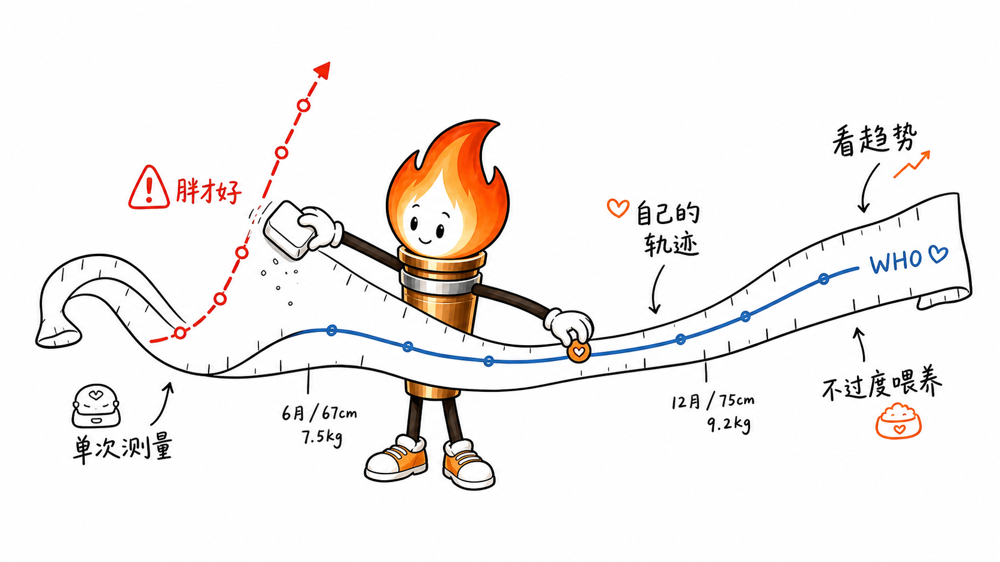

在国人的认知里，白白胖胖的宝宝才是养得好。然而，这种“胖即长的好”的观念其实是一种误解。医学研究表明，过快的体重增长可能暗藏健康风险——婴儿期体重迅速攀升会显著提高儿童期乃至成年后肥胖的风险。近年来中国儿童超重肥胖率快速上升便印证了这一点：2010年中国学龄儿童超重肥胖比例为15.5%，到2019年增至24.2%，2022年更飙升至29.4%。中国已成为全球超重/肥胖儿童最多的国家之一。

“胖乎乎”的外表并不等于健康，相反，过度喂养在无形中给孩子的未来肥胖和慢性疾病埋下了隐患。因此，了解婴幼儿的生长曲线就是为人父母的必修课。

<a id="point-05-007"></a>
#### 官方生长曲线与表格下载

WHO 的官方页面提供身长/身高-年龄、体重-年龄等标准的 PDF 图表、简化现场表和 Excel 数据表。按“出生至6个月、6个月至2岁、2岁至5岁”查找时，建议直接使用[权威资源下载与核验页](docs/05-权威资源下载与核验.md)，其中已按女孩/男孩和 z 分数/百分位整理好下载入口。

先打开原始页面也可以：

- [WHO 身长/身高-年龄标准](https://www.who.int/tools/child-growth-standards/standards/length-height-for-age)
- [WHO 体重-年龄标准](https://www.who.int/tools/child-growth-standards/standards/weight-for-age)

<a id="point-05-008"></a>
#### WHO 儿童生长标准原则母乳喂养宝宝范本

很多宝妈带娃接种疫苗时，会被告知宝宝生长不达标，建议断奶喂米粉。避免类似干扰最好的办法，就是自己绘制宝宝的生长曲线。对宝宝的生长做到自己心里有数，就不怕各种忽悠和干扰。

1997年，WHO启动了一项跨国大型研究，旨在制定0～5岁儿童的全新生长标准。这项研究被称为“多中心生长参考研究（MGRS）”，涉及来自全球六个国家（巴西、加纳、印度、挪威、阿曼、美国）的约8,500名儿童。与以往研究不同，MGRS对样本选择设定了苛刻的条件，确保入选儿童生长在“最优环境”中：
喂养方式最优：所有婴儿均按照最佳喂养实践进行哺育——出生后纯母乳喂养至少4～6个月，且在添加辅食后继续母乳喂养至1岁以上。母乳喂养被视为衡量正常生长的范本。
医疗保健完善：婴儿的生长环境良好，定期获得预防保健和必要的医疗服务。
家庭环境健康：母亲在孕期和哺乳期不吸烟，家庭无其他明显不利健康的因素。
营养环境理想：宝宝按需喂养，及时添加辅食，营养摄入充足且适宜。
通过严格筛选满足上述条件的样本，WHO得以捕捉“在理想环境下儿童应有的生长模式”。研究发现，无论种族或地域差异，只要赋予儿童生命早期最优的养育和营养条件，不同国家儿童的生长趋势惊人地相似。例如，来自印度、挪威、巴西的婴幼儿在健康环境中身高体重增长模式几乎没有差别。这印证了一个重要理念：早期生长更多取决于环境和喂养，而非遗传种族。

2006年，WHO正式发布了基于该研究的数据绘制的新生长曲线。这套“儿童生长标准”首次告诉世界各地的父母和医务人员：每个孩子在理想条件下都拥有相似的生长潜力。它以母乳喂养婴儿为参照，提供了衡量儿童生长发育的**“金标准”。相比之下，旧的生长曲线（如1977年美国NCHS/WHO参考）主要基于特定地区特定时期的儿童数据，只描述了“孩子是如何长的”，而非“孩子在最佳情况下应该怎么长”**。正因为如此，新WHO曲线被称为“生长标准（Standard）”，强调规范和应有值；而旧曲线更多只是“生长参照（Reference）”，反映过去某人群的生长状况。

<a id="point-05-009"></a>
#### 生长标准 vs 生长参照：与本地曲线比较

理解“标准”与“参照”的区别，有助于我们认识WHO曲线相对于各国本地曲线的价值。生长标准是针对理想条件制定的规范，具有指导性（prescriptive），回答的是“在最佳抚育下儿童应该如何生长”。而生长参照是对特定人群某时期实际测量数据的总结，具有描述性（descriptive），回答的是“某地儿童实际是怎样生长的”。简单来说，标准关注“应然”，参照体现“实然”。

WHO的0～5岁生长曲线是全球标准，而各国和地区往往也会制定本土版本的生长曲线作为参考。例如，香港在2020年完成了新的**“HK2020”儿童生长曲线**，大陆也于2022年发布了**《7岁以下儿童生长标准》**。这些本地曲线通常基于本地大规模测量数据绘制，反映当地儿童在当下环境中的实际生长分布。由于遗传和环境因素差异，本地参考曲线与WHO标准存在一些系统性差别：
出生体重差异：研究发现，香港新生儿的平均体重略低于WHO标准的中位值，约相当于WHO曲线的**-0.4个标准差**。这意味着用WHO曲线衡量时，香港新生儿整体偏轻一些。在WHO标准下极少有香港宝宝出生体重超过+2SD（大于97th百分位）。
身长/身高差异：香港儿童在学龄前某些年龄段的身长略低于WHO同龄均值，例如4岁女孩平均身高比WHO标准低约0.43个SD，导致约4%的香港4岁女孩按WHO标准可界定为“低于正常身高”（身高\<-2SD，即发育迟缓）。这提示当地儿童的身高增长节奏略有不同。
增长轨迹差异：整体而言，香港5岁以下儿童的身高体重分布与WHO2006标准高度吻合。本地研究发现，0～5岁香港幼儿各项生长指标的均值用WHO标准评价大多处于良好范围（均值z分数在±0.33以内）。因此，WHO曲线基本适用于衡量香港幼儿的生长状况。只有少数指标（如出生体重、4岁身高）存在系统偏差，需要在解读时注意。
喂养及肥胖影响：大陆儿童的生长曲线可能受到近年来营养过剩和肥胖流行的影响。虽然缺少权威英文数据详细比较，但可以预期，随着中国儿童普遍变得更高更重，本土参照曲线的上位百分位值（如体重）可能高于WHO标准。同样地，母乳喂养率、喂养方式等差异也会造成本地曲线与WHO曲线的不一致。

归根结底，WHO标准曲线代表“理想哺育”下的生长模式，而本地曲线反映现实中本地儿童的平均状况。前者可用于评估孩子是否达到了应有的生长潜力，后者则用于观察孩子相对于同胞群体的位置。两者各有用途，但在医疗实践中越来越多国家采用WHO标准作为衡量健康生长的依据。这不仅在全球范围内统一了评价尺度，也避免了因人口特殊性导致的误判。例如，相比香港本地曲线，WHO曲线对香港婴儿判定“生长不良”的频率更低，这在一定程度上是由于WHO曲线的分布更宽松且本地新生儿偏轻所致。换句话说，用WHO标准衡量时，香港许多偏瘦的小婴儿其实仍在正常范围内，不会像本地曲线那样过早被标签为“生长落后”。对于医生和家长而言，这减少了不必要的焦虑和过度喂养的干预。

<a id="point-05-010"></a>
#### 正确解读WHO生长图（不想了解就问奶爸AI）：

为了全面评估儿童的生长发育，WHO儿童生长标准提供了九项关键的身体测量指标的生长曲线。其实足月健康宝宝仅需要关注身长/身高 - 年龄即可。

拿到生长曲线图，家长该怎么看？这里涉及对百分位和Z分数的理解，以及动态观察生长趋势的方法。
百分位与Z分数：百分位数是直观的排名概念，例如体重处于第50百分位意味着宝宝的体重在同龄孩子中居中（或者是最大比例的群体）。Z分数则是统计学上的标准差单位，例如Z=0对应50th百分位，Z=+1约对应该年龄的85th百分位，Z=-2约对应第3百分位。临床上常用**-2 SD和+2 SD**作为判断异常的界限：低于-2SD一般意味着生长偏低（如低体重、矮小或消瘦），高于+2SD则提示超出正常范围（如生长过快或肥胖）。

关注曲线走势而非单点：儿童生长评估最重要的是纵向观察生长趋势。单次测量的高低并不足以断定健康与否，因为测量误差、暂时的因素（如生病、胃口不好）都可能影响个别数据点。正确的做法是连续监测多次测量值，在曲线上描绘出宝宝自己的生长轨迹。**只要孩子的各项指标始终沿着某一条百分位曲线附近平行移动，即便该曲线相对高或低，都可能是TA正常的生长轨迹。每个孩子都有自己的生长曲线通道，稳定沿着通道前进通常表示发育良好。**举个例子，前面讲了香港孩子的出生体重低，同时，4岁龄时的数值也低，但在生长曲线上看就是平滑的曲线。如果按照香港本地的曲线，孩子就发育迟缓，父母就会焦虑。因此，建议尽量使用WHO 的生长曲线记录孩子的成长过程数据。

“跨越两个百分位线”预警：判断生长异常的关键标准之一，是看孩子的生长曲线是否发生了明显偏离。临床经验指出，如果体重或身长的曲线连续跨过两个主要百分位通道（例如从接近P75跌至低于P25，跨过了P50和P25两条线），往往值得警惕。这样的变化可能意味着生长速度显著放缓或加快，需要医生进一步评估原因。需要强调，跨越百分位通道比单次数值偏低/高更能说明问题。
生长速率与节奏：利用WHO曲线，还可以评估生长速度（velocity），例如半年内身高增长了多少，与同龄孩子相比处于什么水平。如果生长速率明显偏离常轨，也能早期发现问题。此外，对于婴幼儿的体重，观察体重-身长/BMI曲线能帮助区分是匀称生长还是体重过快积累。
综上，正确解读生长图表需要的不是数值，而是变化趋势。一般来说，**只要孩子各项指标保持在沿自身轨迹平稳前行，就属于正常生长**。即便某次测量落在中下段，只要后续赶上或一直平行移动，也无须过度担心。判断异常更应看曲线走向是否陡变——这是早期干预营养或健康问题的信号。

在国家和全球层面，WHO标准被广泛用于儿童营养和健康状况的监测。各国卫生部门经常依据WHO标准计算生长不良和超重肥胖的流行率，以评估营养相关政策的效果。

WHO曲线最大的优势之一在于不再把纯母乳宝宝的感官偏瘦当作异常。过去一些医生，可能会因为婴儿在4～6月龄体重增速放缓而误以为母乳“不够吃”。如今有了WHO标准，只要看到孩子仍沿着曲线稳步增长，就可以确信这是母乳喂养的正常模式，无需过度干预。这种变化对保护和支持母乳喂养极为重要。因此，WHO曲线的应用帮助医生在临床实践中做到**“不冤枉一个正常娃”**，同时也不漏掉真正需要关注的异常情况。

<a id="point-05-011"></a>
#### 结语：沿着自身曲线成长才是健康

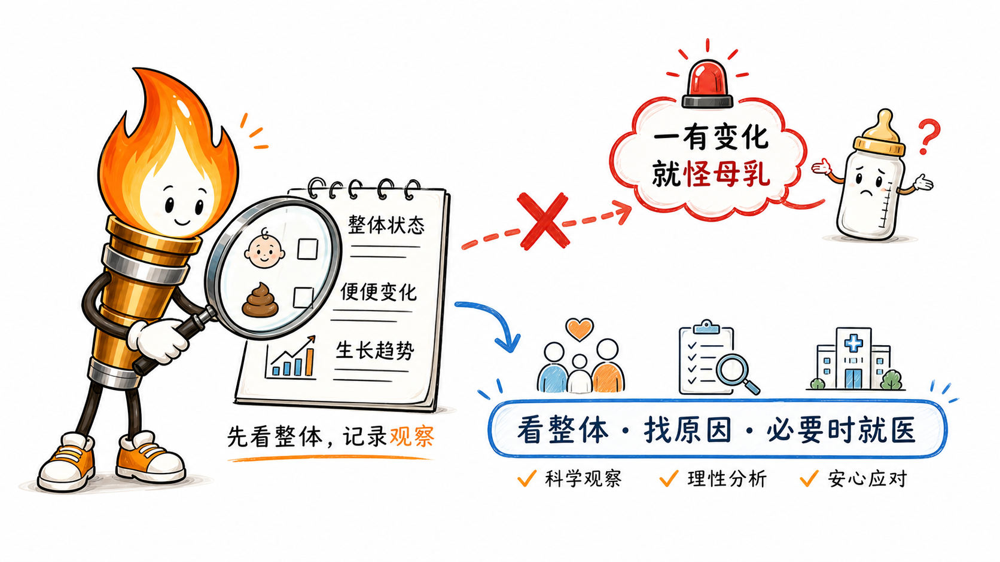

通过以上讨论，我们可以清晰地得出结论：评判一个婴儿是否健康，应当看TA是否沿着自己的生长曲线稳步前进，而不是看起来够不够胖。胖乎乎的外表也许让人觉得可爱壮实，但并不等于健康；相反，过度追求“胖”可能掩盖了不合理喂养的问题，给日后健康埋下隐患。
**特别提醒：我们的医院和父母们使用的儿童生长记录app往往采用的是本土数据，例如中国的0-7岁的生长曲线。这些曲线在前面的章节已经探讨了，并不是标准，只是本土宝宝的实际生长情况，因为中国的母乳喂养率很低，儿童肥胖率很高，因此数据对母乳喂养宝宝是不友好的，母乳喂养的父母一定要使用WHO儿童生长标准独立绘制宝宝的生长曲线。**
真正健康的婴儿，可能体型各异：有的在第10百分位的小巧精悍，有的在第90百分位的高大强壮，只要他们一直在自己的轨道上前进，就都是正常的。WHO儿童生长标准提供了衡量这一点的客观标尺。它提醒我们，每个孩子都有自己正常的生长通道，我们要尊重这种个体差异，关注长期趋势而非一时高低。当宝宝的生长偏离轨迹时，及时寻找原因、给予帮助；当宝宝按部就班地长大时，则无需拿TA和别的孩子盲目比较，更不应因为“不够胖”就焦虑。
综言之，让我们以科学的数据和工具为依据，摆脱陈旧的观念束缚。以WHO生长曲线为指南，结合对自身宝宝的细心观察，每一位家长都能更从容地见证孩子踏实成长的点滴。这样的成长，才是最值得欣慰和骄傲的。每个沿着自己曲线茁壮成长的宝宝，都是健康而独特的生命，让我们用科学和耐心守护他们的未来。

<a id="point-05-012"></a>
### 母乳性腹泻与“乳糖不耐受”的真相

<a id="point-05-013"></a>
#### 揭开“母乳性腹泻”与“蛋花便”的真面目

很多纯母乳喂养宝宝拉“蛋花便”（粘稠状，带有淡黄色物质，有时带有气泡或微酸味），父母的意识里宝宝的臭臭应该是金灿灿、成型的，于是他们去咨询儿儿科医生，我们的儿科医生真的是学业不精，他们也不懂怎么回事，于是就创造了“母乳性腹泻”这个新医学名词，并且煞有介事的给予治疗。

什么是腹泻？真正的腹泻是水样便（甚至呈喷射状）、频次极高，且伴有腹痛和烦躁不安。“蛋花便”根本不是腹泻，也不是疾病，而是纯母乳喂养宝宝的自然进化，宝宝宝宝娇嫩肠道的产物，结果就被儿科医生给破坏了。

为什么母乳会有轻泻作用？
母乳本身极其容易被消化吸收，它天然的轻泻作用有利于保护宝宝娇嫩的肠道，尤其在新生儿黄疸期间，坚持纯母乳喂养有利于快速排出体内的胆红素。

纯母乳宝宝一天排便3到10次都是正常的。其实，人类正常的排便次数本该与吃饭次数一致，但大部分人都存在一定程度的便秘，大家默认一天一次属于正常。宝宝蛋花便里的粘液主要成分是乳酸菌，所以会有一点酸味。

了解了这些以后，就不要为宝宝的蛋花便焦虑了。只要宝宝精神状态良好，生长曲线各项指标达标，父母要做的就是多清水洗屁股（从小水龙头洗的宝宝冬天屁股也不怕冷），避免红屁屁。

<a id="point-05-014"></a>
#### “母乳乳糖不耐受”逐利下的商业骗局

崔某涛忽悠了几代父母，通过不断地忽悠成长为国内头部的博主。早年是4个月辅食，打脸打多了改口6个月，如今仍然有大量的宝妈还在传播他4个月的辅食食谱。母乳乳糖不耐受也是其最早提出，如今已经深入宝妈们的心，并形成一个巨大的乳糖酶产业。今天，我们就把这个问题讲透。

哺乳动物是地球上最高智慧的生物，人类也是哺乳动物的一个分支，演化了几百万年，生生不息都是依靠母乳哺育后代。突然，母乳就不适合哺育后代了，得服用乳糖酶，那么发明乳糖酶的人应该获诺贝尔奖，毕竟它拯救了人类啊！

现实呢？那些没有刷短视频的妈妈哺育的宝宝活的好好的。婴儿真的会对母乳中的乳糖不耐受吗？在不能母乳喂养的情况中有列举，先天性乳糖酶缺乏症，患儿从第一次摄入母乳或普通配方奶开始，就会出现非常严重的水样腹泻，继而迅速脱水、体重下降或完全无法增重。它不是“宝宝爱放屁、肚子咕噜响、晚上哭闹”这么轻微。这种患儿的数量有多少呢？以发病相对集中的芬兰为例，估计也只有约每6万名新生儿1例。确诊后通常需要真正的无乳糖配方，而不是随便滴几滴乳糖酶继续观察。

难道就不存在宝宝某段时间出现乳糖消化不良吗？如果宝宝生病了，例如严重胃肠炎、肠黏膜损伤、乳糜泻、严重营养不良或某些牛奶蛋白相关肠病，可能暂时损伤乳糖酶，因为乳糖酶位于小肠绒毛最表面，损伤会造成继发性乳糖吸收不良。这时重点应是寻找并处理造成肠黏膜损伤的原因，而不是忽视疾病去搞服用什么乳糖酶。肠道恢复以后，乳糖消化能力自然就会恢复。

<a id="point-05-015"></a>
#### 乳糖不耐受又是怎么回事？

乳糖是一种复合碳水化合物，在乳糖酶的作用下可分解为葡萄糖和半乳糖。葡萄糖是宝宝神经元活动的关键且高效的燃料；而半乳糖是脑苷脂的重要组成部分，直接参与维持和促进宝宝神经细胞的正常功能。
自然演化的过程中，所有的哺乳动物都是在婴幼儿阶段才吃母乳，之后就会彻底断奶。即便在人类数百万年的演化过程中，成年人也没有吃奶的习惯，即便是游牧民族，液态奶也只是奴隶们的食物，是在巴氏杀菌法发明之后，液态奶才被端上大众的餐桌。过去人们把奶制造成奶酪食用，奶酪是发酵食品，发酵的过程就是乳糖被细菌分解的过程。消化功能用进废退，因此，地球上三分之二的人无法消化乳糖，喝奶后乳糖会被结肠细菌发酵成乳酸、氢气、甲烷和二氧化碳。其中，乳酸会刺激肠壁并加快肠蠕动，从而导致腹泻；而各种气体的产生则增加了结肠内的压力，从而导致胀气。乳糖不耐受的表现就是饮用牛奶后会出现腹痛、放屁、腹泻等症状。

搞笑的乳糖酶使用方法
售卖乳糖酶的商家会教授宝妈先挤出一小部分母乳，加入乳糖酶后喂给宝宝，然后继续亲喂。这是拿酵母菌的特性售卖乳糖酶，一小部分乳糖被分解，然后在肠胃中像发面一样，把之后宝宝吮吸的大量母乳的乳糖都给分解了，这是把宝妈当傻子吗？
市面上的“无乳糖牛奶”是如何制造的呢？有些先通过膜过滤去掉一部分乳糖，然后按剩余乳糖含量添加乳糖酶，将乳糖提前分解为葡萄糖和半乳糖。虽然总糖量并没有变化，但无乳糖牛奶尝起来更甜，这导致有些消费者很郁闷，他们原本是想购买无“糖”牛奶，结果发现是甜的。

<a id="point-05-016"></a>
#### 自然离乳

有一种说法，哺乳动物的乳汁中乳糖含量越高，智商越高，恰好自然界中人类乳汁的乳糖含量最高。但很多父母不给宝宝吃母乳，非要喂奶粉，如果是被干扰也就罢了。很有很多喂奶粉的宝妈去污名化母乳喂养。给人的感觉，人类好像是最残忍和最无情的哺乳动物。

很多宝妈受其影响，总想断奶。每当有人咨询，我通常会告知四点：

1、自然界中，乳汁是哺乳动物哺育幼崽的唯一食物。牛奶是给牛崽吃的，羊奶是给羊崽吃的，骆驼奶是给骆驼崽吃的，每一种奶都是人家幼崽生长所需最完美的营养组合，也为其幼崽提供生长因子和免疫保护。牛仅用大半年就性成熟了，而人类幼崽1岁才刚学会走路，乳牙要满2岁才长齐。
2、肺炎和腹泻是婴幼儿最大的杀手，母乳可以让宝宝免患肺炎和腹泻。有的妈妈会较真，真的可以免患肺炎和腹泻吗？人类对抗不了病毒，但母乳喂养的宝宝不会出现重症的肺炎和腹泻，使感染病的危害最小化。
3、宝宝在五岁之前，其自身的免疫力尚不完善，依赖妈妈母乳的被动免疫。每一个母乳到2岁多的妈妈都不急于断奶了，因为宝宝含乳不再是为了吃奶，而是安全需要。生病时含着乳房就能安静地睡去。研究也发现哺乳时间越长，罹患乳腺癌的风险反而越低。
4、最迟2岁就应该戒夜奶了，那么宝宝什么时候会自然离乳呢？2.5岁至5岁阶段，人的乳糖酶分泌开始消退，自然对母乳的瘾也在消退，这就是自然离乳的过程。这也呼应了世界卫生组织母乳喂养最低2岁的倡议。

<a id="point-05-017"></a>
#### 母乳性便秘

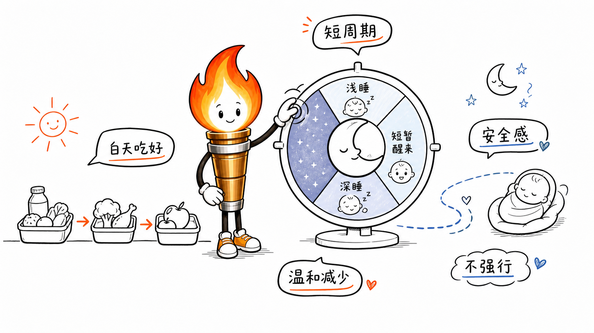

儿科医生的养育水平不行是可以理解的，但瞎起名的热情却很高，除了“母乳性腹泻”，还有对应的“母乳性便秘”（民间俗称攒肚），也就是宝宝好几天都不排便。

以上两种“疾病”都发生在纯母乳喂养期间，也就是宝宝纯母乳喂养期间，出现了好几天不排便的情况，我遇到最长的案例34天。一个吃素的未婚妈妈，产后拼命给我打电话，我半夜去医院指导宝宝含乳。因为妈妈比较信我，宝宝一个月没有排便也没有焦虑。另一个宝宝一周没有排便找我，我说只要宝宝好吃好睡，精神状态好，不排便没有关系。她焦虑，还是去看了儿科医生，伟大的中医给开了四物汤，我也没有问过哪四种物，但是我知道会干扰宝宝的肠道菌群。还有一种很极端的，直接上开塞露，妈妈告诉我从那之后，不上开塞露不排便了。

认知真的很重要，我们思考一下，母乳是什么？母乳是为宝宝量身定制的食物，一口母乳的88%是水，剩下12%的营养也几乎都是可以被宝宝身体吸收的营养。健康成人的便便固体物中超过一半是肠道菌尸体，婴童长的飞快，肠道一直在生长，肠道菌群也在不断增加容身之所，其实每天排便反而不正常。

不要焦虑什么母乳性便秘，纯母乳喂养的宝宝，只要肚子不胀、精神好，不要关注今天有没有便便。拉出来的便便是蛋花便或软糊状（转向成人肠道菌群），只要便便不干就说明一切正常，切勿盲目用药。混合喂养或人工喂养的就必须关注，喂奶粉的宝宝是真的会便秘。

<a id="point-05-018"></a>
### 戒夜奶

有人说一孕傻三年，大概是说睡眠不足这个事。睡眠不足是每一个母亲都必须面对的事，不论是母乳喂养，还是人工喂养。只是有些宝宝夜奶吃得久，有些妈妈有些扛不住，甚至会有一些抑郁。戒夜奶是宝妈们问的最多的问题之一，什么时候开始戒夜奶并没有一个标准答案，因为每一个娃都是不一样的。但是我还是会给父母们一些建议，希望对父母们能有帮助。

宝宝多大的时候能睡整夜觉？母乳喂养的宝宝要满9个月，才能在晚上一口气睡5个小时。这意味宝宝9个月以后，经过适当的训练，晚上仅需要喂一次奶就能到天亮。在9个月之前，有些宝宝可以一次睡超过5个小时，但不建议刻意训练，因为宝宝的胃还小，长时间不吃奶有可能会导致宝宝生长迟缓。晚上宝宝多睡有一个前提，就是宝宝白天有规律的吃奶吃辅食。有非常多的宝宝白天使劲玩，不怎么好好吃饭，家中老人家还焦虑宝宝吃的少，结果宝宝是攒着肚子晚上拼命吃。因为晚上的泌乳确实更充足，宝宝吃奶的时候更轻松和满足，很容易给宝宝养成吃夜奶的习惯。

如何培养宝宝白天多吃奶，晚上多睡觉的习惯？其实没有屡试不爽的方法，每个孩子的情况各不一样，尤其是高需求的宝宝，训练的难度要大得多。所以，特别提醒父母们，不建议强行不给宝宝吃奶。如果过激的行为导致宝宝缺乏安全感，反而激发了宝宝的警觉，晚上不敢睡去，总是要含着乳房。培养的第一步是保持有规律的生活，白天正常的吃、睡、玩、晒太阳，每天适当的晒太阳可以刺激宝宝晚上释放褪黑色素，释放褪黑色素有利于宝宝更好的睡觉。如果白天的情绪波动较大（例如大哭了一场），晚上也容易睡不安稳。第二步是宝宝6个月后，晚上哄宝宝就尽量不要用喂奶的方式，每次宝宝醒来要用手轻拍哄睡，不再像6个月前按需喂养、来者不拒，慢慢的养成不吃夜奶的习惯。培养一个习惯是需要时间的，宝妈千万不要焦虑，越是急越容易行为不当，行为不当容易让宝宝缺乏安全感，缺乏安全感的孩子就更加的粘人。

<a id="point-05-019"></a>
#### 成人和婴幼儿的睡眠模式并不相同

很多妈妈戒夜奶失败就干脆不戒了，反正9个月的宝宝能自己找奶头，自己只管睡自己的，让宝宝自己折腾去。但宝妈们又担心晚上缺乏深度睡眠是否会影响宝宝生长。这种担心可以理解，但婴幼儿和成人的睡眠模式并不相同。

成人的睡眠：以夜间连续睡眠为主，入睡以后通常会依次经历：浅睡眠 - 深睡眠，也称慢波睡眠 - 快速眼动睡眠，也就是常说的做梦睡眠。大概 90 -110分钟一个循环，一晚上睡7个小时的成人，可能会经历4～5个睡眠循环。很多人半夜会醒来一次，迷迷糊糊的上个卫生间后倒头继续睡。

世界卫生组织建议，0～3个月婴儿每天睡眠通常为14～17小时，4～11个月通常为12～16小时，其中包括白天的小睡。但这是参考范围，不是每个宝宝必须精确达到的指标。新生儿的睡眠：短周期、多阶段、容易醒。刚出生的宝宝还没有建立成熟的昼夜节律，他们的睡眠不是集中在晚上，而是分散在一天24小时之中。新生儿一次可能只睡一两个小时就饿了，睡眠周期通常只有大约45～60分钟，比成人短得多。周期结束时，宝宝可能扭动、哼唧、睁眼，甚至哭几声，然后重新入睡。频繁出现这些表现，并不意味着宝宝睡眠质量差。

6个月之后的宝宝，一个循环可以粗略理解为：浅睡眠N1→ 稳定睡眠N2→ 深睡眠N3→ 睡眠变浅→ 快速眼动睡眠 → 短暂觉醒或进入下一循环。在活动睡眠阶段，宝宝可能眼球转动、面部出现表情、四肢抽动、发出声音，呼吸也可能时快时慢。看起来似乎“睡得不踏实”，但这是一种正常而重要的睡眠状态，与早期脑神经发育密切相关。安静睡眠阶段，宝宝身体活动减少，呼吸更加平稳，对外界刺激反应较少。父母常常将这个阶段视为真正的睡眠，正常睡眠并不是从入睡到天亮始终保持同一种“深度”，而是在浅睡、深睡、快速眼动睡眠和短暂觉醒之间不断转换。一夜会重复多个周期。深睡眠通常在前半夜相对较多，快速眼动睡眠则在后半夜逐渐增加。即使是健康成人，夜里也会出现短暂觉醒，只是很多时候醒来的时间很短，第二天没有留下记忆。

<a id="point-05-020"></a>
#### 宝宝容易醒，是早期发育的正常特点

小月龄宝宝生长迅速，但苦于胃容量有限，需要频繁吃奶；昼夜节律尚未成熟；睡眠周期又比较短，因此夜间醒来吃奶、寻求安抚十分常见。大多人工喂养吃奶粉的宝宝，六个月就已经开始睡整夜觉了，这没有什么好羡慕的，父母轻松是以牺牲宝宝健康为代价，过早睡整夜觉意味着胃被撑大导致超重肥胖。

晚上频繁吃夜奶的宝宝，大多是因为身体不舒服。
例如因为过敏引起的鼻塞、长痱子引起的皮肤瘙痒、衣服不舒服、太冷或太热，出牙期的疼痛、生病、生虫、饥饿等等。
其次是缺乏安全感，分离焦虑、陌生环境、父母吵架、环境吵杂、白天受到惊吓，还有剖腹产、缺氧、早产儿、早期照蓝光的宝宝，他们属于高需求的宝宝，真的很费妈，但需要给予适当的满足，以修复宝宝内在的不安全感。
再就是每一次进阶，例如会坐、会爬、会走路，宝宝会夜晚醒来练习这些技能，还有尿了、拉了、白天睡多了，或是睡少了、睡前玩的太嗨等等。

欲得小儿安，三分饥与寒，对症解决问题，习惯需要慢慢养成。
现在不鼓励古法包裹宝宝，如果父母发现宝宝总因为肌肉跳动被惊醒，可以在睡前适当的包裹几个小时，宝宝会睡的更安稳，但不宜包裹太紧，9个月以后的宝宝也喜欢舒展睡觉。为了戒夜奶，培养宝宝半夜醒来不奶哄的习惯，有时需要父亲上场，宝宝转换睡眠时以每分钟60次节律轻拍宝宝，或许几个晚上，就能让宝宝接受没有奶的夜晚。

<a id="point-05-021"></a>
#### 远离宝宝睡眠训练师

有需求就有服务，不能好好睡觉是个非常折腾人的事，于是就有了一堆教你训练宝宝睡眠的课程，最牛的当属“哭泣免疫法”及其衍生的各种方法。在性格培养课程会有详细的介绍，这里就简单带过。
在1.5岁以内的婴幼儿认知里，妈妈和自己是一体的，自己想要什么应该马上得到满足。你是不是会想，那不会惯坏了吗？你会这么想是因为你太复杂了。小宝宝只有需要，没有想要，他需要抱抱、需要睡觉、需要吃奶，拉屎拉尿需要有人清理，这些都是需要，他的大脑还没有给他植入想要的能力。
我们无法回忆三岁前的任何事件，是因为4岁之前我们不记事，但我们的感受会被烙印进潜意识，潜意识就像本能，草丛有响声我们会警觉，突然的飞鸟会吓我们一跳，潜意识参与我们所有的决策，只是我们不知道，因为潜意识支配的决策都是不需要大脑思考、推理的。那么宝宝现在有需求了，他要如何表达他的需求呢？宝宝饿了，开始咂巴嘴要吃奶。
为什么生命早期的哭需要安抚？时间回到2～3万年前的旧石器时代，人类现在的基因是在那个时代定型的，那个时期的人类祖先茹毛饮血、食不果腹、并不处于食物链的顶端。试问一下，如果你正在被追杀，会让小宝宝哭吗？绝不会，而是会及时的安抚，否则全家就会成为大型猛兽的食物。睡眠训练师所做的，就是漠视孩子的哭，通过忽视、不回应达到脱敏的目的。非常遗憾的是，人类的幼崽并不知道你在训练他，他为了得到回应，会一直地哭下去，直到精疲力竭，直到对新世界不再信任，直到关闭了安全感的大门。人类和动物的情感厚度是非常不同的，如果你收养一只较大的流浪猫，即使它不黏人，但也会很乖。一个无情型人格的人，可能会成为高智商的连环杀人犯。一个幼年遭遇哭泣免疫训练的孩子，可能会一生饱受失眠、成瘾折磨，有些人抑郁，甚至选择自杀结束生命。

这里我必须要非常慎重地提醒父母，不要因为宝宝哭，自己没有及时的安抚而焦虑，哪怕宝宝哭了很久，只要你去安抚就不会给他造成精神创伤。只有长期刻意的忽视才会造成精神创伤。我很怕父母从一个极端走向另一个极端，怕孩子被忽视而过度关注孩子，结果让孩子失去了自我决策的能力。例如蹒跚走路的宝宝摔倒了，不要冲过去抱宝宝，会吓到他。宝宝的神经末梢没有发育完全，耍一跤没有磕到牙齿，他会哭或转头看你。哭的宝宝你要扶他时轻描淡写的说：“宝宝摔倒了呀！摔倒了自己爬起来。”如果是看你，说明宝宝内心已经很强大了，你笑呵呵地看着他说：“宝宝自己爬起来。”无关安全不必紧张，但宝宝呼喊你时，还是要及时的回应宝宝，让他知道你挥之即来，他内心笃定世界是安全的，爸爸妈妈呼之即来时，他才敢探索世界。

**睡眠很重要，但婴儿健康睡眠的核心，不是“从晚上睡到天亮”，而是在安全的睡眠环境中，按照自己的发育节奏，获得足够的总睡眠，并在饥饿和不适时得到及时回应。**

<a id="point-05-022"></a>
### 母乳啥时会没营养

在人类进化与哺乳动物繁衍的历史长河中，泌乳是支持后代生长、发育与免疫防御的基石。长期以来，中国社会文化中存在一种根深蒂固的误解，即认为母乳在婴儿达到特定月龄（如六个月或八个月）后，其营养价值会大幅衰减，甚至“变成如同水一般毫无营养的液体”。然而，随着泌乳生物学、母婴免疫学、基因组学以及时间营养学等交叉学科的飞速发展，现代科学已经彻底推翻了这一假设。大量严谨的临床观察与生化分析表明，母乳并非一种成分恒定不变的静态食品，而是一种高度动态、个性化且极具生物活性的复杂流体。它能够根据婴儿的生长阶段、吸吮模式、昼夜节律、母体营养状况，乃至母婴双方的实时感染状态，在宏观营养素、微量营养素及免疫因子浓度上发生精确的自适应性调整。

要理解母乳成分的动态变化及其长期营养价值，首先必须确立成熟母乳的营养学基准。母乳的组成物质在渗透压、热量密度及大分子比例上经过了极度的演化优化，以满足人类大脑高度发育和身体快速生长的双重需求。

成熟母乳的物理化学特征表现为极佳的水合作用基础，其主要由约百分之八十八的水分构成，比重约为1.030，渗透压维持在约286 mOsm/L的等渗状态。在其所含的124 g/L固体营养物质中，大分子营养素构成了婴儿生命早期最完美的代谢底物。母乳的能量密度通常在 65–70 kcal/100 mL 之间，其中约百分之五十的总热量来源于脂类，约百分之四十来源于碳水化合物，碳水化合物主要以乳糖的形式存在。乳糖不仅是大脑发育的首要能量来源，同时在乳腺的乳透压调节中发挥着不可或缺的作用，直接影响乳汁的合成与分泌体积。除乳糖外，母乳中还含有超过两百种结构各异的母乳低聚糖（HMOs），总浓度在成熟乳中约为12–14 g/L（在初乳中甚至超过20 g/L）。这些复杂的碳水化合物并不被婴儿自身的消化酶分解，而是作为天然的益生元，直接进入远端肠道，选择性地滋养双歧杆菌等有益菌群，并通过充当“诱饵”受体来中和肠道病原体，构成婴儿先天免疫的重要防线。脂类是母乳中变异度最大的宏观营养素，其平均含量约为3.5–4.2 g/100 mL，但个体差异及时间差异极大（范围可跨越1.8至8.9 g/100 mL）。甘油三酯构成了乳脂的主体，其中饱和脂肪酸占近百分之五十（棕榈酸占约百分之二十三）。母乳中的脂类不仅是能量储备，更提供了亚油酸和α-亚麻酸等必需脂肪酸，这些前体物质在婴儿体内转化为花生四烯酸（AA）、二十碳五烯酸（EPA）和二十二碳六烯酸（DHA），为视网膜和神经元突触的快速构建提供关键结构脂质。蛋白质方面，母乳蛋白浓度随着泌乳期的推进呈自然下降趋势，从泌乳早期的1.4–1.6 g/100 mL平稳降至六个月后的约0.7–0.8 g/100 mL，这一过程与婴儿肾脏排泄负荷的成熟度完美契合。母乳中的蛋白质分为乳清蛋白与酪蛋白，其比例在泌乳早期约为80:20，成熟期转变为60:40或50:50，赋予了母乳极高的胃肠道消化吸收率。关键的功能性蛋白包括α-乳清蛋白、溶菌酶、乳铁蛋白和分泌型免疫球蛋白A，它们在消化道内往往不被完全降解，而是直接参与营养素转运与免疫防御。此外，谷氨酰胺是母乳中最丰富的游离氨基酸，其在成熟乳中的浓度比初乳高出近二十倍，对肠道上皮细胞的增殖与修复起着核心作用。

“六个月以后母乳没有营养”的流言，其根源往往在于将婴儿对特定外源性微量元素（特别是铁）绝对需求量的增加，错误地归咎于母乳本身宏观营养价值的衰竭。世界卫生组织（WHO）与联合国儿童基金会（UNICEF）明确建议，在六个月时引入辅食的同时，应持续母乳喂养至两岁或以上。来自中低收入国家的流行病学数据表明，在婴儿9-11个月大时，母乳依然提供约百分之六十三的日常总能量需求；即便在12-23个月（即第二年）的延长哺乳期内，母乳仍能供应约百分之四十四的总能量。更为关键的是，在15至18个月龄的幼儿中，母乳分别满足了其约百分之七十的维生素A需求、百分之四十的钙需求和百分之三十七的核黄素需求。为了深入解析母乳在第二年的成分，研究人员对泌乳期长达十八个月至四十八个月（二至四年）的母乳进行了纵向成分分析。结果表明，进入延长哺乳期后，母乳的生化性质发生了极为显著的逆向浓缩效应，产后两年以上母乳的热量密度比一岁以内的母乳高出约 60%。

上述数据揭示了一个深邃的生物学现象：随着婴儿成长为大龄幼儿，母乳的日摄入量和分泌总体积虽然自然下降，但其单位体积内的营养浓度却发生了实质性的转变。由于脂肪是提供热量最高的宏观营养素，长期哺乳期母乳的热量密度随脂肪比例的攀升而大幅增加。

这种演变具有极高的适应性意义：针对幼儿，母乳的定位从单一的能量及水分来源，转变为高热量的膳食补充剂与免疫强化剂。由于一岁以后的幼儿具备自主饮水能力，母乳变得不再那么“充满水分”，而是逐渐演化为脂肪酸与蛋白质的浓缩精华。

除了宏观营养的高密度化，生物活性因子的纵向变化更有力地反驳了“无营养论”。针对产后十一个月至十七个月的母乳样本进行的纵向流式细胞与蛋白质组学分析显示，进入第二年后，母乳中的总蛋白、乳铁蛋白、溶菌酶以及分泌型IgA的浓度较第一年不仅没有下降，反而出现了具有统计学意义的显著攀升。

随着月龄增加，婴儿每天的泌乳次数逐渐减少，随之而来的却是免疫因子的阶梯式上升。到第十七个月时，母乳中抗细菌及抗真菌的乳铁蛋白和溶菌酶的浓度相较于第十一个月几乎翻倍。这种高浓度的免疫成分能够有效中和幼儿在扩大活动范围后所接触到的日益复杂的环境病原体。临床荟萃分析进一步证实，相较于在第二年停止母乳喂养的幼儿，持续母乳喂养在第二年能够显著降低急性胃肠炎与呼吸道感染的发病率。

<a id="point-05-023"></a>
#### 营养素对比：母乳、全脂牛奶与幼儿配方奶粉

在讨论一岁以后营养摄入时，全脂牛奶或特定阶段的幼儿配方奶粉常被视为母乳的替代品。然而，生化比对结果显示，母乳在必需脂肪酸谱和蛋白质构成上仍然具有不可比拟的优势。

全脂牛奶的蛋白质含量极高（约占能量来源的较高比例），但其酪蛋白含量占优，对幼儿尚未完全成熟的肾脏代谢可能造成额外负荷，且缺乏长链多不饱和脂肪酸；而市售幼儿配方奶粉（其依据欧洲食品安全局 EFSA 推荐标准设定）尽管在亚油酸、α-亚麻酸（ALA）和DHA/EPA上进行了人工强化，并在铁、锌微量元素上进行了补足，但仍然缺乏母乳中动态生成的酶类、免疫球蛋白与活体微生物。因此，母乳搭配合理的营养辅食，在能量代谢、神经发育及免疫保护上，依然构成了最理想的营养矩阵，无需强行向牛奶或配方奶转换。

<a id="point-05-024"></a>
#### 母乳是高度定制化的营养

除了长期的纵向宏观演变，母乳在极短的生理周期内（如单次哺乳的数十分钟期间）也展现出惊人的可塑性与即时响应能力。通常，在一次哺乳过程中分泌的乳汁根据时间先后被视觉上划分为前乳和后乳。前乳由于积聚在乳腺导管中，呈淡灰蓝色，脂肪含量较低但富含水分、蛋白质与水溶性维生素，满足婴儿初始的解渴需求；随着乳房被逐渐排空，后乳呈奶油白色，脂肪浓度急剧上升，为婴儿提供产生饱腹感的高度密集的能量。

最新的泌乳基因组学与流式细胞分析揭示了一个更为惊人的现象：母乳的脂质与细胞活性不仅在单次哺乳过程中逐渐升高，更会在一次良好且彻底的哺乳结束后的三十分钟达到绝对峰值。在乳汁不断合成的过程中，较大的脂肪球倾向于聚集并附着在乳腺腺泡及导管的管壁上。当婴儿进行有效吸吮并大量移除乳汁时，这些黏附的脂肪球被逐渐“冲刷”并过滤至乳液中，导致乳房排空程度越高，分泌出的乳脂越为浓郁。然而，这不仅仅是一个简单的物理过程，研究表明，乳汁被移除这一行为，能够产生强烈的机械与生化反馈，直接刺激母体乳腺上皮细胞的基因表达。这种基因激活不仅促进了脂质的加速分泌，更主动引导了大量母体免疫细胞（巨噬细胞、淋巴细胞等）跨越上皮屏障，积极迁移入乳汁中。这种以婴儿实时需求和吸吮强度为驱动的短时高强度基因调控与生化响应机制，充分说明了母乳作为活性流体的本质，是任何标准化配方奶粉所无法企及的。

长期以来，公众甚至部分医学界人士认为哺乳只是一种“营养输出”的单向传递过程。然而，现代微生物动力学与粘膜免疫学的交叉研究揭示，母乳喂养实际上是一场在母婴之间实时交互的免疫对话。火炬手奶爸的一位粉丝就分享了她宝宝生病期间，她的乳汁从乳白色转变为米黄色。那么这是如何做到的？原来在哺乳期间，乳腺导管随着催产素的释放发生节律性的收缩与舒张。在婴儿强力吸吮产生口腔负压的情况下，婴儿口腔中的少量唾液及其携带的口腔共生细菌、甚至是新感染的潜伏病原体，会发生逆行回流，直接进入母亲的乳腺导管系统及乳腺实质组织。母亲成熟的免疫系统在乳腺局部接收到这些外源性“抗原信号”后，会迅速做出应对。学界普遍认为，通过复杂的“肠-乳腺途径”，母亲肠道及免疫器官中的树突状细胞会将捕获的病原体信息呈递给T细胞和B细胞。随后，被激活的特异性淋巴细胞通过血液与淋巴系统归巢至乳腺，并大量增殖，开始针对婴儿口腔传入的特定病原体产生定向的分泌型抗体（尤其是sIgA）及白细胞，并排入下一餐的母乳中。这一动态反馈回路的存在，确保了母乳中的免疫微环境始终是“量身定制”的。当婴儿遭遇感染而母亲并未生病时，婴儿的病原体通过唾液回流通知母亲，使得母乳能在极短的时间内（数小时）转化为含有极高白细胞计数和特异性抗体的靶向免疫制剂，直接协助免疫系统尚未成熟的婴儿清除感染源。

除了触发中长期的母体细胞免疫响应，母乳与婴儿唾液在口腔与胃部的物理混合本身，即刻激活了一场致命的抗菌生化风暴。这种协同防御不仅依赖于抗体，更依赖于高度进化的酶促反应体系。生化分析显示，母乳中富含黄嘌呤氧化酶，该酶在乳腺内原本参与乳脂球膜的构建。而令人惊奇的是，新生婴儿及幼儿的唾液中，异常富集该酶的底物——次黄嘌呤和黄嘌呤。测定数据显示，新生儿唾液中的次黄嘌呤和黄嘌呤中位数浓度分别高达27 μM和19 μM，是普通成年人唾液（约2.1 μM和1.7 μM）的十倍以上。当这两种体液在婴儿进食时混合，黄嘌呤氧化酶迅速催化大量底物，瞬时生成高浓度的过氧化氢和活性氧。随后，乳汁及唾液中普遍存在的乳过氧化物酶接管反应，利用这些生成的过氧化氢，将饮食及唾液中自然存在的硫氰酸盐氧化为具有强效、广谱抗菌特性的次硫氰酸盐离子。这种由母婴共同完成的“双剑合璧”的防御机制，能在长达二十四小时内有效抑制包括金黄色葡萄球菌和沙门氏菌在内的条件致病菌及肠道恶性细菌，同时却对婴儿肠道共生益生菌（如乳酸杆菌）的生长起到促进作用。此外，唾液中的次黄嘌呤在炎症刺激下，还能够被巨噬细胞通过补救途径转化为次黄苷酸，从而抑制NLRP3炎症小体的过度激活，降低细胞因子风暴风险，引导粘膜免疫反应走向消退与修复。这种进化上的精巧协同设计，完美解释了直接进行母乳亲喂缘何能为婴儿的口腔和胃肠道黏膜提供无可比拟的免疫屏障，这也是仅靠无菌配方奶或缺乏酶活性的巴氏杀菌捐赠乳所根本无法复制的核心优势。

母乳不仅限于营养输送与免疫对抗，还承担着精密的“内分泌调节器”角色。人体遵循严格的二十四小时昼夜节律，由下丘脑的视交叉上核控制。母体会将其自身的生物钟信号转化为血液中波动的激素与代谢物，并通过乳腺分泌将其无缝传递给婴儿。这一前沿研究领域被称为“时间营养学”，揭示了白天的母乳与夜间的母乳在化学组成上存在着本质的差异。婴儿在出生后，其自身的生物钟机制及内源性褪黑素分泌极不成熟。在这一关键窗口期，母乳充当了体外的生物钟授时因子，帮助婴儿同步其睡眠-觉醒周期、代谢率以及体温调节。在一项涵盖236个母乳样本的纵向研究中，研究人员在早上六点、中午十二点、傍晚六点及午夜十二点分别提取母乳进行化验，发现了以下显著的昼夜节律性特征：褪黑素在午夜达到绝对峰值，传递明确的睡眠环境信号，促进深度神经发育与细胞内抗氧化应激；色氨酸在夜间母乳中浓度更高，作为褪黑素与中枢血清素的合成前体，协助确立并维持睡眠觉醒机制的稳定；皮质醇则在清晨达到峰值，日间维持高位，夜间大幅降低，作为应激与觉醒激素，促进婴儿日间觉醒，支持清晨的能量动员与基础代谢率提升；瘦素及脂质在日间浓度发生剧烈波动，与婴儿体重及脂肪比例的调控高度相关，参与生命早期无脂体重的构建，预防成年期肥胖。母乳中的微生物组也受到严格的昼夜节律调控。夜间母乳中皮肤相关的共生细菌（如葡萄球菌属）的相对丰度显著增加，而日间母乳中环境相关的细菌更为普遍。

母乳成分的精准节律变化，给**背奶妈妈**们提出了挑战，如果婴儿被喂养了时间错配的母乳（例如，在中午喂食前一天半夜吸出的富含催眠信号褪黑素的夜间母乳，或在睡前喂食清晨吸出的富含觉醒信号皮质醇的日间母乳），可能会严重扰乱婴儿正在建立的脆弱生物钟，导致睡眠障碍与代谢失调。好在母乳非常耐存储，可以标注好时间存储24小时喂养，确保营养、免疫的同时，又能维持母乳天然的节律信号。

<a id="point-05-025"></a>
#### 母体营养缓冲机制

有一种攻击母乳的声音，说母乳的营养来自母亲的膳食，如果母亲挑食、营养不良或特定微量元素缺乏，母乳也会营养不全面，但权威的结论并非如此，这主要归功于哺乳动物进化出的强大生存策略——“母体缓冲”机制。

为了维持乳汁质量，泌乳期的微量营养素可以依据其对母体膳食摄入和生理状态的依赖性划分为截然不同的两大类：
优先营养素：包括维生素A、维生素B族（如硫胺素B1、核黄素B2、B6、B12）、胆碱、维生素D、硒（Se）和碘（I）。其在母乳中的分泌浓度高度依赖于母体近期的膳食摄入量和体内储备池。当然，对于严格素食的母亲，如果极度缺乏B12，反映在母乳质量上确实会危及婴儿神经发育。因此，在母乳喂养之外，育儿网校还建立了最前沿营养健康课程。
微量营养素：包括钙（Ca）、铁（Fe）、锌（Zn）、铜（Cu）和叶酸（Folate）。它们的显著特点是浓度极其稳定，不受母体膳食波动的直接影响。无论母亲摄入量是过量还是匮乏，乳腺细胞都会利用严密的稳态控制系统（如主动转运机制），强制性地从母亲自身的骨骼矿物质池或组织储备中“抽取”这些元素分泌到乳汁中。换言之，即使母亲自身患有严重的缺铁性贫血（IDA）或严重的钙流失（骨密度下降），其母乳依然能为婴儿提供恒定、标准的二类营养素。

持续的纯母乳喂养每天额外消耗约330至500千卡热量，并透支母亲体内的营养基盘。如果不主动进行膳食干预，母亲将遭遇疲劳、脱发、免疫力下降及产后抑郁的风险，最终可能导致泌乳质量下降。现实中，膳食干预容易走向两个极端，一个是宝妈因为节食导致隐性饥饿（就是某些非常重要的微量元素缺乏），另一个是过度进补，原本漂亮的姑娘变成了肥腰大肚黄脸婆。

<a id="point-05-026"></a>
#### 1人吃饭保证2人营养

哺乳动物的进化赋予了孕产期的女性一些特殊的能力，例如在某些重要的营养素吸收上有了大幅的提升。因此，哺乳期的女性并不需要特别进补，针对父母们会担心的营养素，我梳理了世界卫生组织等权威机构的一些数据。

正常饮食可满足孕产妇的铁需求。Whittaker 等采用口服与静脉双稳定同位素，在同一批健康孕妇中连续测量，发现铁吸收率从孕12周 7.6% 升至孕24周 21.1%、孕36周 37.4%，产后12周回落至 26.3%；传统意义上的补铁食物是富含血红素铁的瘦肉、肝脏等，因为血红素铁本身就易于吸吮，那么纯素孕产妇只吃非血红素食物会怎样呢？Barrett 等用标准的非血红素食物试验则报告从孕12周 7% 升至孕36周 66%，产后16–24周约 11%。

钙在早孕阶段就触发吸收增强模式了。Endotext 和多项人群研究指出，孕期肠钙吸收可超过2倍，并且这一改变在孕12周左右就能观察到；在低钙摄入的巴西女性中，真吸收率从孕前 32.9% 升至中孕 49.9%、晚孕 53.8%。不过，成人女性进入稳定哺乳期后，肠钙吸收多回到接近非孕水平；乳汁中的钙主要由骨骼重吸收和一定程度的肾脏保留提供。这也是为什么高钙摄入或单纯补钙并不能完全阻止哺乳期的短暂骨量下降。

锌的吸收情况。巴西低锌摄入女性的锌吸收率从早孕 29% 升至晚孕 43%，产后早期 39%；而综述同时指出，加州较高锌摄入女性从孕前 14.6% 到晚孕 19.4% 的变化并不显著（说明身体吸收有考量需求）。另有中国农村乳母研究显示，锌吸收率平均 0.53，比同社区未孕女性高 71%。

叶酸方面，有稳定同位素研究发现：没有证据证明妊娠会提升叶酸吸收率。因此，必须在孕前和孕早期确保足够的摄入量，因为神经管关闭窗口非常早，早期的匮乏是要付出代价的。补充方面有争议，有专家建议食补，叶酸作为水溶性维生素，每天一餐绿叶蔬菜并不会缺乏。政府则免费发放补充剂。关键还是看父母，备孕阶段要么食补，要么每天服用补充剂，水溶性维生素的特点是不存，需要每天补充。

活性维生素D在孕期会升高约2–3倍，这是母体-胎盘-肾脏共同参与的内分泌适应，与钙稳态和免疫调节相关。WHO据此并未建议对所有孕妇常规补充维生素D来改善母婴健康，孕期建议每天晒15 - 20分钟太阳，白天多户外运动应该都是超标的，关键是月子期间，虽然维生素D可以在体内存储1-2个月，多吃香菇等富含维生素D2的食物，或者服用维生素D补充剂，省去了担心焦虑。

介绍了孕产期吸收率会增强的一些研究，目的是提醒女性不必焦虑营养问题，只要注重营养、正常饮食、不节食，就可以一人吃饭满足二人营养。在《生命最初1000天》的部分我们强调了生命早期营养的重要性，关乎到人一生的健康。哺乳期间从骨骼稀释的钙质，会从食物中加倍吸收补回去。非洲女性一生母乳哺育超过10个宝宝，并没有出现骨质酥松的问题，而如今我们的很多女性年纪轻轻就骨质酥松，这背后和过量的动物性蛋白质，尤其是过量的乳制品息息相关，在营养板块我们会有详细的解读。

<a id="point-05-027"></a>
### 厌奶期

“厌奶期”是中文育儿语境中的常用说法，指原本吃奶尚可的婴儿出现一段时间的吃奶减少、吃奶分心或拒绝乳房。常见因素包括婴儿发育到更容易分心的阶段、近期接种或疼痛不适、鼻塞、口腔问题、奶瓶偏好/流速偏好、母婴紧张互动、错误强迫喂养等。“厌奶期”现象并不少见，但没有可靠的全球发生率。

考虑到父母常常为此焦虑，建议先排查“是不是生病了”。若伴有发热、呕吐、腹泻、口腔白斑、明显鼻塞、嗜睡、尿量减少、体重下降，先就医。若精神状态尚可、只是吃奶量暂时下降，可尝试在安静环境喂奶，增加肌肤接触，减少围观与催促，避免“追着喂、按头喂”。

有宝妈询问“厌奶期“是不是说明母乳没营养、该断奶了？绝不是，更不要有断奶的念头。所谓“厌奶”其实是宝宝分心、行为变化，和母乳质量无关。相反，过早停母乳、硬塞辅食，可能加重喂养冲突。关于“厌奶期”缺少前瞻性队列与干预等高质量研究说明它根本就不是个真实的问题，更多是父母基于过去经验的判断引发的焦虑。记住一点，吃是人的本能，没有之前吃的起劲，说明宝宝并不饿，可能是胃大了，耐饿的时间延长了，多多引导吃奶就好。
---
<a id="point-05-028"></a>
### 不能母乳喂养的情况｜宝宝禁忌与妈妈禁忌

<a id="point-05-029"></a>
#### 婴儿方面的禁忌症
半乳糖血症：是一种罕见的遗传性代谢疾病，主要由基因突变导致婴儿缺乏分解乳糖中半乳糖的酶，母乳中的乳糖会导致严重代谢紊乱甚至死亡，需完全避免母乳。从报告个案来看，这种疾病主要发生在爱尔兰旅人、欧洲白人身上，至今没有国人的病历报告。

苯丙酮尿症(PKU)：是一种可防可控的遗传性代谢疾病，苯丙氨酸及其代谢产物在体内积累，对神经系统造成不可逆的损害。因此，部分严重病例需限制（肉类、鱼类、蛋类、奶制品）母乳摄入量，搭配特殊医学配方奶。在欧洲白人中发病率较高，而在东亚和非洲裔人群中较罕见。

严重口腔或消化道畸形： 如唇腭裂、先天性食道闭锁等，可能导致婴儿无法有效吸吮或吞咽母乳。注意：绝大多数的舌系带短可能出现含乳不正确的问题，但不影响母乳喂养。

极度早产或危重状态： 可能因吸吮和吞咽能力不足，暂时无法直接母乳喂养，需通过管饲或其他方式喂哺母乳。注意：早产儿喂配方奶粉极易罹患坏死性小肠结肠炎，因此，权威的医学次级食物建议是巴氏杀菌的捐赠母乳。

<a id="point-05-030"></a>
#### 母亲方面的禁忌症
严重心脏病（如心脏功能3-4级）：心脏功能分级通常采用纽约心脏协会(NYHA)的标准。3级(III级)表示患者在轻度活动时即出现明显症状（如呼吸困难、疲劳），4级(IV级)则为休息时仍有症状，无法进行任何体力活动。母乳喂养需要额外的体力支持（如哺乳时的姿势维持），可能加重心脏负担，导致心衰恶化及宝宝跌落。

HIV/AIDS： HIV阳性母亲在抗病毒治疗下可母乳喂养。世卫组织建议，当受到艾滋病毒感染的母亲进行母乳喂养时，应当接受抗逆转录病毒药物治疗（ART），并且遵循世卫组织在母乳喂养和补充喂养方面的指导意见。但需注意，在有安全可负担的人工喂养条件的地区，为杜绝病毒传播风险，通常不建议母乳喂养。这是因为即便 ART 抑制良好，仍有约 0.5–2% 的残余母乳传播风险（多为未完全依从或药效不佳的情况）。  
乙肝（HBV）和HIV 的传播途径高度相似（血液、性接触、母婴传播），但它们在母乳喂养方面的建议却完全不同，只要婴儿按规范接种疫苗+免疫球蛋白，就不必因为乙肝而放弃母乳喂养。

活动性结核病：未经治疗的肺结核患者可能通过呼吸道传播病菌给婴儿，需暂停母乳喂养直至治疗有效。

人类T淋巴细胞病毒(HTLV-1/2)： 这类病毒可通过母乳传播，感染后可能导致婴儿白血病或神经系统疾病，因此为绝对禁忌。

化疗或放疗： 癌症治疗中的化疗药物或放射性物质可能通过乳汁影响婴儿。

某些药物： 如抗癫痫药（如苯巴比妥高剂量）、某些抗精神病药物等，可能对婴儿造成毒性或发育影响，而患病母亲又不能停药。

药物滥用： 如吸食毒品（可卡因、大麻等），会通过乳汁危害婴儿。

产后严重抑郁症或精神病： 若母亲无法安全照顾婴儿或拒绝哺乳，则不适合母乳喂养。

极度营养不良或衰竭： 例如BMI低于18，母亲身体已无法支持持续泌乳，坚持母乳喂养会严重透支母亲的健康。

特殊情况：相对禁忌 

乳腺手术史： 如乳房缩小术（例如乳腺切除术后）可能导致乳汁分泌不足，但部分母亲仍可尝试哺乳，需个体化评估。

急性乳腺炎或脓肿： 若母亲有严重乳房感染，可能需暂停哺乳，直至治疗痊愈。
---
<a id="point-05-031"></a>
### 血化成奶
从感性层面，血化成奶是一种伟大的奉献精神，但在科学上是解释不通。一位成年人一年也就允许献800毫升血，几乎每一位妈妈每天都要哺乳宝宝900毫升以上的母乳，所以，我们必须理解其并不是一回事。现代泌乳生理学认为，乳汁是在乳腺泡上皮细胞内合成并分泌的：吸吮刺激引起催乳素上升，驱动乳汁合成；催产素促使肌上皮细胞收缩，完成射乳。乳汁的原料确实来自母体血液循环携带的葡萄糖、脂肪酸、氨基酸、矿物质和部分免疫成分，但血液不是直接“变成奶”，而是为乳腺细胞提供底物，随后由细胞进行选择、转运、合成与分泌。例如，乳糖的碳源主要来自血浆葡萄糖。这是基础生理学层面的高确定性结论。

解释这一原理是因为资本宣扬“喂奶极度伤身”，让母亲背负不必要的心理压力甚至过早断奶。同时，母亲容易把提高奶量寄托在“补血食品”上。职场女性存在的各种问题，如果出现在哺乳期的宝妈身上，就容易被归结为哺乳造成的。

<a id="point-05-032"></a>
#### 《佛说父母恩重难报经》疑似中国造

《佛说父母恩重难报经》中一段经文：“每生一孩，赖乳养命，乳由血变，每孩饮母八斛四斗甚多白乳，所以憔悴……” 意思是婴儿出生以后，依赖母乳才能存活和成长。在古代没有配方奶、消毒条件和现代医疗的环境下，母乳不仅提供食物，也代表母亲对婴儿持续不断的照料。由于古人不了解乳腺结构、激素调节和乳汁合成机制，便形成了“经血上行化乳”“乳血同源”之类的解释。中国传统医籍中也长期存在“乳为血化”的说法。“斛”和“斗”是古代容量单位。通常可把“八斛四斗”理解为八十四斗，但不同朝代、不同地区的容量标准并不完全相同，不能可靠地换算成一个确定的现代升数。佛教汉文里经常出现“八万四千”这样的数字，用来表示数量极多、种类繁多。因此，八斛四斗传达的是一个孩子从出生到离乳，饮用的母乳累积起来数量十分巨大。孩子得到生命，母亲则付出了身体、精力和容颜。这是一种典型的“身体化报恩叙事”：母亲的恩情不是抽象感情，而是怀孕、生育、哺乳、睡眠不足和长期照料等真实身体付出。这段经文的核心不在“乳”，而在“恩”。母乳在这里具有三层含义。
第一层是生命之乳，孩子依靠母乳生存，乳汁象征生命的延续；第二层是身体之乳。“乳由血变”让读者感到，母亲仿佛是在把自己的血肉交给孩子；第三层是恩债之乳。“八斛四斗”把母亲的付出描绘成一个难以偿还的巨大数量，由此引出“父母恩难报”的主题。

这部《佛说父母恩重难报经》虽然题作“鸠摩罗什译”，但唐代的佛经目录已经把它列为疑伪，明代莲池大师也认为它并非真正的佛说。学术研究通常把它看作中国本土融合佛教因果观与儒家孝道思想的佛教疑伪经。真正的佛经《佛说父母恩难报经》收入《大正藏》，旧题后汉安世高译，原文只概括地说父母对子女有“乳哺长养”之恩，并没有“乳由血变”“八斛四斗”这段话。
---

<a id="point-05-033"></a>
### 胸小没有奶

“胸小没有奶”是最常见也最误导人的母乳谣言之一。权威解剖学与官方母乳教育资料都指出：乳房大小主要由脂肪与结缔组织决定，产生乳汁的是乳腺组织；因此乳房大不等于泌乳多，乳房小也不等于泌乳少。更贴近生理现实的说法是：不同母亲乳房的“储奶能力”存在差异，小乳房有时意味着每次可储存的奶量较少，于是宝宝可能更频繁吃奶，但24小时总产奶量并不必然低。真正导致奶量不足的，更常见是泌乳启动延迟、衔乳与转运无效、母婴分离、补授方式不当、母体肥胖/代谢因素、分娩方式和心理压力等。

“真性低奶量”在人群中的比例很难估计，但**“自觉奶不够”极为常见**。2022年系统综述纳入27项研究后发现，在不同产后阶段，大约有一半母亲把“奶不够”作为停止母乳的重要原因。另一方面，2024年系统综述与Meta分析显示，泌乳启动延迟（通常指产后72小时后仍未出现明显“下奶”）的合并发生率约为30%，在中国亚组也约为30%。这解释了为什么很多家庭会在最初几天把“频繁吃奶”误判为“胸小没奶”。

“乳房大小与奶量无关”属于官方母乳教育与解剖生理学都支持的强共识。对“先做喂养评估、优先纠正排空问题，再谈催乳药/催乳品”这一点，ABM临床方案给出的证据基础也相对扎实：它明确指出低奶量常与乳汁移出不足有关，而药物和草本催乳剂的高质量证据不足。

判断奶够不够，不要只盯着“吃得勤”或“胸看起来小”，而应看体重增长、尿布数量、精神状态、吞咽声和哺后满足度。前3个月通常仍需高频喂养，国家卫健委建议3月龄内纯母乳宝宝每日8–10次或以上。若怀疑低奶量，第一步是找哺乳顾问/儿保/妇幼门诊评估含接和转运；第二步才是考虑补授策略。若需要补充，优先考虑挤出的母乳；补授同时应维持乳房刺激，否则越补越少。母亲饮食方面，不是狂灌汤水。Cochrane综述显示，额外强迫喝水并不能提高奶量。
---

<a id="point-05-034"></a>
### 产后出汗多是气血太虚

产后多汗、夜间出汗或“褥汗”在产后早期十分常见。现代医学的主要解释是：分娩后雌孕激素水平迅速下降，影响下丘脑体温调节；同时妊娠期潴留的额外体液在产后通过排尿和出汗逐步排出。产褥期通常约6–8周，而出汗高峰多发生在最初几天到几周。前瞻性研究显示，约29%的产后女性报告夜间潮热/夜汗；临床资料也常报告大约35%的人会经历类似现象。北京妇产医院的科普明确指出，正常情况下产后一周左右“褥汗”会自然减轻，这不是“身体虚弱”的证据。

产后早期出汗增多通常是正常恢复现象；而“出汗就是气血太虚”则没有现代循证医学证据支持，只是某种传统理论框架下的解释，不能替代鉴别诊断。

**实用建议。**多数情况下，穿透气衣物、保持室内通风、适度洗澡、及时补水即可，不必“捂月子”“怕见风就不开窗”。如果出汗持续超过6周仍很重，或者伴有体温≥38℃、恶露臭味、咳嗽/尿痛/盆腔痛、心慌手抖、明显消瘦、持续失眠焦虑、重度疲惫、胸闷气短、单侧腿肿痛或大量出血，就不应再用“虚”来解释，而要警惕感染、甲状腺炎、持续贫血/出血、血栓或心理问题。

“产后出汗多=气血太虚，所以要大补、捂汗、不能洗澡吹风”缺乏现代证据。风险在于两方面：一是过度保暖、少饮水和闷热环境会让母亲更脱水、更难受；二是把发热、臭恶露、心悸消瘦、情绪异常都归到“虚”，可能延误感染、甲状腺病、贫血或产后抑郁的识别。更科学的表述应是：**产后多汗多数是正常生理恢复，但如果超出常见时间窗或伴随危险信号，就要尽快就医。**

<a id="point-05-035"></a>
### 喂奶耗损妈妈气血，喂久了妈妈会变老、体虚、落下病根

多哺乳有预防乳腺癌的作用，遇到说哺乳会落下病根的情况，独立思考的当代女性应该多问一句：“落下啥病根？” 人类文明史也有5000年了，是哺乳繁衍至今。

<a id="point-05-036"></a>
### 乳房下垂
乳房“下垂”的医学术语是 breast ptosis。它主要与皮肤和支撑结构的拉伸、乳房体积变化、年龄增长、重力、体重波动、妊娠期乳房增大后再回缩、吸烟和孕次增加有关。换言之，乳房外形变化更多与“怀孕—产后体积变化”本身相关，而不是与“有没有喂母乳”简单画等号。

几乎没有哺乳影响乳房下垂的RCT（随机对照试验），现有最好的人体观察证据并不支持“哺乳导致乳房下垂”。女人在怀孕时乳房膨胀，停止哺乳后，乳房要恢复到孕前阶段，那不是下垂，那是恢复。

如果母亲担心外形变化，最现实的建议不是放弃母乳，而是尽量避免体重反复大起大落、戒烟、选择舒适有支撑的哺乳内衣以缓解不适。需要强调的是，内衣可以改善舒适感，但并没有高质量证据证明能预防下垂。

---

<a id="chapter-06"></a>
## 06 辅食过渡


<a id="point-06-001"></a>
### ☑️婴幼儿辅食添加指南

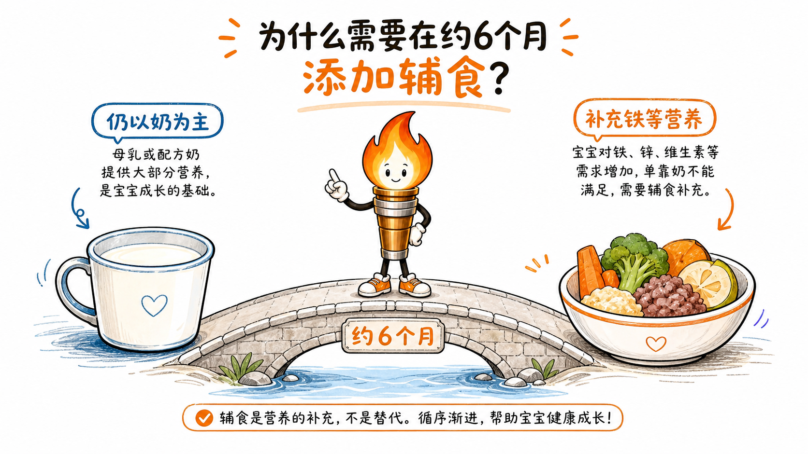

世界卫生组织（WHO）将“辅食”定义为：“当仅靠母乳（或配方奶）已无法满足婴儿营养需求时，需要添加其他食物和液体”的过程。辅食添加是宝宝成长过程中一个重要的里程碑，它不仅为宝宝提供成长所需的额外营养，更是训练宝宝咀嚼、吞咽等口腔精细运动技能，以及手眼协调能力的关键时期。

在世界卫生组织的母乳喂养指南中，辅食是相对于母乳的概念，是辅助母乳喂养的辅助性食物，因此，主食母乳依然是宝宝生长最重要的营养来源。因为缺乏科学喂养的认知，国人将辅食视为宝宝断母乳的起点，甚至有大量的谣言是讲辅食阶段的母乳不再有营养，结果就是 6～18个月成为婴幼儿营养不良的高发阶段。

<a id="point-06-002"></a>
### 扯淡的辅食信号

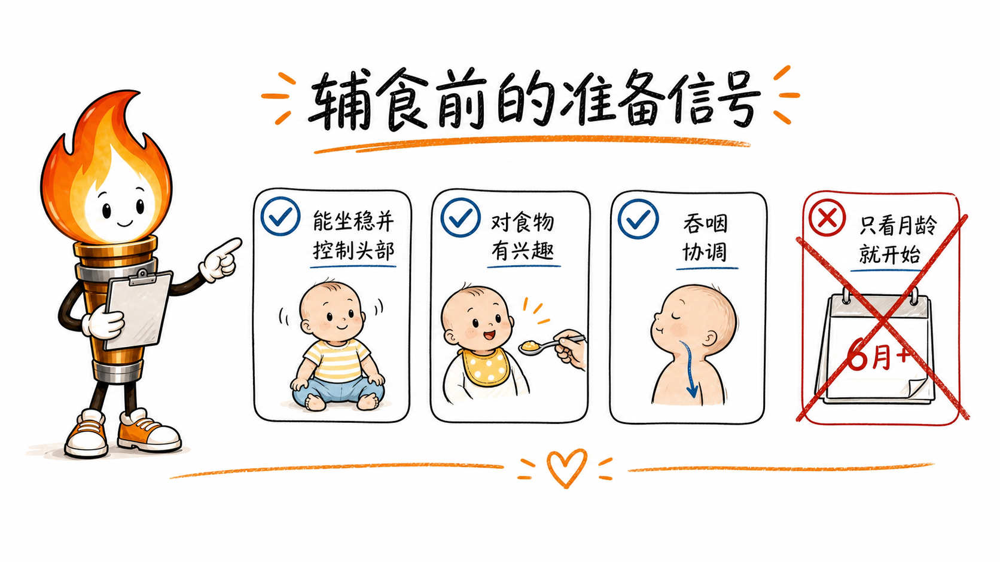

2025年，某度搜索辅食添加时间的首页结果依然没有一条正确的信息，国人依然生活在资本操控下的信息茧房中。我过去培训过2800多名持证的月嫂、育婴师，无一人能回答出辅食添加时间的正确答案。从儿科医生到家政培训老师都强调观察辅食添加的信号，这个概念是在误导父母，毫无科学依据可言，父母需要警惕。  
① 能独坐或借支撑保持直立，头颈控制稳定；  
② 看到勺子会主动张口；  
③ 对大人吃饭表现出强烈兴趣，尝试抓食或咀嚼动作；  
④ 一天内奶量达标（母乳 ≥ 8 次或配方奶 ≥ 700 mL）仍显饥饿信号。
宝宝会坐和发展里程碑有关，和是否要吃辅食是两个不同的概念；
宝宝表现出对吃东西的兴趣是从出生就有的原始本能，抓东西、咀嚼的动作都是口欲期的本能反应，和是否要喂辅食没有必然的联系；
母乳宝宝出生第一天的喂奶次数就不少于 8次，在宝宝的发展里程碑章节我会讲到一个螺旋上升的概念，每隔一段时间宝宝的吮吸时间会显著增加，这不是奶水不足，也不是要添加辅食，而是宝宝通过吮吸增加妈妈的泌乳量。至于人工喂养的奶水量就更荒唐了，肥胖宝宝是因为从出生第一天就被误导把胃撑大了，因此，很多宝宝不足4个月的奶量就已经超过700毫升，过早添加辅食只会让他们肥上加肥，最终导致短命。

<a id="point-06-003"></a>
### 辅食的添加时间：不早于6个月，不迟于9个月

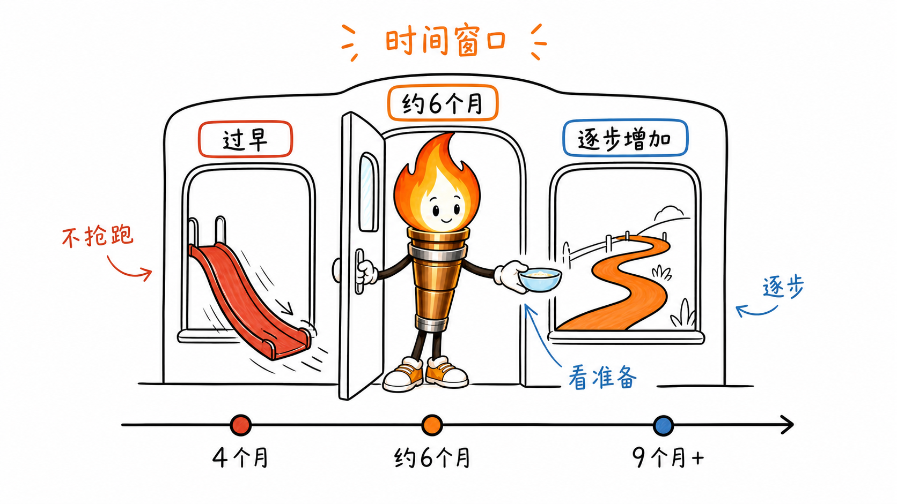

不早于6个月的科学依据

在纯母乳喂养的章节，我们强调出生至6个月要纯母乳喂养。因此，早于6个月的答案已经明晃晃的错了。世界卫生组织于1997年至2003年间联合联合国儿童基金会，在巴西、加拿大、加纳、印度、挪威和阿曼六国，筛选出8440名健康、接受母乳喂养的儿童进行系统随访，直至5岁（其中1743对母婴进行 0 - 24 月密集随访）。研究结果表明，纯母乳喂养的婴儿在生长发育、免疫力及智力发展方面具有明显优势，尤其在预防呼吸道感染和腹泻等常见传染病方面更为突出。纯母乳喂养不仅显著降低婴儿期疾病的发生率，还有效减少早期死亡风险。

因为父母被误导，导致大量的宝宝饱受过敏的折磨，这是因为在宝宝6个月前，肠道壁的缝隙很大，蛋白可以穿透肠道壁进入血液，触发人体免疫系统的防御机制。免疫系统一旦标记蛋白为入侵者，就会敌我不分的发起攻击，结果误伤自己。6个月后，宝宝的肠道织起一张保护网（仅有一层细胞的肠道保护膜）阻止蛋白穿过。 此时肠道开始大量分泌消化酶，这才是添加辅食的信号。在宝宝不具备消化能力时添加辅食，可能导致宝宝患上肠胃炎，并时常腹泻，还会增加婴儿得肥胖症、糖尿病、湿疹和乳糜泻的风险。

为何要不迟于9个月

12个月大的宝宝，60%～90% 的营养依然来自主食母乳。有些 9个月才添加辅食的父母咨询宝宝不爱吃青菜的问题，我通常解释有2种可能，一方面是喂养习惯的问题，早期的辅食偏荤食，久而久之宝宝习惯了吃肉，不喜欢吃寡淡的蔬菜了。还有就是味蕾的问题，蔬菜其实是偏苦味的，7-8个月时宝宝对蔬菜的苦味不敏感，常吃就习惯了蔬菜的苦味。但到 9-10个月时才添加蔬菜，因为宝宝对苦味比较敏感，就有点不太喜欢，这个时候只有做馅才能让宝宝多吃蔬菜了。
如今的父母更喜欢采购加工食品，不论是蔬果泥、还是米粉，我觉着这不是个好主意。辅食是宝宝认识固体食物的过程，固体食物除了形态，咀嚼有利于乳牙萌出与发育，天天喂加工食品的宝宝，1岁多还喜欢不咀嚼就整吞，不仅容易噎到，而且也不利于向成人食物过度。

<a id="point-06-004"></a>
### 早于 6个月吃辅食易肥胖

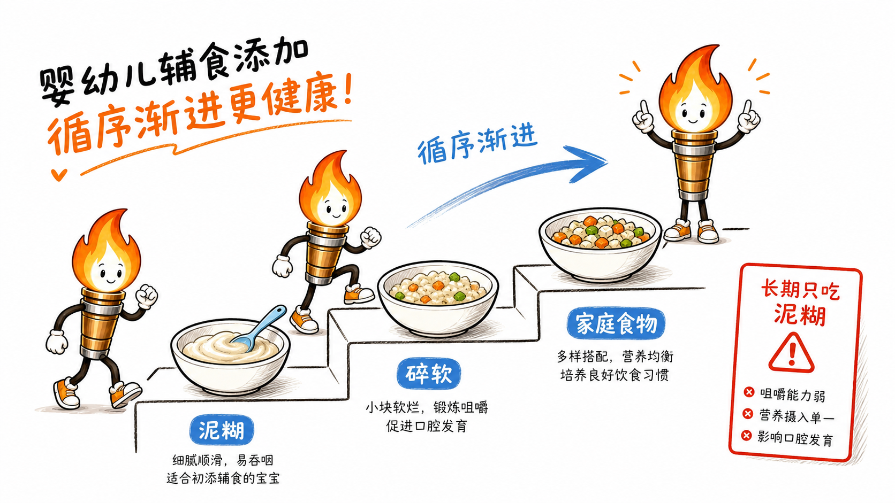

美国一项针对近 900名儿童的研究发现：那些4个月就开始吃辅食，到了3岁肥胖的风险会增加 6倍！研究认为，太早吃固体食物可能会干扰宝宝的饱腹机制，还可能让肠道和免疫系统“措手不及”，从而影响一生健康。
2013年3月21日，我儿子出生，就在同一天，《Pediatrics》（儿科学）杂志刊登了一篇研究性文章。由美国疾病控制与预防中心进行的调查涵盖了1334位宝妈。其中40%的受访者表示在宝宝未满4个月时就开始添加辅食，甚至有9%的人在宝宝4周大时就开始了。我儿子满月时，父亲也建议喂米油，我们为此发生了争执，他说是他把我养大的。我说养大和养好是两回事，我曾经饱受寻麻疹（过敏）折磨，我不想我的孩子再经历这些痛苦。调研中母亲们给不足4个月的宝宝喂辅食的常见理由，包括“我宝宝长得够大了”，“宝宝看起来很饿”，“我想让宝宝在夜里睡得久一点”，还有“某某医生或卫生保健专家说，我的宝宝应该开始吃辅食了”。这些错误的决策背后，其实和长期有预谋的软营销有关。我们去接种疫苗的医院长期推销婴儿米粉，恐吓父母早断奶，宝宝4个月就要开始添加婴儿米粉，以至于今天的父母都以为宝宝第一口辅食应该是米粉。

<a id="point-06-005"></a>
### 宝宝的第一口辅食

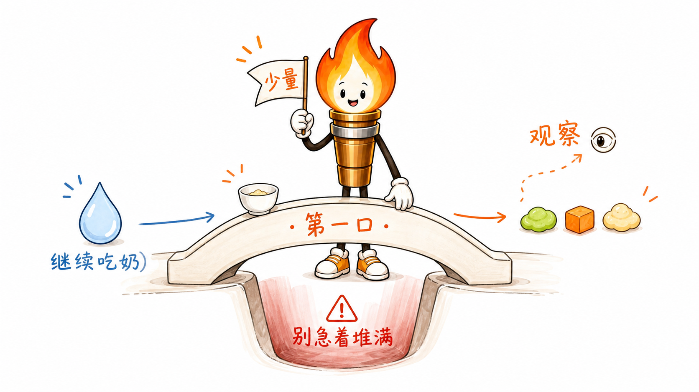

第一口辅食首选果泥
辅食的目的包括训练吞咽能力、补铁等，第一口辅食宝宝不一定吞咽，很可能会遇到挺舌反射。挺舌反射是婴儿的原始保护性反射，用舌头将送入口中的固体或半固体食物推出。出现挺舌反射说明宝宝还没有进入辅食期，得过两天再尝试喂食看情况。
辅食最开始是从1-2口食物开始的，过去尝试和训练吞咽最省事的方法是长辈咀嚼一口食物，然后用食指塞入宝宝的嘴巴，当然如今的我们听上去都觉着有点恶心，但这个经验我们可以保留，就是用小指刮一点香蕉泥喂给宝宝。宝宝喜欢甜的味道，母乳很甜，香蕉泥也很甜，宝宝通常是不排斥的。

宝宝吃下第一口辅食才正式进入辅食阶段，开始阶段的辅食依然建议以天然的果泥为主，可以是蒸熟的苹果或梨，省事就直接喂香蕉泥。建议继续喂果泥主要从两个方面考虑：首先果泥富含VC，VC能促进铁吸收。水果的铁吸收率排行中，苹果仅次于樱桃，排名第四。至于为什么要选择苹果、梨和香蕉，是因为它们不会过敏。另一个考量是减少便秘（积食上火）的发生率。在纯母乳喂养阶段，宝宝的肠道以双歧杆菌为主，双歧杆菌的丰度可达90%，一旦开始辅食，尤其是食物多样性之后，肠道迅速转为成人肠道菌群，菌群的种类变得特别丰富，便便也从水样的蛋花便向成型便便过度，即便是吃富含水溶性膳食纤维的果泥，宝宝的排便也发生了根本性的变化。只是和果泥宝宝柔软成型便便不同，吃米粉的宝宝大都出现严重的便秘。

我总是反复强调要吃天然的水果，天然的水果富含无机盐、维生素、纤维素以及花青素、茄红素、类黄酮等保健物质。加工的果泥辅食可能会流失掉一些营养物质，尤其是促进胃肠蠕动的水溶性膳食纤维。挑选天然的水果以自然熟为佳，自然熟不是说父母要去树上现摘，即便你在香蕉的产地，香蕉也是青的时候就砍下来存储，因为表皮发黄的香蕉2-3天就坏掉了。青皮的香蕉含有具有很强收敛性的鞣酸，可能会引起宝宝的便秘。我遛娃时随机在水果店买一根，给宝宝喂自然熟的水果只需要随身带一把不锈钢勺，去皮刮泥喂宝宝即可。喂香蕉前我会先尝一口，有些皮黄的香蕉也会有一股生香蕉的味道，我就怀疑含有鞣酸。有很多中医谣言，例如只能吃当地当季的果蔬，我喜欢购买当地当季的果蔬，因为便宜、更新鲜、更环保，和水果自身的营养及身体所需没有关系。曾经海员吃不到新鲜的果蔬纷纷罹患“坏血病”。18世纪，英国海军医生 James Lind 通过对照实验发现——柠檬和橙子能治坏血病。此后英国海军强制携带柑橘类，坏血病几乎绝迹。这是人类最早的循证营养学研究之一。

<a id="point-06-006"></a>
### 不过敏的辅食白名单

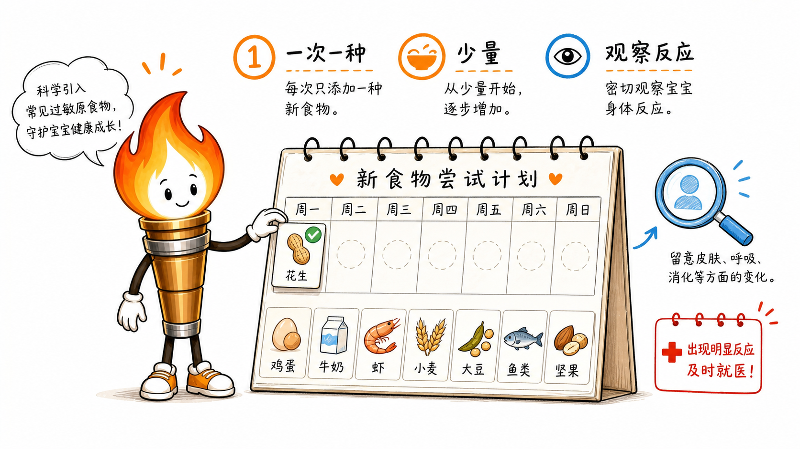

美国儿科医生西尔斯的《亲密育儿百科》结合美国儿科学会 50年经验制定了一份不过敏的宝宝辅食清单，这份清单极具参考价值。我曾经参考这份清单喂养我的儿子，只是我的儿子是个素宝宝，我们把清单中的肉蛋奶鱼剔除了。

6个月：苹果、香蕉、梨和米粥。

7-9个月：牛油果、土豆泥、桃、麦片粥、胡萝卜、南瓜、红薯或山药、稀释的梨或苹果汁（1:50兑水）。

9-12个月：小羊肉、小牛肉、豆腐、家禽、豆类、米糕、豌豆、蛋黄、麦片粥、奶酪、菠菜、酸奶。

12-18个月：全脂牛奶、杏、西红柿、脱脂软干酪、葡萄柚、冰淇淋、葡萄、整蛋、草莓、牛肉、三文鱼、面食、全麦饼干、西兰花、菜花、小麦、瓜类、蜂蜜、芒果、薄烤饼、猕猴桃、松饼、百吉饼（外形像甜甜圈的面包）、木瓜。

18-24个月：三明治、果酱、混合饮料、营养布丁、汤、蘸料、炖菜、调味酱、调味料。
---
<a id="point-06-007"></a>
### 辅食的注意事项

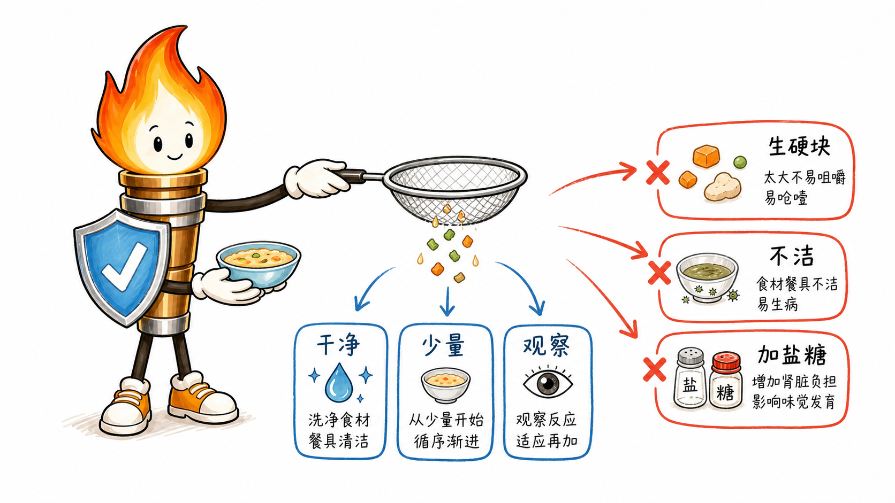
WHO和UNICEF于2003年联合制定的《全球婴幼儿喂养战略》强调了两个关键点：
营养在婴儿早期月份和年龄阶段至关重要；适当的喂养方式对于实现最佳健康至关重要。

饮食选择与禁忌
父母决定宝宝的口味：少给宝宝吃精加工食品。例如，主要成分是肉的香肠被世界卫生组织认定为致癌物；市售白面包高糖、高脂、缺乏营养。

绿叶蔬菜：7个月大的宝宝就可以添加绿叶蔬菜。但要避免粗纤维多的食物，如芹菜和带皮的扁豆，它们容易噎到或卡住。若要喂食，芹菜需剥皮抽筋，扁豆需压扁成泥。

1岁前禁忌：
浆果：易致急性过敏症状。
牛奶、蛋清和面食：易致宝宝过敏。
蜂蜜：含有危及1岁前宝宝健康的致病菌。

1岁半前禁忌：
盐：会增加肾脏负担。
糖：易致宝宝挑食，且甜食和面包的糖和脂肪通常高达50%，是典型的垃圾食品。
饼干：吃多了会上火，推荐用水果替代饼干和零食。冷冻香蕉是极佳的磨牙饼干，可缓解宝宝出牙不适，口感类似冰淇淋，担心冷食对宝宝肠胃影响是多余的，反而长期喝温热水的人身体较差（60度热水是一类致癌物，易致食管癌）。

1岁后受欢迎的食物：O形麦圈、煮熟去壳豌豆、无盐米糕、熟透梨片、煮熟胡萝卜丁、切片全麦面包、煮熟意大利面、全麦百吉饼、豆腐块、炒鸡蛋、煮熟绿豆、法式面包、牛油果块或酱。

1岁后最容易哽咽的食物：果仁、种子、整粒葡萄、爆米花、大块或整条香肠、粗纤维多的食物（如未处理的芹菜和扁豆）、硬豆子、肉块、生胡萝卜。

固体食物与咀嚼：长期喂固体食物的宝宝更懂得咀嚼，而长期吃婴儿米粉的宝宝则不懂得咀嚼，更容易噎到。

辅食喂养原则
食物选择：挑选清淡、易咀嚼的天然食物。
自主进食：鼓励孩子自主吃辅食，不要介意他们弄得一团糟，这是宝宝练习技能和开发智力的过程。
尊重宝宝：尊重宝宝的食量，不强迫多喂。
按需喂养：少食多餐，饿了就吃，而不是定时定点。

卫生习惯：
避免使用一次性筷子，其不干净且可能含硫化物。
避免使用美耐皿（密胺）碗，长期使用或热食可能释放甲醛，建议选用不锈钢餐具。
避免用塑料袋装热食（如热包子），有毒。
用手接触塑料制品（如自行车把、汽车方向盘）后，接触食物前务必洗手，避免塑化剂残留。
桶装水桶会释放双酚A，需注意其危害。

辅食与健康习惯
长期影响：辅食和宝宝日后的饮食习惯息息相关。
健康饮食：爱吃水果和青菜的孩子更健康。
咀嚼的重要性：咀嚼对于乳牙萌出和换牙至关重要，因此不推荐宝宝长期食用精加工的婴儿米粉，而是鼓励多吃需要咀嚼的天然食物（例如土豆泥）。
进食姿势：宝宝一边玩一边吃东西时，要注意不要躺着进食，容易噎到。
食物量：一次性不要给宝宝太多食物，他会把食物撒一地。

<a id="point-06-008"></a>
### 有关辅食的注意事项

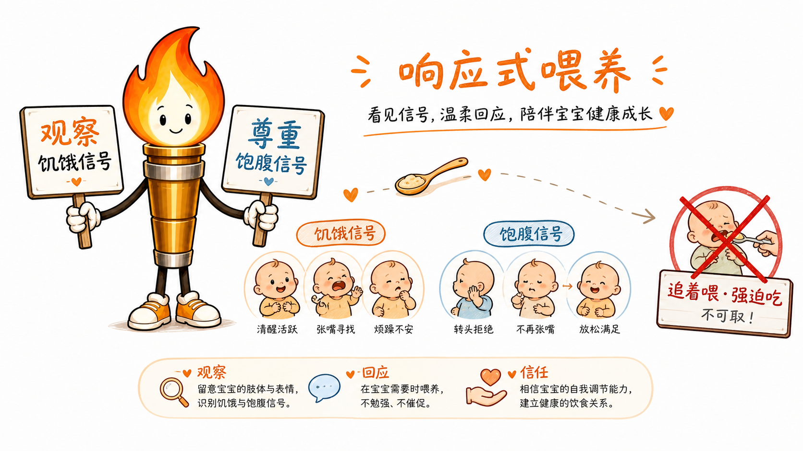

补铁是辅食的目的之一
满 6个月的宝宝对铁的需要有所增加，全世界各地的宝宝普遍存在铁储备下降的情况，补铁也成为宝宝添加辅食的目的之一。铁是身体所有器官生长和生理功能运行的必需成分，其中对宝宝的智力发展和骨骼生长至关重要。

大多医生不懂营养
说到辅食添加，很多母婴博主喜欢搬出《居民膳食指南》，《指南》是个金字塔，底部是主食、中部是蔬果，顶部是肉蛋，现实中真的没有人按照《指南》饮食，反而越来越多的人长成金字塔的样子。《膳食指南》最初来自美国农业部，制定标准的专家则来自食品企业的代表。《中国居民膳食指南》由中国营养学会发布，中国营养学会是由食品企业和营养师组成的团体，中国营养师几乎唯一的生存之路就是销售保健食品。公众认为医生（包括中医）都是懂营养的，其实营养是前沿科学，和中医是完全不同的宗门。全世界的医学院也大都不学营养，有营养课的也不超过20个小时。因此，医生的营养知识主要来自度娘，而度娘是非常不靠谱的知识来源。

传统的第一口辅食
各国从1990年开始落实纯母乳喂养至今已有 35年历史了，虽然口头上一切为了孩子，实际上太多医生将孩子视为自己的提款机。2000年的数据，4个月全母乳喂养率80%，母乳喂养最后的高光时刻，之后的数据就一路断崖式下降。2000年之前咱们一直遵循全母乳喂养的传统，全和纯一字之差，规则则差之千里。过去宝宝的第一口辅食是不迟于4个月，主要以米油、蛋黄、红肉泥或肝泥、面条为主。
1、米油，纯纯的碳水化合物，既不含铁，也缺乏蛋白质等营养，但却含有重金属。2017年发表于《Journal of Agricultural and Food Chemistry》（国际农业和食品化学）的一项国际研究发现——婴儿米制谷物中的甲基汞含量显著高于其他类型婴儿谷物。研究人员检测了119份婴儿谷物样本，发现米基谷物中甲基汞（MeHg）平均含量约为1.61 µg/kg，最高可达13.9 µg/kg，而非米基谷物的含量几乎可以忽略。另一项研究还指出，米粉和米饼中的甲基汞平均值分别是小麦或燕麦谷物的61倍与92倍。
甲基汞是一种可在人体内蓄积的神经毒素，对婴幼儿正在发育的脑神经系统尤其敏感。长期摄入虽量小但持续的汞暴露，可能影响宝宝的认知、语言和运动发育。
2、蛋黄，富含胆固醇和饱和脂肪，增加了宝宝代谢的负担。蛋黄中的铁和蔬菜是一样的非血红素铁，依赖维生素C 的促进吸收，因此，吃蛋黄补铁还不如烫点菠菜。
3、肉肝泥，富含血红素铁，理论上可以快速补铁。但过量摄入血红蛋白（Hb）既可能导致铁中毒，也可能诱发很多疾病。例如多项研究都发现，普通人群中 Hb 较高（在正常范围内偏高）与代谢综合征、肝脂肪浸润、2型糖尿病、心血管死亡率上升相关。过去脑梗只发生在老年人身上，如今有媒体报道 6岁女童发生脑梗，大概率是从小就过量摄入血红素铁。2014年，世界卫生组织旗下的癌症委员会将红肉和加工肉列为高等级致癌物。红肉致癌主要还是因为其中的血红素铁，长期过量摄入可能诱发直结肠癌。
4、面条，在中国仅次于牛奶和鸡蛋的第三大过敏原，科学辅食清单中，小麦制品要等到孩子12个月以后才添加，这样就不会发生小麦过敏的风险。

植物营养与健康
吃肉才能补铁，素食营养不全面的观念是资本长期营销形成的错误认知。美国营养与饮食学会和加拿大营养师协会的研究（2003/2009/2016）表明，只要科学规划，素食（包括严格纯素）是一种健康、安全、营养均衡的饮食方式，适用于全生命周期人群，包括孕妇、哺乳期妈妈、婴幼儿、儿童、青少年、成年人、老年人和运动员。
想尝试纯植物性饮食可以认真阅读养生的章节，人类的肠道更喜欢天然食物，而非加工食品，警惕那些推销保健食品和补充剂的营养师，他们只是打着为你好旗帜的推销员。

强化铁的米粉
国人的饮食存在显著的地区差异，例如南方人喜欢吃米，北方人喜欢吃面，广东人喜欢清淡，四川人喜欢麻辣，但宝宝的第一口辅食，国人出奇一致的选择了婴儿米粉。为什么呢？因为资本把国人困入了信息茧房。从 2014年开始，父母耳边不断地回响着“第一口辅食要吃米粉”，进口米粉企业借由母婴类、健康知识类博主和宝妈群辅食理念普及传播，辅食品类迎来真正意义的市场教育和高速发展，市场份额应该在50%左右。美国辅食市场泥类佐餐辅食（蔬果泥）和零食类辅食（泡芙、磨牙棒）占比高，饱腹类辅食（谷、米粉）占比较少。国人热衷饱腹类辅食有一个潜在原因是急于断奶，老美的米粉占比低是担心重金属风险。
大米是最不易过敏的食物，因此适合做第一口辅食，但大米的铁含量极低，可以忽略不计，因此又不满足辅食补铁的目的，于是食品企业想到了添加铁剂。铁剂有很多种，一般食品工业添加的铁剂分为二价铁和三价铁，二价铁在临床上最早、应用也最广泛，通过小肠吸收率相对较高，但副作用较为明显。三价铁需要先在胃酸或维生素 C 等还原剂的作用下还原成二价铁才能被有效吸收，制备过程中需要更复杂的工艺来提高生物利用度、降低胃肠道刺激或改善口感，这往往会增加其生产成本。但不论是二价，还是三价，强化铁剂并非自然界存在的铁的形式。研究表明，其吸收效果不及红肉、肝脏等天然食物。
米粉作为辅食也存在两个不能回避的问题，首先是易上火便秘的问题，当宝宝嗯呀几天拉不出屎时，父母容易慌了神；其次则是真正的问题，水稻这种农作物有一个特性，喜欢富集重金属，因此，所有的大米制品都含有重金属，不论是你爷爷种的，还是有机大米制品，统统含有重金属。我们国家曾经搞过污水灌溉，至今土壤的重金属调查数据都是国家机密，媒体也时常爆出大米重金属超标，出口欧盟的米制品被退回等等，重金属检测合格的米制品对成人是安全的，但对婴幼儿则存在较高的风险，铅、镉、砷、汞等有毒重金属对成长中的婴童智力、骨骼影响较为明显。美国《消费者报告》（最权威的第三方检测机构）、FDA（美国食品药品监督管理局）和AAP（美国儿科学会）都严重关切米粉重金属议题，并建议每周食用不超过2次才是安全的。

---

<a id="chapter-07"></a>
## 07 人工喂养与替代喂养


<a id="point-07-001"></a>
### ☑️人工喂养

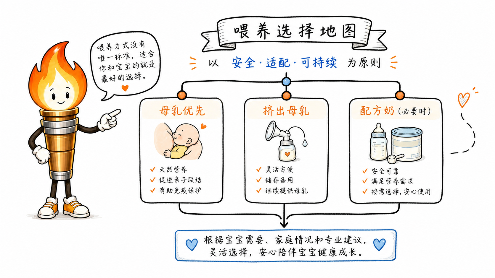

19世纪英国工会活动家 托马斯·J·德宁说过：“有50%的利润，资本就铤而走险；有100%的利润，资本就敢践踏一切法律；有300%的利润，资本就敢犯任何罪行，甚至冒绞刑的危险。” 

有行业负责人爆料，一罐终端售价398元的配方奶粉，其成本不足40元。很多宝妈撇家舍业为宝宝赚奶粉钱，其实就150元的成本，又没有陪伴宝宝成长，真心不值。格兰特利·迪克·里德在1955年出版的《无忧分娩》中有这样一句话：新生儿只有 3 种需要：温暖地待在妈妈怀里；从妈妈的乳房获得食物；因妈妈的存在获得安全感。孩子真正需要的是待在妈妈怀里，从妈妈的乳房获得食物，因妈妈的存在获得安全感。可是面对加价近900%的配方奶粉，怀胎10月，辛苦把娃生下来的母亲们没有因此愤怒，似乎还在攀比谁交的智商税高。2014年时，英国一罐奶粉89元、荷兰90元。2024年英国配方奶粉平均价格约为每罐11.99英镑，部分产品达到18英镑，即便价格上涨了近四分之一仍然不及我们的价格高。而人家物价上涨是因为疫情发钱导致通胀。

中国的劳动供养比仅约为1.1，也就是1名劳动者养活自己之外，根本剩不下多少钱。如果确实因为生活所迫必须要返岗，那也是残酷现实中孩子的命，谁让咱们生在这个社会。

<a id="point-07-002"></a>
### 奶粉的选择

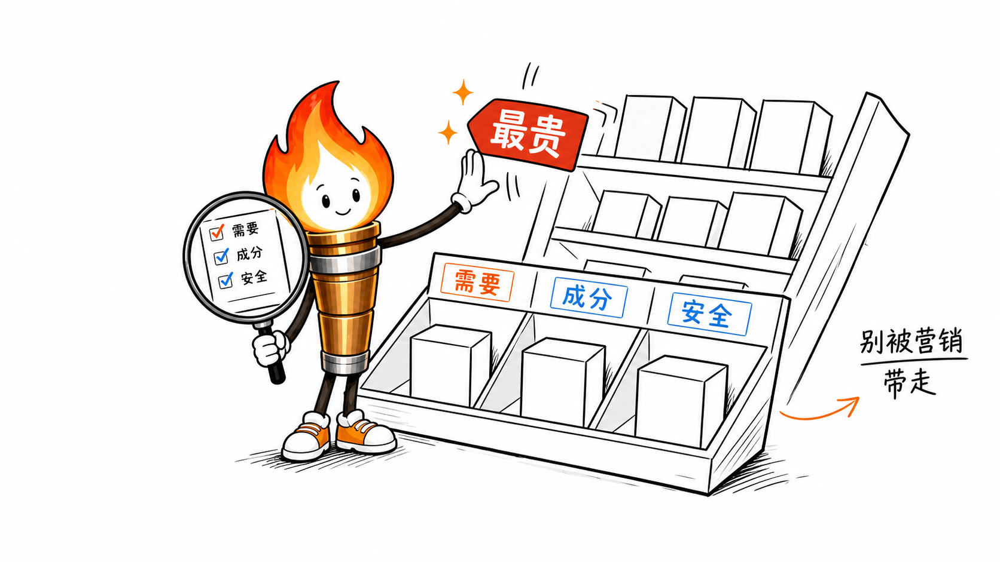

婴儿配方奶粉的生产受国家严格监管，必须执行国家**强制标准**（如 GB 10765《婴儿配方食品》、GB 10766《较大婴儿配方食品》。标准详细规定了能量、蛋白质、脂肪、碳水化合物、维生素、矿物质等必需成分的含量范围与比例。只要产品符合并通过国家抽检，就说明它能满足婴儿正常生长发育的基本营养需要。

不同品牌之间所谓的“配方差异”，主要集中在“可选成分”，如：DHA、ARA、益生菌、核苷酸、OPO结构脂、乳铁蛋白等。这些添加物在广告营销下似乎对孩子成长极为重要，但如此重要的营养为什么不是必须成份？因为中国的奶粉广告本身就违反了国际母乳代用品规定，广告中那些声称对孩子无比重要的营养物质并没有确凿证据证明其宣传的功效，如若真的对婴童的健康必不可少，必将强制纳入国家标准。愚钝的父母们，这个道理你们想的明白吗？

因此，从科学与法规角度而言：凡符合国家标准、正规渠道销售的配方奶粉，其营养价值都满足宝宝的基础营养需要；所谓的“高端”、“适合中国宝宝”“专利配方”，更多是“违法”宣传，而非营养本质差异。你为可选成份付出的溢价就是纯纯的智商税，而真正全面的、为宝宝量身定制的高级营养无需花钱购买，它就来自母亲的乳房。母乳中含有的营养物质超过 400种，而奶粉的所有营养都写在了奶粉罐上，总数不超过 40种，而且即便都是营养补充剂的形式，而非营养。

<a id="point-07-003"></a>
### 婴儿配方奶粉的历史

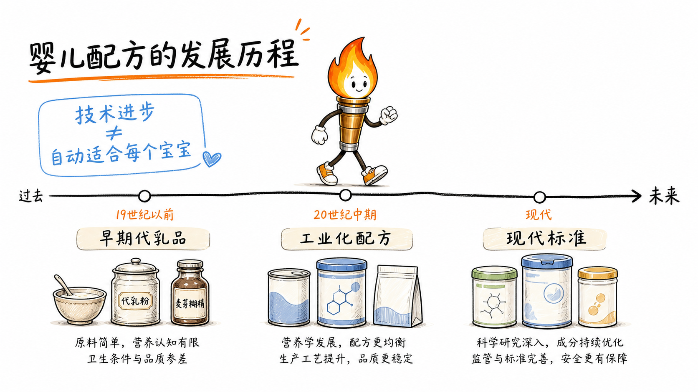

母乳是婴儿成长的最佳食物，没有之一。中国的很多皇帝是由奶妈抚养成人，例如乾隆。末代皇帝溥仪吃奶 9年，也是奶妈带大的。然而，总有人不能母乳喂养，又请不起奶妈，于是就食用家畜的奶，未经消毒的动物奶可能导致脱水、消化不良以及较高死亡率，时间到了19世纪，最早的母乳代用品开始出现。

德国科学家约翰·弗朗茨·西蒙于1838年发布了第一份比较人奶与牛奶的化学分析报告。该报告显示，牛乳的蛋白质含量高于人乳，而碳水化合物含量则较低。他假设，牛奶蛋白质所产生的凝乳比人乳大，导致了牛奶喂养婴儿所经历的耐受性问题。这项开创性的研究相当于提出了母乳代用品的构想，以牛奶等基础原料为基础，然后模仿人乳添加各种营养素。

第一款商业化的婴儿配方奶粉是由德国化学家尤斯图斯·冯·李比希于1860年开发的，这是一种由牛奶、小麦粉、麦芽粉和碳酸钾混合而成的粉末，与加热后的牛奶混合使用。其他动物奶也曾用于制备婴儿配方奶粉，但因为牛奶最容易获得而成为日后的标准。商业化婴儿配方奶粉首次出现在19世纪，但它的广泛使用又经过了100年时间，主要由于成本问题。1869年，李比希的可溶性婴儿食品每瓶售价1美元。而在1870年代，雀巢推出了首款营养全面的婴儿配方浓缩奶粉，售价为每瓶50美分，早在1892年，雀巢就在中国卖起了婴儿奶粉，1908年还在上海设立了办事处。新中国建立后，没有奶水的父母就给宝宝喂米汤和蔬菜粥，婴儿死亡率一度高达20%，直到1954年，才有了上海益民食品厂生产的乳儿配方代乳粉。

1883年时，已经出现了27个不同专利品牌的婴儿食品，但那时的配方奶粉的营养都不够全面，许多配方缺乏足够的蛋白质，而且没有添加微量营养素。到了19世纪末，医生们开始积极参与婴儿营养学的研究。美国儿科医生托马斯·摩根·罗奇博士开发了“百分比法”，这是一种为单个婴儿调整牛奶配方的方法。医生们通过监测婴儿的粪便来调整奶粉的成分比例。这种个性化的科学喂养方法在1893年到1915年期间广受欢迎，但这样搞太费劲，于是医生推荐了一种更简便的配方，父母们可以在家自制。在20世纪60年代之前，几代父母都用蒸发乳、清水和糖来制作自制婴儿配方奶粉，直到商业化婴儿配方奶粉的大规模生产使其更加方便且价格更实惠。以牛奶为基础的婴儿配方奶粉长期主导着全球市场。大豆奶也被用作配方基础，为那些寻求非牛奶替代母乳的家庭或有特定医学需求的婴儿提供选择。

<a id="point-07-004"></a>
### 美国婴儿配方奶粉法规的历史

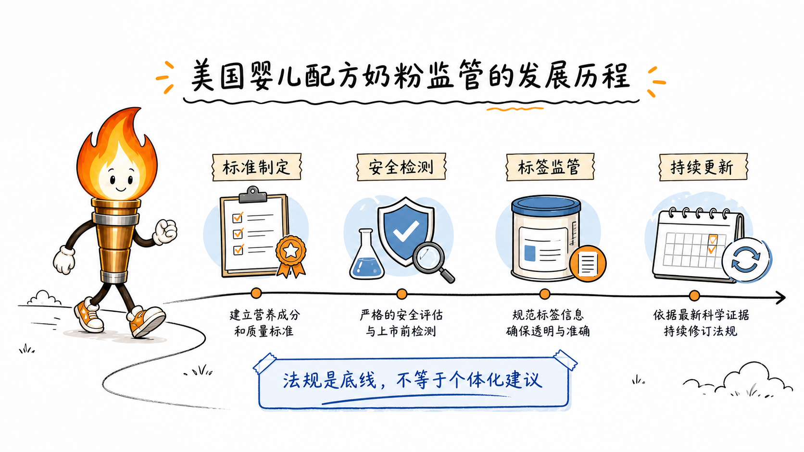

美国儿科学会（AAP）营养委员会在1967年制定了婴儿配方奶粉中的维生素和矿物质成分的首次指导方针，并在1969年制定了铁强化的规定。其他组织也发布了关于配方成分的一般性指导方针。然而，在1978年至1979年期间，141名婴儿因食用两种不同品牌的大豆配方奶粉而发生低氯性碱中毒，这一事件促使1980年《婴儿配方奶粉法案》（IFA）的出台。该法案要求FDA对在美国销售的婴儿配方奶粉的成分和生产进行监管。《婴儿配方奶粉法案》于1986年进行了更新，最近一次修订是在2014年。

我为什么要讲美国的婴儿配方奶粉的法规历史？因为中国缺乏本土母乳研究基础，中国的企业和国家标准都是追寻人家的脚步，起步时学习先进经验没有什么好丢人的，反而是负责任的态度。婴儿配方奶粉现在是全球监管最严格的食品产品之一，各国之间对营养成分的标准仅有细微的差别。例如日本的配方奶的碘比我们的要低，因为日本人大量使用海带等富含碘的食品，基本不存在碘缺乏的问题。

要在美国合法销售和推广婴儿配方奶粉，产品必须通过全面的营养成分测试，所有成分都必须经过GRAS（公认安全）认证，并在临床试验中证明能够支持婴儿的正常生长，同时提交生产安全证明。婴儿配方奶粉必须包含30种营养成分，并在规定的最小和最大水平之间。FDA注册过程耗时且成本高昂，且每年必须接受安全检查。因此，在中国已经卖了十几年的婴儿配方山羊奶，直到2024年1月才在美国市场出现。历史上，美国儿科学会（AAP）批准的婴儿配方奶粉选项主要是基于牛奶、大豆的奶粉或特殊配方奶粉。在2023年，FDA和AAP都更新了指南，推荐父母们可以将山羊奶作为婴儿配方奶使用了。

<a id="point-07-005"></a>
### 豆奶、牛奶和山羊奶基配方奶粉选择

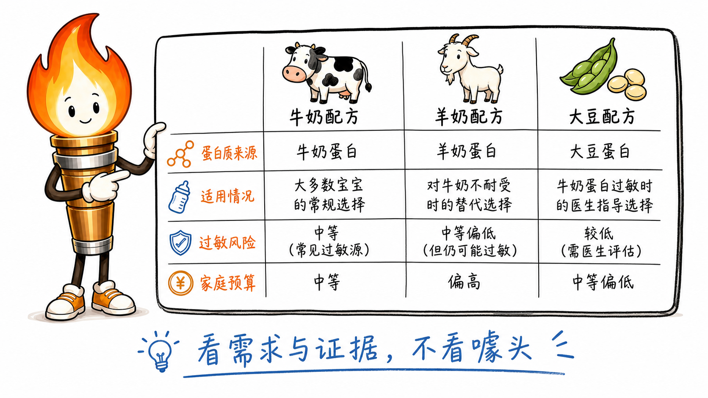

母乳是婴儿最理想的食物，它提供了婴儿生长发育所需的全部营养物质，并有助于增强婴儿的免疫力。世界卫生组织建议，在婴儿出生后的前六个月进行纯母乳喂养，并持续母乳喂养至两岁或更长时间。 然而，由于各种原因，一些父母无法进行母乳喂养，于是欧美开始流行捐赠母乳，父母们可以花钱购买巴氏杀菌的捐赠母乳。因为是类似献血的捐赠母乳，捐赠者会避免捐赠含有毒素或药物残留的母乳，因为捐赠奶是用于脆弱的宝宝。因此，捐赠母乳是不能亲喂母乳宝宝的最佳选择。但在中国，大部分父母更倾向于婴儿配方奶粉，甚至有父母认为母乳不如奶粉营养。

婴儿配方奶粉虽然只是婴儿生存的基础营养，但都是严格按照各国的强制标准生产的，因此，所有合格的产品，配料表虽然存在差异，但所提供的营养是类似的，都能满足小宝宝的基本生存需要。

牛奶基婴儿配方粉是最成熟的品类，主要缺点是牛奶蛋白过敏和乳糖不耐受的问题。山羊奶基婴儿配方粉在营销上强调其比牛奶含有更多A2 β-酪蛋白，所以相比于牛奶更低致敏性。相比牛奶还含有更少α-s1 酪蛋白，脂肪球只有牛奶脂肪的三分之一大小，所以更易消化。这些宣传的研究样本普遍不多，有的就几十个，研究的经费则是由山羊奶合作社或者是产业相关的政府基金提供的经费，因此可信度较低。从用户反馈数据看，确诊牛奶过敏的宝宝不必尝试羊奶粉，因为山羊奶只是含有更多的A2 β-酪蛋白，但并没有去除致敏的A1 β-酪蛋白。至于羊奶粉更接近人乳的宣传如果出现在欧美早就被罚到破产，人乳的核心是人乳乳清蛋白，酪蛋白早期占比20%，后期占比40%，人乳的营养不仅是动态变化的，而且人乳的蛋白和动物乳就不是一个东西，就像山羊奶宣称和牛奶不同一样。对牛奶过敏或乳糖不耐受的婴儿，可以尝试大豆基婴儿配方粉，这种植物营养的配方奶粉在欧美远比中国流行，在中国我都没有见过真实的产品，背后应该和中国父母觉着大豆不够高端有关，但一个残酷的现实是乳制品中的酪蛋白是癌细胞生长最重要的营养，这就是为什么不抽烟、喝酒，没有工作压力和交际应酬的儿童，会成为中国肿瘤发病率最高的群体的原因。

<a id="point-07-006"></a>
### 水解与氨基酸奶粉

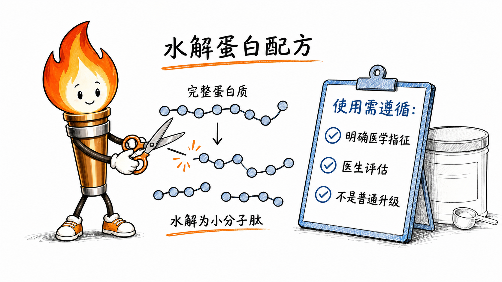

对于乳糖不耐受或过敏的宝宝，最应该转换的是水解或氨基酸奶粉。普通奶粉、水解奶粉和氨基酸奶粉。它们的区别在于牛乳蛋白经过了不同程度的处理，以降低致敏性。了解这些区别有助于过敏宝宝的父母根据需要选择合适的奶粉，避免被卖奶粉的忽悠。

普通奶粉：使用的是正常的牛奶蛋白。生产过程中通常对牛奶进行巴氏杀菌或超高温瞬时灭菌（UHT）以消除病菌，然后添加碳水化合物、脂肪、维生素和矿物质等成分，喷雾干燥成奶粉。其蛋白质以完整形式存在，包含大分子的乳清蛋白和酪蛋白成份。适合不能进行母乳喂养，同时没有牛奶过敏的宝宝。

水解奶粉：将牛乳蛋白经过酶水解工艺，也就是预先将大分子蛋白切割成较小的肽段，目的是降低致敏性。水解程度有“部分水解”和“深度水解”之分：部分水解（又称HA奶粉）通常蛋白质分子较普通奶粉有所变小，但还有一定较大肽段；深度水解则更彻底，将\>95%的肽段降至3000道尔顿以下的分子量。生产水解奶粉时，厂家会严格控制酶的种类、作用pH、温度和时间，以达到所需的水解度和肽段大小分布。例如，研究显示在碱性蛋白酶、pH约8、温度约60℃条件下水解2小时左右，可得到适宜大小的多肽，同时避免产生过多游离氨基酸（过多游离氨基酸会导致苦味）。水解后通常还会通过加热杀菌终止酶反应，并可能采用超滤技术去除残余的大分子片段。不同厂家的工艺有所差异，因此市售的水解奶粉在肽段分子量分布、残余致敏蛋白含量等方面可能存在差异。总体而言，水解奶粉的蛋白质已经被预消化为小片段，大幅降低了引发过敏的可能。需要注意“部分水解配方”并不适用于治疗已确诊的过敏，而深度水解配方（EHF）才被视为“低致敏”用于治疗目的。

氨基酸奶粉：氨基酸配方是将牛奶蛋白完全去除，仅保留构成人体蛋白的基础单位——游离氨基酸。换言之，其中不含任何完整的牛奶蛋白或肽段，蛋白质营养完全由合成的氨基酸混合提供。这类奶粉针对极重度的牛奶蛋白过敏宝宝或对水解奶粉仍过敏的情况。氨基酸原料通常由工业发酵或化学合成获得，纯度很高。由于游离氨基酸本身带有苦味且配方缺少天然乳蛋白的风味，生产商会采用风味遮蔽和微囊化技术改善口感。例如，有专利方法通过调节配方pH到6.8～7.2来减轻氨基酸配方的苦味；也有在氨基酸外包裹一层无味物质（微囊化）或添加适宜的天然香料来掩盖异味。这使得尽管氨基酸奶粉闻起来或尝起来依然与普通奶有所不同，但大多数宝宝可以接受。氨基酸配方的生产也需经过严格的无菌工艺和质量管控，以确保完全不被牛奶蛋白污染————通常生产线与其他含奶制品分开，避免任何微量交叉接触。

总的来说，这三种配方的差异可以理解为：普通奶粉提供完整蛋白质，营养全面但对过敏儿不友好；水解奶粉把蛋白“预消化”成碎片，极大降低了过敏原性又保留了基本营养；氨基酸奶粉则彻底拆解为最小单位，几乎杜绝了过敏风险。

<a id="point-07-007"></a>
### “低过敏”标签标准与检测方法

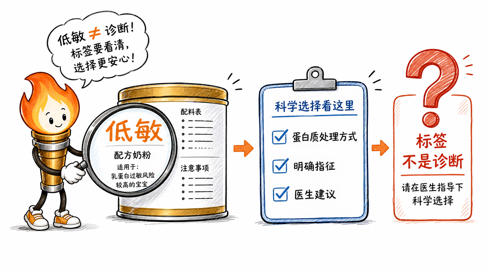

当奶粉被标称为“低过敏性”时，意味着它已经过严格测试，绝大多数对牛奶过敏的婴儿食用后都不会发生过敏反应。欧美对于“低过敏”配方有明确标准：通常要求在临床试验中至少90%的确诊牛奶蛋白过敏婴儿食用该配方不出现过敏反应，且有95%信心水平保证。这一标准最早由美国儿科学会（AAP）和欧洲过敏学会等机构提出，用于区别真正低敏的医疗配方。

具体而言，要获得低过敏认证，配方奶必须经过以下评估：
临床喂养试验：在至少两个独立中心，对一组牛奶蛋白过敏婴儿进行喂养测试，观察过敏症状。只有满足“90%婴儿无不良反应”的严苛条件，才可称为低过敏。消费者一定会遇到号称深度水解的产品，但未正式临床验证，可能仍引起过敏反应。

体外残留过敏原检测：使用物理化学和免疫学方法检测配方中的残留牛奶蛋白抗原。例如，通过分子筛或凝胶电泳（SDS-PAGE）测定肽段的分子量分布，通过免疫印迹或ELISA测定是否存在可被牛奶过敏患者IgE抗体识别的残余表位。一些检测包括用过敏宝宝的血清做IgE结合抑制实验，看看配方中的蛋白质是否还能结合IgE抗体。理想的深度水解配方应当检测不到主要致敏乳蛋白如β-乳球蛋白（BLG）和酪蛋白的残留或仅有痕量。例如一项对市售深度水解奶粉的调查发现，不同品牌之间差异很大：约20%的样品中β-乳球蛋白含量低于检测下限(\<0.01 mg/kg)，其余80%样品则能测出一定量BLG，最高甚至达每公斤36毫克。这提示并非所有标称“深度水解”的产品都同样低敏，如果您购买的低敏奶粉吃了依然过敏，那就继续换品牌吧。

工艺与质量控制：监管机构和专家也强调生产过程的质量控制，如要求专线生产（避免与普通奶粉共线造成污染）、对每批次进行抗原含量测定等。一些专业指南建议制定更严格的行业标准，明确深度水解配方的技术指标和标签要求，并建立产品数据库追踪过敏反应报告。
需要注意的是，“低过敏”并不等于“无过敏原”。除了氨基酸配方是纯氨基酸不含乳源蛋白外，任何水解配方仍可能含有微量残留的牛奶蛋白片段。这些残留肽段虽然绝大多数宝宝不敏感，但对极少数高度敏感的个体仍可能触发反应。因此，医学上只有氨基酸配方可以说是完全不含牛奶过敏原，其余水解配方只能称为低致敏风险而非百分之百无过敏风险。这也是为什么对极重度过敏患儿，医生会直接选用氨基酸配方保险起见。
总之，欧美市场上能够贴“Hypoallergenic低致敏”标签的奶粉，一定是经过了严格临床验证和实验室检测的深度水解或氨基酸配方。家长在选购号称低敏的配方时，应了解这一认证背景，不要将母婴店员声称“易消化”的部分水解奶粉误认为是治疗过敏用的低致敏配方，国内销售人员为了业绩不负责任推销是常态。

营养消化吸收与代谢差异
配方的蛋白形式不同，会影响宝宝的消化吸收速度和代谢反应。父母可能注意到，不同奶粉会导致宝宝排便性状、饱腹感等有所区别，这都是蛋白消化差异的体现。

普通奶粉的消化：含有完整大分子蛋白质（平均分子量在数万道尔顿以上）。宝宝喝下后，需要经过胃肠道自身的酶（如胃蛋白酶、胰蛋白酶等）逐步将其分解成小肽和氨基酸再吸收。这一过程较为缓慢、均匀，所以普通奶喂养的宝宝通常在胃里滞留时间略长，提供较长的饱腹感。完整蛋白消化后吸收入血的氨基酸是逐步释放的，血浆氨基酸峰值相对较低且平稳。正常情况下，这种吸收模式不会给代谢带来负担。但对于牛奶蛋白过敏的孩子，他们的免疫系统会错误识别这些完整蛋白为“入侵者”，从而引发过敏反应。

水解奶粉的消化：由于蛋白预先被酶切成了较小的肽段，相当于帮宝宝部分完成了消化步骤。因此水解奶粉通常更易消化、更快吸收。特别是深度水解配方中，大部分肽段分子量在1000-3000道尔顿以下，很多成份无需过多分解就直接穿过小肠黏膜被吸收。这意味着宝宝喝水解奶后，氨基酸/小肽更快进入血液。研究表明，喂养水解配方的婴儿，其血液中的某些氨基酸浓度高于母乳喂养婴儿，例如苏氨酸、缬氨酸、苯丙氨酸等水平显著升高。同时，因氨基酸过量吸收，部分会以尿素形式代谢排出，故水解配方喂养婴儿的血液尿素氮（BUN）水平也可能偏高。这些指标反映水解奶提供的氨基酸相对“富余”，吸收利用率很高但一部分被当作代谢废物处理掉。这并不表示有害，但提示水解蛋白含量可能过高或吸收过快。为此，有专家提出水解奶粉应调整并平衡氨基酸组成和总量，以更接近母乳的氨基酸谱和负荷。在实际配方中，厂家会确保必需氨基酸含量充足的同时，适当控制总蛋白量，使之不至于产生过多代谢负担。

氨基酸奶粉的消化：氨基酸配方是完全消化状态——所有蛋白质营养已经是游离氨基酸。它几乎不需要胃蛋白酶或胰蛋白酶作用，直接在小肠就可以迅速被吸收。这带来的影响是吸收最快、血氨基酸峰值最高。如果给宝宝喂等量蛋白质含量的氨基酸奶粉，相比普通或水解奶粉，他的血浆中氨基酸浓度会在较短时间内升高更多，进而促使机体加速将多余氨基酸转化为氮（尿素）排出。这可能解释为何一些研究中氨基酸/水解配方组婴儿的BUN值高于普通配方组。不过，由于临床上氨基酸配方多用于过敏严重宝宝，这些宝宝往往之前营养摄入受限，换用氨基酸奶后反而会迅速恢复生长，因此一过性轻度BUN升高一般不影响健康。同时，为了避免过高的溶质负荷和渗透压，氨基酸配方在营养比例上有所调整：常常降低碳水化合物含量、提高脂肪比重，以减少游离氨基酸和糖类在肠道中的渗透压负担。脂肪提供的热量密度高且不会显著增加溶质浓度，因此更适合在氨基酸配方中占较大比例。这种调整也有助于延缓胃排空，让氨基酸的吸收稍微均匀一些。举例来说，一款氨基酸配方每100毫升提供约3克蛋白质当量、10克碳水和5克脂肪——碳水含量比普通奶粉略低，而脂肪含量相对提高。这种配方设计可以让氨基酸更平缓地被吸收利用。

小结一下，对于不能母乳喂养又过敏的宝宝，水解和氨基酸配方更容易、更快速被消化吸收，因此对肠胃负担小、更适合敏感肠道或者吸收不良的宝宝。然而吸收过快也意味着血中氨基酸峰值较高，可能导致部分浪费（经由尿素排出）。厂家通过调整宏量营养比例（蛋白/脂肪/碳水比）和强化必要成分来优化这一过程。无论哪种配方，配方设计的最终目标都是让宝宝安全且充分地吸收营养。对于普通宝宝来说，普通配方已足够胜任；对于过敏宝宝，水解或氨基酸配方则在提供营养的同时最大程度降低过敏原，这是它们相较普通奶粉最大的代谢优势。

<a id="point-07-008"></a>
### 对免疫系统和过敏症状的影响

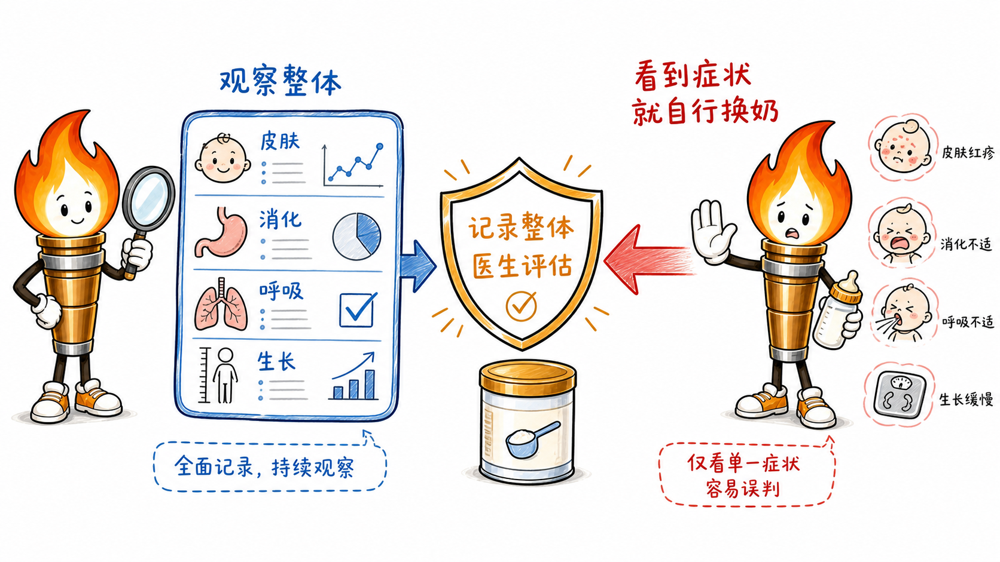

1、过敏症状的缓解效果：
对于已有牛奶蛋白过敏（CMPA）的婴儿，更换为水解或氨基酸配方奶粉的首要目的就是缓解过敏症状。临床经验表明，大多数过敏宝宝在换奶后数天到数周内症状会明显改善。例如，有专家指出使用深度水解乳清配方喂养时，有些婴儿3-5周后湿疹皮疹就从中度明显减轻为轻度，持续喂养下去可以逐步完全消退；对于严重的胃肠道症状（如便血、呕吐等），通常在换用适当配方2-4周内也能有显著好转。深度水解配方和氨基酸配方在缓解过敏症状方面都被证明是有效的。系统性综述比较了这两种配方在过敏儿中的效果，结果显示无论是胃肠道症状还是皮肤湿疹等症状的改善，两者差异并不显著：也就是说，如果宝宝能耐受深度水解配方，那么症状改善程度和速度与直接用氨基酸配方相当。因此，出于临床和经济考虑，绝大多数CMPA患儿首先尝试深度水解配方即可满足治疗需要。
需要强调的是，绝大部分（约90%）的牛奶蛋白过敏婴儿对深度水解奶粉是耐受的，只有大约10%左右的宝宝因过敏极重或特殊原因需要升级到氨基酸配方。这些需要氨基酸配方的情况通常包括：水解配方喂养2～4周症状仍未改善，或者患儿有严重的速发型过敏反应（如喝奶即发生喘憋、荨麻疹甚至过敏性休克），又或者合并对多种食物过敏（需要彻底排除过敏源）等。在这些情形下，氨基酸配方因不含任何乳蛋白，是最安全的选择。一项回顾研究指出，在头对头的随机试验中，对于能够耐受的患儿，使用氨基酸配方和深度水解配方在胃肠道症状（如呕吐、腹泻）和皮肤症状（如湿疹）的改善上疗效相当；而对于那些无法耐受水解配方的重症宝宝，换成氨基酸配方后症状和生长都会明显改善。这也是临床实践中的观察：只要找到适合宝宝的配方，其过敏症状大多能够控制，孩子也能恢复舒适进食和正常发育。

2、对湿疹、喘息等过敏相关疾病的影响：
很多牛奶过敏的宝宝在婴儿期会出现顽固的湿疹或反复喘息、哮喘样症状。这些有时是CMPA的表现之一，因为过敏导致的免疫反应可以影响皮肤和呼吸道。改用低敏配方后，这些症状往往也会随食物过敏的控制而改善。如果宝宝的湿疹是由牛奶过敏触发的，那么换奶是基础治疗之一。临床上观察到，用深度水解配方喂养几周后，许多孩子的湿疹皮损开始愈合，瘙痒和皮炎程度下降。有报告称一些婴儿由深度水解酪蛋白配方喂养4周后，中重度湿疹减轻为轻度，显示出明显的疗效。同样地，如果宝宝因奶过敏出现喘息、咳嗽等（有时与过敏性喘息相关），消除了过敏原后呼吸道症状也会减轻。所以，总的来说，对于因CMPA引发的湿疹和喘息，特殊配方奶粉的使用能够帮助控制症状。
此外，还有一些婴儿并没有确诊CMPA，但有家族过敏史或湿疹倾向的高风险婴儿。在纯母乳喂养无法实现时，医生有时会推荐部分水解配方作为预防措施。这类HA配方是否真能预防湿疹/哮喘，研究结果不一但有一些积极迹象。例如，德国GINI研究的长期随访显示，在生命最初4个月喂养部分水解乳清配方的高风险婴儿，在前1-2年内湿疹发生率比普通奶粉组有所降低；我们最新的系统综述也发现，对有过敏家族史的婴儿，早期喂养部分水解奶粉可降低2岁前湿疹风险，而喂深度水解奶粉则在2岁以后仍可见湿疹风险降低（推测与持续的免疫耐受训练有关）。对于喘息，一些数据也提示0-1岁时喂部分水解配方的高风险婴儿喘息发生率低于普通配方喂养者。不过，需要强调这方面证据尚不完全一致，而且这些预防性作用主要体现在高危人群中，对于普通风险婴儿并不建议特别使用水解配方预防过敏。而一旦宝宝已经确诊CMPA，则应直接使用深度水解或氨基酸配方治疗，而不是部分水解配方。

3、对过敏耐受形成的影响：
所谓耐受（Tolerance），是指宝宝的免疫系统逐渐学会“不把牛奶蛋白当敌人”，从而未来能够重新接受普通牛奶。大多数牛奶过敏儿童随着年龄增长都会自然产生耐受，统计约有80-90%的孩子会在3～5岁左右长大后“脱敏”。那么，喂不同配方是否会影响耐受建立的速度呢？这是家长和医生都关心的问题。
近年的一些研究提出，深度水解配方可能有助于更快建立耐受，而氨基酸配方因完全无抗原刺激，可能在免疫训练方面稍显不足。例如一项有名的前瞻性队列研究（Nocerino等人的“Atopic March”研究）随访了CMPA婴儿3年，发现喂养含益生菌LGG的深度水解酪蛋白配方的孩子，在3岁时有约81%已经对牛奶产生耐受；相比之下，喂养氨基酸配方的孩子到3岁时只有约19%建立了耐受。此外，深度水解配方组婴儿在随访期内发生其他过敏（如湿疹、哮喘）的比例也显著低于氨基酸组。研究者推测，这是因为深度水解配方中残留的极小量乳蛋白肽片段扮演了“低剂量暴露疗法”的角色：这些微量肽足以让免疫系统逐渐适应却又不足以触发严重过敏，从而促进了口服免疫耐受的建立。相反，氨基酸配方完全无乳蛋白抗原，免疫系统得不到任何训练机会，虽然短期内避免了过敏反应，但耐受可能发展得更慢。
不过，需要客观看待的是，上述差异也可能部分受到病例选择偏倚影响——毕竟使用氨基酸配方的往往是过敏最重的一批孩子，他们本身产生耐受的时间可能就比轻症者长。此外，目前尚无大规模的随机对照试验直接比较两种喂养策略对耐受年龄的影响，因此这些结果是提示性而非定论，尤其不要迷信益生菌类产品。

总的来说，在免疫学效应上：水解配方和氨基酸配方都能有效缓解CMPA相关症状，改善宝宝的湿疹、腹泻、呕吐等，让免疫系统从过敏的亢奋状态中平静下来。对于父母来说，更重要的是先控制当前症状、保障宝宝营养摄入，至于耐受的建立是一个循序渐进的过程，不宜冒然自行给宝宝试牛奶。我认识一位宝妈对过敏认识不足，轻信了销售人员要使用水解配方训练宝宝的耐受能力，结果造成孩子不可逆转的认知发育迟缓。特殊配方奶粉所做的，是在婴幼儿成长高峰阶段保驾护航。

<a id="point-07-009"></a>
### 对生长发育的影响

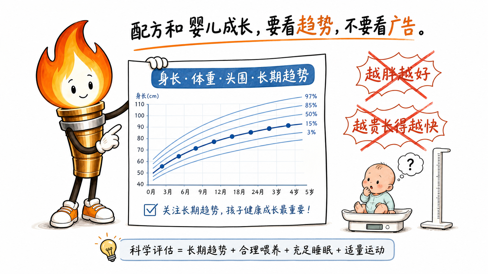

父母们常关心：喝这些特殊奶粉，宝宝发育会不会受影响？毕竟水解、氨基酸配方在口味、成分上与普通奶有差别。很多自媒体博主发布一些诋毁氨基酸奶粉的个人观点，这会干扰父母做出正确的选择。特殊配方都是经过严格营养学设计的，能够支持过敏婴儿生长发育。大量临床研究对比了不同配方喂养下婴儿的生长指标，例如体重、身长的Z评分等。

1、生长速率比较：
总体结论是：无论深度水解还是氨基酸配方，只要喂养充足，婴儿的体格生长与普通配方喂养是相当的。一项2023年的研究比较了CMPA婴儿改用深度水解 vs. 氨基酸配方后2个月的生长恢复情况。结果显示，两组在体重增长方面没有显著差异，体重的Z评分改善幅度相近；在身长增长方面，氨基酸组每月长高略多一些，大约1.8厘米/月，水解组约1.3厘米/月，差异有统计学意义但临床意义不大。两组宝宝的体重和身长Z评分在营养干预后都提高了（追赶生长），且差异均不显著。研究总结认为：EHF和AAF均能让过敏宝宝实现正常的体重、身高发育，甚至氨基酸配方组在身高提升上有一点优势。
类似地，较早的一份系统综述审查了多个临床试验的数据，发现氨基酸配方与深度水解配方在促进生长和改善营养状况上效果相当。其中提到有两项随机对照试验报告，氨基酸配方组的某些生长指标略优于水解组，比如体重增长稍快，但另有试验未发现差异。总体来看，所有接受低敏配方的婴儿其身高体重均保持在正常范围，没有因为换了特殊奶粉就营养不良或生长停滞。实际上，当宝宝因为过敏反应而无法正常喂养普通奶时，及时换用适合的配方反而能恢复其正常生长曲线。很多CMPA婴儿在确诊前可能长期喝了不耐受的奶，导致喂养困难、体重不增甚至下降。一旦换奶，常常出现“追赶生长”现象：之前落后的身高体重逐步赶上同龄人。上面那项研究就观察到，不论EHF还是AAF组，从换奶开始到随访时，体重-for-age的Z值平均提高了约0.7～1.3，身长Z值也有提升，说明宝宝在特殊配方支持下营养状况大大改善。

2、消化和代谢耐受性：
在生长之外，也有研究比较了不同配方的耐受性（即宝宝喝后的舒适度、副作用等）。一般来说，深度水解和氨基酸配方都更容易消化，所以喂养这些配方时，宝宝出现严重胀气、便秘或吐奶的概率并不高，很多不耐受普通奶的宝宝在特殊配方上反而胃肠症状消失了。有一些家长反馈氨基酸配方可能让宝宝大便次数增多、质地偏稀，这是因为游离氨基酸和不同的脂肪结构改变了肠道代谢，通常不必担心，只要宝宝长得好、没有脱水就行。深度水解配方的大便性状接近母乳喂养宝宝的软便，也是比较正常的。需要注意的是，这些配方本身因为成分的原因，闻起来和尝起来和普通奶粉有差异，宝宝刚开始可能会有些抗拒，但大多数能逐渐适应。如果宝宝出现摄入量减少或拒喝的情况，家长可以采取一些过渡方法（例如逐步过渡、调整冲调温度等）。不过由于过敏宝宝通常在换奶后很快感觉舒服了（没有腹痛不适），他们往往会愿意喝新奶（当然，这是我猜测的，因为决定喜欢与否的核心还是口味）。

经济因素与奶粉选择策略

除了营养和疗效，经济因素也是家庭不得不考虑的现实问题。特殊配方奶粉往往价格昂贵，尤其是氨基酸奶粉在全球范围都是价格最高的配方奶之一。那么，在治疗重度牛奶过敏时，直接用氨基酸奶粉是否“划算”？还是应该先试水解奶粉？在经济学上有一些有趣的模型研究为此提供了分析。
医学指南多数建议，对非重症的CMPA宝宝，首选价格较低的深度水解配方进行治疗；只有当喂养4周症状未改善或存在水解配方仍过敏的情况，才改用氨基酸配方。这种两步走策略可以节省成本，因为大部分宝宝在第一步就能成功，无需用到昂贵的氨基酸粉。然而，也有人提出另一种思路：对于某些高度怀疑重症过敏的宝宝，是不是一开始就用氨基酸配方，省去中间试错的时间，让孩子立刻好转？尽管短期费用高，但可能减少了多次看病、反复换奶的成本和宝宝受苦的时间。最近有一项来自阿根廷的研究就模拟了这两种策略的成本效益。他们构建了一个决策树模型，跟踪一批6个月以下疑似CMPA的婴儿直到两岁：
标准策略：按常规先深度水解4周诊断/治疗，不行再换氨基酸。
新策略：一发现怀疑CMPA就直接用氨基酸配方4周诊断/治疗。
结果模型显示：直接使用氨基酸配方反而带来了总体成本节省，原因是在这两年里减少了累计的过敏症状时间和相关医疗消耗。具体数据是，对于模拟的12,334名患儿，一步策略相比两步策略节省了约336万美元的总费用，并且总共减少了334个月的有症状病程。也就是说，虽然一步策略本身昂贵，但早期用它避免了很多反复就诊、误诊试验和由于症状未控制导致的并发花费，所以总体竟然“划算”。研究者据此认为，对于重度CMPA患儿，直接使用一步进行诊断和治疗，可以缩短疾病折磨时间，降低家庭和医疗系统的支出。
当然，这是一个模型分析，具体到个体，父母要根据宝宝过敏的严重程度来决策。如果宝宝只是轻中度症状，先尝试较便宜的深度水解是理性的选择；而若宝宝曾发生过严重过敏反应（如过敏性休克），为了安全可能一上来就用一步策略。

在水解和氨基酸品牌的选择上，我更倾向于父母们选择进口的产品，当然前提是你有稳定的渠道（非私人代购）。欧美的产品标准相对较高，且受到的监管相对严格，个人受到伤害后可以获得惩罚性赔偿。例如强生因为爽身粉诉讼，2016 年密苏里州先后出现 7200 万美元、1.1 亿美元的诉讼赔偿；2018 年圣路易斯陪审团裁定强生向 22 名女性支付 46.9 亿美元（后经上诉减为 21.2 亿美元，并于 2021 年被美国最高法院维持），到2024年5月，强生想用100亿美元与所有的诉讼人和解，结果被法院驳回。回顾三聚氰胺毒奶粉事件，3000万宝宝受到影响，导致约30万肾结石宝宝，6个可爱的宝宝在痛苦中死去，处置的结果就是22家企业各出资5000万给奶业工业协会成立一家基金，以后出事就诊后可以找基金报销。这不是惩罚，更像行业协会一次强制募捐。相比于奶业企业动辄 20-30亿的年度营销费用，5000万可能都不及一场综艺冠名赞助的费高。最可怕的是当受害者想要维权，北京的赵连海被判2年6个月，广东的郭利被判5年。

最后，写给新手爸妈的一句话是：上海的一次调研，中小学生过敏率超过了50%，这既是父母们的无知造成，也是资本干扰母乳喂养的结果，对于母乳喂养的宝宝过敏，您找我都可以帮助您逐步解决，也不会给孩子造成长期的影响，但人工喂养的宝宝，多数都是终身过敏体质，即便有一段时间不发生过敏反应，也不代表身体差时不发作。人工喂养的父母花最多的钱，给孩子受最多的罪，自己操最多的心。卖奶粉的博主搞定100个孩子一年可以赚100万，推动母乳喂养的我帮到100个孩子，1年也收不到1000元的打赏，所以，我这种傻博主也没有动力天天直播，也不愿意付费咨询，因为时间和收益不成比例。我的发心要改变中国母乳喂养的显著，要把中国的纯母乳喂养率提升至 80%以上，我很心累，但我从未气馁，能帮到一个宝宝就帮到一个，虽然他长大了，也不知道曾经有一个博主帮助过他。

<a id="point-07-010"></a>
### 冲泡奶粉的水温

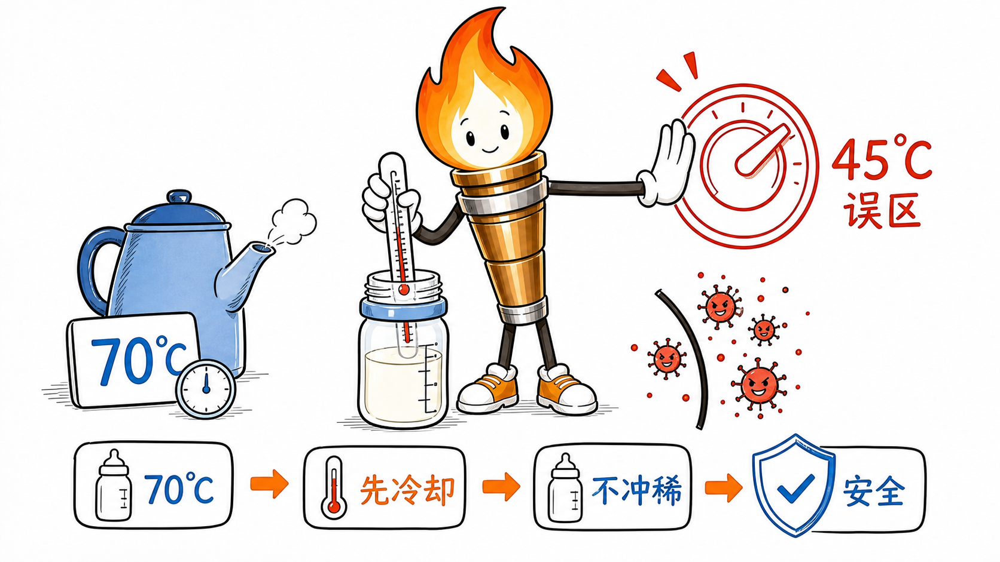

我在一年时间就培训过 2800多名月嫂、育儿嫂，关于冲泡奶粉的水温，大多学员不知道正确答案，这很正常，因为几乎所有的国产奶粉罐体上标注的冲泡奶粉的水温是45度，这个水温冲泡奶粉最大的好处是可以直接喂宝宝，但风险也显而易见，一旦细菌感染，轻则导致宝宝腹泻、呕吐，重则可能导致致命的脑膜炎、菌血症和坏死性结肠炎。

有一个母婴自媒体博主建议使用50度的水冲泡奶粉，因为杯子是冷的，45度倒下去就变成了40度了，50度倒下去刚好是45度。类似拍脑袋的母婴博主在国内是主流，崔某更是忽悠了几代宝妈。我从来都是查阅WHO等权威机构的指南，世界卫生组织的标准是用不低于70度的水温冲泡奶粉，这个温度在国内引发巨大的争议，国人没有很强的好奇心，更喜欢用自己的“常识”做判断，即便他们用100度的热水冲泡茶叶，用250度的炉火炒菜，但他们认定 70度的水温会破坏奶粉的营养，还有一个原因，他们认为70度的水温冲泡奶粉后，没有办法喂宝宝，他们没有想过用流动的自来水直接冲奶瓶降温，他们就像完成小学作业一样，只有一个标准答案。

2017 年 12 月，法国乳业巨头召回（含中国）问题乳粉高达数万吨，原因是其生产的婴儿配方奶粉和其他奶制品可能受到沙门氏菌污染。沙门氏菌是一种常见的食源性病原体，可以引起食物中毒，导致严重腹泻、胃痉挛和呕吐，对婴儿、老年人和免疫系统较弱的人群尤其危险。

2022年2月，位于美国密歇根州的雅培营养工厂发生了坂崎肠杆菌（Cronobacter sakazakii，亦称克罗诺杆菌）污染事件，导致四名婴儿生病，其中两人不幸死亡。坂崎肠杆菌是一种革兰氏阴性、非产气的细菌，能够在低水活度环境中生长，生命力极为顽强。它不仅耐寒、耐热、耐干燥，还能在酸碱、渗透压和紫外线等恶劣条件下存活，并对消毒杀菌剂具有较强的抗性。多项研究表明，婴儿配方奶粉中的坂崎肠杆菌是导致婴儿及早产儿发生脑膜炎、菌血症和坏死性结肠炎的主要感染源，尤其是免疫系统较弱的婴儿感染后，死亡率可高达50%。坂崎肠杆菌的自然来源非常广泛，遍布我们的生活环境。感染婴儿通常会表现出发热、呕吐、腹泻、嗜睡以及严重的脑部损伤等症状。该细菌能够迅速分泌多糖物质将自己包裹起来，这些多糖不仅能保护其免受不利环境的侵害，还具有强大的粘附性，一旦污染了食品生产线，就非常难以清除。坂崎肠杆菌在极为干燥的环境中（如婴儿配方奶粉）可存活长达2年，且能够承受高达68度的温度，显示出其极强的耐受性。

世界卫生组织的标准，冲泡奶粉的水温应为70度，原因是“婴儿配方奶粉并非完全无菌，可能含有导致婴儿发生严重疾病的细菌。正确的冲调和保存方式，可以有效降低婴儿患病的风险。”

智者畏因、凡夫畏果。这句话的意思，有智慧的人做事时会考虑后果，如果预见到会有不好的结果，就不要去做。普通人只在事情发生后才感到恐惧、后悔、痛苦。最多的例子当属平时胡吃海喝，住院时倾家荡产悔不当初。冲泡奶粉这事，坂崎肠杆菌对1岁以下婴儿存在致命的风险，父母用70度水温冲泡奶粉会麻烦一点，但宝宝连腹泻的机会都没有，用45度的水温省事一点，但真正的风险是父母无法承受的代价。至于父母们担心的营养问题，WHO做了大量的研究，70度水温对VC会有一些影响，但依然满足宝宝对营养的全部需求。


<a id="point-07-011"></a>
### 奶粉如何营销

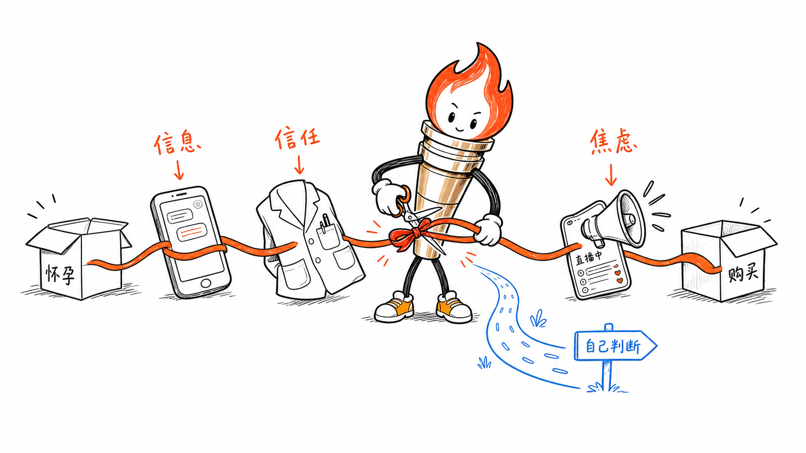

配方奶营销如何影响我们关于婴儿喂养的决定，这是来自世界卫生组织和联合国儿童基金会的权威研究报告。

<a id="point-07-012"></a>
#### 怀孕即被盯上

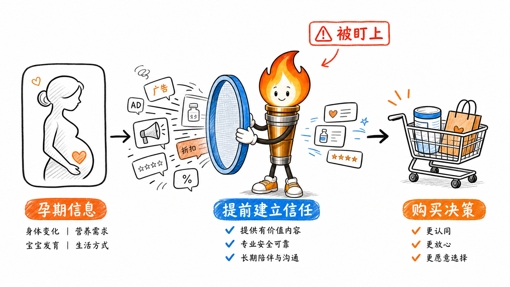

当你开始在网上寻找信息，告诉世界你的宝宝即将诞生时，你就已经出现在配方奶粉营销主管的雷达屏幕上，他们把你列入未来的营销目标，想方设法利用你的担忧和不安全感。你的后背是一个靶子，什么都不能阻挡他们靠近你，瞄准你的不是一家配方奶粉企业，而是整个行业。花言巧语粉饰产品里所包含的真相，躲在网络和卫生机构里你信任的那些人的背后，出现在你寻求任何建议的地方，步步紧逼地让你购买他们的产品。

可怕嘛！但这千真万确，因为每一个宝宝都是一台提款机，母婴博主每搞定一个宝宝，一年就可以赚到超过10000元的奶粉佣金，而年赚百万只需要搞定100个宝宝。
这绝非夸张，父母们拼命赚的奶粉钱，只不过是在养活一群吸血鬼。而推动母乳喂养几乎是个需要高度专业却无利可图的苦差。

<a id="point-07-013"></a>
#### 谎言无处不在

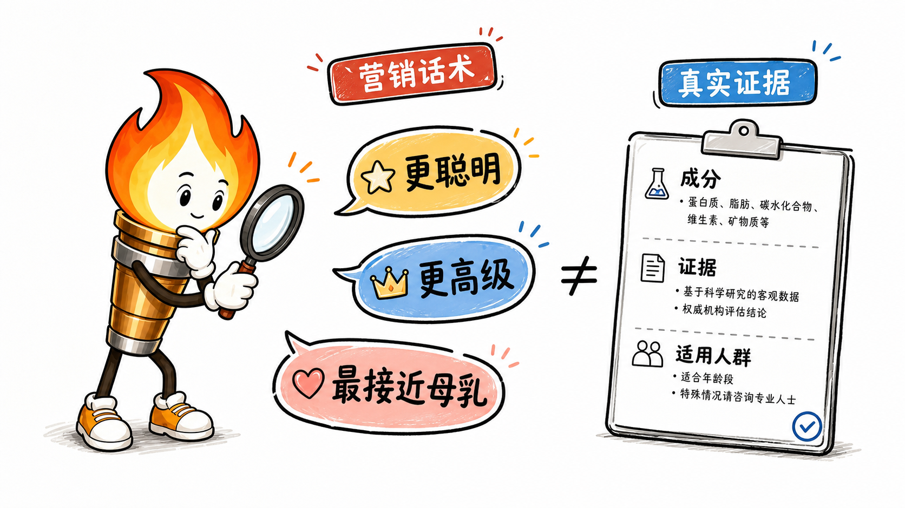

广告营销是人人都会经历的生活日常，然而，配方奶粉的营销不同于其他产品，因为婴童生命最初 1000天的喂养方式深刻地影响着他们目前以及一生的生存、健康和发展水平。因此，决定用何种方式对婴幼儿和儿童进行喂养，这应该基于最佳的信息以及真实的循证依据，而这些信息和真实的循证依据只应该从儿童及父母的最佳利益出发，而非受商业利益的影响。

尽管越来越多的循证依据表明，母乳和母乳喂养具有人工合成的配方奶粉无法复制的独特性，配方奶粉企业仍使用虚假和不完整的科学声称，并标榜配方奶粉接近、等同或优于母乳。
这是联合国儿童基金会关于母乳喂养的知识问答，有证据表明，母乳喂养可以防止婴儿猝死、过敏症状、急性呼吸性疾病以及耳部疾病的发生。
世界卫生组织一再警告：配方粉使儿童易患感染病、哮喘、脑膜炎、肥胖和糖尿病。

“孩子出生后，不知道谁泄露了我的信息，我收到了营销人员或其他人寄的一些奶粉样品。这些公司好像在激烈地争取我宝宝的第一口奶。”（孕检之后的信息泄漏，是谁大家都心知肚明，但公众不敢公开批评，也无处发声。）

中国的奶粉营销渗透率高达97%。中国父母接触奶粉营销的最主要途径（72%）是透过电视，（除了广告，还有冠名各种年轻人喜欢的综艺节目，根据 Nielsen Intelligence 的数据，一家美国公司 2018 年斥资超过 4 亿美元，在中国进行配方奶电视宣传活动。中国乳业三巨头每年投入的营销费用也超过百亿。58%透过超市，数据显示中国的奶粉销售过半是在线下母婴连锁店完成。抖音和B站的渗透率排名第三，是41%。在抖音搜索任意奶粉品牌时，都会发现多则数百个账号同时在直播，而真正传播母乳知识的直播一个都没有。微信没有上榜是因为数据的隐私性，中国的营销管理人员透露，配方奶粉企业创建或参与了妈妈群，并利用这些聊天群收集女性信息、推荐产品、提供礼物，引诱女性购买企业的产品。所有的宝妈，肯定都加入了不止一个微信妈妈群，加入的目的是希望答疑解惑，进群久了会发现全是为了卖货。

<a id="point-07-014"></a>
#### 医务参与其中

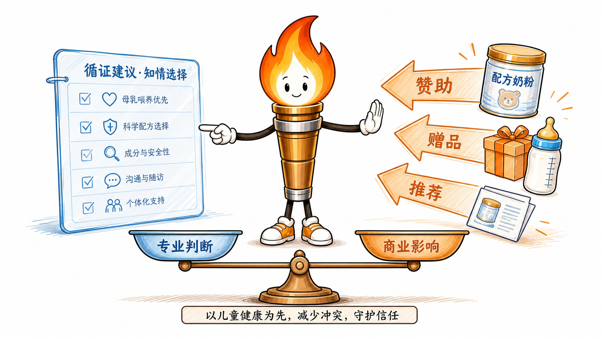

在世界上许多国家和地区，医务人员在社会上深受尊重和信任。医务人员的建议对孕妇和婴幼儿父母影响很大，其中包括婴幼儿喂养的决定。配方奶粉企业在营销活动中积极瞄准医务人员，力图利用这种信任关系。医务人员对女性的婴幼儿喂养态度和做法产生了巨大影响，一些医务人员有意或无意地对女性进行母乳喂养的能力及其母乳的价值和质量提出了质疑，阻碍了女性进行母乳喂养，让她们打消了母乳喂养的念头。虽然中国有77%的孕妇表达了想要母乳喂养的决心，但也有高达21%的孕妇明确要人工喂养，她们认为「配方奶粉比母乳的营养更全面、更均衡」，这显然是受到了奶粉营销的误导。

中国的一些医务人员通常会建议在宝宝出生后立即添加配方奶粉 ，一些医院在孩子出生 6或 12个小时后才把孩子送到宝妈手里。在此期间，他们会给宝妈一些特定品牌的配方奶粉。

一些医务人员对母乳的质量信心不足，提倡使用母乳替代品，这破坏了持续的母乳喂养。许多医务人员认为，母乳在 6个月内是OK的，建议在6个月后使用配方奶粉，一些医务人员认为，在引入固体食物时、以及整个学步期和学步期以后，配方奶粉都是必要的。医学院普遍没有营养课，也不教授专业的母乳喂养内容，但由配方奶粉企业赞助的会议和培训活动很普遍，所以才会有很多医生认为配方奶粉最接近母乳，虽然中国医生建议产后喂奶粉的比例只有17%，但有高达46%的父母在医院内外领取到了免费的奶粉样品

<a id="point-07-015"></a>
#### 大V收割粉丝

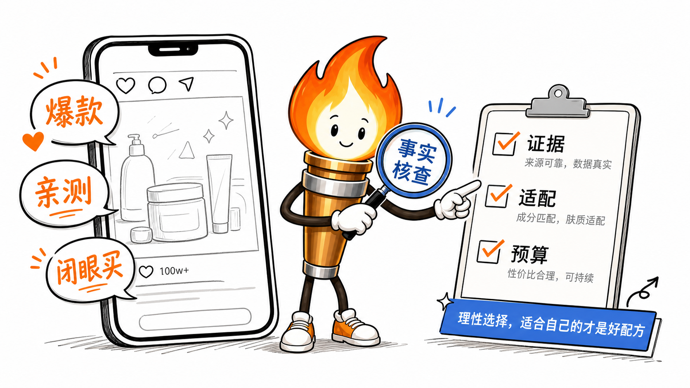

那些拥有大量社交媒体粉丝并有能力影响消费者选择的人，会定期发布有关配方奶粉的帖子。这些配方奶粉的代言人们包括名人、儿科医生、所谓的专家和大V宝妈。在英国，有影响力的人会在网上上传自己的“待产包”的视频和图片，并展示了配方奶粉品牌。在中国，营销管理人员称，“大V 宝妈”作为关键营销渠道，拥有特殊营销效果。待产包的套路中国现在也在广泛使用。在中国，超过三分之二的受访女性（68%）
表示收到过配方奶公司的优惠或促销折扣，38%的女性表示收到过配方奶公司的礼物。

爱占便宜是国人的一大特质，品牌经理说：如果消费者可以提供出生证明，他们就可以免费获得一罐一段配方奶粉。这是配方奶粉企业获得新客户的一种非常有效的方式。如果婴幼儿喝了一个品牌的一段配方奶粉， 在大多数情况下，孩子会喝同一品牌的二段和三段奶粉。一个宝宝每个月至少要吃4罐奶粉，一年就超过50罐，这个钱并不都被奶粉公司赚走，兜售奶粉的母婴博主也可以从中分得30-50%佣金。

<a id="point-07-016"></a>
#### 代价极其惨烈

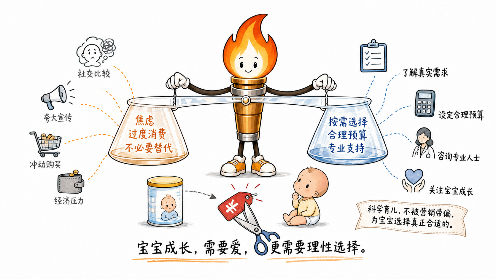

父母真实的想法是给宝宝最好的，花多少钱不在乎，但现实是钱花的越多，给到宝宝的可能反而越差。在1955年出版的《无忧分娩》一书中格兰特利 - 迪克 - 里德写到：
新生儿只有 3 种需要 ：温暖地待在妈妈怀里； 从妈妈的乳房获得食物； 因妈妈的存在获得安全感。这 3 点母乳喂养都可以满足，却不需要花一分钱。

在巨额预算及片面引用科学信息推动下，导致了奶粉的过度消费，阻碍了母乳喂养。配方奶粉营销还削弱了母亲喂养母乳的信心，这种行为对儿童及家庭产生了极大影响。喂养配方奶粉，不仅会损害儿童的健康、成长和发育，还会加剧条件较差的家庭的经济负担。

我们要清楚地认识到，母乳是婴儿营养的最佳来源。几十年来，相关研究不断地揭示了母乳在儿童成长、预防感染、亲情和大脑发育方面具有极高的价值。喂养母乳也有益于母亲的健康。

配方奶粉原本是为一些不能或不愿母乳喂养的父母提供的，但父母选择配方奶粉也常常由于其他因素，例如职场环境等其他不支持母乳喂养的因素。

多项研究表明，营销能够增加对包括烟草、酒精和过度加工食品等不健康产品的需求和消费。配方奶粉行业营销支出估计占其年营业额的5-10%，这一数据同样反映了他们对营销效果的信心。各国应制定强有力的法律法规（很遗憾，中国的得分很低），针对数字营销应采取措施（不幸的是奶粉是最慷慨的金主爸爸），应加大推广母乳喂养的投入，保护妇女和家庭免受不道德营销行为的侵害。

<a id="point-07-017"></a>
#### 营养都是虚构

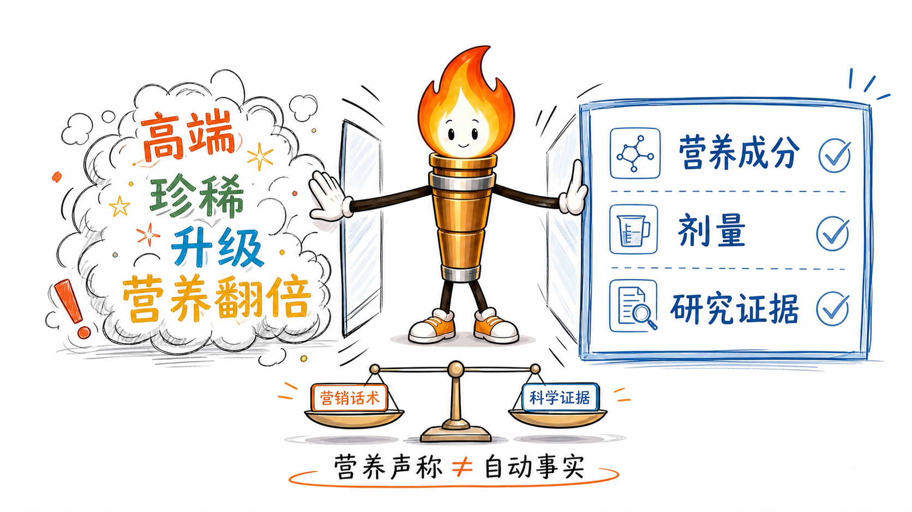

在过去的20年中，全球母乳喂养率，特别是纯母乳喂养率略有提高。然而，配方奶粉的销售额在大约同一时期翻了近一番，到2019年达到 556 亿美元（约合4024亿人民币）。

奶粉公司使用不完整的科学证据，推断出未经证实的结果。例如把母乳低聚糖 (HMO) 、二十二碳六烯酸 (DHA) 、乳铁蛋白、双歧杆菌等成分宣传为“源自”母乳，并与儿童发育结果相关。但审查它们所引用的科学证据，结论是并不支持这些主张的有效性。

母乳低聚糖 (HMO) 是多种肠道有益菌的营养，尤其是会滋养双歧杆菌，同时会抑制肠道有害菌的增殖，奶粉中的低聚糖是人工合成的，没有母乳中低聚糖的效果，甚至有一些研究认为它们还会造成不好的结果。


<a id="point-07-018"></a>
#### 颠覆价值信仰

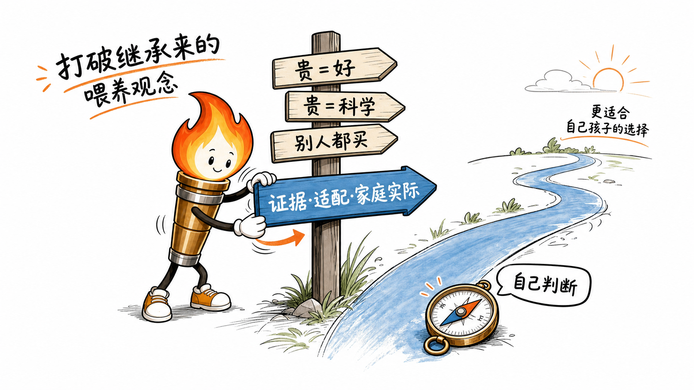

作为一个年产值550亿美元的产业，配方奶粉企业系统地影响了家长对于婴幼儿喂养方式的决定，四十多年来，无孔不入的疯狂营销旨在说服家庭和健康专业人士，从而削弱儿童健康和发展。旨在改变家庭和社区的价值观、信仰和实践。（价值观是指个人或群体对于什么是重要、有意义、值得追求的信念和原则的总称）

奶粉企业很懂的拿捏父母的情绪用于营销，女权主义反对的不是生育和照顾本身，
而是对于价值的贬低和劳动分配的不公。奶粉企业通过大V宝妈同为女性的身份偷换女权的概念，倡导人工喂养，要求家中老人和丈夫共同带娃。

由配方奶公司组织和管理的婴儿俱乐部为女性提供礼物和折扣、怀孕和分娩信息。
飞鹤公开表示其一年组织开展的线下活动就有超过 100万场。世界卫生组织强调母乳喂养在婴儿出生后头六个月尤为重要，称其“有助于预防肺炎和腹泻这两种可能导致婴儿死亡的主要疾病”。世界顶级医学杂志《柳叶刀》2016年的研究表明：“改善母乳喂养行为每年可以挽救82万人的生命，其中87%是6个月以下婴儿”“此外，母乳喂养还可以减少母亲患乳腺癌和卵巢癌的风险”。据联合国儿童基金会和世卫组织发布的报告，在中国，未进行母乳喂养而造成的总经济损失每年高达660亿美元，这些损失主要是因缺乏母乳喂养使儿童认知能力偏低而造成的。

<a id="point-07-019"></a>
#### 坚守母乳喂养

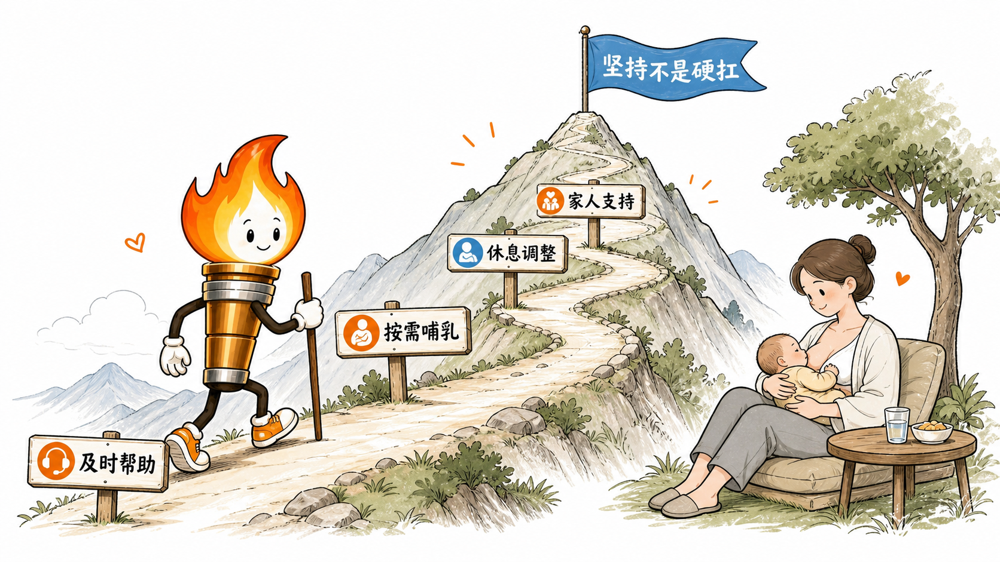

配方奶粉企业活跃的营销行为都是设法影响女性及家庭的婴幼儿喂养决定。许多女性表达了母乳喂养的愿望，但持续不断传来的设计巧妙且极具说服力的营销信息， 削弱了她们对母乳喂养的信心。

配方奶粉企业使用微妙的营销技巧来制造父母的焦虑和期望。例如产后最初几天没有奶水，如果真没有奶水，人类又是如何繁衍至今。奶粉营销的另一个卖点是婴儿更长时间的饱腹感，这是事实，但也是刻意的误导。母乳喂养是按需喂养，宝宝吮吸很辛苦，每次宝宝都吃七分饱。人工喂养很省事，宝宝每次都吃120%分饱，结果就是人工喂养的宝宝普遍超重肥胖，在医学上胖是病，幼年的胖更是危害一生。

奶粉公司一直在误导父母，宣称母乳质量随着时间的推移而下降，联合国儿童基金会在其网站上公开表示：母乳是保障人类婴儿营养的最佳物质，绝大多数妇女可以产生有足够营养元素的乳汁。极度营养不良的妇女，其身体质量指数低于18的情况下，奶水的质量才会受到影响。不同阶段，从婴儿刚出生时的初乳，到成熟乳汁，母乳的成分不同，甚至在每次喂奶中，乳汁成分也不同。前奶富含乳糖止渴又能满足大脑需求，后奶富含脂肪和蛋白质，满足身体生长的需要。这就是母乳的神奇之处，母亲身体自动调节母乳的成分以满足婴儿需要。婴儿六个月前与六个月后相比，母乳所含能量、蛋白质和铁的总量大致相同。母乳提供的各种营养素的量占身体需要量的百分比有所不同（因随着婴儿生长，身体需要的各种营养素的量也增加）。母乳中免疫物质在不同的时间段也不同，取决于母亲自己暴露于哪些抗原物质。六个月之后母乳没有营养的说法是不正确的。

<a id="point-07-020"></a>
### 0-6个月人工喂养的宝宝，需要喂水吗？

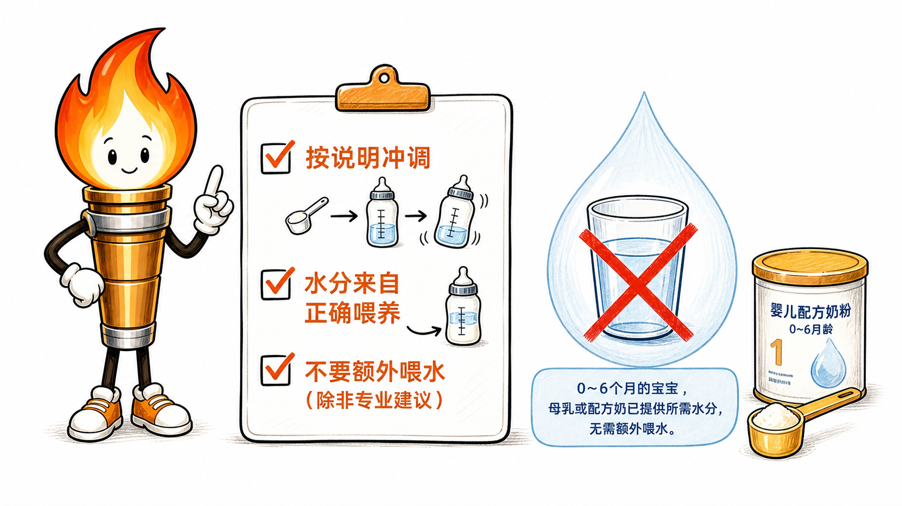

WHO、AAP等权威机构明确指出，6月龄内纯母乳喂养或人工喂养（即配方奶喂养）的婴儿均无需额外补水。

在传统的育儿观念中，常有“喝奶粉容易上火，需要喂水”的误区。但现代循证儿科学明确指出，过早给婴儿喂水不仅没有必要，反而潜藏着严重的健康风险。

为什么不需要额外喂水？

1. 配方奶中已经含有充足的水分
标准配方奶的冲调比例是经过严格测算的，按照说明冲调好的配方奶液中，水分的比例高度模拟母乳的约 85% 到 88%。只要宝宝每天有正常的奶量摄入，这些水分就完全足够维持其新陈代谢、体温调节和排泄需求。即使在炎热的夏天，通过增加喂奶量满足宝宝的水分需求，而非通过直接喂水。

2. 肾脏发育未成熟与“水中毒”风险
6个月以下的婴儿，其肾脏的浓缩和稀释功能尚未发育成熟，肾小球滤过率较低。如果额外摄入白开水，婴儿的肾脏无法快速将多余的水分排出体外。这会导致多余的水分进入血液，稀释血液中的钠离子浓度，引发**稀释性低钠血症**，临床上称为“水中毒”。严重的水中毒会导致脑细胞水肿，引发嗜睡、体温过低、惊厥抽搐，损伤智力，甚至危及生命。

3. 胃容量极小与营养不良风险
婴儿的胃容量非常有限。白开水没有热量和营养，如果让宝宝喝了水，水会占据胃部宝贵的空间，产生虚假的饱腹感。这会直接导致宝宝下一次喝奶时的摄入量减少。长期以往，会导致蛋白质、脂肪及微量元素摄入不足，造成生长发育迟缓或体重不达标。

4. 生病、便秘等特殊情况
如果宝宝出现腹泻、频繁呕吐或发烧，确实面临脱水风险。但在这种情况下，儿科医生通常会建议补充口服补液盐（ORS）来同步补充水分和流失的电解质，而不是喂白开水。
宝宝积食、上火是否应该“喂水”？所谓积食、上火就是消化不良和便秘，首先，绝对不能因为宝宝“积食”而故意多加水、把奶粉冲稀。长期喝过稀的奶液，其危害等同于直接喂水，不仅会导致营养不良，同样会增加水中毒的风险。其次，便秘的症结在于配方奶粉，这是人工喂养无法彻底解决的问题。最后，不要把便秘等同于缺水，我们喝的水无法被运送到结直肠，而是在胃和小肠里被吸收。结直肠里的水是水溶性膳食纤维被肠道有益菌分解后释放出来的。
---

---
