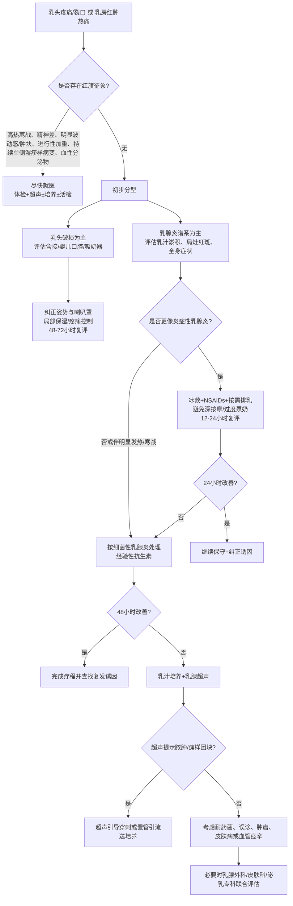

# ☑️0-6个月纯母乳喂养

## 如何判断宝宝是否吃饱了 

两位宝妈在小区遛娃，喂奶粉的宝妈随口问母乳喂养的宝妈，你们家的宝宝现在一次吃多少毫升的奶，她一时不知如何回答。回家后开始挤奶计算宝宝的奶量，然后发现自己的母乳量和人家比少了太多，于是非常焦虑，担心宝宝没有吃饱。

新手父母可能都会有如此困惑，到底怎么判断宝宝是不是吃饱了。在讲宝宝是不是吃饱了之前，我们先要明确，母乳喂养和人工喂养本质不同，母乳是按需喂养，所谓按需喂养，就是宝宝想吃就喂，没有具体应该吃多少毫升的概念。人的本能饿了就吃，吃饱了就玩、就睡。而且通过挤出来奶判断宝宝吃了多少是不准确的，宝宝吮吸吃到的母乳量，远超过可以挤出来的奶量。相比于按需喂养，人工喂养的宝宝胃会被撑大，且普遍都超重肥胖。

判断宝宝是否吃饱，首先记录宝宝每天的小便次数，世界卫生组织的标准是每天不少于 6次，实际都不会少于8次。其次是观察宝宝的生长曲线是不是平滑，平滑就代表稳定，如果生长曲线下滑，则代表近期的营养没有跟上，及时调整宝宝的吃奶频次就好。有些老人家帮忙带娃，要教她们观察纸尿裤的提示线变色代表宝宝尿了，要及时的更换纸尿裤，尿过的纸尿裤通气性降低，不利于宝宝生殖器健康。

母乳是一种高脂肪食物，纯母乳喂养期间的乳汁脂肪含量高达35%，6个月之后母乳的脂肪含量有所下降，同时宝宝因为进入爬行和学步期的运动量明显增加，可能出现体重停滞或增长缓慢，不要只盯着具体的体重变化，一定要看生长曲线是否平滑，只要生长曲线平滑，就不需要焦虑宝宝的身长体重。
---
# 纯母乳喂养宝宝，天热要喂水吗？ 

答案： 不需要，而且有害。
1)母乳的 88%是水，因此，营养物质仅占12%，当照护人给宝宝喂水时，水会填充宝宝的胃，减少宝宝的奶水摄入，长期如此会导致宝宝营养不良。
2)天气炎热，宝宝渴了怎么办？渴了当然就喂母乳，母乳不仅解渴，而且还是宝宝最喜欢的味道。
3)6个月以内的宝宝非常脆弱，喂的水如果不干净，感染腹泻会造成家庭不必要的紧张、焦虑。而母乳是妈妈用身体过滤、对宝宝而言是足够安全的水。
4)即便水是干净的，喂水的容器也从不像奶粉瓶一样频繁消毒。我曾经在社区检查老人们携带的水壶，发现有些水壶盖内层存有污垢，可见水瓶没有像奶瓶一样频繁消毒。
---

# 乳头破损与乳腺炎的处置实践

如果你有手洗衣服后手泡到褶皱的经验，有嘴唇干去舔结果皲裂的经历，大概也就理解为什么乳头会皲裂，以及知道如何保护乳头。乳头疼痛和皲裂通常发生在宝宝刚开始吃奶的阶段，疼痛有可能是因为含乳不太正确，原本该含住整个乳晕，但宝宝只含住了乳头并一直拉扯导致了乳头疼痛。

乳头皲裂是皮肤不适应导致的，我见过宝宝吸的满嘴血的情况，是新手宝妈被月嫂误导，给乳房消毒使用的清洁剂导致乳房皮肤干燥，最终导致乳头皲裂。

乳头破损与乳腺炎并非“忍一忍就会好”的小问题，它们显著增加早停母乳喂养、乳腺脓肿和产后抑郁风险。当前最佳证据支持：先纠正含接与吸奶器使用，避免深度按摩和过度排空；细菌性乳腺炎首选双氯西林或头孢氨苄 10–14 天；48 小时无改善应做乳汁培养并行超声；脓肿以超声引导穿刺/置管引流为先。

## 证据框架与应用边界

| 关键建议                                                               | 主要依据                                                                                     |
| ------------------------------------------------------------------ | ---------------------------------------------------------------------------------------- |
| 乳头破损的首要处理不是“停喂”，而是立即评估并纠正含接姿势、婴儿口腔因素及吸奶器喇叭罩匹配                      | ABM #26 指出异常含接、舌系带、吸奶器误用是持续乳头痛/损伤的核心原因；2025 Meta 显示“专项干预”优于泛化护理。 (ABM, 2016；Jia 等, 2025) |
| 对**炎症性乳腺炎**，优先使用**冰敷、NSAIDs、按需排乳与生理性喂养**，避免深度按摩、过度泵奶和预防性抗生素        | ABM #36 明确“冰敷+NSAIDs+生理性哺乳”为谱系管理核心，并指出深度按摩和非选择性抗生素可能加重炎症或耐药。 (ABM, 2022)                 |
| 当出现**局灶红肿热痛合并发热/寒战，或保守处理 12–24 小时无缓解**时，应按**细菌性乳腺炎**处理并启用经验性抗生素    | ABM #36、NICE、AAFP 均支持对疑似细菌性乳腺炎进行经验治疗。 (ABM, 2022；NICE；AAFP)                              |
| **48 小时**一线治疗仍无改善、反复发作、NICU 脆弱婴儿喂养、当地 MRSA 高流行或医务人员暴露场景，应做**乳汁培养** | ABM #36 对乳汁培养的适应证给出明确建议。 (ABM, 2022)                                                     |
| 可疑**脓肿/痈样团块/波动感**时，首选**乳腺超声**；一旦证实脓肿，治疗核心是**引流+培养**而非单纯延长口服药       | ABM #36、ABM #30 均将超声列为首选影像；脓肿需引流控制感染源。 (ABM, 2022；ABM, 2019)                             |
| **持续单侧湿疹样改变、血性分泌物、固定肿块、橘皮样改变或反复同一部位乳腺炎**，必须排除 Paget 病、炎性乳腺癌和其他肿瘤   | ABM #26、ABM #30 与 Mayo/ACR 相关资料均强调该鉴别诊断。 (ABM, 2016；ABM, 2019；Mayo, 2025)                |

过去很多儿科医生见到新生儿舌系带短就直接剪了，避免影响母乳喂养，如今已经被证明这些顺带的手术基本都是没有必要的，而且有感染等风险。因为前面的证据确信舌系带确实是造成乳头破损的原因之一，我必须要很严肃的告知父母哪些情况可能需要手术，但请父母们一定谨记，概率并不高于您中奖500万，不要乳头疼痛就琢磨宝宝的舌系带，尽量忘了它的存在。
**有明确的舌头功能受限**：（舌头能不能完成吃奶动作）能不能伸过下牙龈/下唇，能不能上抬贴近上腭，能不能包裹乳房，能不能维持密封吸吮。有些宝宝舌尖被牵拉成心形、舌头前伸困难、上抬困难，才需要手术。比如一个出生 5–7 天的新生儿：
妈妈两侧乳头严重裂口，每次哺乳剧痛；宝宝含接总是很浅，吃奶时有明显咔哒声，容易滑脱；喂完后乳头呈压扁的“口红头”；宝宝吃奶 40–60 分钟仍频繁找奶，尿量偏少，体重下降接近或超过警戒线，或者后续体重增长不理想。有经验的母乳顾问已经现场调整过抱姿、深含接、乳房支撑、必要时用挤奶补充，但宝宝仍无法有效转奶。检查时发现“经典舌系带”：抬舌时舌系带清楚可见，并明显限制舌头上抬/前伸。


## 定义与流行病学

**乳头破损**是指哺乳或吸奶相关的乳头—乳晕复合体表皮或浅层组织损伤，常表现为红斑、压痕、水疱、裂隙、糜烂、渗血或黄痂；它既可独立存在，也可成为乳汁淤积、细菌入侵和乳腺炎的上游事件。ABM 将超过 2 周仍持续存在的哺乳相关乳头/乳房疼痛归入“持续性疼痛”范畴，强调需要同时评估母婴双方，而不是仅把问题归于“乳头娇嫩”。 

乳头相关症状在产后早期非常常见，但**“常见”不等于“正常到无需处理”**。2014 年澳大利亚前瞻性研究显示，出院前 79% 的产妇报告乳头痛，8 周内 58% 报告过乳头损伤，至 8 周时仍有 8% 存在损伤、20% 仍有疼痛；2016 年一项产后 30 天研究报告乳头皲裂患病率为 32%；2023 年综述指出，产后首周乳头损伤大约影响 29%–76% 的哺乳者。乳头痛与早期停止母乳喂养密切相关。 

**哺乳期乳腺炎**是发生在泌乳期乳房的炎症性疾病，可有或无感染。WHO 在定义上强调其本质是“炎症”，不等同于所有病例都是细菌感染；ABM 2022 则进一步提出“乳腺炎谱系”，覆盖乳管狭窄/乳汁淤积、炎症性乳腺炎、细菌性乳腺炎、脓肿、痈样炎性肿块和感染性乳汁潴留囊肿等连续阶段。 

流行病学上，乳腺炎的发生率受病例定义、采样方式和就诊行为影响很大。2020 年系统综述估计，在产后 26 周内，约**四分之一**的母乳喂养女性至少经历一次乳腺炎；但基于行政数据库的台湾研究显示，产后 6 个月以医疗索赔计的发生比例约为 1.19%，提示**“自报症状—临床诊断—行政编码”之间存在明显差距**。多项研究共同指出，高峰发生期多在**产后最初 4 周至 3 个月**。 

## 病因与危险因素

乳头破损与乳腺炎的病因不宜被简化为“奶没排空”或“着凉”。更准确的理解是：**机械损伤、炎症、微生态失衡、真正细菌感染、皮肤病和母婴解剖/功能不匹配**常常交织发生。ABM #26 和 #36 都强调，错误把所有疼痛都归因于“真菌感染”或“堵奶”，会带来漏诊与过度治疗。 

**机械性因素**是最常见上游诱因。核心包括浅含接、吸吮方向不良、婴儿颌部夹持、口腔结构异常、吸奶器喇叭罩过大或过小、吸力过高、单次泵奶时间过长、频繁额外排空导致过度泌乳，以及不必要的乳盾使用。2016 年 ABM 指出，美国一项调查中 14.6% 的母亲报告过泵奶相关损伤；2025 年喇叭罩研究进一步提示，喇叭罩尺寸应个体化试配，而不是按随机经验选择。 

**感染性因素**可分为细菌、病毒和争议较大的“真菌性”病因。细菌性乳腺炎最常见的病原体仍是金黄色葡萄球菌及耐药株，也应考虑凝固酶阴性葡萄球菌和少见耐药菌；当乳头已有裂隙、脓痂、黄色渗出时，浅表细菌感染更要警惕。病毒方面，HSV 或带状疱疹可累及乳头，表现为簇集性疱疹或沿皮节分布的疱疹样损害。真菌方面，ABM 2016 认为 Candida 关联“仍有争议”，2021 年综述更明确提出：大量所谓“乳头/乳管鹅口疮”可能被过度诊断和过度治疗。 

**皮肤病变**是被低估的类别。湿疹、刺激性接触性皮炎、过敏性接触性皮炎、银屑病、乳头白泡以及 Paget 病都可能表现为红、痒、灼痛、脱屑、糜烂或渗液。ABM 明确把羊毛脂、局部抗生素、香精、维生素 A/E 制剂等列为常见接触性过敏原之一，因此“乱抹药膏”本身就可能让乳头更糟。

**母体因素**包括乳量过多、肿胀、反复乳管阻塞、既往乳腺炎史、乳头裂口、乳腺手术史、雷诺现象/血管痉挛倾向、慢性疼痛综合征、抑郁焦虑，以及近期母婴应用抗生素或抗真菌药后导致的微生态改变。ABM 还提示，过度泵奶可维持“高供给—肿胀—疼痛—再泵奶”的恶性循环。 

**婴儿因素**应系统检查，包括舌系带短、腭形态异常、低口腔肌张力、早产导致的吸吮协调差、吞咽困难、反流/呛咳、鼻塞、出牙期咬乳，以及个体吸吮力异常。ABM 强调只看母亲、不看婴儿，是持续乳头损伤诊疗失败的重要原因。 

### 病因与对应预防措施

| 病因类别                   | 典型线索                         | 可操作预防措施                                            |
| ---------------------- | ---------------------------- | -------------------------------------------------- |
| 机械性：浅含接、体位不佳           | 喂奶开始即刺痛，乳头喂后变扁/楔形、压痕明显       | 返岗前学习深含接；每次喂后观察乳头形态；疼痛持续即请泌乳顾问现场观察一次喂养             |
| 吸奶器误用：喇叭罩不合适、吸力过高、时长过久 | 泵后乳头充血、水肿、摩擦痛或乳晕被过度卷入        | 先测量乳头直径再试配喇叭罩；以“有效排乳而非最大吸力”为目标；单次一般 15–20 分钟内评估结束点 |
| 细菌感染                   | 裂隙伴黄痂、渗液、局部蜂窝织炎，或乳腺局灶红肿热痛伴发热 | 及时处理裂口；避免深按硬揉；48 小时无改善送培养                          |
| 真菌样疼痛                  | 亮粉色、脱屑、烧灼痛，但体征常不典型           | 不凭“烧灼痛”就长期抗真菌；先排除含接、皮炎、血管痉挛与细菌失衡                   |
| 病毒：HSV/带状疱疹            | 簇集小疱、剧痛、单侧为主或沿皮节分布           | 立即就医；患侧暂停直接喂及患侧乳汁喂养直到病灶愈合                          |
| 皮肤病：湿疹/接触性皮炎/银屑病       | 瘙痒、脱屑、渗液、边界清楚或长期反复           | 避免香精、刺激性清洁剂与不明药膏；按皮肤病管理而非一味抗感染                     |
| 母体高供给/反复堵塞             | 奶涨、漏奶、反复硬结                   | 减少“额外排空”，仅按需喂或表达至舒适；不要把“完全排空”作为每日目标                |
| 婴儿口腔解剖或功能异常            | 舌系带短、咬乳、松口频繁、含接浅             | 评估舌系带与口腔功能；必要时转介处理                                 |
| 药物/系统性疾病               | 雷诺现象、慢性疼痛、过敏体质、近期抗生素史        | 问诊要包含既往病史和用药史；对血管痉挛、皮炎、慢性痛分别处理                     |

## 临床表现、分级与诊断流程

乳头破损的临床表现可从**红、痛、压痕、水疱**进展到**裂隙、渗血、黄痂、难以含接**。严格说，目前缺乏被普遍采用的统一分级金标准，ABM 也指出标准化疼痛评估不足；因此临床上更实用的做法，是同时记录**疼痛强度、损伤深度、受累面积、是否伴渗液/感染**以及是否影响有效喂养。 

乳腺炎更适合按**谱系分级**理解：  
轻者为乳管狭窄/局部淤积，表现为限局性胀痛或条索样硬结；  
进展为炎症性乳腺炎时，可见局部楔形红斑、肿胀、疼痛和低热；  
再进展为细菌性乳腺炎时，常有更明显红热痛、乏力、寒战、发热；  
若形成痈样炎性团块或脓肿，则出现边界较清的肿块、波动感或症状反复。约 3%–11% 的急性乳腺炎会发展为脓肿。 

鉴别诊断应覆盖三个层面。第一，**非感染性疼痛**：如血管痉挛、乳头白泡、过度供乳、阻塞、神经性痛/触痛异常。第二，**皮肤病与局灶性感染**：湿疹、过敏、银屑病、浅表脓疱病。第三，**肿瘤性疾病**：持续单侧湿疹样改变要排除 Paget 病；反复同一象限乳腺炎、橘皮样皮肤、乳房回缩或治疗后不缓解时要警惕炎性乳腺癌。 



上图为综合 ABM #26、#30、#36 和 Mayo/NICE 证据整理的临床路径，适合门诊与职业返岗场景的初筛与分流。 

## 影像、实验室与治疗策略

哺乳期乳腺炎的诊断首先是**临床诊断**，并不依赖常规化验。ABM 2022 明确指出，CRP 和白细胞计数在区分“炎症”与“细菌感染”方面作用有限，因为它们都是非特异性炎症指标。真正决定检查升级的是**病程、严重度、复发性和对治疗的反应**。 

影像方面，**哺乳期首选乳腺超声**。当超声可疑、与触诊不一致，或怀疑恶性病变时，再加做乳腺 X 线摄影/数字乳腺断层摄影；ABM #30 和 ACR 还指出，哺乳期进行影像和穿刺活检总体是安全的，不能因为担心“奶漏”就回避对可疑肿块的活检。对持续疼痛但找不到原因、持续血性分泌物、单侧固定肿块或反复同一部位乳腺炎，影像和必要活检都应前移。

治疗原则上，**乳头破损与乳腺炎都应先纠正诱因，再决定是否进入药物或手术层级**。乳头破损的首选方案仍是机械性纠正：深含接、优化体位、婴儿口腔评估、吸奶器重配和减压性局部护理。对单纯裂口，2025 年系统综述提示各种“保湿型处理”总体可能优于单纯风干或只擦母乳，但产品间差异很大，且总证据质量仍不高；因此临床更可取的做法是：**在纠正力学创伤的前提下，选择单一、成分简单、低刺激的保湿保护措施**，同时警惕羊毛脂过敏和部分高湿敷料的浸渍风险。 

对乳腺炎，ABM 2022 强调很多病例首先是**炎症性而非感染性**。此时首选保守措施是冰敷、NSAIDs、按需哺乳/手挤乳、避免深度按摩和“拼命排空”。“吊喂”“电动按摩器猛揉”“一有硬块就高频加泵”都缺乏证据，且可能加重水肿、微血管损伤和痈样改变。抗生素应**保留给细菌性乳腺炎**，而不是对所有肿胀发热一上来就使用。 

### 不同治疗方案的证据对比

| 方案                  | 主要适应证                        | 疗效结论                         | 常见不良反应/风险                 | 推荐定位     |
| ------------------- | ---------------------------- | ---------------------------- | ------------------------- | -------- |
| 含接矫正、婴儿口腔评估、吸奶器重配   | 乳头疼痛/裂口一线；反复乳腺炎上游干预          | 能直接减少持续机械创伤；专项干预整体优于泛化护理     | 需要专业观察和随访，依从性受支持系统影响      | **首选**   |
| 冰敷 + NSAIDs + 生理性排乳 | 炎症性乳腺炎、乳房肿胀、疼痛明显但暂无脓肿        | 可减轻水肿与疼痛；部分炎症性乳腺炎可无需抗生素缓解    | 热敷可能舒适但过热可加重充血；过度排空会维持高供给 | **首选**   |
| 保湿/水凝胶/羊毛脂等局部护理     | 乳头裂隙、摩擦痛、糜烂                  | 总体可能优于单纯风干或仅擦母乳，但研究异质性大、证据不稳 | 过敏性皮炎、局部浸渍；部分旧型水凝胶报道感染风险  | 替代或辅助    |
| 经验性口服抗生素            | 细菌性乳腺炎                       | 可缩短病程并减少并发症；需结合当地耐药谱         | 胃肠反应、皮疹、婴儿肠道菌群受扰          | **首选**   |
| 抗真菌治疗               | 仅限支持 Candida 的临床场景，且需排除更常见原因 | 真菌病因高度争议，不宜经验性长期用药           | 氟康唑相互作用、QT 风险；误治导致延误真正病因  | 非常选择性    |
| 超声引导穿刺/置管引流         | 脓肿、感染性乳汁潴留囊肿                 | 比单纯切开引流更微创，恢复更快、疼痛更少的证据在增加   | 可能需多次穿刺；置管护理要求更高          | **脓肿首选** |
| 切开引流                | 大脓肿、复杂多房脓肿或穿刺失败              | 有效，但创伤更大，可能影响哺乳体验            | 疼痛、瘢痕、换药负担大               | 替代方案     |

### 常用抗生素在哺乳期的安全性对**住院与静脉治疗**，ABM 2022 的核心意见不是“重症就一定上静脉药”，而是：**只有出现严重脓毒症表现、不能耐受口服药/液体，或已知多重耐药菌风险时**，才需要住院并按培养或本地抗菌谱个体化升级治疗；如需住院，应尽量母婴同室并维持按需哺乳。

| 药物                                    | 常用剂量与疗程                                               | 适用场景                     | 哺乳期安全性               | 主要不良反应/禁忌                                  |
| ------------------------------------- | ----------------------------------------------------- | ------------------------ | -------------------- | ------------------------------------------ |
| **双氯西林 dicloxacillin**                | **500 mg，口服，每日 4 次，10–14 天**                          | 非 MRSA 风险、典型细菌性乳腺炎       | 乳汁浓度很低，通常可继续哺乳       | 母体胃肠不适、皮疹；青霉素过敏禁用                          |
| **头孢氨苄 cephalexin**                   | **500 mg，口服，每日 4 次，10–14 天**                          | 一线替代；需兼顾部分革兰阴性杆菌时更方便     | 乳汁水平低，可继续哺乳          | 婴儿偶见稀便/鹅口疮样改变；头孢过敏者慎用                      |
| **克林霉素 clindamycin**                  | **300 mg，口服，每日 4 次，10–14 天**                          | 头孢/青霉素过敏，或考虑 MRSA        | 一般不必停母乳，但更倾向监测婴儿肠道反应 | 婴儿腹泻、念珠菌、极少见血便；母体腹泻/C. difficile 风险        |
| **复方新诺明 TMP-SMX DS**                  | **160/800 mg，口服，每日 2 次，10–14 天**                      | MRSA 风险或二线替代             | 对健康足月儿、过了新生儿期通常可接受   | **G6PD 缺乏婴儿禁用**；黄疸、早产、病重婴儿及生后 \\\<30 天慎/避免 |
| **阿莫西林/克拉维酸 amoxicillin-clavulanate** | **875/125 mg，每日 2 次**，或 **500/125 mg，每日 3 次，10–14 天** | NICE/AAFP 作为二线或部分混合菌覆盖替代 | 总体可接受，可继续哺乳          | 婴儿更易出现腹泻、烦躁或皮疹；青霉素过敏禁用                     |

## 并发症、预后与争议

乳头破损与乳腺炎最直接的并发症是**哺乳中断、奶量下降、疼痛记忆和乳房脓肿**。ABM 指出脓肿是细菌性乳腺炎或痈样炎性团块进一步进展的结果；持续炎症、错误按摩和延误治疗会增加这一风险。对形成脓肿者，若及时引流并继续建立排乳通路，多数仍能维持部分或全部母乳喂养。

心理层面的后果同样重要。ABM 2016 已提示乳头/乳房痛与产后抑郁相关；2023 年中国横断面研究进一步发现，哺乳期乳腺炎与产后抑郁风险升高相关。这意味着临床上不能把“乳房问题”仅当成局部疾病，而应把睡眠剥夺、疼痛、羞耻和失败感一并纳入评估。 

当前最值得警惕的临床争议有三类。其一，**Candida 过度诊断**：仅凭烧灼痛和“奶阵像针扎”就长期抗真菌，证据并不牢靠。其二，**是否所有乳腺炎都需抗生素**：ABM 2022 已明显转向“先识别炎症性/细菌性分层处理”。其三，**按摩与排空强度**：过去流行的“硬块越硬越要揉开、越痛越要抽空”并无高质量证据支持，反而可能造成更多组织损伤。 

总体预后通常良好，但前提是**早识别、早纠因、早复评**。若病灶反复出现在同一位置，或伴持续异常分泌物、皮肤橘皮样改变、固定肿块、体重下降或治疗后迟迟不消退，应把“良性炎症”退出默认诊断路径，及早排除炎性乳腺癌、Paget 病、肉芽肿性乳腺炎和其他实体病变。 

## 哺乳妈妈的预防与自我管理 SOP

### 乳头破损的急救处理

出现乳头裂口、渗血或剧痛时，**第一步不是停喂，而是减小继续受伤的机械力**。具体做法是：先用疼痛较轻一侧启动喂养或先短暂手挤几毫升让奶阵启动；随后重新调整深含接；若直接喂确实过痛，可短期以手挤乳或低吸力泵奶替代，但要同时纠正喇叭罩和吸力，防止把“替代喂养”变成新的创伤源。对裂口可薄涂单一成分保湿剂或使用简单敷料保护，避免多种药膏叠加。若裂口伴黄痂、渗液或明显局部发热，应考虑浅表细菌感染。

### 乳腺炎的早期识别与家庭处理

职场妈妈最实用的自检标准是：**同一象限出现持续压痛/硬结 + 局灶红斑或楔形红区 + 乏力/发热感**。一旦出现，先停止“加班式排空”和深揉，改为冰敷、布洛芬等 NSAIDs、正常频率哺乳/手挤至舒适，不追求把乳房“抽空见底”。ABM 2022 还特别提醒，病中如果能让婴儿直接含乳，往往比继续高频泵奶更生理；乳汁本身通常可以继续给孩子。 

### 何时必须就医

以下情况不宜继续居家观察：一是寒战、高热、明显全身不适；二是 12–24 小时保守处理不见缓解，或 48 小时抗生素后仍无改善；三是摸到波动感肿块、症状先缓解后又反跳；四是单侧乳头湿疹样破溃超过 3 周、血性分泌物、乳房回缩、橘皮样皮肤或持续固定肿块；五是婴儿为早产儿、病弱儿或 NICU 婴儿，母亲有反复乳腺炎史。 

### 吸奶器使用、清洁与消毒

返岗泵奶的目标是**模拟婴儿正常吃奶的频率与量**，而不是“多抽多存”。每次泵前洗手，检查管路是否清洁、是否有霉点；泵后尽快拆分奶瓶和接触乳汁部件，在**单独清洁盆**中用温热肥皂水清洗，不建议直接在水槽里洗；冲净后自然风干。CDC 建议接触喂养的部件至少每日消毒一次，可选洗碗机热烘、沸水 5 分钟或蒸汽消毒。 

### 休息、营养与心理支持

对患有乳腺炎的妈妈，最重要的生活方式处方不是“拼命喝汤催奶”，而是**减少额外刺激、保证液体摄入、分段休息和任务减负**。若疼痛持续、影响睡眠、出现明显失败感或哭泣易激惹，应主动筛查产后抑郁/焦虑。疼痛与抑郁相互放大，越早识别越能防止恶性循环。

### 乳头凹陷

乳头凹陷会造成一些女性的自卑感，但因为乳房是一个隐私器官，很多女性并未想过处置它。哺乳或许是一次纠正乳头凹陷的时机，而且绝大部分的凹陷乳头可以通过长时间的拉伸复位。
建议在孕早期就购买一个乳头内陷矫正器，硅胶材质，就像一个果冻大小，利用拔罐的真空原理，贴附在乳头上按压硅胶外壳，排除空气后就可以把乳头吸起来，坚持每晚睡前矫正。如果对拉伸定型感觉不舒服，还有一种电子变频矫正器，理论上会更舒服一点。大部分女性都是单乳头内陷，把注射器的前段磨平，自己吸起来定型的方式也是可以的。

如果哺乳时乳头仍是内陷的，其实也不影响宝宝含乳，宝宝吮吸不是叼着乳头，而是含住整个乳晕，只要多耐心陪伴宝宝，一旦吮吸开始，宝宝还您一个漂亮的乳头就只是时间问题了。

---

# 科学做月子

怀胎10 月生下宝宝后放下一切专心照顾宝宝，人类是哺乳动物中独有的一份，没有恐惧，免于风吹日晒，不必忍饥挨饿。但我们的月子文化伴随着争议，今天我们聊一下哪些应该保留，哪些是糟粕。

## 坐月子是一种文化，而非科学

在传统中国社会里，家庭不是现代意义上的小家庭，而是父系宗族的一环。女人出嫁后离开娘家，进入夫家，成为夫家的一名媳妇。她和这个宗族没有血缘关系，身份天然尴尬：既是外来者，又是劳动者；既要服侍公婆，又要接受长辈考验。但生了孩子，尤其是男孩，意味着为夫家延续了香火，这在过去是整个宗族的大事。月子正是母凭子贵的仪式：一个没有血缘的外来媳妇，变成日后家族的话事人。

坐月子一面是保护。基于古代中医浅薄的认知，产妇刚生完，身体虚、毛孔开、气血亏，风寒容易进入身体，落下“月子病”。2007年关于中国坐月子习俗的研究就提到，传统观念认为产妇应该整个月躺在床上，借此恢复并避免未来疾病，尤其是避免风寒。

另一面是规训。怎么做月子往往由婆婆、长辈和习俗决定。吃什么，不能吃什么；刷牙、洗头、洗澡、下床都被纳入家庭秩序之中。这其中肯定有善意，例如过去是农耕社会，女性不仅要生孩子，还要做饭、洗衣、挑水、喂猪、下地、带大孩子。产后出血、会阴损伤、感染、贫血、体力透支都很常见。要求产妇“躺着休息”，某种程度上是在告诉家庭：这个女人刚刚经历了生死关口，这一个月不能让她干活，所以，“卧床”最早可能有一个合理内核：让产妇休息，免于劳动。

综上所述，月子是一种文化，而非科学。中医仅用一个“风寒”就困住了产妇手脚，不能碰冷水、不能吹风、不能洗头、不能洗澡，甚至不能下地，要卧床休息。古人不知道产后血液处于更容易凝固的状态，也不知道长期不动会增加下肢血栓风险。说实话古时候血栓可能真不是个事，在70年代末、80年代初的中国乡村地区，人们只有在大的节日才吃得上一顿肉，那个时候农村乳腺癌的发病率为零，而如今每八个女人就有一个最终会罹患乳腺癌。

## 科学坐月子，应对接西方42天产褥期

说西方不坐月子，人家叫产褥期，不论是产假、照护的法规、政策都远比我们更扎实。说西方没有月饼，同样馅料的糕点人家琳琅满目。你叫中医，他叫草药医学，印度叫阿育吠陀，希腊和阿拉伯叫尤那尼医学，南非的穆替医学、西非的依发医学，哪一个都比我们历史悠久。这些依靠经验和本能的传统医学，不能说治疗方法一摸一样，只能说理论如出一辙，都是天人合一，道法自然。

经验这东西很唬人，但终究是不科学。例如传统的月子是30天，但全球现代医学的统一标准是产后 42 天进行复查，这个时间点完全取决于产妇身体的生理复原时间（医学上称为“产褥期”）。怀孕期间，子宫的体积会被撑大到孕前的数十倍，重量从 50 克左右增加到 1000 克左右。分娩后，子宫需要通过不断的收缩来恢复到孕前的大小。这个“缩回去”的生理过程，临床上需要大约 6 周（6 × 7 = 42 天）的时间才能彻底完成。胎盘娩出后，子宫内膜会留下一个巨大的创面。这个创面的修复、恶露的彻底排净，以及顺产侧切伤口或剖宫产腹部切口的深层组织愈合，都需要大约 6 周的时间。孕期女性的心血管系统（血容量大幅增加）、内分泌系统、甚至骨盆的韧带肌肉都发生了巨大改变。分娩后，这些系统需要大约 42 天才能基本恢复到“非孕状态”。既然医学都定义了产后恢复需要42天，月子也应该顺应科学改为42天。

你有没有发现42 背后有个神奇数字7。健康女性的平均月经周期是 28 天，这正好是 4 个7天（周、星期）。现代医学规定，孕期从女性“最后一次月经的第一天”开始计算。一个完整的妊娠期平均为 280 天。在医学上，这被划分为 10 个“妊娠月”（每个妊娠月严格按 28 天计算，即 4 周）。280 天除以 7 刚好是 40 周。这种算法消除了公历历法中大月（31天）、小月（30天）和平闰年带来的天数误差。胎儿在子宫内的发育日新月异。如果用“月”作单位，时间跨度太大，难以描述胎儿微小的变化（例如胎心、神经管的发育）；如果用“天”作单位，日常沟通又过于繁琐。以“周”为单位，刚好能精准卡住胎儿发育的关键节点和各项产检（如 12 周 NT 检查，24 周大排畸）的最佳窗口期。

## 月子病 - 现代社会的庸人自扰

有一个段子，说 70年代的可口可乐遇到了困扰，媒体疯狂炒作可口可乐不健康，股东会上苹果的董事说，既然公众认为水才健康，那么我们就卖水。结果被疯狂嘲笑。而可口可乐真的推出了瓶装水，并且配上了恐吓营销的广告，自来水只是用来清洁和洗漱的。这只是一个讲恐吓营销的段子，但类似占领心智的恐吓营销在我们身边比比皆是，月子病就算是中医风寒最成功的案例。

古人的医学认知极为有限。《肘后备急方》给屠呦呦提供了发现青蒿素的重要灵感，但翻开《肘后备急方·治寒热诸疟方》会发现，同一个篇章里，既有“青蒿一握，以水二升渍，绞取汁”的宝贵线索，也混杂着大量今天看来毫无医学依据的巫术、厌胜和危险用药。比如，有方子让人把蜘蛛塞进芦管，再把芦管系在脖子上，等疟疾发作时间过去再解下来；有方子要求病人日出时向东方拜太阳，闭气跪拜，用墨注入两耳，再用朱砂（富含重金属汞）在舌头上写字；还有方子让人把一颗大豆破开，一半写“日”，一半写“月”，左右手各持一片，然后吞下去。甚至还有“抱雄鸡，让它大叫即可治疟”的说法，以及写“鬼”字、念咒语、把“疟鬼”送给河官的做法。这才是传统医学最真实的样子，不是什么“古人智慧”，而是经验、观察、误判、巫术和偶然有效的线索混杂在一起。迷信中医者无知，全面否定中医者自负，要像屠呦呦一样，借由现代科学和古人经验，走出一条中国特色的捷径。

回到坐月子本身，我们细数月子里的规矩：月子里不能洗头、洗澡，会受风落下头痛、月子病；必须捂月子，门窗紧闭、穿厚棉袄盖厚被子，不能开空调；月子不能下床，躺满 30 天才恢复；不能吃蔬菜、水果，寒凉伤胃、宝宝拉肚子；月子不能刷牙，一刷牙牙齿全松动脱落；必须天天喝浓油鸡汤、猪蹄汤才能下奶；不能看手机、看书，会伤眼、落下眼痛；月子不能哭，哭了以后眼睛会瞎、常年流泪；月子不能出门、不能见风，出门必留病根；月子里不能吃盐，完全无盐饮食；喝米酒、酒酿、黄酒下奶，补气血。

很多月子禁忌，并不是毫无来由的迷信。它们往往来自旧时代真实的生活困难：没有热水器，没有吹风机，没有空调，没有抗生素，没有现代产科，没有营养学，也没有母乳喂养科学。古人看见产妇洗头后头痛，就以为是洗头伤身；看见产后牙龈出血，就以为是刷牙伤牙；这些禁忌最初可能是为了保护产妇，但口口相传时不知所以然，最后把“提醒”变成了“恐吓”，把“经验”变成了“规训”，把“照护”变成了“控制”。今天我来拆解不是否定老祖宗，而是不要再以讹传讹下去，回归到科学坐月子，科学育儿本身。

## 风寒捆住了产妇的手脚

旧时代生活条件导致的“防寒经验”，不能洗头、洗澡，会受风头痛；必须捂月子，门窗紧闭，不能开空调；不能出门、不能见风。是因为古代没有热水器、浴霸、吹风机、空调、干净浴室，也没有抗生素。产妇刚分娩后出汗多、体力差、免疫和伤口恢复都需要时间，如果在寒冷、潮湿、通风差的环境里洗澡，又不能及时擦干、保暖，确实容易受凉，也可能增加感染风险。而今天这些都已经不存在了，产后清洁反而有助于减少感染、异味和不适。产后有缝合伤口的应该每天用温水洗浴伤口并轻轻擦干，涂点碘伏以帮助预防感染。科学上不建议每天给宝宝洗澡，但脐带没有脱落要每天涂抹碘伏，现在我们颠倒过来，大人一身脏兮兮不洗澡，小宝宝偏要每天洗，这是不对的。

产妇刚生完孩子，身体确实像经历了一场大消耗，需要休息、营养和温暖的环境。但“保暖”不是“捂汗”，更不是让体温升高。产后如果发热，尤其体温达到38℃或以上，反而要警惕感染等问题。正确的做法，是让产妇感觉温暖、舒适、不被冷风直吹，避免忽冷忽热，而不是把门窗关死，把人捂在闷热的房间里。

新生儿也一样，不能用老人的体感去判断宝宝冷不冷。宝宝体温调节能力还不成熟，既怕冷，也怕热；但在很多家庭里，更常见的问题不是冻着，而是被捂热。宝宝睡觉时，房间保持在20℃左右到22℃左右，或者让大人穿轻薄衣服也觉得舒适、不闷热，通常就比较合适。判断宝宝冷热，也不要只摸手脚，手脚偏凉是正常的，应该摸后颈和背部：温热、干爽，说明比较合适；如果出汗、后背发烫、脸红，就可能是穿盖太多了。

所以，空调不是月子里的敌人，风扇也不是问题本身。真正要避免的是冷风直接对着产妇和宝宝吹，尤其是整晚固定吹身体。房间可以开空调，可以通风，但风口不要直吹人；温度不要忽高忽低；产妇的肩颈、腰腹、膝盖注意保暖；宝宝少捂一层、勤观察状态。坐月子不是回到没有空调的年代，而是用更科学的方法照顾母婴：产妇要暖，新生儿要凉爽，房间要舒适，空气要流通。保暖不是捂，降温不是吹。真正好的月子环境，是大人舒服，宝宝不热，全家都能睡得安稳。

多说一句，有些人会纳闷，为什么女人不吸烟，却同样是肺癌的高发人群，这背后有饮食的原因，动物性蛋白质是癌细胞生长的核心营养。但还有一个很隐蔽的杀手——氡气。氡是一种无色、无味、看不见的放射性气体，再环保的房屋也避免不了氡气聚集，长期暴露会增加肺癌风险，经常通风是解决氡气致癌最简单、有效的方法。所以，坐月子也要经常给房间通风换气。

## 修养绝非卧床不动

把“产后需要休息”误解成“长期卧床不动”。农耕社会里，产妇很可能刚生完就要做饭、洗衣、挑水、带孩子、下地干活。要求她“卧床休息”，某种意义上是在替她争取免于劳动的权利。古时候这可能真不是事。70年代末、80年代初在中国农村做的《中国健康调查》显示，那会儿中国农村只有逢年过节才能吃上一顿肉，调查地区的乳腺癌发病率为零，今天中国每八个女性，就会有一个女性患上乳腺癌，因此各地都在开展免费的乳癌筛查。但比乳癌更恐怖的是心脑血管疾病，死亡率是两癌的20倍。今天的产妇再卧床，血栓就真找上门了，正确的做法是产后感觉可以时就开始轻柔运动，比如走路、轻柔拉伸和盆底肌训练。英国王妃产后都在运动，咱们躺那装金贵，其实暴露的是国人缺乏基本的生理认知和独立思考的能力。

## 中医毁在无知的中医师手上

古人既没有七大营养素的概念，也没有生理学的基础常识，例如中医把脾视为消化器官，而脾是人体最大的淋巴器官，和消化没有半毛钱关系。因为不知道肠道菌群的存在，于是就用“寒、热、补、泄”来解释身体感受。蔬菜水果含水多、富含水溶性膳食纤维，人吃完不仅会促进肠道蠕动，有些还会胀气，于是被归为“寒凉”。但现代营养学看，产后更容易便秘、痔疮、肠蠕动变慢，蔬菜、水果、全谷物和水分反而很重要。NHS明确建议产后为了避免便秘，应吃足新鲜水果、蔬菜、沙拉、全谷物和全麦面包，并喝足水。权威医学杂志《柳叶刀》的研究也警告国人预防早逝，要多吃水果、蔬菜，减少红肉等动物性食物。我们常说越是无知的人越犟，无知的中医师就是谣言的坚定制造者，打着中医的旗号，毁掉中医的祖业。

无盐月子餐并不健康，这背后的原理我用一款减肥产品给您拆解。有一种数字命名的素食全餐，主要成分是100多种种子磨成的粉末，申请的商品品类是粥。它的减肥原理就藏在产品的配料表里，这是一款无盐餐。用 35克富含蛋白、脂肪和膳食纤维的种子代餐替代正餐，确实会造成巨大的热量缺口，这是减肥的第一步。冲泡的形态让种子中的膳食纤维富含水分，给人更强的饱腹感。无盐餐迫使细胞释放钠来完成新陈代谢，钠从细胞稀释出来时要把平衡的水分一同带出来，就造成体重的减轻。这就是素食全餐快速减重的原理，制造热量缺口、增加饱腹感，排出身体的水分，这套快速减肥方案最先减掉的4-5公斤体重主要是食物残渣和水。无盐月子餐可以让人快速减重，但脂肪会更紧实，难以下咽的食物可能会造成产妇厌食，导致短暂的营养不良。学过《生命最初1000天》就知道这可不是什么好事。

### 母乳谣言：浓油鸡汤、猪蹄汤

传统观念认为浓白色的汤汁是“营养精华”，能帮助“下奶”。这在现代营养科学中是完全站不住脚的。“浓白”的本质是乳化脂肪，是因为肉类和骨头中的脂肪在持续沸腾中被游离出来的蛋白质包裹，形成了乳化脂肪微粒。汤里的核心成分其实是大量的饱和脂肪、胆固醇和嘌呤，而产妇真正需要的是蛋白质、铁和钙等营养依然残留在肉里。产妇摄入这种高饱和脂肪的汤水会导致乳汁中的脂肪含量骤增，使得乳汁变得粘稠。在产后最初一两周，乳腺导管尚未完全通畅、宝宝吸吮能力还有待提升时，这极易引发乳腺导管堵塞（堵奶），进而发展为痛苦的急性乳腺炎。这是导致许多母亲提早放弃纯母乳喂养的直接生理诱因。而且高脂饮食会加重消化系统负担，而高浓度的嘌呤则会增加高尿酸血症的风险，同时过剩的热量也会转化为脂肪囤积，不利于身体状态的恢复。

### 母乳谣言：米酒、酒酿、黄酒补气血
用甜酒酿鸡蛋汤“活血化瘀”、“催乳”，从医学和儿科学的角度来看，哺乳期摄入任何形式的酒精都是百害而无一利的。酒精会抑制产妇大脑垂体分泌催产素，催产素是引发“奶阵”的关键激素，其水平下降会导致乳汁排出困难。酒精能自由穿透血乳屏障，母乳中的酒精浓度与母亲血液中的酒精浓度几乎同步。对于婴儿来说，酒精没有任何“安全暴露剂量”。即便是微量酒精通过母乳进入婴儿体内，也会扰乱婴儿的神经系统和睡眠节律（尤其是减少对其大脑发育至关重要的快速动眼期 REM 睡眠），导致婴儿异常清醒、烦躁不安。长期暴露更会对婴儿的运动神经和认知发育造成隐蔽的、不可逆的损害。

所谓的“产后气血亏虚”，在现代医学中通常对应的是分娩失血导致的缺铁性贫血，以及巨大体力消耗和激素剧烈波动带来的疲惫。
科学的应对方案是多食用富含铁的食物（如深色绿叶蔬菜、豆类、全谷物，或瘦肉），并搭配富含维生素 C 的果蔬以最大化铁的吸收率。多吃营养密度高、抗炎的全天然食物，获取身体组织修复所需的植物营养素、复合碳水和膳食纤维，才是产后恢复活力的科学基石。

## 不刷牙的产妇建议查一下智商

古人常说“受了风寒”或“着凉了”，并将其视为感冒、发烧、咳嗽甚至重症的直接原因，实际上真正的幕后黑手都是微生物（病毒和细菌）。在中医经典（如张仲景的《伤寒论》）中，“伤寒”是一个非常宽泛的概念，字面意思是“受到寒冷的伤害”，涵盖了各种急性发热性疾病。如今我们知道，这些疾病都有对应的细菌感染。如伤寒沙门氏菌、斑疹伤寒立克次体等。古代的伤寒就是一种通过受污染的食物和水传播的肠道传染病（常伴有持续高热和神志不清）。在古代，由于缺乏对微生物和卫生条件的认知，这种由细菌引发的剧烈发热疾病，往往被统统归类为广义的“风寒邪气”所致。

洗头、洗澡会着凉是一个物理现象，人从水中出来，身体表面还有一层水珠，水蒸发时会吸收带走身体的热量，我们的身体一旦失温，大脑的下丘脑会立刻下达指令：保卫核心体温！ 为了防止热量通过血液循环散失到外界，身体会本能地收缩体表和末梢（包括鼻腔、咽喉黏膜）的毛细血管。血管收缩，流经鼻腔黏膜的血液量就会急剧减少，部署在呼吸道前线的免疫防御力量被瞬间削弱，病毒就能在毫无阻拦的情况下长驱直入。普通感冒的主要元凶“鼻病毒”，最适宜的繁殖温度就是 33℃左右。在正常体温（37℃）它们繁殖缓慢甚至会自爆；但当冷空气将你的鼻腔温度降到 33℃ 时，鼻腔就成了鼻病毒完美的大本营，它们会以指数级速度复制。

一个月不洗头、不洗澡可以忍，问题是如今吃的都是精加工的食物，长时间不刷牙真的能吃的下饭吗？刷牙是保持口腔卫生非常重要的手段，不刷牙很容易龋齿、口臭、牙龈出血、口腔溃疡。孕产阶段受激素影响，孕产妇很容易牙龈出血。古时候也没有软毛刷，都是猪鬃做牙刷，我估计刷牙不仅会牙龈出血，而且可能会疼。而古人的食物都是粗粮，所以一段时间不刷牙也问题不大。如果长辈告诉你刷牙会导致牙齿脱落，就这种鬼话你都能信，是不是应该去测试一下智商，别耽误孩子的人生。
---

# 孕产期的营养
 
## 科学补铁：告别隐性饥饿

养育宝宝是一场马拉松，对妈妈们的身心都是极大的考验。在日复一日的忙碌中，我们常常忽略了自身的健康，也可能在无意中让宝宝错失了成长的关键。今天，让我们深入探讨一个看似寻常却至关重要的话题——补铁。这不仅关乎我们自身的健康，更是宝宝未来智力发育、身体强健的基石。

一、缺铁：被忽视的“隐性饥饿之首”

你是否经常感到疲惫、头晕，指甲变脆，头发干燥甚至脱发？或者稍一运动就心慌气短、手脚冰凉？如果这些症状与你相符，那么你很可能已经加入了“隐性饥饿”的大军，而缺铁，正是三大隐性饥饿之首。

铁是人体必需的微量元素，存在于我们身体的每一个细胞中。它最重要的功能是作为红细胞（血红蛋白）的核心，将氧气从肺部运送到身体的每一个角落。当铁储存不足，无法生成足够的健康红细胞时，就会出现缺铁性贫血。

缺铁是全球性的公共卫生问题，尤其影响儿童、妇女和青少年。对妈妈们而言，生理期是造成铁流失的重要原因。而在中国，婴幼儿的缺铁问题也相当普遍。根据一份来自西部12省的数据，6-12个月的儿童缺铁中位数高达50.09%，这意味着近一半的宝宝面临缺铁风险。这背后真正的症结，往往在于不当的喂养方式，例如过早地用辅食替代母乳，而非作为补充。

二、铁的来源与吸收：破除传统迷思

食物中的铁主要分为血红素铁和非血红素铁。血红素铁主要来自肉类、禽类和鱼类；植物性食物、全谷物、豆类、坚果种子、绿叶蔬菜，以及鸡蛋中的铁，主要属于非血红素铁。许多宣传会强调植物性铁吸收率较低，这句话本身没有错，但如果只强调“难吸收”，却不告诉公众非血红素铁才是大多数人日常铁摄入的主要来源，就容易造成误导。即便在吃肉的人群中，血红素铁通常也只占总铁摄入的一小部分，85%–90%的铁仍然来自非血红素铁。著名的流行病学研究《中国健康调查》：80年代的中国农村男性每日摄入约34毫克铁（几乎不吃动物性食物），远高于美国男性的18毫克。想提高铁的吸收率只需与富含维生素C的食物同餐，同时，与富含钙的食物（如牛奶）错开一小时，餐后一小时则避免浓茶、咖啡等抑制铁吸收的因素。

肉类、禽类和鱼类的血红素铁吸收率高，但也有代价，与钠和饱和脂肪一样，过量的血红素铁与引起炎症、增加胰岛素抵抗、甚至癌症、中风和心脏病风险有关。补错了铁也是要付出健康代价的。

三、婴幼儿补铁：警惕营销陷阱与过度干预
宝宝的铁需求至关重要，但如何补充却充满了争议和误区。

陷阱一：强化铁米粉是第一口辅食的最佳选择？

这是2014年前后，进口米粉行业为了销量而精心策划的“骗局”。让我们来剖析事实：
1、没有充分证据表明，强化铁米粉能有效降低婴幼儿缺铁性贫血的发生率。
2、多项研究显示，肉泥在提高宝宝铁吸收和维持肠道菌群健康方面，优于婴儿米粉。
3、大米的生物特性喜欢富集重金属，尤其是对婴幼儿神经系统有毒性的无机砷。美国《消费者报告》的研究指出，婴儿米粉在儿童无机砷暴露总量中占比高达55%。相比之下，小米、玉米、燕麦、藜麦、土豆、南瓜等是更安全的主食选择。
4、中国宝宝正在过量食用婴儿米粉，可能影响宝宝口味偏好，增加未来肥胖风险。

陷阱二：铁剂和强化食品是安全的？
无论是口服铁补充剂，还是强化铁的配方奶和米粉，其添加的都是游离铁。这种非自然形式的铁存在潜在风险：
胃肠道副作用：可能引起恶心、呕吐、便秘等不适，导致依从性差。
破坏肠道菌群：研究表明，铁补充剂会将婴儿肠道微生物组从有益模式转变为更具致病性的模式。病原菌对铁的需求似乎比有益菌更高，补充的游离铁可能反而“喂养”了坏细菌。
增加氧化应激和感染风险：对于铁充足的婴儿，额外补铁会增加肠道氧化应激，在感染高发地区甚至可能加剧细菌感染的风险。动物研究也提示，铁过量与学习记忆受损有关。

四、科学的婴幼儿补铁策略：回归天然与个体化
世界卫生组织（WHO）、美国儿科学会（AAP）和国际母乳会（LLLI）的核心共识是：6月龄后应通过富含铁的辅食来预防贫血，并反对1岁前喂食普通牛奶。
然而，在具体操作上存在差异，这恰恰揭示了补铁需要个体化考量：
AAP的普遍预防策略：建议纯母乳喂养的婴儿从4月龄起预防性补铁。这主要基于美国婴儿储铁普遍在6月龄前耗尽的背景，是一种“一刀切”的防范策略。
WHO与LLLI的精准干预策略：立场更为谨慎。他们强调，足月健康的婴儿在半岁前通常无需额外补铁，母乳中虽铁量少但吸收率极高且生理上最适宜。只有当社区婴幼儿贫血率超过40%，才推荐作为公共卫生政策进行每日补铁。他们认识到，对低风险人群补铁可能弊大于利。

给父母的实用建议：
母亲健康前提：贫血的孕妇应在孕期和哺乳期积极通过天然食物补铁。
第一口辅食：忘掉容易便秘的米粉！豆类（如扁豆）、深绿色蔬菜泥是极佳的富铁选择。例如，将蒸熟的扁豆压成泥，与富含维C和天然甜味的香蕉泥混合，就是一道完美的补铁辅食。
有争议的红枣：红枣能补铁和红枣不能补铁都属于超级食物叙事，属于营养噪音。干红枣 2.3 mg/100克，牛肉 2.7 mg /100克，虽然通过红枣泡水补铁不现实，但否定红枣能补铁就是刻意误导。使用动物肝脏给婴幼儿补铁，反而导致铁中毒的案例是存在的，铁是微量元素，前面的中国健康调查已经证实，只要多吃深色绿叶蔬菜和豆类，就不存在缺铁的问题。那么煮花生红枣米饭是不是可以弥补大米几乎不含铁的短板，而非血红素铁永远不会铁中毒。
科学的忠告：铁是微量元素，身体需求不高，且在没有失血或炎症的情况下，铁的循环利用率很高，不易流失。如今的食物并不匮乏，但婴幼儿贫血发生率却很高，这背后真正的问题父母被架上了资本的辅食陷阱，没有让孩子好好吃饭。

## 锌 —— 铁的竞争对手

锌对免疫功能和细胞生长至关重要，参与味觉和嗅觉。
帮助血液凝结 ，蛋白质和DNA的生成，促进伤口愈合，支持免疫系统的正常功能，在骨骼的形成与维护中发挥关键作用，对皮肤、头发和指甲的健康也至关重要。

WHO、AAP和LLLI的立场一致，不主张对健康婴幼儿常规补锌药物，而是通过食补。锌不足可能引发皮肤病、免疫力下降和体重减轻。
通过植物性饮食可以获取足够的锌，然而，需要注意的是，谷物和大米中含有的植酸盐会阻碍锌的吸收，为了提高锌的吸收效率，可以通过现代加工技术来减少植酸盐的抑制作用。这些技术包括：浸泡、加热、发芽、发酵以及使用酵母。
一种食物同时含有铁和锌两种元素，食补时并不影响身体吸收，但如果是通过补充剂，尤其是在空腹的情况下，铁和锌会出现互斥现象，其实就是有一方抢占了金属离子转运蛋白 DMT1，另一方就失去了赶往需求的巴士。因此在服用补充剂时，应该错开补充剂的服用时间，对于市面上的钙铁锌补充剂，我只想，父母应该从小就教导孩子好好吃饭，想想自己是怎么活过来的。

## 碘 —— 健康的基石

碘是一种必需的微量矿物质，对我们身体的正常运作至关重要。它主要用于合成甲状腺激素，而甲状腺激素负责调节新陈代谢、体温、神经和肌肉功能、生殖以及生长发育，碘缺乏被认为是可能导致泌乳不足的母体因素之一。婴儿自身碘储备有限，主要通过母乳和富含碘的辅食来获取，碘是大脑发育和生长的必需元素。如果婴儿缺乏碘，可能会导致智力发育障碍和甲状腺肿大。婴儿辅食中的碘应该来自食材，而非碘盐，因为婴儿的食物中不应该出现盐，因此，碘更依赖母乳。

海藻、海带、紫菜、裙带菜、红皮藻（dulse），这些植物性食物是碘的极佳来源。
哺乳期及婴幼儿不建议食用羊栖菜，虽然其富含碘，但可能含有重金属砷。每周少量多次地摄入富含碘的海藻类食物，而不是偶尔一次性大量摄入，这样能更有效地控制总摄入量。世界卫生组织（WHO）、美国儿科学会（AAP）以及国际母乳会（LLLI）都支持使用碘盐。AAP建议孕妇和哺乳期妈妈服用含碘的维生素。

碘摄入不足或过量都可能对健康造成危害。
哺乳期妈妈的推荐摄入量：膳食参考摄入量（DRI）为 290微克（µg）。可耐受的上限摄入量（Tolerable Upper Limit）为：14-18岁为900微克（µg），19岁及以上为1,100微克（µg）。研究表明，全球范围内，碘缺乏是一个普遍存在的问题，包括一些挪威的哺乳期女性母乳中的碘浓度且母体碘摄入不足。这再次强调了哺乳期母亲确保充足碘摄入的重要性。

甲状腺功能异常

颈部蝴蝶形的甲状腺分泌 T₄ 和 T₃ 两种激素，决定全身细胞燃烧能量的快慢；垂体分泌的 TSH 像油门，指挥甲状腺加速或减速。当激素分泌不足时，就出现“甲状腺功能减退症（甲减）”；分泌过多时，就是“甲状腺功能亢进症（甲亢）”。

甲状腺功能减退症：发动机“怠速”。桥本甲状腺炎（自身免疫）最常见病因，碘摄入过少／过多，特定药物（胺碘酮、锂盐等），垂体损伤导致 TSH 分泌不足（次发性甲减）也都会导致甲减。

甲减的典型表现有怕冷、乏力、体重增加、皮肤干燥或浮肿、便秘、反应变慢、情绪低落，女性可月经紊乱或不孕。

甲状腺功能亢进症：发动机“超转”。Graves 病（70–80%，自身免疫，吸烟加重）是最常见的病因。毒性结节或腺瘤、亚急性甲状腺炎早期、过量外源性甲状腺激素等也是主要的诱因。

甲亢表现为怕热、多汗、心悸、手抖、体重下降、焦虑失眠；Graves 病患者可出现突眼。女性常月经减少甚至闭经。

快速分辨甲减与甲亢。代谢方面甲减“踩刹车”、甲亢“踩油门”。体重方面甲减多增重、甲亢常减重。心率与情绪上甲减脉慢、易疲惫、甲亢心悸、情绪亢奋。

常见误区
“吃海带能治甲减” → 海藻只是碘来源，对自身免疫性甲减无治疗效果。
“补药或蜂蜜能治甲亢” → 甲亢需正规药物、放碘或手术治疗。
“抗甲状腺药必须终身服用” → 多数 Graves 患者经 1–1.5 年规范治疗可停药缓解。
“体检 TSH 略异常无需理会” → 持续异常或合并症人群须警惕亚临床甲状腺病变。

## 维生素A —— 中国父母的智商税

维生素A是维持视力的关键，还对免疫系统的正常运作和上皮组织（如皮肤和黏膜）的健康发挥着不可或缺的作用。缺乏维生素A会增加宝宝感染的风险，严重时甚至可能导致夜盲症和生长发育迟缓。

在宝宝生命的早期，母乳（尤其是初乳）是维生素A的重要来源。但随着宝宝的成长，特别是进入6月龄后，他们需要从多样化的食物中获取额外的维生素A。

植物性食物：维生素A的宝库
人体可以高效地将β-胡萝卜素转化为维生素A。β-胡萝卜素是一种强大的抗氧化剂，只存在于植物性食物中。这意味着，通过摄入富含β-胡萝卜素的植物性食物，我们不仅能获得身体所需的维生素A，还能受益于β-胡萝卜素带来的其他健康益处。
重点推荐的富含β-胡萝卜素的植物性食物包括：
深黄色/橙色/红色蔬菜和水果： 南瓜、红薯、胡萝卜、哈密瓜、芒果、杏、红辣椒等。这些食物不仅颜色鲜艳，而且β-胡萝卜素含量丰富，是宝宝辅食的绝佳选择。
深绿色叶菜： 菠菜、羽衣甘蓝、西兰花等。虽然颜色不是橙黄色，但这些蔬菜同样含有丰富的β-胡萝卜素。
通过均衡饮食，特别是多吃这些色彩丰富的蔬菜和水果，能够安全、有效地满足宝宝的维生素A需求，同时还能摄入其他重要的维生素、矿物质和膳食纤维。

食补优于补充剂
世界卫生组织（WHO）、美国儿科学会（AAP）和国际母乳会（LLLI）在维生素A营养方面有基本共识：辅食应富含维生素A食物。各方都建议在婴儿辅食中经常加入深黄色/橙红色蔬果。通过天然食物来满足维生素A需求是首选方式，既安全又能提供其他协同营养素。

不常规补充维生素A制剂： 除非有明确的维生素A缺乏诊断，AAP和LLLI均不主张给婴幼儿额外服用维生素A药剂或保健品，以避免过量中毒的风险。WHO在6个月以内强烈不推荐维生素A。

### 为什么也不推荐β-胡萝卜素补充剂？
你可能会想，既然β-胡萝卜素这么好，直接吃补充剂不是更方便吗？然而，有研究发现，服用β-胡萝卜素补充剂反而与肺癌发病率的增加有关，这与从食物中摄入β-胡萝卜素能降低肺癌发病率的结果截然相反。健康的营养是一个复杂的生化系统，涉及数千种化学物质及其对健康的数千种影响。孤立的营养素作为补充剂无法替代完整的食物，它们无法带来持久的健康，甚至可能产生意想不到的副作用。

每日摄取多少食物可以满足维生素A都需求？
根据世界卫生组织（WHO）和各国卫生机构（例如中国居民膳食营养素参考摄入量DRIs）建议：6个月婴儿每日维生素A建议摄入量：约300～400微克RAE。
每100克南瓜提供约516微克RAE，人体将β-胡萝卜素转化为维生素A（视黄醇当量）转化效率 6 : 1，3100微克 β-胡萝卜素÷ 6 ≈ 516.7 微克视黄醇当量 (RAE)，因此，每日约70克南瓜即可满足6个月宝宝一天所需维生素A（视黄醇当量）。
胡萝卜素不会导致维生素A中毒，但长期大量食用富含胡萝卜素的食物可能引起宝宝皮肤变黄（胡萝卜素血症），是因为色素是由肝脏代谢，但儿童的肝脏代谢还不够强大。素宝宝皮肤偏黄是可逆的，且对健康并无危害。

## 钙与维生素 D：骨骼与整体健康的关键
钙和维生素 D 对骨骼和牙齿健康至关重要，并在神经、肌肉和心脏功能中发挥重要作用。

维生素 D：阳光是最佳来源

维生素 D 实际上是一种由皮肤在阳光照射下产生的激素，而非真正的维生素。它与饮食的关系不大，因为大多数维生素 D 是通过阳光照射下皮肤产生的。

阳光是维生素 D 的最佳来源：
人体可以利用自身的血清胆固醇在阳光下制造维生素 D，这也有助于降低胆固醇水平。适量的阳光照射对皮肤有益，有助于调节昼夜节律，改善情绪和睡眠。通常，没有涂抹防晒霜的成人每天晒太阳15分钟就足够了，你甚至都不需要刻意，只需要人在户外。

影响维生素 D 水平的因素：
地理位置：生活在赤道以北或以南37度以上地区的人群，在冬季可能无法通过阳光合成足够的维生素 D。
肤色：皮肤较黑的人需要更长时间的日照才能产生足够的维生素 D。
其他因素：癌症、怀孕或肥胖等都会增加维生素 D 缺乏的风险。

医院和食品强化都是使用维生素D2，没有过量风险。市场销售的主要是动物性的D3。富含维生素 D2的主要食物有香菇，香菇同时也富含维生素B12，因此，素食者建议多食用香菇。野生菌类容易富含重金属，但香菇都是使用锯末人工养殖很安全。

维生素 D 缺乏的普遍性与影响：
维生素 D 缺乏普遍存在。它对免疫功能至关重要，被认为是某些自身免疫性疾病发生的一个重要因素。低维生素 D 水平还与肥胖、抑郁、心脏问题和某些癌症风险增加有关，并可能导致抗磷脂抗体及其他自身免疫性抗体风险增加。此外，较低的维生素 D 水平与较高的多发性硬化症（MS）风险相关，且MS患者体内的维生素 D 水平越低，病情复发的风险就越高。

关于维生素 D 补充的指南与建议：
母乳喂养婴儿：AAP认为，由于现代育儿方式避免阳光直射，母乳喂养婴儿需要额外补充维生素 D 约400 IU/天，以有效预防佝偻病。意思是纯母乳喂养的妈妈如果总是躲在室内，建议给小宝宝每天喂400 IU。虽然小朋友皮肤较嫩，一旦可以爬了，还是建议多晒太阳，晒太阳的益处远不止补钙。

WHO（世界卫生组织）作为国际组织，其指南语气略显谨慎。LLLI（国际母乳会）赞同补充维生素 D，并强调这是由于“生活方式改变”而非“母乳本身缺陷”。

孕妇如果需要补充，每天1,000-2,000 IU就足够了。1岁以上的儿童和成人：如果需要，每天可以服用 600 IU的维生素 D 补充剂。尽管使用补充剂较为普遍，但目前没有研究真正表明服用维生素 D 补充剂有助于解决上述所有健康问题。对于慢性疾病来说，服用营养补充剂并不能带来同样的益处。但研究普遍认为对于缺乏者服用补充剂是有益的。

身体可以储存维生素 D，前提是制造的维生素 D 多于消耗的。充足的维生素 D 是自我保健的核心领域之一。

## 钙：多样的健康来源

钙对骨骼健康至关重要，三方（WHO、AAP、LLLI）一致认为不需要给健康的婴儿额外补充钙片。

钙的良好来源：
牛奶、酸奶、奶酪（尽管存在争议，但仍是常见来源）
强化橙汁、强化谷物、强化植物奶
羽衣甘蓝、毛豆、秋葵
豆腐、杏仁、豆豉、深绿色蔬菜、豆类

乳制品与钙的争议：
尽管许多人将钙与乳制品联系起来，但不吃乳制品并不意味着钙摄入不足。
研究表明，乳制品对成人骨骼强度的益处可能并不像人们认为的那么大。乳制品消费量最高的国家，往往髋部骨折的风险也更高。

潜在健康风险：
高乳制品摄入量可能与某些癌症（如前列腺癌和子宫内膜癌）的风险增加有关。
乳制品中的镁含量很少，而镁是吸收钙所必需的。没有镁的帮助，身体只能吸收乳制品钙含量的25%。
牛奶中含有胰岛素样生长因子1 (IGF-1)，其含量是母乳的6倍，能够促进肿瘤生长，并可能导致儿童身高快速增长，而过快增长不一定是好事。
乳制品中还可能累积杀虫剂、重金属和其他脂溶性毒素。
乳制品可能会加剧炎症反应，因其钠和饱和脂肪含量较高，与引起炎症和增加患胰岛素抵抗的风险有关。
乳糖不耐症在许多非北欧裔人群中普遍存在，可能引发腹痛、腹胀、胀气和腹泻等问题。乳制品被认为是导致胰岛素抵抗和某些自身免疫性疾病的原因之一，可能通过“分子模拟”理论攻击胰腺细胞或神经髓鞘。

美国农业政策与公共卫生之间存在脱节，政府政策偏向玉米和大豆等作物用于饲养动物，而非种植更多的新鲜农产品供人食用。乳制品行业通过政府强制性计划推广乳制品，导致高糖、高脂肪、高盐的乳制品被大量消费，这与联邦政府的饮食指南相冲突。

植物性钙来源：
人类同样可以通过直接食用植物性食物或补充剂获得钙，而无需依赖乳制品。富含钙的植物性来源包括：豆腐和豆豉、深绿色蔬菜、豆类、杏仁、强化植物奶

促进钙吸收的关键营养素：
骨骼健康所需的营养素以复杂的方式相互协作：
钾：可以减少钙的流失，提高骨骼的生成速度。橙子、香蕉、土豆以及许多其他水果、蔬菜和豆类都富含钾。
镁：有助于增加骨密度。富含镁的食物有糙米、深绿色蔬菜、豆类、坚果、种子和全谷物。
维生素 C：是合成胶原蛋白的必需营养素，胶原蛋白是连接骨骼结缔组织的蛋白质。柑橘类水果、辣椒、西红柿以及其他水果和蔬菜都是维生素 C 的优质来源。
维生素 K：可以促进骨骼的形成。深色绿叶蔬菜、豆类和全豆制品（如毛豆和豆腐）等富含钙的食物也富含维生素 K。

特殊人群和补充剂：
无论是否食用乳制品，某些人群可能因医疗需求而需要额外补钙，这些需求可以通过天然富含钙的食物、强化食品或钙补充剂来满足。例如：ADHD 患者普遍缺乏多种矿物质，包括钙。低FODMAPs饮食可能导致铁、维生素 D、短链脂肪酸和总热量的缺乏，也可能导致钙的缺乏。

钙与维生素 D 的协同作用
钙和维生素 D 在骨骼健康中都扮演着重要角色。充足的钙摄入、适当摄入维生素 D，并进行规律的负重运动，是建立最大骨密度和骨骼强度的重要手段。这些营养素，连同镁、维生素 C 和 K，共同协作，对骨骼健康至关重要。
---
延伸阅读：晒太阳补钙，其实很简单

很多妈妈听过“多晒太阳能补钙”，但关键并不在于把宝宝暴露在强烈阳光下，而是让皮肤接收到足够的紫外线 B（UV-B）。UV-B 能促使皮肤合成维生素 D，维生素 D 再把饮食中的钙搬运进骨骼。只要掌握正确的时段、暴露面积与时长，宝宝就能既安全又高效地获得“天然维 D”。

 一、为什么一定要晒？
钙就像盖房子的砖块，维生素 D 是搬砖的工人。没有维 D，再多的钙也难以被骨头利用。合成维 D 需要 UV-B，而 UV-B 只有在太阳高度角足够大时才充足；玻璃、防晒衣和 SPF ≥ 8 的防晒霜几乎会把它全部挡住。因此，晒对时间和部位远比晒多久更重要。

 二、用“影子”判断黄金时机
出门前不必查复杂的数据，只要低头看看影子：当影子长度不超过身高两倍时，UV-B 基本达标；影子越短，UV-B 越强。通常上午十点到下午三点之间最容易出现这种情况，冬季或高纬度地区则要更靠近正午。若影子比身高短，就说明阳光强度很高，最好缩短暴露时间以免晒伤；若影子拉长到两倍以上，则几乎没有合成维 D 的价值，换个时间再晒更有效。

三、四步到位的安全日晒法
第一步：选时段。先确认 UV 指数达到 3 以上（影子 ≤ 自己身高的 2 倍）。
第二步：露面积。让至少 10 % 的皮肤直接见光——最简单的组合是“脸加双上臂”，但记得脱掉防晒衣，也别隔着玻璃。带宝宝沐浴阳光可以飞机抱只晒背。
第三步：控时长。浅色皮肤的宝宝晒 5–15 分钟即可，中等肤色延长到 10–25 分钟，深色肤色（黑人）可达 20–40 分钟。每周晒三到四次就够。
第四步：晒后护理。完成目标时长后，若还要继续外出，可涂儿童防晒霜或穿防晒衣。
总结：科普是为了让父母清晰的了解，生活中常带宝宝外出根本不会缺维生素D。

 四、宝妈最常见的四个疑问

隔着窗晒有用吗？玻璃几乎挡掉所有 UV-B，效果接近零。
怕晒黑怎么办？每天晒10几分钟太阳可以激活退黑色素，还有利于睡眠，避免过度暴晒同样重要，相比防晒霜，物理防晒（遮阳伞）效果更好。
阴天能不能补维 D？云层虽削弱半数以上 UV-B，但只要影子仍在身高两倍以内，适当延长时间仍然有效。
吃维 D 补剂还要晒吗？ 口服维 D 可以兜底保证血液水平，阳光还带来调节昼夜节律、改善情绪等额外益处，只要不晒伤，能晒是福报。

五、一句话总结

牢记“看影子、露出双臂、补完VD要做好防晒”这三大要诀，宝宝就能轻松从阳光中获得充足维生素 D，把饮食里的钙牢牢锁进骨骼，健康茁壮地成长。
---

# 背奶指南：母乳喂养在职场的生存技巧

“背奶”是母亲携带吸奶、储奶与冷藏器具，在工作间隙完成集乳、暂存、冷链运输，并在下班后把母乳带回给婴儿继续喂养。

“背奶”的认知图谱概括为三条主链。
第一条是**供需链**：按需、规律、有效地排空乳房，才能维持泌乳；而焦虑、疼痛、羞耻、疲惫会通过影响催产素与奶阵，降低排奶效率。
第二条是**安全链**：合格容器、清洁泵件、日期标记、冷链储存、先进先出、规范解冻与温热，决定了挤出的奶能否安全进入婴儿体内。
第三条是**支持链**：上级能否接受固定吸奶时段、单位是否有私密空间、家庭能否分担夜间照护、母亲是否拥有最小而稳定的社会支持，决定了这套流程能否持续执行。换句话说，背奶从来不是“意志力”单兵作战，而是生理规律、基础设施与关系协商共同作用的结果。

## 背奶的科学内涵与健康动机

从医学与公共卫生立场看，母乳喂养并不是可有可无的生活方式，而是婴儿喂养的规范性基线。世界卫生组织建议出生后前六个月纯母乳喂养，随后在添加安全、充足的辅食同时继续母乳喂养至两岁或以上；美国儿科学会则强调，母乳喂养及人乳供给具有短期与长期的医学和神经发育优势。母乳不仅提供前六个月婴儿所需的营养，而且具有独特的免疫与抗炎成分，能够降低腹泻、肺炎等常见感染风险，并与更好的神经发育结局相关。

对母亲而言，继续母乳喂养并坚持到返岗后，健康收益同样明确。CDC与AAP都指出，母乳喂养与母亲较低的乳腺癌、卵巢癌、2型糖尿病和高血压风险相关；美国卫生总署的母乳喂养行动报告还指出，母乳喂养有助于减少产后出血，并需要家庭、职场与社区的共同支持，才能真正实现。也因此，许多女性选择“背奶”，并不只是为了“舍不得断奶”，而是基于对婴儿免疫和发育价值、以及对自身长期健康收益的理性判断。

在体重与产后恢复方面，证据更适合被表述为“有帮助，但不是魔法”。一项纳入队列研究的荟萃分析发现，哺乳母亲的产后体重滞留低于瓶喂母亲；另一项较早的大样本研究提示，若妊娠增重适中并按建议持续哺乳，许多女性在产后六个月时可显著减少体重滞留，而对“严重体重滞留”的风险也可能下降。与此同时，这一效应会受到孕前BMI、妊娠增重、哺乳强度等因素影响，因此不宜把背奶宣传成“必然瘦身”。更准确的说法是：持续泌乳与规律排空，通常有利于降低过度产后体重滞留的风险。

## 科学严谨的背奶SOP

适合返岗“背奶”的SOP，首先要把设备选对。对需要长期、规律集乳的职场母亲，优先级通常是**双边电动吸奶器**，因为同时吸两侧能在更短时间内获得更多乳汁，更适合全职返岗场景。使用前要检查泵组与导管是否清洁、是否有霉变；个人用手动泵和个人用电动泵都不应与他人共用。FDA还特别提醒，不要被“医院级”一词做过度营销引导，因为这个说法本身并不是一个FDA认可的法定安全等级。

储奶容器要遵循“材质安全、密封稳定、便于标记”的原则。权威建议是使用清洁、带盖的食品级玻璃容器、**不含BPA**的硬质塑料容器，或专门设计的母乳储存袋；如果需要送托育机构，还应标注挤奶日期，必要时标注婴儿姓名。泵件中凡是接触母乳的部分，应在每次使用后尽快拆开清洗；CDC明确建议使用专用清洗盆而不是直接在水槽里洗，避免水槽内病原体污染泵件。对婴儿喂养用品，CDC还建议每日进行一次额外消毒，可通过洗碗机高温程序、煮沸或蒸汽完成。

吸奶频率要围绕“尽量模拟婴儿吃奶节律”来安排。美国妇女健康办公室给出的返岗经验值是：多数女性通常每 **2到3小时** 需要吸奶一次，8小时工作段大约需要 **2到3次**；每次泵奶常常需要 **15到20分钟**，还不包括往返、组装与清洁时间。对中国职场母亲来说，这意味着背奶不是“午休顺手做一下”，而是一项必须被写进工作节奏的固定生理安排。

家用与通勤环境中的储奶时限，建议采用“**保守优先**”原则。CDC当前家庭指导是：新鲜母乳在室温 **4小时内**、冰箱 **4天内**、冷冻 **6个月最佳、12个月可接受**；若放在带冰袋的保温冷藏包里，旅行或通勤场景下可保存 **24小时**。如果工作场所和家庭冰箱开关门频繁、温度波动明显，实际SOP采用更短时限会更稳妥。无论采用哪套时限，都应执行“**先进先出**”，优先使用日期更早的奶。

解冻与加热是第二个高风险节点。CDC建议将冷冻母乳在冰箱中过夜解冻，或用温水、流动温水缓慢解冻；中国官方科普材料则更具体地建议把冷藏或已解冻母乳放在 **40–45℃** 温水中隔水加热约 **5–10分钟**，使奶温接近 **40℃左右**。这套方法的核心不是“烫热”，而是“均匀回温”。真正的安全红线只有几条：**严禁微波炉加热，严禁明火或灶台直热，严禁将已解冻母乳再次冷冻，严禁把宝宝喝剩的奶留到下一顿**。CDC还明确指出，解冻后在冰箱内应于 **24小时内** 用完，回温或放至室温后应于 **2小时内** 用完。

如果把上面的证据转成一个真正可执行的日常SOP，可以浓缩成这样一句话：**按时排空，干净收集，立刻标记，迅速冷藏，优先用旧奶，缓慢回温，不走捷径。**这套流程看似琐碎，但它正是背奶能否既持续又安全的技术底盘。

## 职场困境中的空间与设施缺口

在政策文本里，中国对母婴设施的要求并不低。国家卫生健康委等十五部门印发的《母乳喂养促进行动计划（2021—2025年）》明确提出，到2025年，公共场所母婴设施配置率达到 **80%以上**，所有应配备母婴设施的用人单位基本建成标准化母婴设施；国务院《女职工劳动保护特别规定》也要求，用人单位应根据女职工需要建立哺乳室等设施。问题不在于“有没有政策”，而在于真实落地并不均衡，且目前仍缺少一个全国统一、持续更新的“实际配置率”公开数据库。

从地方标准看，合格母婴室的要求并不模糊。浙江地方标准要求母婴室应独立、私密、有水源，并配置哺乳区、盥洗区、备餐区和休憩区；哺乳区还应具备帘子、隔间等遮挡物，照明应柔和，环境应易清洁、具备导向标识。也就是说，真正合格的“背奶空间”并不只是放一把椅子和一个插座，而是一套带有隐私、卫生、洗手条件与功能分区的微型基础设施。新华社2023年的调研同时显示，地方建设进展高度分化，例如杭州公共场所母婴室已建成 **738个**、标准化率达到 **95%**；这说明国内并非完全没有成熟样板，但也恰恰说明很多城市仍未达到这种水平。

更棘手的是职场内部的基础设施。较早但影响广泛的2019年智联招聘《职场妈妈生存状况调查报告》显示，只有 **8.22%** 的公司设有母婴室。尽管这一数据并不能代表今天所有企业，但它提供了一个重要基线：企业端母婴设施长期偏少并不是个别感受，而是一个结构性短板。此后新华社等媒体持续报道的真实案例依然是：母亲在卫生间、车里、储物间、地下车库或办公桌前临时吸奶，说明“有法有标”并没有自动转化为“有房可用”。

空间问题之所以严重，不只是因为“不体面”，更因为它直接作用于泌乳生理。奶阵依赖催产素触发，而焦虑、疼痛、疲惫、尴尬和自我意识过强都可能抑制奶阵。相关资料明确指出，感到紧张、羞耻、自我暴露，尤其是在工作场所或公共空间表达乳汁时，会延迟甚至抑制排奶反射。换言之，脏乱、缺乏隐私、无法锁门、需要提防被打断的环境，不只是体验差，而是可能真的让“吸不出来”成为现实。

## 时间、精力与心理负荷的双重挤压

背奶对工作节奏的扰动是可以被量化的。按照权威建议，多数返岗女性需要每 **2到3小时** 吸奶一次，8小时工时通常需要 **2到3次**，每次表达乳汁约 **15到20分钟**。如果再加上往返空间、组装、标记、清洗和收纳，一天中被切开的时间块绝不仅是一小时法律哺乳时间那么简单。这也是为什么许多高强度岗位的母亲会感到：不是她们不想坚持，而是工作流本身缺乏容纳这种生理节律的缝隙。

中国研究对此有更具体的证据。一项针对中国全职返岗哺乳女性的研究发现，影响母乳喂养持续时间的重要因素包括产假长度、教育水平、家庭收入、通勤时间 **超过1小时**、以及工作场所母乳喂养支持总分；在同一研究里，最低分的并不是同事或主管态度，而是技术与设施支持，例如**没有冰箱保存母乳、没有吸奶器、没有私密吸奶区域**。另一项覆盖 **10,408名** 中国工作母亲的混合研究则把关键工作相关因素归纳为四类：**就业福利、通勤时间、工作环境、劳动强度**。这几乎与背奶妈妈的日常抱怨一一对应。

长通勤让问题进一步放大。严格说，通勤本身并不会“直接让奶量变差”，但它会压缩吸奶窗口、增加涨奶不适、提高冷链携带负担，并迫使母亲在上下班路上承担更复杂的时间管理。结合中国研究中“**通勤超过1小时** 与更短母乳喂养持续时间有关”的结果，以及CDC关于母乳需在保冷包中尽快转入稳定冷藏或冷冻的要求，可以合理推断：当工作已经很满、通勤又很长时，背奶变得困难并不是主观脆弱，而是客观流程越来越脆弱。

心理负荷同样不是附属问题，而是背奶能否持续的核心变量。一方面，中国农村样本研究发现，母亲的焦虑和压力症状与母乳喂养自我效能显著相关；另一方面，心理痛苦又会通过影响催产素释放，进一步妨碍奶阵和排奶效率。于是，奶量焦虑会导致更难排奶，更难排奶又加重“我是不是不够奶”的焦虑，形成典型的恶性循环。

社会偏见则让这条心理链路更难被打断。中国成人网络调查显示，**接近95%** 的受访者认为公共场所应该设置哺乳室，但同时也有 **47%** 认为看见女性在公共场所哺乳会“尴尬”；研究还发现，工作场所对哺乳的公平感知与污名化体验，是支持缺失的重要预测因素。换句话说，很多人原则上支持母乳喂养，但一旦它真的占用时间、需要空间、要求隐私，就容易被重新解释成“麻烦”“影响效率”或“不够拼”。这正是背奶妈妈最典型的隐性压力来源。


## 家庭内部的契约化协作

如果只给背奶母亲一句建议，那就是：不要把家庭支持交给“自觉”，而要交给“协议”。证据显示，父亲支持母乳喂养的自我效能越高，六周时纯母乳喂养的概率越高；陪伴时间越长、疲劳越低，也越有利于这种支持形成。与此同时，睡眠保护研究指出，产后睡眠碎片化是产后抑郁的重要风险因素。因此，一个真正有效的家庭协议，不应只写“爸爸多帮忙”，而应明确到任务层：例如，配偶固定承担一段夜间瓶喂与哄睡、清洗泵件、贴标签和整理冷冻库存；目标不是“让妈妈轻松一点”，而是为母亲争取一段连续睡眠和最低限度的恢复窗口。把“至少一段不中断睡眠”设为家庭KPI，远比“多理解一点妈妈”更有执行力。

祖辈支持同样需要培训，而不是默认“老人带娃更有经验”。中国研究发现，家庭主要照护者的健康与营养知识，与母亲感受到的实际哺乳支持和纯母乳喂养有关；另有农村中国研究显示，祖母群体整体上比母亲更少采用积极的婴幼儿喂养做法。再结合WHO关于**辅食应在6个月开始**的明确建议，家庭内部至少要统一三条底线：**6个月前不擅自加水、加米粉或其他固体食物；不随意拉长或缩短瓶喂频率；不把“宝宝哭了”自动等同于“母乳不够”。** 这不是和长辈“争论育儿观”，而是把家庭成员拉到同一套科学喂养脚本里。

### 职场中的向上管理与边界感

返岗前最值得做的一件事，不是先买多少储奶袋，而是与直属领导进行一次正式、具体、前置的“预期管理”沟通。中国法律底线是：哺乳未满1周岁婴儿的女职工，用人单位每天应安排 **1小时哺乳时间**，不得延长劳动时间或安排夜班；但从泌乳生理看，多数母亲实际需要每 **2到3小时** 排空一次。也就是说，**法律规定的是底线，生理需求往往更高**。因此，最有效的沟通方式不是临时“请假去吸奶”，而是提前把吸奶时段写成固定日程，例如上午一次、午间一次、下午一次，每次约15–20分钟，尽量与会议和高峰任务错峰。这样做的意义在于：把背奶从“临时离岗”转成“可预期的工作安排”。

边界感还需要靠硬件具象化。基于效率和安全考虑，职场母亲更适合备一套“办公室常驻版”装备：双边电动泵或便携泵、备用阀门和法兰、标签、冷藏包和冰袋、专用清洗盆或清洁收纳袋。设备的作用不只是缩短操作时间，也是在开放办公环境中为自己建立一个清晰的物理边界：我不是在“摸鱼”，我是在做一项有卫生要求、有时间窗口的生理工作。由于个人用吸奶器不应共用，且储奶需要稳定保冷，设备准备得越完整，临时借东西、来回解释、现场找插座和找袋子的心理消耗就越少。

### 轻量化互助网络的搭建方式

相比耗时的大型妈妈社群，背奶妈妈更需要的是**低维护、高命中**的微型支持网络。工作场所母乳喂养支持的系统综述指出，同事知识、共事经验、对公平性的理解、以及工作场景中的污名化感受，都会显著影响支持水平；而中国全职返岗女性研究也显示，工作场所母乳喂养支持总分越高，母乳喂养持续时间越长。基于这些证据，一个真正有用的“同楼/同园区妈妈群”不需要承担育儿讨论的全部功能，只需要解决三个问题：共享**已获允许、可上锁、有电源、有洗手条件**的备用空间信息；拼单采购冷链耗材；在某次奶量波动、漏奶、开会冲突或临时找不到空间时，提供及时情绪托底。

这种网络之所以有效，关键不在“交朋友”，而在把支持做轻。对背奶妈妈来说，最宝贵的不是被很多人看见，而是在最脆弱的十分钟里，有人告诉你哪间房现在空着、谁手上有多余冰袋、今天奶少并不等于明天也少。它是一种**精准支援**，而不是另一种需要经营的社交负担。

从整体上看，背奶最需要被纠正的误解有两个。第一，它不是“妈妈自己再努力一点”的问题，而是一套对时间、空间、冷链和支持都有明确要求的工程。第二，它也不是“要么完美坚持，要么彻底失败”的二元任务。真正科学的目标，不是制造额外道德压力，而是在可承受的现实里，尽量延长安全、稳定、可持续的人乳供给时间，并把母亲本人的睡眠、情绪和尊严也纳入同等重要的指标。只要这套目标被说清楚，背奶就不再是苦撑，而会更接近一套能执行、能协商、能被支持的职场母乳SOP。

## 背奶妈妈的法定权益

背奶妈妈作为职场中的特殊群体，其权益受到多项法律法规的保护，主要涵盖以下三个方面：

1. 哺乳时间保障

《女职工劳动保护特别规定》第九条明确规定："对哺乳未满1周岁婴儿的女职工，用人单位不得延长劳动时间或者安排夜班劳动。用人单位应当在每天的劳动时间内为哺乳期女职工安排1小时哺乳时间；女职工生育多胞胎的，每多哺乳1个婴儿每天增加1小时哺乳时间。"

**哺乳时间的法律属性**：
- 哺乳时间属于正常劳动时间，用人单位应支付正常工作时间的工资
- 用人单位不得因女职工享受哺乳时间而降低工资或解除劳动合同
- 哺乳时间可协商折算为提前下班或延迟上班，但总时长不得少于法定要求

2. 哺乳设施配置权

《女职工劳动保护特别规定》第十条指出："女职工比较多的用人单位应当根据女职工的需要，建立女职工卫生室、孕妇休息室、哺乳室等设施，妥善解决女职工在生理卫生、哺乳方面的困难。"

**哺乳设施的标准要求**：
- 面积一般不低于4平方米，有条件单位应达到10平方米
- 需配备座椅、带安全扣的婴儿尿布台、便于放置哺乳用品的桌子
- 需有电源插座、带盖垃圾桶、保护哺乳私密性的可上锁门或帘子
- 不得以第三卫生间或厕所替代母婴室、育婴室等设施

3. 工作安排限制

《女职工劳动保护特别规定》第五条和第九条禁止用人单位在哺乳期内安排夜班劳动或延长工作时间。《劳动合同法》第四十二条规定，在孕期、产期、哺乳期的女职工，用人单位不得依照该法第四十条、第四十一条的规定解除劳动合同。

**工作安排的法律限制**：
- 不得安排哺乳期女职工从事国家规定的第三级体力劳动强度的劳动
- 不得延长劳动时间或安排夜班（通常指晚8点至早7点）
- 不得因女职工处于哺乳期而降低工资、予以辞退或解除劳动合同
- 劳动合同到期的，应顺延至哺乳期结束

## 维权路径与实操方法

背奶妈妈在职场中面临权益侵害时，可通过以下路径维权：

1. 哺乳时间不足的维权案例

**案例分析**：2024年，湖北黄州区法院审理的"吴某诉武汉某公司劳动争议案"中，吴某在哺乳期内被公司以"迟到232次"为由解除劳动合同。法院认定，公司未将哺乳时间从考勤中剔除，直接依据考勤记录认定吴某迟到早退并解除劳动合同的行为违法，判决公司支付违法解除劳动关系经济赔偿金。

**维权方法**：
- **证据收集**：保留劳动合同、工资条、考勤记录、哺乳时间申请记录、婴儿出生证明等
- **书面沟通**：向公司提交《哺乳假申请及催告函》，明确要求安排法定哺乳时间，并附上法律依据
- **劳动仲裁**：向当地劳动争议仲裁委员会申请仲裁，主张公司未提供哺乳时间构成违法解除
- **诉讼救济**：对仲裁结果不服的，可在15日内向法院提起诉讼

**实操建议**：
- 在哺乳期开始前，向公司提交书面哺乳时间申请，明确具体时段
- 哺乳时间应计入正常工作时间，不得扣减工资或要求补班
- 如公司以"工作忙"为由拒绝，可提出灵活安排方案（如分时段使用哺乳室）
- 对考勤异常及时提出书面异议，要求重新计算

2. 哺乳室设施不足的维权案例

**案例分析**：2024年，广东韶关市检察院通过公益诉讼督促整改母婴室问题。志愿者小丽发现商场母婴室引导标识缺失、设施不齐全，通过"益心为公"检察云平台反映问题。检察院调查后向相关职能部门制发检察建议，推动商场完善母婴室设施，整改率达100%。

**维权方法**：
- **个人投诉**：向用人单位所在地劳动监察部门投诉，要求整改
- **公益诉讼**：通过"益心为公"平台反映问题，由检察院启动公益诉讼
- **媒体曝光**：通过社交媒体或新闻媒体曝光问题，施加舆论压力
- **行政举报**：向卫生健康部门举报公共场所母婴室不达标问题

**实操建议**：
- 拍照记录哺乳室缺失或不达标的现状，保存时间戳证据
- 了解当地母婴室配置标准（如广州规定六类公共场所必须建设母婴室）
- 通过12315热线或劳动监察部门投诉，要求用人单位整改
- 对拒不整改的单位，可联合其他背奶妈妈共同维权，增强影响力

3. 哺乳期工作安排冲突的维权案例

**案例分析**：2023年，天津某销售公司安排哺乳期女职工小玲夜班工作，小玲以处于哺乳期为由拒绝。公司以旷工为由解除劳动合同，小玲申请劳动仲裁并胜诉，获得违法解除劳动合同赔偿金。法院认为，用人单位在小玲哺乳期间安排夜班工作违反了法律规定，小玲拒绝不构成无故旷工。

**维权方法**：
- **拒绝执行**：明确告知公司拒绝夜班安排的法律依据
- **书面沟通**：提交《拒绝夜班工作及哺乳期权益保障申请》，要求调整工作安排
- **劳动监察投诉**：向劳动监察部门投诉公司违法安排夜班
- **劳动仲裁**：申请仲裁要求支付违法解除赔偿金或恢复劳动关系

**实操建议**：
- 提前了解公司是否有哺乳期女职工，了解其哺乳室和哺乳时间安排情况
- 返岗前与公司沟通哺乳期特殊需求，制定书面哺乳计划
- 对于需要连续工作的岗位，可要求公司提供其他便利措施（如弹性工作时间）
- 如被强制安排夜班或加班，应立即向公司提出书面异议并保留证据

## 维权策略与实用工具

1. 书面沟通模板

**哺乳假申请及催告函模板**：

```
致[公司/部门名称]负责人：

根据《女职工劳动保护特别规定》第九条规定，本人于[分娩日期]生育[子女数量]名子女，现申请自[开始日期]起至哺乳期结束（[结束日期]），每日享受[1+（X-1）]小时哺乳时间（X为子女数量），具体时段为[上午/下午][具体时间区间]。

本人承诺将合理安排工作，确保不影响项目进度。哺乳时间结束后，将立即返回工作岗位继续工作。

请公司予以批准，并明确哺乳期间的工资发放标准及考勤记录方式。

申请人：[职工姓名]
部门：[部门名称]
岗位：[岗位名称]
申请日期：[申请提交日期]
```

**拒绝夜班工作及哺乳期权益保障申请模板**：

```
致[公司/部门名称]负责人：

根据《女职工劳动保护特别规定》第九条规定，本人目前处于哺乳未满1周岁婴儿的哺乳期，现正式提出拒绝夜班工作的申请。

夜班工作将严重影响本人对婴儿的哺乳安排，可能造成乳汁淤积甚至乳腺炎等健康问题。本人愿意通过调整日间工作时间或其他方式弥补因拒绝夜班而减少的工作时间。

请公司重新安排工作，确保不侵犯本人的法定哺乳权益。

申请人：[职工姓名]
部门：[部门名称]
岗位：[岗位名称]
申请日期：[申请提交日期]
```

2. 证据收集清单

背奶妈妈维权需准备以下关键证据：

| 证据类型 | 具体内容 | 收集方法 |
| ---- | ---- | ---- |
|      |      |      |

3. 投诉渠道与流程

**劳动监察投诉流程**：
1. 准备材料：劳动合同、哺乳期证明、考勤记录、工资流水、与公司沟通的记录等
2. 确定管辖部门：向用人单位所在地的县级劳动监察大队投诉
3. 提交投诉：可通过上门递交、邮寄或劳动监察部门指定的网络平台提交
4. 等待处理：劳动监察部门在5个工作日内决定是否受理，受理后60个工作日内完成调查
5. 跟进结果：投诉人可通过询问、查询等方式了解处理进度，直至问题解决

**妇联维权渠道**：
- 拨打12338妇联维权热线，获取专业咨询与法律服务
- 向当地妇联组织提交书面投诉，请求协助调解
- 参与妇联组织的女职工权益保护活动，获取更多支持

**仲裁申请流程**：
1. 准备材料：仲裁申请书、身份证明、劳动关系证明、哺乳期证明、证据材料等
2. 提交申请：向劳动合同履行地或用人单位所在地的劳动争议仲裁委员会提交申请
3. 等待受理：仲裁委员会在5日内决定是否受理
4. 参与仲裁：配合仲裁庭调查，提供证据和证言
5. 执行裁决：对仲裁结果不服的，可在15日内向法院起诉

## 维权成功案例分析
1. 哺乳时间被压缩案例

**案例**：2025年，东莞某电子科技公司员工汪女士（哺乳期）被公司单方面调整客户资源，导致工资大幅下降，且不安排哺乳时间。汪女士被迫解除劳动关系，申请劳动仲裁，最终获得经济补偿金、产假工资差额、哺乳期间工资损失等共计45288元。

**维权要点**：
- 将哺乳期客户资源被调整视为变相降薪，构成违法解除
- 产假前提成工资占工资比重大的情况，可作为重要证据
- 强调国家鼓励生育政策，公司行为与政策相违背
- 仲裁请求应包括经济补偿金、工资差额等

2. 哺乳期被辞退案例

**案例**：2023年，南宁市邕宁区某用人单位以劳动合同到期为由解雇正处哺乳期的女职工，法院最终认定用人单位违法终止劳动合同，判决支付赔偿金差额87713元。

**维权要点**：
- 明确哺乳期女职工劳动合同应自动顺延至哺乳期结束
- 收集劳动合同到期证明和哺乳期证明
- 申请仲裁时明确主张违法解除赔偿金（双倍经济补偿金）
- 对仲裁结果不满的，可在15日内向法院提起诉讼

## 总结与建议

背奶妈妈的权益保障是法律明确赋予的权利，也是社会文明进步的体现。面对职场中的权益侵害，背奶妈妈应：

1. **充分了解法律依据**：熟悉《女职工劳动保护特别规定》《劳动合同法》等法律法规，明确自己的法定权益

2. **提前做好权益规划**：返岗前与公司沟通哺乳期特殊需求，制定书面哺乳计划，为可能的维权做准备

3. **保留完整证据链**：对哺乳时间申请、考勤记录、工作安排等关键环节保留证据，确保维权有据可依

4. **选择合适的维权路径**：根据问题性质选择个人投诉、劳动仲裁或联合维权等方式，提高维权成功率

5. **寻求专业法律支持**：必要时可联系工会、妇联或专业律师，获取法律咨询和援助

**背奶妈妈的权益保障不仅是法律问题，更是社会责任问题**。在国家鼓励生育的背景下，用人单位应积极承担法律责任和社会责任，为背奶妈妈提供必要的支持和便利，共同营造尊重、关爱、支持女职工的职场环境。

---